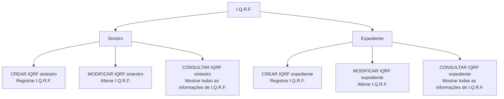
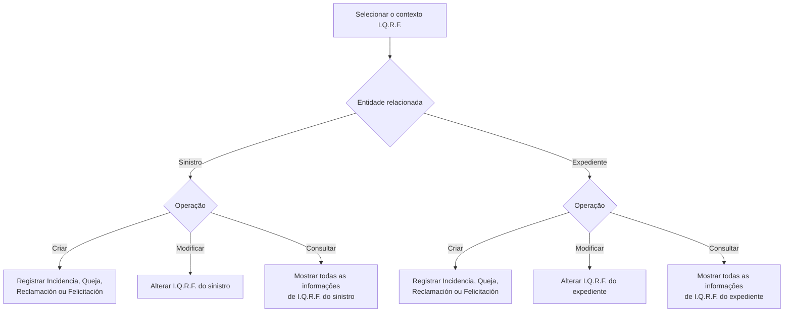

# Documentação de Operações de Sinistros (Automóvel) — I.Q.R.F.

## 1. Metadados do Documento
- **Arquivo de Origem:** Não identificado; conteúdo bruto fornecido com 2 páginas
- **Tipo de Documento:** Manual Operacional
- **Domínio / Sistema:** Operações de Sinistros de Automóvel — I.Q.R.F.
- **Público-Alvo:** Operação, Negócio e equipes consumidoras das operações I.Q.R.F.
- **Data/Versão Identificada:** Não identificada

---

## 2. Resumo Executivo & Contexto de Negócio

O documento descreve operações I.Q.R.F. aplicáveis ao domínio de **Sinistros de Automóvel**. I.Q.R.F. é apresentado como o contexto para registrar e administrar uma **Incidência, Queja, Reclamación ou Felicitación** vinculada a um sinistro ou a um expediente.

A documentação relaciona quatro operações de manutenção: criação e modificação de I.Q.R.F. para sinistros, e criação e modificação de I.Q.R.F. para expedientes. Também relaciona duas operações de consulta, destinadas a exibir todas as informações de I.Q.R.F. de um sinistro ou de um expediente.

O objetivo operacional identificado é permitir o registro, a alteração e a consulta de informações I.Q.R.F. em dois níveis de associação: **siniestro** e **expediente**. O texto não especifica métodos HTTP, contratos de integração, campos de entrada, regras de autorização, persistência, URLs ou comportamento de erro.

O conteúdo também contém as expressões “Home Solutions APIs Documentation Zeus”, “EN” e “CF”, mas não apresenta contexto suficiente para determinar se representam sistemas, portais, classificações, ambientes ou metadados documentais.

---

## 3. Arquitetura, Componentes & Tecnologias Envolvidas

### Componentes e operações identificados

| Componente / Operação | Função descrita |
| :--- | :--- |
| I.Q.R.F. | Contexto das operações para incidências, quejas, reclamaciones ou felicitaciones. |
| Sinistro | Entidade à qual pode ser associado, criado, modificado ou consultado um I.Q.R.F. |
| Expediente | Entidade à qual pode ser associado, criado, modificado ou consultado um I.Q.R.F. |
| CREAR IQRF siniestro | Registra um I.Q.R.F. em um sinistro. |
| MODIFICAR IQRF siniestro | Altera um I.Q.R.F. de um sinistro. |
| CREAR IQRF expediente | Registra um I.Q.R.F. em um expediente. |
| MODIFICAR IQRF expediente | Altera um I.Q.R.F. de um expediente. |
| CONSULTAR IQRF siniestro | Mostra todas as informações de I.Q.R.F. de um sinistro. |
| CONSULTAR IQRF expediente | Mostra todas as informações de I.Q.R.F. de um expediente. |
| Home Solutions APIs Documentation Zeus | Expressão presente no conteúdo, sem detalhamento de finalidade ou integração. |



> **Nota de Análise:** O documento não descreve arquitetura técnica de aplicação, microsserviços, APIs, protocolos, tecnologias, bancos de dados, ambientes ou relações de dependência entre componentes.

---

## 4. Regras de Negócio, Especificações Funcionais & Processos

### Classificações de I.Q.R.F.

O documento informa que um I.Q.R.F. pode corresponder a uma das seguintes classificações:

- **Incidencia**
- **Queja**
- **Reclamación**
- **Felicitación**

O documento não define critérios de classificação, regras de obrigatoriedade, transições de estado, responsáveis, prazos, prioridades ou mecanismos de aprovação para essas classificações.

### Operações sobre sinistro

1. **CREAR IQRF siniestro**
   - Permite registrar uma Incidencia, Queja, Reclamación ou Felicitación associada a um sinistro.

2. **MODIFICAR IQRF siniestro**
   - Permite alterar uma Incidencia, Queja, Reclamación ou Felicitación associada a um sinistro.

3. **CONSULTAR IQRF siniestro**
   - Mostra todas as informações de I.Q.R.F. de um sinistro.

### Operações sobre expediente

1. **CREAR IQRF expediente**
   - Permite registrar uma Incidencia, Queja, Reclamación ou Felicitación associada a um expediente.

2. **MODIFICAR IQRF expediente**
   - Permite alterar uma Incidencia, Queja, Reclamación ou Felicitación associada a um expediente.

3. **CONSULTAR IQRF expediente**
   - Mostra todas as informações de I.Q.R.F. de um expediente.

### Fluxo funcional consolidado



> **Nota de Análise:** O documento apresenta os nomes e as finalidades das operações, mas não detalha o fluxo de telas, campos necessários, identificadores de sinistro ou expediente, validações, regras de atualização ou o conteúdo retornado pelas consultas.

---

## 5. Tabelas de Parâmetros, Ambientes e Estruturas de Dados

| Item / Parâmetro | Descrição / Função | Tipo / Valores / Formato | Ambiente / Observações |
| :--- | :--- | :--- | :--- |
| I.Q.R.F. | Contexto de operações sobre uma incidência, queja, reclamación ou felicitación. | Não especificado | Aplicável a sinistros e expedientes. |
| Incidencia | Classificação que pode ser registrada ou modificada em I.Q.R.F. | Não especificado | O documento não define critérios. |
| Queja | Classificação que pode ser registrada ou modificada em I.Q.R.F. | Não especificado | O documento não define critérios. |
| Reclamación | Classificação que pode ser registrada ou modificada em I.Q.R.F. | Não especificado | O documento não define critérios. |
| Felicitación | Classificação que pode ser registrada ou modificada em I.Q.R.F. | Não especificado | O documento não define critérios. |
| Siniestro | Entidade consultada ou associada às operações I.Q.R.F. | Não especificado | Contexto de Sinistros de Automóvel. |
| Expediente | Entidade consultada ou associada às operações I.Q.R.F. | Não especificado | Sem detalhamento adicional. |
| CREAR IQRF siniestro | Registra I.Q.R.F. em um sinistro. | Operação | Sem contrato técnico informado. |
| MODIFICAR IQRF siniestro | Altera I.Q.R.F. de um sinistro. | Operação | Sem contrato técnico informado. |
| CONSULTAR IQRF siniestro | Mostra todas as informações de I.Q.R.F. de um sinistro. | Operação | Sem estrutura de resposta informada. |
| CREAR IQRF expediente | Registra I.Q.R.F. em um expediente. | Operação | Sem contrato técnico informado. |
| MODIFICAR IQRF expediente | Altera I.Q.R.F. de um expediente. | Operação | Sem contrato técnico informado. |
| CONSULTAR IQRF expediente | Mostra todas as informações de I.Q.R.F. de um expediente. | Operação | Sem estrutura de resposta informada. |
| Home Solutions APIs Documentation Zeus | Texto citado no conteúdo bruto. | Não especificado | Não há explicação sobre sua função. |
| EN | Texto citado no conteúdo bruto. | Não especificado | Significado não detalhado. |
| CF | Texto citado no conteúdo bruto. | Não especificado | Significado não detalhado. |

---

## 6. Bateria de Perguntas & Respostas para RAG (FAQ Sintético)

### P1: Quais operações I.Q.R.F. estão disponíveis para um sinistro?
**R:** Para um sinistro, o documento lista três operações: **CREAR IQRF siniestro**, para registrar uma Incidencia, Queja, Reclamación ou Felicitación; **MODIFICAR IQRF siniestro**, para alterar esse I.Q.R.F.; e **CONSULTAR IQRF siniestro**, para mostrar todas as informações de I.Q.R.F. associadas ao sinistro.

### P2: Quais operações I.Q.R.F. estão disponíveis para um expediente?
**R:** Para um expediente, o documento lista três operações: **CREAR IQRF expediente**, para registrar uma Incidencia, Queja, Reclamación ou Felicitación; **MODIFICAR IQRF expediente**, para alterar esse I.Q.R.F.; e **CONSULTAR IQRF expediente**, para mostrar todas as informações de I.Q.R.F. associadas ao expediente.

### P3: Quais tipos de registro podem ser tratados por I.Q.R.F.?
**R:** O documento afirma que I.Q.R.F. pode registrar ou modificar quatro classificações: **Incidencia**, **Queja**, **Reclamación** e **Felicitación**. Não são apresentados critérios para escolher uma classificação, nem definições funcionais adicionais para cada uma.

### P4: A operação CONSULTAR IQRF siniestro retorna quais informações?
**R:** A operação **CONSULTAR IQRF siniestro** “muestra toda la información de IQRF de un siniestro”, isto é, mostra todas as informações de I.Q.R.F. de um sinistro. O documento não descreve quais campos compõem essas informações.

### P5: A operação CONSULTAR IQRF expediente retorna quais informações?
**R:** A operação **CONSULTAR IQRF expediente** “muestra toda la información de IQRF de un expediente”, isto é, mostra todas as informações de I.Q.R.F. de um expediente. O documento não informa a estrutura, o formato ou os campos apresentados na consulta.

### P6: É possível criar um I.Q.R.F. diretamente para um expediente?
**R:** Sim. A operação **CREAR IQRF expediente** permite registrar uma Incidencia, Queja, Reclamación ou Felicitación para um expediente.

### P7: É possível modificar um I.Q.R.F. vinculado a um sinistro?
**R:** Sim. A operação **MODIFICAR IQRF siniestro** permite alterar uma Incidencia, Queja, Reclamación ou Felicitación associada a um sinistro.

### P8: O documento informa endpoints, métodos HTTP ou contratos JSON das operações I.Q.R.F.?
**R:** Não. O conteúdo apresenta apenas os nomes e os objetivos funcionais das operações de criação, modificação e consulta. Não há endpoints, métodos HTTP, parâmetros de requisição, contratos JSON, códigos de resposta ou mecanismos de autenticação.

### P9: O documento detalha validações para criar ou modificar um I.Q.R.F.?
**R:** Não. Não são descritas validações de campos, critérios de elegibilidade, obrigatoriedade, tratamento de erros, autorizações, regras de negócio específicas ou condições para criação e modificação.

### P10: O escopo do documento está relacionado a qual domínio?
**R:** O título do conteúdo identifica o domínio como **Operaciones de Siniestros (Automóvil) - I.Q.R.F.** Portanto, o escopo explicitamente informado está relacionado a operações de sinistros de automóvel e ao tratamento de I.Q.R.F.

---

## 7. Glossário de Termos, Siglas & Conceitos-Chave

- **I.Q.R.F.:** Sigla apresentada no documento como o contexto de operações para registrar, modificar e consultar uma Incidencia, Queja, Reclamación ou Felicitación em sinistros e expedientes. A expansão da sigla não é fornecida.
- **Sinistro / Siniestro:** Entidade relacionada ao domínio de Sinistros de Automóvel e alvo das operações de criação, modificação e consulta de I.Q.R.F.
- **Expediente:** Entidade que pode receber e ter consultadas ou modificadas informações I.Q.R.F. O documento não define seu significado operacional.
- **Incidencia:** Categoria de I.Q.R.F. que pode ser registrada ou modificada.
- **Queja:** Categoria de I.Q.R.F. que pode ser registrada ou modificada.
- **Reclamación:** Categoria de I.Q.R.F. que pode ser registrada ou modificada.
- **Felicitación:** Categoria de I.Q.R.F. que pode ser registrada ou modificada.
- **CF:** Termo presente no conteúdo bruto, sem definição.
- **EN:** Termo presente no conteúdo bruto, sem definição.
- **Home Solutions APIs Documentation Zeus:** Texto presente no conteúdo bruto, sem explicação de escopo, tecnologia ou função.

---

## 8. Notas Críticas, Riscos & Limitações

- O documento é resumido e não contém especificação técnica de APIs, métodos HTTP, URLs, ambientes, protocolos ou contratos de dados.
- Não há definição da expansão da sigla **I.Q.R.F.**
- Não há descrição dos campos necessários para criar, alterar ou consultar um I.Q.R.F.
- Não há regras de autenticação, autorização, perfis de acesso, auditoria ou segregação de funções.
- Não são informados critérios de validação, comportamento para erros, códigos de retorno, regras de persistência ou estados de ciclo de vida.
- Os termos **CF**, **EN** e **Home Solutions APIs Documentation Zeus** aparecem sem contexto suficiente para interpretação confiável.
- Não há detalhamento adicional que permita determinar se sinistro e expediente possuem relacionamento entre si ou representam entidades independentes no fluxo I.Q.R.F.

---

## 9. Conteúdo Bruto Estruturado (Referência Fiel)

```text
--- [PÁGINA 1 DE 2] ---

DOCUMENTACIÓN OPERACIONES de
SINIESTROS (Automóvil) - I.Q.R.F.
I.Q.R.F.
Todas las Operaciones que se pueden realizar I.Q.R.F.
CREAR IQRF siniestro
Permite registrar una Incidencia, Queja,
Reclamación o Felicitación a un siniestro
MODIFICAR IQRF siniestro
Permite cambiar una Incidencia, Queja,
Reclamación o Felicitación a un siniestros
CREAR IQRF expediente:
Permite registrar una Incidencia, Queja,
Reclamación o Felicitación a un expediente
MODIFICAR IQRF expediente
Permite cambiar una Incidencia, Queja,
Reclamación o Felicitación a un expediente
CONSULTAR IQRF siniestro
 CONSULTAR IQRF expediente
 /
 CF
Home Solutions APIs Documentation Zeus
EN


--- [PÁGINA 2 DE 2] ---

Muestra toda la información de IQRF de un
siniestro
Muestra toda la información de IQRF de un
expediente
```
