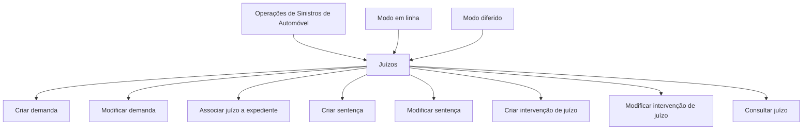

# Operações de Sinistros de Automóvel — Juízos

## 1. Metadados do Documento
- **Arquivo de Origem:** Não identificado
- **Tipo de Documento:** Manual Operacional
- **Domínio / Sistema:** Sinistros de Automóvel — Juízos
- **Público-Alvo:** Operação
- **Data/Versão Identificada:** Não identificada

---

## 2. Resumo Executivo & Contexto de Negócio

O documento descreve operações relacionadas a **juízos** no contexto de **sinistros de automóvel**. As operações abrangem o ciclo de manutenção de uma demanda, sua sentença, intervenções associadas e a consulta consolidada das informações de um juízo.

Todas as operações apresentadas podem ser realizadas em dois modos: **em linha** e **diferido**. O documento não define as diferenças operacionais, técnicas ou de processamento entre os modos em linha e diferido.

O fluxo funcional permite criar e modificar demandas e sentenças, associar expedientes ao juízo, associar pessoas envolvidas — como advogados e testemunhas — e consultar todas as informações disponíveis para um juízo.

O conteúdo é resumido e não informa contratos de integração, métodos HTTP, telas, campos obrigatórios, regras de cálculo, mensagens de erro ou permissões necessárias para executar cada operação.

---

## 3. Arquitetura, Componentes & Tecnologias Envolvidas

O documento menciona o domínio de **Sinistros (Automóvel)** e o objeto funcional **Juízos**. Também há referências textuais a “Home Solutions APIs Documentation Zeus”, “CF” e “EN”, sem detalhamento de arquitetura, tecnologia, integração ou função desses termos.



**Nota de Análise:** O documento não descreve componentes de software, microsserviços, APIs, bancos de dados, ambientes, protocolos ou tecnologias de implementação.

---

## 4. Regras de Negócio, Especificações Funcionais & Processos

### Regra geral de execução
- Todas as operações relacionadas a um juízo podem ser realizadas **em linha** ou **de forma diferida**.
- O documento não especifica critérios para escolher o modo em linha ou diferido.
- O documento não detalha comportamento assíncrono, filas, agendamento, tempos de processamento ou confirmação de conclusão para operações diferidas.

### Operações de demanda
1. **Criar demanda**
   - Cria a demanda de um juízo.
   - O documento não especifica os dados exigidos para a criação da demanda.

2. **Modificar demanda**
   - Permite alterar informações da demanda de um juízo.
   - Inclui alteração de dados e importes.
   - O documento não define quais dados ou importes podem ser modificados.

### Associação entre juízo e expediente
3. **Associar juízo a expediente**
   - Indica quais expedientes estão relacionados ao juízo.
   - O documento não detalha se um juízo pode possuir múltiplos expedientes, nem se um expediente pode ser associado a múltiplos juízos.

### Operações de sentença
4. **Criar sentença**
   - Gera os dados da sentença de um juízo.
   - O documento não especifica os campos, valores, estados ou validações da sentença.

5. **Modificar sentença**
   - Permite alterar informações da sentença de um juízo.
   - Inclui alteração de dados e importes.
   - O documento não informa restrições para alteração de sentenças.

### Operações de intervenção
6. **Criar intervenção de juízo**
   - Associa ao juízo as pessoas relacionadas.
   - Exemplos citados: advogados e testemunhas.
   - O termo “etc.” indica que podem existir outros tipos de pessoas relacionadas, mas o documento não os enumera.

7. **Modificar intervenção de juízo**
   - Permite modificar intervenções e pessoas associadas ao juízo.
   - O documento não detalha se a modificação inclui inclusão, remoção ou substituição de pessoas.

### Consulta
8. **Consultar juízo**
   - Visualiza toda a informação de um juízo.
   - O documento não lista quais dados compõem a informação consultada.

---

## 5. Tabelas de Parâmetros, Ambientes e Estruturas de Dados

| Item / Parâmetro | Descrição / Função | Tipo / Valores / Formato | Ambiente / Observações |
| :--- | :--- | :--- | :--- |
| Juízo | Entidade principal das operações documentadas. | Não especificado | Pertence ao domínio de sinistros de automóvel. |
| Demanda | Informação criada ou modificada para um juízo. | Dados e importes não detalhados | Pode ser operada em linha ou diferido. |
| Expediente | Entidade relacionada a um juízo por meio da operação de associação. | Não especificado | O documento não define cardinalidade ou atributos. |
| Sentença | Dados da sentença de um juízo. | Dados e importes não detalhados | Pode ser criada e modificada. |
| Intervenção de juízo | Associação de pessoas relacionadas ao juízo. | Pessoas; exemplos: advogados e testemunhas | Pode ser criada e modificada. |
| Modo em linha | Forma de execução disponível para todas as operações. | Não especificado | Não há detalhamento técnico ou funcional adicional. |
| Modo diferido | Forma de execução disponível para todas as operações. | Não especificado | Não há detalhamento técnico ou funcional adicional. |
| Home Solutions APIs Documentation Zeus | Referência textual presente no documento. | Não especificado | Sem função ou relacionamento descrito. |
| CF | Referência textual presente no documento. | Não especificado | Sem significado expandido no conteúdo. |
| EN | Referência textual presente no documento. | Não especificado | Sem significado expandido no conteúdo. |

---

## 6. Bateria de Perguntas & Respostas para RAG (FAQ Sintético)

### P1: Quais operações de juízo estão disponíveis para sinistros de automóvel?
**R:** Estão disponíveis as operações de criar demanda, modificar demanda, associar juízo a expediente, criar sentença, modificar sentença, criar intervenção de juízo, modificar intervenção de juízo e consultar juízo.

### P2: As operações de juízo podem ser executadas de forma diferida?
**R:** Sim. O documento estabelece que todas as operações que podem ser realizadas com um juízo podem ser executadas tanto em linha quanto de forma diferida. O conteúdo não detalha o mecanismo de processamento diferido.

### P3: O que acontece na operação de criar demanda?
**R:** A operação de criar demanda cria a demanda de um juízo. O documento não apresenta campos obrigatórios, validações, dados de entrada ou resultados retornados pela operação.

### P4: Quais informações podem ser alteradas ao modificar uma demanda?
**R:** A operação de modificar demanda permite alterar informações da demanda de um juízo, incluindo dados e importes. O documento não discrimina os campos ou importes que podem ser modificados.

### P5: Qual é a finalidade de associar um juízo a um expediente?
**R:** A operação de associar juízo a expediente indica quais expedientes estão relacionados ao juízo. O documento não especifica regras de associação, cardinalidade ou critérios de validação.

### P6: O que a criação de sentença gera para um juízo?
**R:** A operação de criar sentença gera os dados da sentença de um juízo. O documento não detalha a estrutura desses dados, seus campos, importes ou regras de negócio.

### P7: É possível alterar dados e importes de uma sentença?
**R:** Sim. A operação de modificar sentença permite alterar a informação da sentença de um juízo, incluindo dados e importes. Não são apresentadas limitações ou condições para a alteração.

### P8: Quem pode ser associado em uma intervenção de juízo?
**R:** Podem ser associadas ao juízo pessoas relacionadas, incluindo advogados e testemunhas. O documento também usa “etc.”, mas não apresenta uma lista completa de tipos de pessoas permitidas.

### P9: O que permite a operação de modificar intervenção de juízo?
**R:** A operação permite modificar as intervenções e as pessoas associadas ao juízo. O documento não esclarece quais tipos de alteração são suportados.

### P10: O que é exibido ao consultar um juízo?
**R:** A operação de consultar juízo visualiza toda a informação de um juízo. O documento não especifica quais dados, relações, demandas, sentenças ou intervenções são exibidos nessa consulta.

---

## 7. Glossário de Termos, Siglas & Conceitos-Chave

- **Juízo:** Entidade central das operações descritas no documento, relacionada ao contexto de sinistros de automóvel.
- **Demanda:** Informação de um juízo que pode ser criada ou modificada, incluindo dados e importes.
- **Expediente:** Entidade que pode ser relacionada a um juízo.
- **Sentença:** Conjunto de dados da sentença de um juízo, que pode ser criado ou modificado.
- **Intervenção de juízo:** Associação entre um juízo e pessoas relacionadas, como advogados e testemunhas.
- **Importes:** Valores associados à demanda ou à sentença; o documento não define seu formato ou significado específico.
- **Em linha:** Modo de execução disponível para as operações de juízo; não detalhado.
- **Diferido:** Modo de execução disponível para as operações de juízo; não detalhado.
- **CF:** Sigla ou referência presente no documento sem significado definido.
- **EN:** Sigla ou referência presente no documento sem significado definido.

---

## 8. Notas Críticas, Riscos & Limitações

- O documento não identifica arquivo de origem, autor, data, versão ou responsável.
- Não há detalhamento de campos, formatos, valores permitidos, obrigatoriedade ou validações das operações.
- Não são descritos contratos de API, métodos HTTP, URLs, autenticação, autorização, códigos de erro ou payloads.
- Os modos de execução em linha e diferido são mencionados, mas não possuem definição operacional ou técnica.
- Não há especificação de permissões, perfis de usuário, auditoria, rastreabilidade ou segregação de funções.
- As referências “Home Solutions APIs Documentation Zeus”, “CF” e “EN” não possuem explicação contextual.
- Não é possível inferir arquitetura de software, componentes técnicos ou dependências a partir do conteúdo fornecido.

---

## 9. Conteúdo Bruto Estruturado (Referência Fiel)

```text
--- [PÁGINA 1 DE 2] ---

DOCUMENTACIÓN OPERACIONES de
SINIESTROS (Automóvil) - JUICIOS
JUICIOS
Todas las Operaciones que se pueden realizar con un Juicios, se
pueden realizar tanto en línea como diferido
CREAR demanda
En esta operación se crea la demanda de un
juicio
MODIFICAR demanda
Permite cambiar información de la demanda
de un juicio, datos e importes
ASOCIAR juicio expediente
En esta operación se indica que expedientes
están relacionados con el juicio
CREAR Sentencia
En esta operación se generan los datos de la
sentencia de un juicio
 /
 CF
Home Solutions APIs Documentation Zeus
EN


--- [PÁGINA 2 DE 2] ---

MODIFICAR Sentencia
Permite cambiar la información de la
sentencia de un juicio, datos e importes
CREAR intervención juicio
Asociar al juicio las personas relacionadas
con el mismo, abogados, testigos.. etc
MODIFICAR intervención juicio
Permite modificar las intervenciones, las
personas asociadas al juicio
CONSULTAR juicio
Visualiza toda la información de un juicio
```
