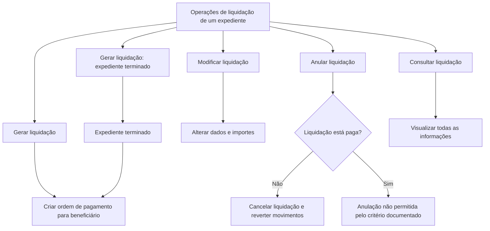

# Documentação de Operações de Sinistros de Automóvel — Liquidações

## 1. Metadados do Documento
- **Arquivo de Origem:** `Não identificado`
- **Tipo de Documento:** `Manual Operacional`
- **Domínio / Sistema:** `Sinistros (Automóvel) — Liquidações`
- **Público-Alvo:** `Operação, negócio e equipes responsáveis por sinistros`
- **Data/Versão Identificada:** `Não identificada`

---

## 2. Resumo Executivo & Contexto de Negócio

O documento descreve operações de liquidação aplicáveis a um expediente de sinistro de automóvel. As operações podem ser realizadas em linha ou de forma diferida, conforme indicado explicitamente no conteúdo original.

A operação de liquidação permite criar uma ordem de pagamento para um beneficiário. O documento também diferencia a geração de liquidação para expedientes terminados, mantendo o objetivo de criar uma ordem de pagamento destinada a um beneficiário.

Além da criação de liquidações, o material apresenta capacidades de modificação, anulação e consulta. A modificação permite alterar dados e importes de uma liquidação; a consulta permite visualizar todas as informações da liquidação.

A anulação possui uma restrição operacional explícita: uma liquidação pode ser cancelada com reversão de seus movimentos desde que não esteja paga. O documento não detalha fluxos de aprovação, perfis de acesso, contratos de integração, métodos HTTP, campos de tela, estados adicionais ou tecnologias utilizadas.

---

## 3. Arquitetura, Componentes & Tecnologias Envolvidas

O documento não apresenta arquitetura técnica, sistemas integrados, microsserviços, bancos de dados, URLs, ambientes, protocolos, tecnologias ou ferramentas.

Os componentes funcionais explicitamente identificados são:

| Componente / Operação | Função descrita |
| :--- | :--- |
| Liquidação | Conjunto de operações de liquidações de um expediente. |
| Gerar liquidação | Cria uma ordem de pagamento para um beneficiário. |
| Gerar liquidação — Expediente terminado | Cria uma ordem de pagamento para um beneficiário quando o expediente está terminado. |
| Modificar liquidação | Altera informações, dados e importes de uma liquidação. |
| Anular liquidação | Cancela uma liquidação e reverte seus movimentos, desde que a liquidação não esteja paga. |
| Consultar liquidação | Visualiza todas as informações de uma liquidação. |
| Expediente | Entidade à qual as operações de liquidação se aplicam. |
| Beneficiário | Destinatário da ordem de pagamento gerada pela liquidação. |



> **Nota de Análise:** o diagrama representa exclusivamente as relações funcionais declaradas no documento. Não foram informados componentes técnicos, integrações, persistência de dados ou transições completas de estado.

---

## 4. Regras de Negócio, Especificações Funcionais & Processos

### Operações de liquidação

1. As operações de liquidações pertencem ao contexto de um expediente.
2. As operações de liquidação podem ser realizadas:
   - em linha;
   - de forma diferida.
3. A operação **Gerar liquidação** permite criar uma ordem de pagamento para um beneficiário.
4. A operação **Gerar liquidação — Expediente terminado** permite criar uma ordem de pagamento para um beneficiário quando o expediente está terminado.
5. A operação **Modificar liquidação** permite mudar informações de uma liquidação, incluindo:
   - dados;
   - importes.
6. A operação **Anular liquidação**:
   - cancela uma liquidação;
   - reverte os movimentos associados;
   - somente é aplicável quando a liquidação não está paga.
7. A operação **Consultar liquidação** permite visualizar toda a informação de uma liquidação.

### Restrição de anulação

| Regra | Condição | Resultado |
| :--- | :--- | :--- |
| Anulação de liquidação | A liquidação não está paga. | A liquidação pode ser cancelada e seus movimentos podem ser revertidos. |
| Anulação de liquidação | A liquidação está paga. | O documento estabelece que a anulação não deve ser realizada nessa condição. |

> **Nota de Análise:** o documento não especifica como o estado “paga” é identificado, quais movimentos são revertidos, se existe estorno financeiro, nem se há exceções operacionais para liquidações pagas.

---

## 5. Tabelas de Parâmetros, Ambientes e Estruturas de Dados

| Item / Parâmetro | Descrição / Função | Tipo / Valores / Formato | Ambiente / Observações |
| :--- | :--- | :--- | :--- |
| Modalidade de execução | Forma de realização das operações de liquidação. | `Em linha` ou `Diferido` | O documento não associa as modalidades a ambientes técnicos. |
| Expediente | Entidade sobre a qual as operações de liquidação são executadas. | Não detalhado | Pode estar terminado para a operação específica de geração em expediente terminado. |
| Beneficiário | Destinatário da ordem de pagamento criada por uma liquidação. | Não detalhado | Não são informados dados cadastrais, identificadores ou critérios de seleção. |
| Ordem de pagamento | Resultado funcional da geração de liquidação. | Não detalhado | Criada para um beneficiário. |
| Dados da liquidação | Informações alteráveis pela operação de modificação. | Não detalhado | O documento não lista campos. |
| Importes da liquidação | Valores que podem ser modificados em uma liquidação. | Não detalhado | Não são informadas moedas, limites ou fórmulas de cálculo. |
| Estado de pagamento | Critério para permitir ou impedir a anulação. | `Paga` / `Não paga` | A anulação é condicionada a a liquidação não estar paga. |
| Movimentos da liquidação | Movimentos associados à liquidação. | Não detalhado | São revertidos durante a anulação permitida. |

---

## 6. Bateria de Perguntas & Respostas para RAG (FAQ Sintético)

### P1: Quais modalidades de execução estão disponíveis para operações de liquidação?
**R:** As operações de liquidação de um expediente podem ser realizadas em linha ou de forma diferida.

### P2: O que a operação “Gerar liquidação” cria?
**R:** A operação “Gerar liquidação” permite criar uma ordem de pagamento para um beneficiário.

### P3: Em que condição deve ser usada a operação “Gerar liquidação — Expediente terminado”?
**R:** A operação “Gerar liquidação — Expediente terminado” é aplicável quando o expediente está terminado e permite criar uma ordem de pagamento para um beneficiário.

### P4: Quais informações podem ser alteradas ao modificar uma liquidação?
**R:** A operação “Modificar liquidação” permite alterar a informação de uma liquidação, incluindo dados e importes.

### P5: Uma liquidação paga pode ser anulada?
**R:** Não. O documento estabelece que a anulação cancela a liquidação e reverte seus movimentos somente quando a liquidação não está paga.

### P6: O que acontece com os movimentos quando uma liquidação é anulada?
**R:** Quando a anulação é permitida — isto é, quando a liquidação não está paga — a liquidação é cancelada e seus movimentos são revertidos.

### P7: Qual operação permite visualizar todas as informações de uma liquidação?
**R:** A operação “Consultar liquidação” permite visualizar toda a informação de uma liquidação.

### P8: O documento especifica quais campos compõem os dados de uma liquidação?
**R:** Não. O documento informa que dados e importes podem ser modificados, mas não detalha os campos, formatos, obrigatoriedades ou validações aplicáveis.

### P9: O documento informa como identificar que uma liquidação está paga?
**R:** Não. O estado “paga” é usado como critério para impedir a anulação, mas o mecanismo de identificação desse estado não é detalhado.

### P10: O documento apresenta APIs, URLs ou contratos técnicos para as operações de liquidação?
**R:** Não. O conteúdo apresenta as operações funcionais de liquidação, mas não fornece métodos HTTP, URLs, contratos JSON, tecnologias, ambientes ou detalhes de integração.

---

## 7. Glossário de Termos, Siglas & Conceitos-Chave

- **Liquidação:** operação tratada no documento para criação, modificação, anulação ou consulta no contexto de um expediente.
- **Expediente:** entidade à qual as operações de liquidação se aplicam.
- **Expediente terminado:** expediente em condição de término, utilizado explicitamente na operação “Gerar liquidação — Expediente terminado”.
- **Beneficiário:** destinatário da ordem de pagamento criada pela geração de liquidação.
- **Ordem de pagamento:** resultado da operação de geração de liquidação para um beneficiário.
- **Importes:** valores de uma liquidação que podem ser alterados pela operação de modificação.
- **Movimentos:** registros ou movimentos associados a uma liquidação; o documento informa que são revertidos em uma anulação permitida.
- **Em linha:** modalidade de execução das operações de liquidação.
- **Diferido:** modalidade de execução das operações de liquidação.

---

## 8. Notas Críticas, Riscos & Limitações

- O documento não identifica arquivo de origem, versão, data, autor, sistema proprietário ou ambiente operacional.
- Não há detalhamento técnico de arquitetura, integrações, APIs, URLs, autenticação, autorização, logs, servidores ou bases de dados.
- Não são descritos os campos de uma liquidação, os formatos de importes, moedas, regras de cálculo ou validações obrigatórias.
- O critério “liquidação paga” é determinante para a anulação, mas não há definição do estado, origem do dado ou procedimento de verificação.
- O documento informa que a anulação reverte movimentos, mas não identifica quais movimentos são revertidos nem os efeitos contábeis, financeiros ou operacionais dessa reversão.
- Não há detalhamento adicional sobre diferenças de comportamento entre execução em linha e execução diferida.
- O trecho de origem possui uma interrupção de conteúdo entre páginas na descrição de anulação; a regra foi interpretada somente a partir da continuação textual explícita: “siempre que no esté pagada”.

---

## 9. Conteúdo Bruto Estruturado (Referência Fiel)

```text
--- [PÁGINA 1 DE 2] ---

DOCUMENTACIÓN OPERACIONES de
SINIESTROS (Automóvil) - LIQUIDACIONES
LIQUIDACIÓN
Operaciones de liquidaciones de un expediente, se pueden realizar tanto
en línea como diferido
GENERAR liquidación
Permite crear una orden de pago para un
beneficiario
GENERAR liquidación Expediente
Terminado
Permite crear una orden de pago para un
beneficiario,cuando el expediente está
terminado
MODIFICAR liquidación
Permite cambiar la información de una
liquidación, tanto datos, como importes
ANULAR liquidación
Cancela una liquidación, revierte sus
movimientos siempre y cuando no esté
 / 
 CF
Home Solutions APIs Documentation Zeus
EN


--- [PÁGINA 2 DE 2] ---

siempre que no esté pagada
 pagada
CONSULTAR liquidación
Visualiza toda la información de una
liquidación
```
