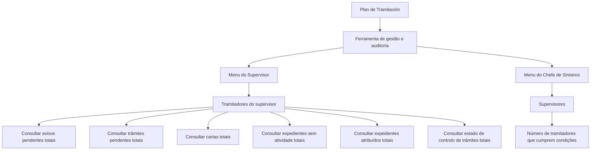

# Operações de Sinistros — Menu do Supervisor e Auditoria

## 1. Metadados do Documento
- **Arquivo de Origem:** Não identificado
- **Tipo de Documento:** Manual Operacional
- **Domínio / Sistema:** Operações de Sinistros — Menu do Supervisor e Chefe de Sinistros
- **Público-Alvo:** Supervisores, chefes/responsáveis de sinistros e tramitadores
- **Data/Versão Identificada:** Não identificada

---

## 2. Resumo Executivo & Contexto de Negócio

O documento descreve uma ferramenta de organização do trabalho de gestão e auditoria para supervisores, baseada no **“Plan de Tramitación”**. O objetivo principal declarado é controlar a gestão realizada pelos tramitadores e, para responsáveis ou chefes de sinistros, controlar a gestão dos supervisores.

O menu do supervisor apresenta os tramitadores sob sua supervisão e a quantidade de expedientes que atendem às condições selecionadas. As operações permitem consultar avisos pendentes, trâmites pendentes, cartas geradas, expedientes sem atividade, expedientes atribuídos e controle de trâmites.

Para o chefe de sinistros, a ferramenta apresenta os supervisores e o número de tramitadores de cada supervisor que atendem às condições aplicáveis. O conteúdo fornecido não detalha filtros específicos, telas, permissões, métodos de acesso ou contratos de integração.

A finalidade operacional é fornecer visibilidade quantitativa sobre pendências, atividade, atribuição e controles de prazo relacionados aos expedientes de sinistros.

---

## 3. Arquitetura, Componentes & Tecnologias Envolvidas

O documento menciona os seguintes elementos funcionais:

- **Ferramenta de gestão e auditoria:** organiza o trabalho de supervisão e auditoria.
- **Plan de Tramitación:** base utilizada pela ferramenta.
- **Menu do Supervisor:** apresenta tramitadores e números de expedientes segundo condições filtradas.
- **Menu do Chefe de Sinistros:** apresenta supervisores e a quantidade de tramitadores que atendem às condições.
- **Tramitadores:** usuários cuja gestão é controlada pelo supervisor.
- **Supervisores:** usuários cuja gestão pode ser controlada pelo chefe de sinistros.
- **Expedientes:** registros consultados nas operações operacionais.



> **Nota de Análise:** O documento não descreve arquitetura técnica de software, tecnologias, bases de dados, APIs, URLs, ambientes, autenticação ou integrações.

---

## 4. Regras de Negócio, Especificações Funcionais & Processos

### 4.1 Objetivo de gestão e auditoria

1. A ferramenta organiza o trabalho de gestão e auditoria dos supervisores.
2. A ferramenta é baseada no **Plan de Tramitación**.
3. O objetivo principal é controlar a gestão dos tramitadores.
4. Para responsáveis ou chefes de sinistros, o objetivo inclui controlar a gestão dos supervisores.

### 4.2 Apresentação de informações por perfil

#### Supervisor

O menu do supervisor apresenta:

1. Os tramitadores associados ao supervisor.
2. O número de expedientes que cumprem as condições aplicáveis.
3. Consultas relacionadas a avisos, trâmites, cartas, falta de atividade, atribuição de expedientes e controlo de trâmites.

#### Chefe de sinistros

O menu do chefe de sinistros apresenta:

1. Os supervisores.
2. O número de tramitadores de cada supervisor que cumprem as condições.

### 4.3 Operações disponíveis para consulta

#### Consultar avisos pendentes totais

A operação mostra os tramitadores do supervisor e o número de expedientes que possuem aviso pendente, considerando as condições filtradas pelo supervisor.

#### Consultar trâmites pendentes totais

A operação mostra os tramitadores do supervisor e o número de expedientes que possuem o trâmite indicado pendente, considerando as condições filtradas pelo tramitador.

#### Consultar cartas totais

A operação mostra os tramitadores do supervisor e o número de expedientes para os quais foi gerada a carta indicada, considerando as condições filtradas pelo tramitador.

#### Consultar expedientes sem atividade totais

A operação mostra os tramitadores do supervisor e o número de expedientes nos quais não foi realizada nenhuma operação, considerando as condições filtradas pelo tramitador.

#### Consultar expedientes atribuídos totais

A operação mostra os tramitadores do supervisor e o número de expedientes que o tramitador possui com o estado indicado. Os exemplos de estado mencionados são:

- Pendente
- Em juízo
- Retido por c.t.

A consulta considera as condições filtradas pelo tramitador.

#### Consultar estado de controlo de trâmites totais

A operação mostra os tramitadores do supervisor e o número de expedientes que possuem uma data de controlo definida. A data de controlo representa o tempo máximo para a realização do trâmite. A consulta considera:

1. O estado indicado pelo tramitador.
2. As condições filtradas pelo tramitador.

---

## 5. Tabelas de Parâmetros, Ambientes e Estruturas de Dados

| Item / Parâmetro | Descrição / Função | Tipo / Valores / Formato | Ambiente / Observações |
| :--- | :--- | :--- | :--- |
| Plan de Tramitación | Base da ferramenta de gestão e auditoria. | Não detalhado | O documento não explica a estrutura ou regras do plano. |
| Supervisor | Perfil que consulta os seus tramitadores e números de expedientes. | Perfil operacional | Pode filtrar condições na consulta de avisos pendentes. |
| Chefe de sinistros | Perfil que visualiza supervisores e quantidades de tramitadores que cumprem condições. | Perfil operacional | Também referido como responsável ou chefe de sinistros. |
| Tramitador | Usuário cuja gestão é controlada pelo supervisor. | Perfil operacional | Aplica filtros em diversas consultas. |
| Expediente | Registro associado à gestão de sinistros e às consultas operacionais. | Não detalhado | O documento não informa campos, identificadores ou ciclo de vida. |
| Aviso pendente | Condição consultável em expedientes. | Estado/condição | Consultado com condições filtradas pelo supervisor. |
| Trâmite pendente | Trâmite indicado que permanece pendente em um expediente. | Estado/condição | Consultado com condições filtradas pelo tramitador. |
| Carta indicada | Carta gerada para um expediente. | Documento/condição | Consultada com condições filtradas pelo tramitador. |
| Expediente sem atividade | Expediente no qual nenhuma operação foi realizada. | Condição | Consultado com condições filtradas pelo tramitador. |
| Estado de expediente | Estado utilizado na consulta de expedientes atribuídos. | Exemplos: pendente, em juízo, retido por c.t. | O documento não define todos os estados possíveis. |
| Data de controlo | Data que define o tempo máximo para realização de um trâmite. | Data | Utilizada em consulta de estado de controlo de trâmites. |
| Condições filtradas | Critérios de filtro utilizados nas consultas. | Não detalhado | Podem ser filtradas pelo supervisor ou pelo tramitador, conforme a operação. |

> **Nota de Análise:** Não foram identificados servidores, ambientes, URLs, portas, variáveis de log, contratos de dados ou estruturas técnicas de integração.

---

## 6. Bateria de Perguntas & Respostas para RAG (FAQ Sintético)

### P1: Qual é o objetivo principal da ferramenta descrita no documento?
**R:** A ferramenta organiza o trabalho de gestão e auditoria dos supervisores, baseada no “Plan de Tramitación”. O objetivo principal é controlar a gestão dos tramitadores e, no caso dos responsáveis ou chefes de sinistros, controlar a gestão dos supervisores.

### P2: O que o menu do supervisor apresenta?
**R:** O menu do supervisor apresenta os tramitadores do supervisor e o número de expedientes que cumprem as condições aplicáveis às consultas.

### P3: O que a operação “Consultar avisos pendentes totais” mostra?
**R:** A operação mostra os tramitadores do supervisor e o número de expedientes que têm aviso pendente, considerando as condições filtradas pelo supervisor.

### P4: Como funciona a consulta de trâmites pendentes totais?
**R:** A consulta mostra os tramitadores do supervisor e o número de expedientes que têm o trâmite indicado pendente, considerando as condições filtradas pelo tramitador.

### P5: O que é consultado em “Consultar cartas totais”?
**R:** A operação mostra os tramitadores do supervisor e o número de expedientes para os quais foi gerada a carta indicada, considerando as condições filtradas pelo tramitador.

### P6: Como a ferramenta identifica expedientes sem atividade?
**R:** A operação “Consultar expedientes sem atividade totais” mostra os tramitadores do supervisor e o número de expedientes nos quais não foi realizada nenhuma operação, considerando as condições filtradas pelo tramitador.

### P7: Quais estados de expediente são citados na consulta de expedientes atribuídos?
**R:** Os estados citados são pendente, em juízo e retido por c.t. A consulta mostra os tramitadores do supervisor e o número de expedientes que cada tramitador possui no estado selecionado, considerando as condições filtradas pelo tramitador.

### P8: O que representa a data de controlo na consulta de estado de controlo de trâmites?
**R:** A data de controlo representa o tempo máximo para a realização de um trâmite. A consulta mostra os expedientes que possuem essa data de controlo definida, no estado indicado pelo tramitador e segundo as condições filtradas pelo tramitador.

### P9: O que o menu do chefe de sinistros apresenta?
**R:** O menu do chefe de sinistros apresenta os supervisores e o número de tramitadores de cada supervisor que cumprem as condições.

### P10: O documento especifica os critérios disponíveis nos filtros?
**R:** Não. O documento informa que existem condições filtradas pelo supervisor ou pelo tramitador, dependendo da operação, mas não detalha quais critérios, campos ou valores podem ser utilizados nos filtros.

---

## 7. Glossário de Termos, Siglas & Conceitos-Chave

- **Plan de Tramitación:** plano no qual a ferramenta de gestão e auditoria é baseada.
- **Sinistros:** domínio operacional mencionado no título e nos perfis de chefe ou responsável de sinistros.
- **Supervisor:** perfil que controla a gestão dos tramitadores e consulta indicadores sobre expedientes.
- **Chefe de sinistros:** perfil que controla a gestão dos supervisores.
- **Tramitador:** usuário cuja gestão é controlada pelo supervisor.
- **Expediente:** registro consultado nas operações de avisos, trâmites, cartas, atividade, atribuição e controlo.
- **Aviso pendente:** condição de um expediente utilizada na consulta de avisos pendentes.
- **Trâmite pendente:** trâmite indicado que permanece pendente em um expediente.
- **Carta:** carta indicada cuja geração para um expediente pode ser consultada.
- **Data de controlo:** data definida para estabelecer o tempo máximo de realização de um trâmite.
- **c.t.:** sigla citada na expressão “retenido por c.t.”; o significado não é detalhado no documento.

---

## 8. Notas Críticas, Riscos & Limitações

- O conteúdo não identifica o nome do arquivo, versão, data, autor ou organização responsável pelo documento.
- O documento não descreve tecnologias, arquitetura de infraestrutura, interfaces, APIs, bancos de dados, integrações, ambientes ou mecanismos de autenticação.
- Os filtros aplicados pelo supervisor e pelo tramitador são mencionados, mas seus critérios, campos e valores permitidos não são detalhados.
- A sigla **“c.t.”** é apresentada como parte de um estado de expediente, mas não possui definição no conteúdo fornecido.
- O documento lista operações funcionais, mas não apresenta procedimentos de navegação, pré-requisitos, tratamento de erros, permissões ou exemplos de resultados.
- Não são detalhadas as condições que determinam quando um tramitador, supervisor ou expediente “cumpre” os critérios das consultas.

---

## 9. Conteúdo Bruto Estruturado (Referência Fiel)

```text
--- [PÁGINA 1 DE 2] ---

DOCUMENTACIÓN
OPERACIONES de
SINIESTROS - MENÚ
DEL SUPERVISOR
AUDITORIA
MENÚ SUPERVISOR
Y JEFE DE
SINIESTROS
Herramienta para organizar el trabajo de
gestión y auditoria de los supervisores,
basado en el "Plan de Tramitación", cuyo
principal objetivo es el Control de la
gestión de sus tramitadores y en el caso
de los responsables o jefes de siniestros
la gestión de sus supervisores. A
continuación se detallan las distintas
operaciones de ambos menús.
En el caso del supervisor lo que muestra
son los tramitadores y el número de
expedientes que cumplen las
condiciones, en el caso del jefe del
CONSULTAR avisos pendientes totales
Muestra los tramitadores del supervisor y el número de expedientes que tengan aviso pendiente,
con las condiciones que haya filtrado el supervisor
CONSULTAR tramites pendientes totales
Muestra los tramitadores del supervisor y el número expedientes que tengan el trámite indicado
pendiente con las condiciones que haya filtrado el tramitador
CONSULTAR cartas totales
Muestra los tramitadores del supervisor y el número expedientes a los que se les haya generado la
carta indicada, con las condiciones que haya filtrado el tramitador
CONSULTAR expedientes sin actividad totales
Muestra los tramitadores del supervisor y el número expedientes que no se haya realizado ninguna
operación con ellos, con las condiciones que haya filtrado el tramitador
CONSULTAR expedientes asignados totales
Muestra los tramitadores del supervisor y el número expedientes que tenga el tramitador con el
estado (pendiente, en juicio, retenido por c.t...) y las condiciones que haya filtrado el tramitador
CONSULTAR estado control tramites totales
Muestra los tramitadores del supervisor y el número de expedientes que tengan definido fecha de
control (tiempo máximo para realizarse) en el estado que indique el tramitador y las condiciones
que haya filtrado el tramitador
 / 
 CF
Home Solutions APIs Documentation Zeus
EN


--- [PÁGINA 2 DE 2] ---

siniestros, muestra los supervisores, y el
número de tramitadores del supervisor
que cumplen con las condiciones.
```
