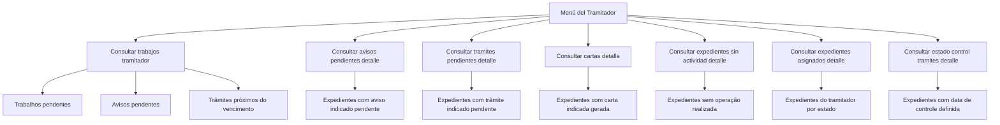

# Documentación de Operaciones de Siniestros — Menú del Tramitador

## 1. Metadados do Documento
- **Arquivo de Origem:** Não identificado no conteúdo fornecido
- **Tipo de Documento:** Manual Operacional
- **Domínio / Sistema:** Operações de Siniestros — Menú del Tramitador
- **Público-Alvo:** Tramitadores e equipes operacionais
- **Data/Versão Identificada:** Não identificada

---

## 2. Resumo Executivo & Contexto de Negócio

O documento descreve o **Menú del Tramitador** como a ferramenta básica e fundamental utilizada por um tramitador para realizar o seu trabalho operacional. O contexto funcional está relacionado a operações de **siniestros** e ao acompanhamento de expedientes, avisos, trâmites, cartas e atividades pendentes.

O menu oferece consultas detalhadas para localizar conjuntos de expedientes segundo critérios operacionais. Em várias operações, o tramitador pode aplicar condições ou filtros próprios para restringir os resultados retornados.

As funcionalidades apresentadas concentram-se em identificar pendências, vencimentos próximos, expedientes sem atividade, expedientes atribuídos ao tramitador e controles de prazo para realização de trâmites. Dessa forma, o menu apoia a priorização e o monitoramento do trabalho operacional.

O conteúdo fornecido não apresenta arquitetura técnica, métodos HTTP, contratos de integração, bancos de dados, URLs, ambientes ou detalhes de implementação. As informações disponíveis são estritamente funcionais e descritivas.

---

## 3. Arquitetura, Componentes & Tecnologias Envolvidas

Os componentes funcionais explicitamente citados são:

- **Menú del Tramitador:** ferramenta central de trabalho do tramitador.
- **Consultar trabajos tramitador:** consulta de trabalhos pendentes, avisos pendentes e trâmites próximos do vencimento.
- **Consultar avisos pendientes detalle:** consulta de expedientes que possuem um aviso indicado pendente.
- **Consultar tramites pendientes detalle:** consulta de expedientes que possuem um trâmite indicado pendente.
- **Consultar cartas detalle:** consulta de expedientes para os quais foi gerada uma carta indicada.
- **Consultar expedientes sin actividad detalle:** consulta de expedientes sem qualquer operação realizada.
- **Consultar expedientes asignados detalle:** consulta de expedientes associados ao tramitador, considerando estados e filtros.
- **Consultar estado control tramites detalle:** consulta de expedientes com data de controle definida para execução de trâmites.



> **Nota de Análise:** O documento não detalha tecnologias, integrações, camadas de software, interfaces, banco de dados, serviços ou contratos técnicos associados ao Menú del Tramitador.

---

## 4. Regras de Negócio, Especificações Funcionais & Processos

### 4.1. Função central do Menú del Tramitador

O **Menú del Tramitador** é apresentado como a ferramenta básica e fundamental pela qual um tramitador realiza todo o seu trabalho. O documento caracteriza o menu como um ponto de acesso a consultas operacionais sobre expedientes e itens associados.

### 4.2. Consultar trabajos tramitador

A operação **Consultar trabajos tramitador** apresenta:

- Todos os trabalhos pendentes.
- Avisos pendentes.
- Trâmites próximos de caducar.

O documento não especifica os critérios para definir que um trâmite está “a ponto de caducar”, nem apresenta prazos, datas, regras de cálculo ou mecanismos de alerta.

### 4.3. Consultar avisos pendientes detalle

A operação **Consultar avisos pendientes detalle** mostra todos os expedientes que:

1. Possuem o aviso indicado pendente.
2. Atendem às condições filtradas pelo tramitador.

A operação depende de um aviso selecionado ou indicado pelo tramitador e de filtros definidos pelo próprio usuário operacional.

### 4.4. Consultar tramites pendientes detalle

A operação **Consultar tramites pendientes detalle** mostra todos os expedientes que:

1. Possuem o trâmite indicado pendente.
2. Atendem às condições filtradas pelo tramitador.

O documento não detalha os tipos de trâmites disponíveis, os estados possíveis dos trâmites ou as regras para determinação de pendência.

### 4.5. Consultar cartas detalle

A operação **Consultar cartas detalle** mostra todos os expedientes para os quais foi gerada a carta indicada, considerando as condições filtradas pelo tramitador.

O documento não especifica tipos de carta, canais de envio, conteúdo documental, destinatários ou estados de entrega.

### 4.6. Consultar expedientes sin actividad detalle

A operação **Consultar expedientes sin actividad detalle** mostra todos os expedientes nos quais não foi realizada nenhuma operação, considerando as condições filtradas pelo tramitador.

O documento não define o período de inatividade nem quais operações são consideradas atividade para esse critério.

### 4.7. Consultar expedientes asignados detalle

A operação **Consultar expedientes asignados detalle** mostra todos os expedientes atribuídos ao tramitador, considerando:

1. O estado do expediente.
2. As condições filtradas pelo tramitador.

Os exemplos de estado apresentados são:

- Pendente.
- Em juízo.
- Retido por “c.t...”.

> **Nota de Análise:** A expressão “c.t...” está truncada no conteúdo extraído. O documento não fornece sua expansão ou significado.

### 4.8. Consultar estado control tramites detalle

A operação **Consultar estado control tramites detalle** mostra todos os expedientes que:

1. Possuem data de controle definida.
2. Possuem data de controle associada ao tempo máximo para realização.
3. Estão no estado indicado pelo tramitador.
4. Atendem às condições filtradas pelo tramitador.

O documento associa explicitamente a data de controle ao “tempo máximo para realizar-se”, mas não informa como esse tempo é calculado, configurado ou atualizado.

---

## 5. Tabelas de Parâmetros, Ambientes e Estruturas de Dados

| Item / Parâmetro | Descrição / Função | Tipo / Valores / Formato | Ambiente / Observações |
| :--- | :--- | :--- | :--- |
| Menú del Tramitador | Ferramenta básica e fundamental para o trabalho do tramitador | Menu operacional | Ambiente não identificado |
| Tramitador | Usuário operacional que executa consultas e define condições de filtro | Papel operacional | Não há matriz de permissões descrita |
| Expediente | Entidade consultada pelas operações do menu | Registro operacional | Estrutura de dados não detalhada |
| Aviso pendente | Aviso associado a um expediente que permanece pendente | Critério de consulta | O aviso deve ser indicado pelo tramitador |
| Trâmite pendente | Trâmite associado a um expediente que permanece pendente | Critério de consulta | O trâmite deve ser indicado pelo tramitador |
| Trâmite próximo de caducar | Trâmite identificado como próximo do vencimento | Critério de acompanhamento | Prazo ou regra de vencimento não detalhados |
| Carta indicada | Carta gerada para um expediente | Critério de consulta | Tipos e conteúdo de carta não detalhados |
| Expediente sem atividade | Expediente para o qual não foi realizada nenhuma operação | Critério de consulta | Janela temporal de inatividade não detalhada |
| Expediente atribuído | Expediente associado a um tramitador | Critério de consulta | Pode ser consultado por estado |
| Estado do expediente | Situação operacional usada na consulta de expedientes atribuídos | Exemplos: pendente, em juízo, retido por c.t... | Lista completa de estados não detalhada |
| Data de controle | Data definida para controlar a execução de um trâmite | Data; formato não identificado | Associada ao tempo máximo para realização |
| Condições de filtro | Critérios aplicados pelo tramitador para limitar os resultados das consultas | Não detalhado | Aplicável a avisos, trâmites, cartas, inatividade, atribuições e controle de trâmites |

> **Nota de Análise:** O conteúdo não informa servidores, URLs, ambientes de desenvolvimento/homologação/produção, rotas de log, variáveis de configuração ou formatos técnicos de dados.

---

## 6. Bateria de Perguntas & Respostas para RAG (FAQ Sintético)

### P1: Qual é a finalidade do Menú del Tramitador?
**R:** O Menú del Tramitador é a ferramenta básica e fundamental utilizada pelo tramitador para realizar o seu trabalho operacional. O menu concentra consultas sobre trabalhos pendentes, avisos, trâmites, cartas e expedientes.

### P2: O que a consulta “Consultar trabajos tramitador” mostra?
**R:** A consulta “Consultar trabajos tramitador” mostra todos os trabalhos pendentes, os avisos pendentes e os trâmites que estão próximos de caducar.

### P3: Como localizar expedientes com um aviso específico pendente?
**R:** A funcionalidade “Consultar avisos pendientes detalle” mostra todos os expedientes que possuem o aviso indicado pendente, respeitando as condições filtradas pelo tramitador.

### P4: Como consultar expedientes com um trâmite específico pendente?
**R:** A funcionalidade “Consultar tramites pendientes detalle” mostra todos os expedientes que possuem o trâmite indicado pendente e que atendem às condições filtradas pelo tramitador.

### P5: Como identificar expedientes para os quais uma carta foi gerada?
**R:** A consulta “Consultar cartas detalle” mostra todos os expedientes aos quais foi gerada a carta indicada, considerando as condições filtradas pelo tramitador.

### P6: Como encontrar expedientes sem nenhuma operação realizada?
**R:** A consulta “Consultar expedientes sin actividad detalle” mostra os expedientes nos quais não foi realizada nenhuma operação, segundo as condições filtradas pelo tramitador.

### P7: Quais estados podem ser usados na consulta de expedientes atribuídos?
**R:** O documento cita como exemplos os estados “pendente”, “em juízo” e “retido por c.t...”. A lista completa de estados não é apresentada, e o significado de “c.t...” não é detalhado.

### P8: O que é consultado em “Consultar expedientes asignados detalle”?
**R:** Essa consulta mostra todos os expedientes atribuídos ao tramitador, considerando o estado selecionado — como pendente, em juízo ou retido por c.t... — e as condições filtradas pelo tramitador.

### P9: O que representa a data de controle dos trâmites?
**R:** A data de controle é uma data definida em expedientes e está relacionada ao tempo máximo para realização de um trâmite. A consulta de estado de controle mostra expedientes que possuem essa data definida, no estado indicado pelo tramitador e conforme os filtros aplicados.

### P10: O documento informa como os filtros do tramitador funcionam?
**R:** Não. O documento informa que diversas consultas utilizam condições filtradas pelo tramitador, mas não descreve os campos disponíveis, operadores de filtro, valores permitidos ou regras de combinação.

### P11: O documento define quando um trâmite está próximo de caducar?
**R:** Não. O documento menciona que a consulta de trabalhos do tramitador mostra trâmites a ponto de caducar, mas não apresenta prazo, fórmula, configuração ou regra para determinar essa condição.

### P12: O documento descreve integrações técnicas ou APIs do Menú del Tramitador?
**R:** Não. O conteúdo fornecido descreve funcionalidades operacionais do menu, mas não apresenta APIs, tecnologias, URLs, contratos de dados, métodos HTTP ou integrações entre sistemas.

---

## 7. Glossário de Termos, Siglas & Conceitos-Chave

- **Siniestros:** termo utilizado no título do documento para o domínio de operações abordado; o conteúdo não fornece definição adicional.
- **Menú del Tramitador:** ferramenta operacional básica e fundamental usada pelo tramitador para realizar consultas e executar seu trabalho.
- **Tramitador:** usuário operacional que utiliza o menu e aplica condições de filtro às consultas.
- **Expediente:** entidade operacional retornada pelas consultas do menu.
- **Aviso pendiente:** aviso pendente associado a um expediente.
- **Trámite pendiente:** trâmite pendente associado a um expediente.
- **Carta:** item gerado para um expediente e consultável por meio de “Consultar cartas detalle”.
- **Expediente sin actividad:** expediente no qual não foi realizada nenhuma operação.
- **Fecha de control:** data definida para controle de trâmites, associada ao tempo máximo para realização.
- **c.t...:** expressão apresentada de forma truncada como parte de um estado de expediente; significado não identificado no documento.

---

## 8. Notas Críticas, Riscos & Limitações

- O conteúdo não identifica o nome do arquivo de origem, autor, data, versão ou histórico de alterações.
- O documento não detalha a arquitetura técnica do sistema, tecnologias, integrações, APIs, URLs, ambientes, autenticação, permissões ou logs.
- Não há definição de campos, filtros, operadores, ordenação, paginação ou formato de resultado para as consultas.
- Os critérios de vencimento de trâmites próximos de caducar não são descritos.
- O conceito de “nenhuma operação” para caracterizar um expediente sem atividade não possui definição operacional nem período de referência.
- A lista de estados de expedientes está incompleta; “c.t...” aparece truncado e não pode ser expandido com segurança.
- A data de controle é vinculada ao tempo máximo para realização de um trâmite, porém não há regra de cálculo, origem da data ou comportamento para atrasos.
- Não existem detalhes adicionais sobre cartas, avisos ou trâmites além de sua utilização como critérios de consulta.

---

## 9. Conteúdo Bruto Estruturado (Referência Fiel)

```text
--- [PÁGINA 1 DE 2] ---

DOCUMENTACIÓN OPERACIONES de
SINIESTROS - MENÚ DEL TRAMITADOR
MENÚ DEL TRAMITADOR
Operaciones que se pueden realizar desde el menú del tamitador. Esta
es la herramienta básica y fundamental en la que un tramitador va a
realizar todo su trabajo
CONSULTAR trabajos tramitador
Muestra todos los trabajos pendientes, avisos
pendientes, trámites a punto de caducar... -
CONSULTAR avisos pendientes detalle
Muestra todos los expedientes que tengan el
aviso indicado pendiente, con las condiciones
que haya filtrado el tramitador
CONSULTAR tramites pendientes detalle
Muestra todos los expedientes que tengan el
trámite indicado pendiente con las
condiciones que haya filtrado el tramitador
CONSULTAR cartas detalle
 CONSULTAR expedientes sin actividad
detalle
 / 
 CF
Home Solutions APIs Documentation Zeus
EN


--- [PÁGINA 2 DE 2] ---

Muestra todos los expedientes a los que se
les haya generado la carta indicada, con las
condiciones que haya filtrado el tramitador
Muestra todos los expedientes que no se
haya realizado ninguna operación con ellos,
con las condiciones que haya filtrado el
tramitador
CONSULTAR expedientes asignados
detalle
Muestra todos los expedientes que tenga el
tramitador con el estado (pendiente, en juicio,
retenido por c.t...) y las condiciones que haya
filtrado el tramitador
CONSULTAR estado control tramites
detalle
Muestra todos los expedientes que tengan
definido fecha de control (tiempo máximo para
realizarse) en el estado que indique el
tramitador y las condiciones que haya filtrado
el tramitador
```
