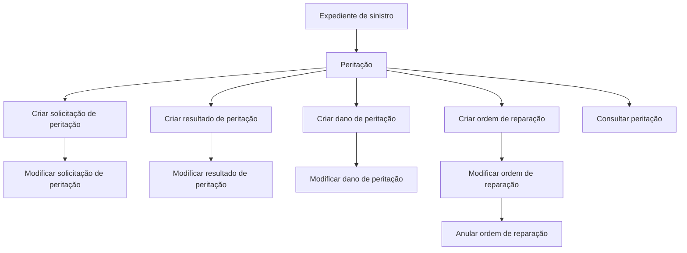

# Documentação de Operações de Sinistros — Peritações

## 1. Metadados do Documento
- **Arquivo de Origem:** `Não identificado`
- **Tipo de Documento:** `Manual Operacional`
- **Domínio / Sistema:** `Sinistros — Peritações`
- **Público-Alvo:** `Operação, Negócio e Desenvolvedores`
- **Data/Versão Identificada:** `Não identificada`

---

## 2. Resumo Executivo & Contexto de Negócio

O documento descreve operações de peritação associadas a expedientes de sinistros. As operações podem ser executadas em modalidade **em linha** ou **diferida**, sem que o material forneça critérios adicionais para seleção, processamento ou diferenças funcionais entre essas modalidades.

O processo de peritação contempla o ciclo de vida da solicitação, incluindo criação e alteração da solicitação de peritação. A solicitação registra a necessidade de realização de uma peritação ou investigação.

Após a realização da peritação por um profissional, o processo permite criar e modificar o resultado da peritação. O documento também prevê o registro e a alteração de danos associados a veículos, imóveis ou outros itens não detalhados.

Por fim, o conjunto funcional inclui a criação, modificação e anulação de ordens de reparação. A ordem de reparação é utilizada para viabilizar o pagamento de um profissional que tenha participado da peritação. A operação de consulta permite visualizar todas as informações de uma peritação.

---

## 3. Arquitetura, Componentes & Tecnologias Envolvidas

O documento não descreve arquitetura técnica, protocolos, integrações, bancos de dados, contratos de API, ambientes ou tecnologias de implementação. O texto apresenta somente operações funcionais do domínio de peritações.

Componentes funcionais identificados:

- **Expediente de sinistro:** contexto no qual as operações de peritação são realizadas.
- **Solicitação de peritação:** registro da necessidade de peritação ou investigação.
- **Resultado de peritação:** dados resultantes da peritação executada por um profissional.
- **Dano de peritação:** danos ocasionados em veículo, imóvel ou outro bem não especificado.
- **Ordem de reparação:** ordem utilizada para permitir o pagamento a profissional interveniente na peritação.
- **Consulta de peritação:** visualização integral das informações de uma peritação.



> **Nota de Análise:** O documento lista operações funcionais de peritação, mas não detalha métodos HTTP, contratos JSON, endpoints, autenticação, sistemas integrados ou modelos de dados.

---

## 4. Regras de Negócio, Especificações Funcionais & Processos

### Modalidades de execução

- As operações de peritação de um expediente podem ser realizadas:
  - **Em linha**.
  - **De forma diferida**.
- O documento não especifica os critérios de negócio, gatilhos, responsáveis ou diferenças operacionais entre a execução em linha e a execução diferida.

### Gestão de solicitação de peritação

1. **Criar solicitação de peritação**
   - Registra uma solicitação para realização de uma peritação ou investigação.

2. **Modificar solicitação de peritação**
   - Permite alterar informações da solicitação de peritação.
   - O documento não identifica quais campos da solicitação podem ser modificados.

### Gestão de resultado de peritação

1. **Criar resultado**
   - Gera os dados do resultado de uma peritação realizada por um profissional.

2. **Modificar resultado**
   - Permite modificar as informações do resultado da peritação.
   - O documento não detalha a estrutura dos dados de resultado, validações ou regras de aprovação.

### Gestão de danos de peritação

1. **Criar dano de peritação**
   - Permite registrar danos ocasionados em veículo, imóvel ou outro bem não detalhado.

2. **Modificar dano de peritação**
   - Permite alterar danos ocasionados em veículo, imóvel ou outro bem não detalhado.

### Gestão de ordem de reparação

1. **Criar ordem de reparação**
   - Permite gerar uma ordem para realizar o pagamento a um profissional que tenha intervindo na peritação.

2. **Modificar ordem de reparação**
   - Permite modificar dados e importes de uma ordem de reparação.

3. **Anular ordem de reparação**
   - Permite cancelar uma ordem de reparação.

### Consulta de peritação

- **Consultar peritação**
  - Permite visualizar todas as informações de uma peritação.
  - O documento não especifica filtros, critérios de busca, permissões, formato de apresentação ou dados exibidos.

---

## 5. Tabelas de Parâmetros, Ambientes e Estruturas de Dados

| Item / Parâmetro | Descrição / Função | Tipo / Valores / Formato | Ambiente / Observações |
| :--- | :--- | :--- | :--- |
| Modalidade de operação | Forma de realização das operações de peritação de um expediente | Em linha ou diferida | Não há critérios adicionais documentados |
| Solicitação de peritação | Registro da necessidade de realizar peritação ou investigação | Entidade funcional | Campos não detalhados |
| Resultado de peritação | Dados gerados após peritação realizada por profissional | Entidade funcional | Estrutura e validações não detalhadas |
| Dano de peritação | Registro dos danos ocasionados | Veículo, imóvel ou outro bem não especificado | Campos e classificação de danos não detalhados |
| Ordem de reparação | Ordem para permitir pagamento de profissional interveniente | Entidade funcional; inclui dados e importes | Processo de pagamento não detalhado |
| Anulação de ordem | Cancelamento de uma ordem de reparação | Operação funcional | Motivos, efeitos e reversões não detalhados |
| Consulta de peritação | Visualização da informação de uma peritação | Operação funcional | Filtros e permissões não detalhados |

---

## 6. Bateria de Perguntas & Respostas para RAG (FAQ Sintético)

### P1: Quais modalidades de execução estão disponíveis para operações de peritação de um expediente?
**R:** As operações de peritação de um expediente podem ser realizadas em linha ou de forma diferida. O documento não explica as diferenças técnicas, funcionais ou operacionais entre essas duas modalidades.

### P2: Qual é a finalidade da operação de criar solicitação de peritação?
**R:** A operação de criar solicitação de peritação registra uma solicitação para que uma peritação ou investigação seja realizada.

### P3: O que pode ser alterado na operação de modificar solicitação de peritação?
**R:** A operação permite mudar informações da solicitação de peritação. O documento não identifica os campos modificáveis nem define validações para a alteração.

### P4: Quando um resultado de peritação é criado?
**R:** O resultado é criado para gerar os dados resultantes de uma peritação realizada por um profissional.

### P5: É possível alterar o resultado de uma peritação já registrado?
**R:** Sim. A operação de modificar resultado permite alterar as informações do resultado da peritação. O material não detalha quais informações podem ser modificadas.

### P6: Que tipos de danos podem ser registrados em uma peritação?
**R:** A operação de criar dano de peritação permite registrar danos ocasionados em veículos, imóveis ou outros bens não especificados pelo documento.

### P7: Qual é o objetivo de uma ordem de reparação no processo de peritação?
**R:** A ordem de reparação permite gerar uma ordem para realizar o pagamento de um profissional que tenha participado da peritação.

### P8: O que a operação de modificar ordem de reparação permite alterar?
**R:** A operação permite modificar tanto os dados quanto os importes de uma ordem de reparação.

### P9: O que acontece ao anular uma ordem de reparação?
**R:** A operação de anular ordem de reparação permite cancelar uma ordem de reparação. O documento não descreve os efeitos financeiros, operacionais ou contábeis do cancelamento.

### P10: Qual operação deve ser utilizada para visualizar informações de uma peritação?
**R:** A operação de consultar peritação permite visualizar todas as informações de uma peritação.

---

## 7. Glossário de Termos, Siglas & Conceitos-Chave

- **Sinistros:** domínio citado no título do documento, relacionado às operações de peritação.
- **Peritação:** atividade sobre um expediente de sinistro que pode ser realizada em linha ou de forma diferida.
- **Expediente:** contexto ou caso de sinistro sobre o qual são realizadas operações de peritação.
- **Solicitação de peritação:** registro que solicita a realização de uma peritação ou investigação.
- **Investigação:** finalidade alternativa mencionada para uma solicitação de peritação.
- **Resultado de peritação:** dados gerados a partir de uma peritação realizada por um profissional.
- **Dano de peritação:** registro de danos ocasionados, incluindo exemplos como veículo e imóvel.
- **Ordem de reparação:** ordem que possibilita o pagamento de profissional que interveio na peritação.
- **Importes:** valores associados a uma ordem de reparação.

---

## 8. Notas Críticas, Riscos & Limitações

- O documento não identifica o arquivo de origem, data, versão, autor ou responsável.
- Não há arquitetura de software, interfaces, APIs, URLs, tecnologias, ambientes, servidores ou rotas de log documentados.
- Não foram apresentados campos, tipos de dados, regras de validação, perfis de acesso ou mecanismos de auditoria.
- A execução em linha e a execução diferida são mencionadas, mas não possuem detalhamento operacional.
- O documento não descreve estados, transições, pré-condições ou pós-condições para criação, modificação e anulação de entidades.
- Não são detalhados os impactos financeiros ou operacionais da modificação e anulação de uma ordem de reparação.
- Não há detalhamento adicional sobre os tópicos apresentados.

---

## 9. Conteúdo Bruto Estruturado (Referência Fiel)

```text
--- [PÁGINA 1 DE 2] ---

DOCUMENTACIÓN OPERACIONES de
SINIESTROS - PERITACIONES
PERITACIONES
Operaciones de peritación de un expediente, se pueden realizar tanto en
línea como diferido
CREAR solicitud peritación
En esta operación se registra la solicitud para
que se realice una peritación / investigación
MODIFICAR solicitud
Permite cambiar información de la solicitud de
peritación
CREAR resultado
En esta operación se generan los datos del
resultado de la peritación realizada por un
profesional
MODIFICAR resultado
Permite cambiar la información del resultado
de la peritación
 /
 CF
Home Solutions APIs Documentation Zeus
EN


--- [PÁGINA 2 DE 2] ---

CREAR daño peritación
Permite registrar los daños ocasionados del
vehículo, del inmueble...
MODIFICAR daño peritación
Permite modificar los daños ocasionados del
vehículo, del inmueble...
CREAR orden reparación
Permite generar una orden para poder pagar
a un profesional que haya intervenido en la
peritación
MODIFICAR orden reparación
Permite modificar una orden tanto los datos,
como los importes de la misma
ANULAR orden reparación
Permite cancelar una orden de reparación
CONSULTAR peritación
Visualiza toda la información de una
peritación.
```
