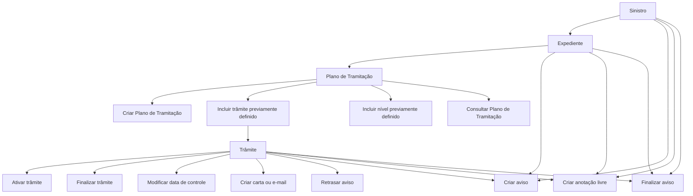

# Documentação de Operações de Sinistros — Plano de Tramitação

## 1. Metadados do Documento
- **Arquivo de Origem:** Não identificado no conteúdo fornecido
- **Tipo de Documento:** Manual Operacional
- **Domínio / Sistema:** Operações de Sinistros — Plano de Tramitação
- **Público-Alvo:** Operação, analistas funcionais e usuários responsáveis pela tramitação de expedientes de sinistro
- **Data/Versão Identificada:** Não identificada

---

## 2. Resumo Executivo & Contexto de Negócio

O documento descreve as operações disponíveis no **Plano de Tramitação** de um **expediente** no domínio de sinistros. O Plano de Tramitação concentra ações relacionadas à criação, consulta, composição e execução de trâmites associados a um expediente.

O processo permite criar um Plano de Tramitação quando o expediente ainda não possui um plano atribuído. Após a criação ou existência do plano, o usuário pode incluir trâmites e níveis previamente definidos no próprio plano.

O conteúdo também descreve operações de acompanhamento operacional, como criação, finalização e postergação de avisos, além da alteração da data de controle de um trâmite. Os avisos podem existir nos níveis de sinistro, expediente e trâmite, conforme a operação realizada.

O documento registra ainda a possibilidade de criar anotações livres e gerar cartas ou e-mails. Não há detalhamento sobre métodos HTTP, contratos JSON, permissões, tecnologias de implementação, integrações externas, ambientes ou regras de elegibilidade adicionais.

---

## 3. Arquitetura, Componentes & Tecnologias Envolvidas

Os componentes funcionais explicitamente citados são:

- **Sinistro:** contexto no qual avisos e anotações podem ser registrados.
- **Expediente:** entidade que pode receber um Plano de Tramitação.
- **Plano de Tramitação:** estrutura que organiza trâmites e níveis de um expediente.
- **Trâmite:** item do Plano de Tramitação que pode ser incluído, ativado, finalizado e ter data de controle modificada.
- **Nível:** item que pode ser incluído no Plano de Tramitação, desde que previamente definido.
- **Aviso:** lembrete associado a sinistro, expediente ou trâmite.
- **Anotação livre:** registro textual visível nos níveis indicados pelo documento.
- **Carta / e-mail:** conteúdo que pode ser gerado pela operação correspondente.



> **Nota de Análise:** O documento não descreve arquitetura técnica, microsserviços, URLs, APIs, bancos de dados, tecnologias ou ambientes de execução.

---

## 4. Regras de Negócio, Especificações Funcionais & Processos

### Criação do Plano de Tramitação
- A operação **CRIAR plano tramitação** permite atribuir um Plano de Tramitação a um expediente.
- A criação é permitida quando o expediente **não possui um plano atribuído**.

### Inclusão de elementos no plano
- A operação **INCLUIR trâmite** adiciona um trâmite ao Plano de Tramitação.
- O trâmite incluído deve ter sido **previamente definido no plano**.
- A operação **INCLUIR nível** adiciona um nível ao Plano de Tramitação.
- O nível incluído deve ter sido **previamente definido no plano**.

### Execução e encerramento de trâmites
- A operação **ACTIVAR trámite** executa o trâmite.
- A operação **FINALIZAR trámite** termina o trâmite.
- A operação **MODIFICAR fecha control** altera a data de controle do trâmite.

### Gestão de avisos
- A operação **CREAR aviso** registra um lembrete.
- O aviso pode existir:
  - no nível de sinistro;
  - no nível de expediente;
  - no nível de trâmite.
- Um aviso criado no nível de sinistro é visível nos Planos de Tramitação de todos os expedientes do sinistro.
- A operação **FINALIZAR aviso** encerra o lembrete para que ele não avise novamente.
- A finalização de aviso pode ocorrer no nível de sinistro, expediente e trâmite.
- A operação **RETRASAR aviso** posterga a data do aviso de trâmite.

### Gestão de anotações
- A operação **CREAR anotación libre** permite inserir uma anotação.
- Uma anotação criada no nível de sinistro é visível em todos os expedientes do sinistro.
- O documento também indica criação de anotação livre nos níveis de expediente e trâmite.

### Geração de comunicações
- A operação **CREAR carta, email** gera a carta ou o texto.
- O documento não especifica formato, destinatário, canal de envio, modelo documental ou regra de disparo para cartas e e-mails.

### Consulta
- A operação **CONSULTAR plan tramitación** mostra todas as informações do Plano de Tramitação.

---

## 5. Tabelas de Parâmetros, Ambientes e Estruturas de Dados

| Item / Parâmetro | Descrição / Função | Tipo / Valores / Formato | Ambiente / Observações |
| :--- | :--- | :--- | :--- |
| Plano de Tramitação | Plano atribuído a um expediente para organizar operações de tramitação. | Estrutura funcional | Pode ser criado somente se o expediente não possuir plano atribuído. |
| Expediente | Entidade que pode receber e consultar um Plano de Tramitação. | Entidade funcional | Associada ao contexto de sinistro. |
| Sinistro | Contexto superior para avisos e anotações. | Entidade funcional | Avisos e anotações no nível de sinistro possuem visibilidade em todos os expedientes do sinistro, conforme descrito. |
| Trâmite | Item incluído no Plano de Tramitação. | Item previamente definido no plano | Pode ser incluído, ativado, finalizado, ter a data de controle modificada e receber aviso postergado. |
| Nível | Item incluído no Plano de Tramitação. | Item previamente definido no plano | O documento não detalha atributos ou comportamento adicional do nível. |
| Aviso | Lembrete registrado no contexto de sinistro, expediente ou trâmite. | Lembrete | Pode ser criado, finalizado ou postergado; a postergação é descrita para aviso de trâmite. |
| Anotação livre | Registro de anotação associado a sinistro, expediente ou trâmite. | Texto não especificado | Anotação de sinistro é visível em todos os expedientes do sinistro. |
| Data de controle | Data associada ao trâmite que pode ser alterada. | Data; formato não informado | O documento não define regras de validação ou cálculo. |
| Carta / e-mail | Carta ou texto gerado pela operação correspondente. | Conteúdo não especificado | Não há detalhes sobre envio, templates ou destinatários. |
| Ambientes, servidores e URLs | Não informados. | Não aplicável | O documento não apresenta endereços, ambientes ou configurações técnicas. |

---

## 6. Bateria de Perguntas & Respostas para RAG (FAQ Sintético)

### P1: Quando é permitido criar um Plano de Tramitação para um expediente?
**R:** Um Plano de Tramitação pode ser criado para atribuição a um expediente quando o expediente não possui um plano previamente atribuído.

### P2: O que é necessário para incluir um trâmite no Plano de Tramitação?
**R:** O trâmite deve estar previamente definido no Plano de Tramitação. A operação **INCLUIR trâmite** adiciona esse trâmite previamente definido ao plano.

### P3: É possível incluir níveis no Plano de Tramitação?
**R:** Sim. A operação **INCLUIR nível** permite adicionar um nível ao Plano de Tramitação, desde que o nível tenha sido previamente definido no plano.

### P4: Qual operação executa um trâmite do Plano de Tramitação?
**R:** A operação **ACTIVAR trámite** executa o trâmite.

### P5: Como um trâmite é encerrado?
**R:** O encerramento ocorre por meio da operação **FINALIZAR trámite**, cuja finalidade é terminar o trâmite.

### P6: Em quais níveis um aviso pode ser criado?
**R:** Um aviso pode ser criado nos níveis de sinistro, expediente e trâmite. O aviso registrado no nível de sinistro é visível nos Planos de Tramitação de todos os expedientes daquele sinistro.

### P7: O que acontece ao finalizar um aviso?
**R:** A operação **FINALIZAR aviso** termina o lembrete para que ele não emita novos avisos. O documento informa que a finalização pode ocorrer nos níveis de sinistro, expediente e trâmite.

### P8: Como postergar um aviso de trâmite?
**R:** A operação **RETRASAR aviso** permite postergar a data do aviso de trâmite. O documento não informa critérios, limites ou formato da nova data.

### P9: Onde uma anotação livre criada no nível de sinistro fica visível?
**R:** Uma anotação livre criada no nível de sinistro fica visível em todos os expedientes pertencentes ao mesmo sinistro.

### P10: É possível criar anotações em outros níveis além do sinistro?
**R:** Sim. O documento indica a criação de anotação livre nos níveis de sinistro, expediente e trâmite.

### P11: Qual operação permite alterar a data de controle de um trâmite?
**R:** A operação **MODIFICAR fecha control** permite mudar a data de controle do trâmite.

### P12: O que a operação de consulta do Plano de Tramitação apresenta?
**R:** A operação **CONSULTAR plan tramitación** mostra todas as informações do Plano de Tramitação.

### P13: O documento especifica como cartas e e-mails são enviados?
**R:** Não. O documento informa apenas que a operação **CREAR carta, email** gera a carta ou o texto, sem detalhar envio, destinatários, modelos ou integrações.

---

## 7. Glossário de Termos, Siglas & Conceitos-Chave

- **Aviso:** lembrete que pode ser registrado nos níveis de sinistro, expediente ou trâmite.
- **Data de controle:** data associada ao trâmite que pode ser modificada.
- **Expediente:** entidade à qual um Plano de Tramitação pode ser atribuído.
- **Nível:** elemento previamente definido que pode ser incluído em um Plano de Tramitação.
- **Plano de Tramitação:** estrutura que agrupa operações e elementos de tramitação de um expediente.
- **Sinistro:** contexto no qual existem expedientes e no qual avisos e anotações podem possuir visibilidade transversal.
- **Trâmite:** elemento do Plano de Tramitação que pode ser incluído, ativado e finalizado.

---

## 8. Notas Críticas, Riscos & Limitações

- O documento não identifica arquivo de origem, data, versão, autor ou responsável pelo conteúdo.
- Não há especificação de permissões, perfis de acesso ou matriz de responsabilidades para cada operação.
- Não são descritos contratos de API, métodos HTTP, estruturas JSON, códigos de retorno ou mecanismos de integração.
- O documento não define tecnologias, componentes de infraestrutura, URLs, servidores, ambientes, logs ou monitoramento.
- Não há detalhamento sobre regras de validação da data de controle, critérios para ativar ou finalizar trâmites, nem tratamento de exceções.
- A operação de criação de carta ou e-mail informa apenas a geração de carta ou texto; não há evidência de envio efetivo da comunicação.
- O documento apresenta termos em espanhol e não fornece definições técnicas adicionais para a estrutura interna de Plano de Tramitação, níveis ou trâmites.

---

## 9. Conteúdo Bruto Estruturado (Referência Fiel)

```text
--- [PÁGINA 1 DE 2] ---

DOCUMENTACIÓN OPERACIONES de
SINIESTROS - PLAN TRAMITACIÓN
PLAN TRAMITACIÓN
Operaciones que se pueden realizar dentro del Plan de tramitación de un
expediente
CREAR plan tramitación
Permite asignar el plan de tramitación a un
expediente, si este no tuviera uno asignado
INCLUIR trámite
Permite añadir un trámite al Plan, previamente
definido en el plan
INCLUIR nivel
Permite añadir un nivel al Plan, previamente
definido en el plan
ACTIVAR trámite
Ejecutar el trámite
 /
 CF
Home Solutions APIs Documentation Zeus
EN


--- [PÁGINA 2 DE 2] ---

FINALIZAR trámite
Terminar el trámite
CREAR aviso
Registrar un recordatorio a nivel de siniestro,
visible en los planes de tramitación de todos
los expedientes, a nivel de expediente y a
nivel de trámite.
CREAR anotación libre
Permite ingresar una anotación a nivel de
siniestro visible en todos los expedientes del
siniestro, a nivel de expediente y a nivel de
trámite.
FINALIZAR aviso
Permite terminar el recordatorio para que no
avise más, a nivel de siniestro, expediente y
trámite.
RETRASAR aviso
Permite post-poner la fecha de aviso de
trámite
CREAR carta, email
Genera la carta o texto
MODIFICAR fecha control
Permite cambiar la fecha de control del
trámite
CONSULTAR plan tramitación
Muestra toda la información del Plan de
tramitación
```
