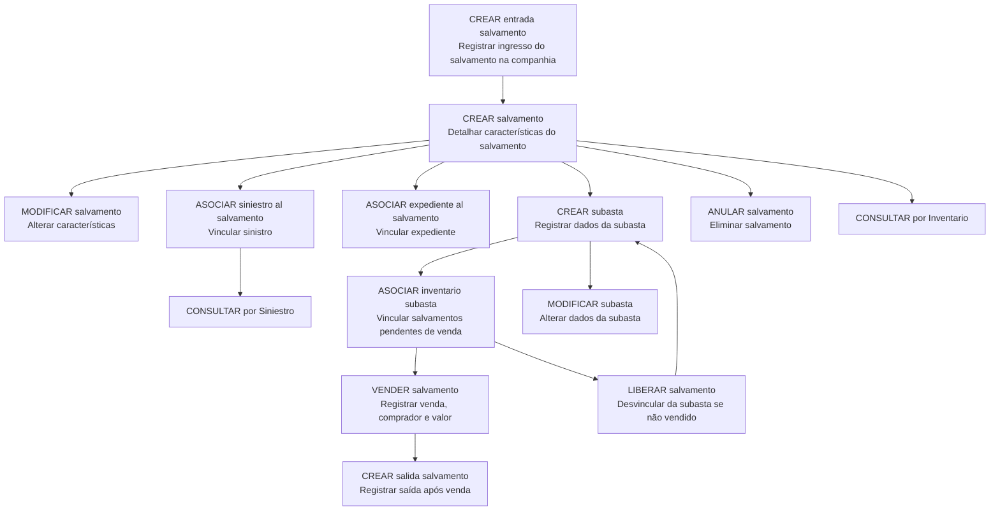

# Operações de Sinistros de Automóvel — Gestão de Salvamentos

## 1. Metadados do Documento
- **Arquivo de Origem:** `Não identificado no conteúdo fornecido`
- **Tipo de Documento:** Manual Operacional
- **Domínio / Sistema:** Sinistros de Automóvel — Salvamentos
- **Público-Alvo:** Operação e áreas de negócio envolvidas na gestão de salvamentos
- **Data/Versão Identificada:** Não identificada

---

## 2. Resumo Executivo & Contexto de Negócio

O documento descreve as operações disponíveis para a gestão de **salvamentos** no contexto de sinistros de automóvel. O processo abrange o registro inicial do bem salvado, o detalhamento das suas características, a associação a sinistros e expedientes, e a preparação do salvamento para venda.

A operação de salvamentos inclui a gestão de subastas. O documento estabelece que uma subasta registra informações para venda de salvamentos, incluindo data e localização, e permite associar ao inventário os salvamentos pendentes de venda. Também há suporte para alteração dos dados de uma subasta.

Após a venda, o processo registra informações sobre o comprador e o valor da venda, além de permitir registrar a saída do salvamento. Caso um salvamento associado a uma subasta não seja vendido, ele pode ser liberado para associação a outra subasta.

O material também prevê operações de consulta por sinistro e por inventário, permitindo recuperar as informações do salvamento por diferentes identificadores de negócio. Não são detalhados sistemas técnicos, métodos HTTP, contratos de integração, perfis de acesso, URLs, ambientes ou persistência de dados.

---

## 3. Arquitetura, Componentes & Tecnologias Envolvidas

O conteúdo fornecido não especifica arquitetura de software, componentes técnicos, microsserviços, tecnologias, bancos de dados, integrações, ambientes ou ferramentas. O material descreve exclusivamente um fluxo operacional-funcional de gestão de salvamentos.



> **Nota de Análise:** O diagrama representa relações funcionais inferidas diretamente das operações listadas. O documento não detalha regras de transição, obrigatoriedade, sequência técnica, métodos de integração ou persistência de dados.

---

## 4. Regras de Negócio, Especificações Funcionais & Processos

### Gestão inicial do salvamento

1. **CREAR entrada salvamento**
   - Registra o ingresso do bem salvado na companhia.

2. **CREAR salvamento**
   - Registra e detalha as características do salvamento.

3. **MODIFICAR salvamento**
   - Permite alterar as características previamente registradas para o salvamento.

4. **ASOCIAR siniestro al salvamento**
   - Vincula um sinistro ao salvamento registrado.
   - O documento informa que essa associação é necessária para vincular o sinistro ao salvamento.

5. **ASOCIAR expediente al salvamento**
   - Vincula um expediente ao salvamento.
   - O documento não define o conteúdo, identificador ou regras de validação do expediente.

### Gestão de subastas

6. **CREAR subasta**
   - Registra as informações de uma subasta destinada à venda de salvamentos.
   - Os exemplos de informações citadas são data e localização.

7. **ASOCIAR inventario subasta**
   - Vincula à subasta os salvamentos que estão pendentes de venda.

8. **MODIFICAR subasta**
   - Permite alterar os dados da subasta.

### Venda, liberação, anulação e saída

9. **VENDER salvamento**
   - Registra a venda de um salvamento.
   - Registra para quem o salvamento foi vendido.
   - Registra o valor pelo qual o salvamento foi vendido.

10. **LIBERAR salvamento**
    - Desvincula o salvamento da subasta.
    - A liberação é aplicável quando o salvamento não foi vendido.
    - Após a liberação, o salvamento pode ser associado a outra subasta.

11. **ANULAR salvamento**
    - Elimina o salvamento.
    - Os motivos explicitamente citados são: o salvamento não é vendido ou o salvamento está incorreto.

12. **CREAR salida salvamento**
    - Registra a saída do salvamento quando o salvamento foi vendido.

### Consultas

13. **CONSULTAR salvamentos (Por Siniestro)**
    - Retorna todas as informações do salvamento mediante a introdução do sinistro.

14. **CONSULTAR salvamentos (Por Inventario)**
    - Retorna todas as informações do salvamento mediante a introdução da identificação do próprio salvamento.

---

## 5. Tabelas de Parâmetros, Ambientes e Estruturas de Dados

| Item / Parâmetro | Descrição / Função | Tipo / Valores / Formato | Ambiente / Observações |
| :--- | :--- | :--- | :--- |
| Entrada de salvamento | Registro do ingresso do bem salvado na companhia | Operação `CREAR entrada salvamento` | Campos não detalhados |
| Salvamento | Registro com características do bem salvado | Operações `CREAR salvamento` e `MODIFICAR salvamento` | Características não especificadas |
| Sinistro | Entidade vinculada ao salvamento | Operação `ASOCIAR siniestro al salvamento` | Necessário para vincular o sinistro ao salvamento |
| Expediente | Entidade vinculada ao salvamento | Operação `ASOCIAR expediente al salvamento` | Sem detalhamento adicional |
| Subasta | Registro para venda de salvamentos | Operações `CREAR subasta` e `MODIFICAR subasta` | Inclui, entre outros dados, data e localização |
| Inventario subasta | Conjunto de salvamentos pendentes de venda vinculados a uma subasta | Operação `ASOCIAR inventario subasta` | Critérios de elegibilidade não detalhados |
| Venda de salvamento | Registro da venda do salvamento | Operação `VENDER salvamento` | Inclui comprador e valor da venda |
| Liberação de salvamento | Desvinculação de uma subasta | Operação `LIBERAR salvamento` | Aplicável se o salvamento não foi vendido |
| Anulação de salvamento | Eliminação de um salvamento | Operação `ANULAR salvamento` | Motivos citados: não vendido ou incorreto |
| Saída de salvamento | Registro da saída do salvamento vendido | Operação `CREAR salida salvamento` | Vinculada à condição de venda |
| Consulta por sinistro | Recuperação de informações do salvamento usando o sinistro | Operação `CONSULTAR salvamentos (Por Siniestro)` | Retorna toda a informação do salvamento |
| Consulta por inventário | Recuperação de informações usando a identificação do salvamento | Operação `CONSULTAR salvamentos (Por Inventario)` | Retorna toda a informação do salvamento |
| Ambientes técnicos | URLs, servidores, versões e credenciais | Não informado | Não identificado no conteúdo |
| Logs e monitoramento | Rotas, variáveis ou políticas de logs | Não informado | Não identificado no conteúdo |

---

## 6. Bateria de Perguntas & Respostas para RAG (FAQ Sintético)

### P1: Qual operação registra o ingresso de um salvamento na companhia?
**R:** A operação `CREAR entrada salvamento` registra o ingresso do bem salvado na companhia.

### P2: Como são registradas as características de um salvamento?
**R:** A operação `CREAR salvamento` permite detalhar as características do salvamento. Caso seja necessário alterar essas características posteriormente, deve ser utilizada a operação `MODIFICAR salvamento`.

### P3: Qual é a finalidade de associar um sinistro a um salvamento?
**R:** A operação `ASOCIAR siniestro al salvamento` é necessária para vincular o sinistro ao salvamento que foi registrado.

### P4: O documento permite vincular um expediente a um salvamento?
**R:** Sim. A operação `ASOCIAR expediente al salvamento` permite vincular um expediente ao salvamento. O documento não detalha quais dados compõem o expediente nem regras adicionais dessa associação.

### P5: Quais informações são registradas ao criar uma subasta?
**R:** A operação `CREAR subasta` registra as informações das subastas destinadas à venda de salvamentos. O documento cita explicitamente data e localização como exemplos de informações registradas.

### P6: Como os salvamentos pendentes de venda são associados a uma subasta?
**R:** A operação `ASOCIAR inventario subasta` vincula à subasta os salvamentos que estão pendentes de serem vendidos.

### P7: Quais dados devem ser registrados quando um salvamento é vendido?
**R:** A operação `VENDER salvamento` registra a venda do salvamento, incluindo a pessoa ou entidade para quem o salvamento foi vendido e o valor pelo qual ocorreu a venda.

### P8: Em que situação um salvamento pode ser liberado de uma subasta?
**R:** A operação `LIBERAR salvamento` permite desvincular o salvamento de uma subasta quando o salvamento não foi vendido. Após a liberação, o salvamento pode ser associado a outra subasta.

### P9: Quando um salvamento pode ser anulado?
**R:** A operação `ANULAR salvamento` permite eliminar um salvamento quando ele não é vendido ou quando está incorreto.

### P10: Como é registrada a saída de um salvamento?
**R:** A operação `CREAR salida salvamento` registra a saída do salvamento quando o salvamento foi vendido.

### P11: Como consultar salvamentos associados a um sinistro?
**R:** A operação `CONSULTAR salvamentos (Por Siniestro)` mostra toda a informação do salvamento ao informar o sinistro.

### P12: Como consultar um salvamento pela sua identificação?
**R:** A operação `CONSULTAR salvamentos (Por Inventario)` mostra toda a informação do salvamento mediante a introdução da identificação do próprio salvamento.

---

## 7. Glossário de Termos, Siglas & Conceitos-Chave

- **Salvamento / Salvado:** Bem registrado no processo de salvamentos relacionado a sinistros de automóvel.
- **Siniestro:** Sinistro associado a um salvamento.
- **Expediente:** Entidade que pode ser vinculada a um salvamento; o documento não apresenta definição adicional.
- **Subasta:** Subasta destinada à venda de salvamentos, com dados como data e localização.
- **Inventario subasta:** Relação ou inventário de salvamentos pendentes de venda associados a uma subasta.
- **CREAR entrada salvamento:** Operação para registrar o ingresso do salvamento na companhia.
- **CREAR salida salvamento:** Operação para registrar a saída de um salvamento vendido.
- **LIBERAR salvamento:** Operação que desvincula um salvamento não vendido da subasta para permitir sua associação a outra subasta.
- **ANULAR salvamento:** Operação para eliminar um salvamento não vendido ou incorreto.

---

## 8. Notas Críticas, Riscos & Limitações

- O documento não identifica arquivo de origem, data, versão, autor, sistema responsável ou ambiente de execução.
- Não há especificação de arquitetura técnica, integrações, APIs, URLs, métodos HTTP, contratos JSON, bancos de dados, logs, monitoramento ou mecanismos de autenticação.
- Não são apresentados campos obrigatórios, formatos, regras de validação, códigos de erro, perfis de acesso ou trilhas de auditoria.
- A relação entre `CREAR entrada salvamento` e `CREAR salvamento` é descrita funcionalmente, mas não há detalhamento sobre pré-requisitos, sequência obrigatória ou estado do salvamento.
- O documento cita a associação de expediente, porém não define o significado operacional de `expediente`.
- A expressão `CF Home Solutions APIs Documentation Zeus EN`, presente no conteúdo bruto, não possui contexto suficiente para ser classificada como sistema, componente ou referência técnica.

---

## 9. Conteúdo Bruto Estruturado (Referência Fiel)

```text
--- [PÁGINA 1 DE 2] ---

DOCUMENTACIÓN OPERACIONES de
SINIESTROS (Automóvil) - SALVAMENTOS
SALVAMENTOS
Operaciones posibles de salvamentos
CREAR entrada salvamento
Se Registra el ingreso del salvado a la
compañía
CREAR salvamento
Se detalla las características del salvamento
MODIFICAR salvamento
Permite cambiar las características del
salvado
ASOCIAR siniestro al salvamento
Se necesita para vincular el siniestro al
salvamento registrado
ASOCIAR expediente al salvamento
 CREAR subasta
 / 
 CF
Home Solutions APIs Documentation Zeus
EN


--- [PÁGINA 2 DE 2] ---

Permite vincular el expediente al salvamento.
 Se registra la información de las subastas
para la venta de salvamentos, fecha,
ubicación, etc
ASOCIAR inventario subasta
Se vinculan los salvamentos pendientes para
ser vendidos
MODIFICAR subasta
Permite cambiar los datos de la subasta
VENDER salvamento
Si un salvamento es vendido se registra su
venta, a quien se le ha vendido, por cuanto,
etc
LIBERAR salvamento
Permite desvincular el salvamento de la
subasta si este no ha sido vendido para poder
asociarse a otra subasta
ANULAR salvamento
Esta operación permite eliminar el
salvamento, porque no se vende, porque está
erróneo
CREAR salida salvamento
Permite registrar la salida del salvamento
cuando es vendido
CONSULTAR salvamentos (Por Siniestro)
Muestra toda la información del salvado
introduciendo el siniestro
CONSULTAR salvamentos (Por Inventario)
Muestra toda la información del salvado,
introduciendo la identificación del mismo
```
