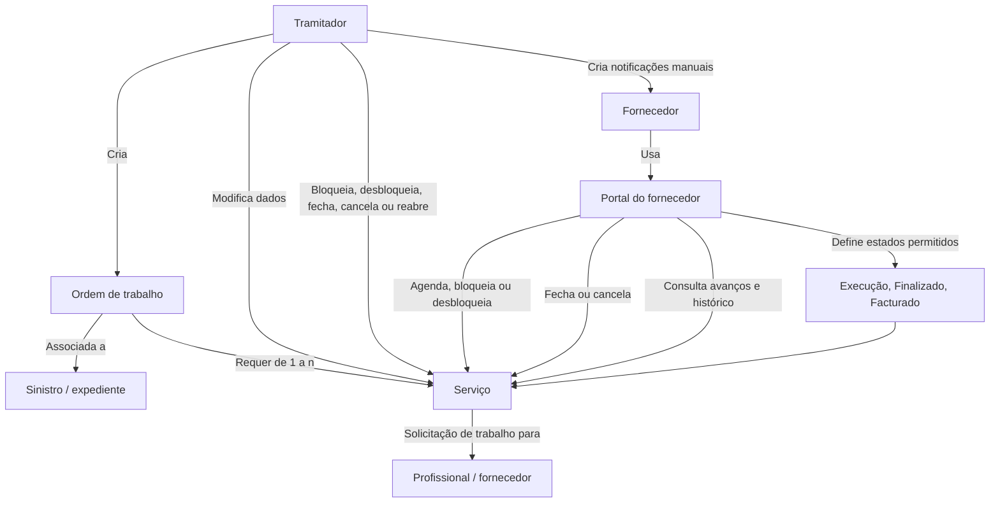
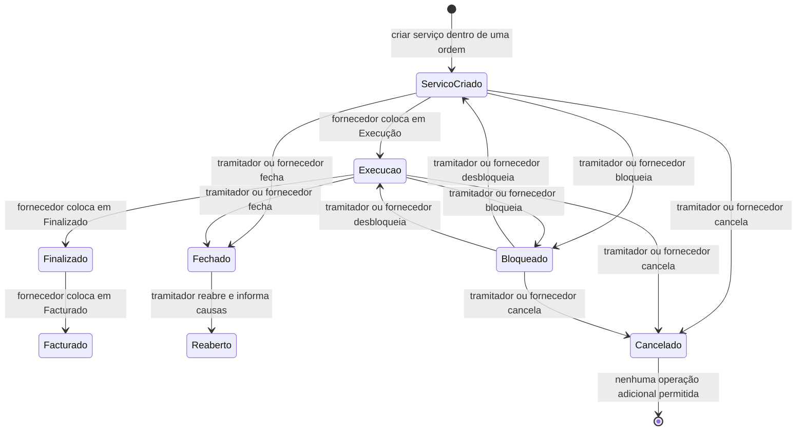

# Operações de Sinistros (Automóvel) — Serviços de Fornecedores

## 1. Metadados do Documento
- **Arquivo de Origem:** `Não informado no conteúdo fornecido`
- **Tipo de Documento:** Apresentação Executiva
- **Domínio / Sistema:** Operações de Sinistros de Automóvel — Serviços de Fornecedores
- **Público-Alvo:** Tramitadores, fornecedores e operação
- **Data/Versão Identificada:** Não identificada

---

## 2. Resumo Executivo & Contexto de Negócio

O documento descreve operações aplicáveis a serviços de fornecedores no contexto de sinistros de automóvel. As operações permitem criar ordens de trabalho vinculadas a sinistros ou expedientes, criar serviços subordinados a essas ordens e administrar a execução desses serviços.

Uma ordem de trabalho pode demandar de um a “n” serviços para ser satisfeita. Cada serviço representa uma solicitação para que um profissional realize um trabalho e deve estar sempre incluído em uma ordem. O documento cita exemplos de agendamento para oficinas, quando um veículo entra no estabelecimento, e para profissionais que devem comparecer a um domicílio.

O tramitador possui funções de criação, modificação, comunicação, bloqueio, fechamento, cancelamento e reabertura de serviços. O portal do fornecedor também disponibiliza determinadas operações, incluindo agendar, bloquear, desbloquear, fechar, cancelar, consultar avanços e consultar o histórico de movimentos.

A gestão de estados é uma parte central do processo operacional. Somente o fornecedor, por meio do portal, pode colocar um serviço nos estados de Execução, Finalizado e Facturado. O documento também define os significados operacionais dos estados de fechamento e cancelamento: um serviço fechado está terminado e pendente de faturamento; um serviço cancelado suspende sua realização e não permite operações posteriores.

---

## 3. Arquitetura, Componentes & Tecnologias Envolvidas

O conteúdo fornecido não descreve arquitetura de software, protocolos, APIs, contratos JSON, métodos HTTP, bancos de dados, URLs, ambientes ou tecnologias de implementação.

Os componentes e atores explicitamente citados são:

- **Tramitador:** usuário responsável por diversas operações de gestão do serviço.
- **Fornecedor:** participante que utiliza o portal para executar operações autorizadas.
- **Portal do fornecedor:** canal pelo qual o fornecedor pode agendar, alterar estados, bloquear, desbloquear, fechar, cancelar, consultar avanços e consultar histórico.
- **Ordem de trabalho:** entidade associada a um sinistro ou expediente e composta por um ou mais serviços.
- **Serviço:** solicitação de realização de um trabalho por um profissional, obrigatoriamente pertencente a uma ordem.
- **Sinistro / expediente:** contexto ao qual uma ordem de trabalho pode ser associada.



> **Nota de Análise:** O documento apresenta operações funcionais e atores, mas não detalha a arquitetura técnica do portal, os serviços de backend, as integrações, os métodos HTTP ou os contratos expostos.

---

## 4. Regras de Negócio, Especificações Funcionais & Processos

### 4.1 Criação de ordem de trabalho

1. Uma ordem de trabalho pode ser criada.
2. A ordem de trabalho deve ser associada a um sinistro ou expediente.
3. Para satisfazer uma ordem de trabalho, podem ser necessários de um a “n” serviços.

### 4.2 Criação de serviço

1. Um serviço representa a solicitação de realização de um trabalho a um profissional.
2. Todo serviço deve estar englobado em uma ordem de trabalho.
3. O documento não detalha os dados obrigatórios, validações, identificadores ou contratos necessários para criar uma ordem ou serviço.

### 4.3 Agendamento de serviço

1. A operação de atribuição de serviço permite agendar dia e hora para que o fornecedor comece o trabalho.
2. O documento apresenta como exemplos:
   - Agendar uma oficina quando um veículo entra no estabelecimento.
   - Agendar um pedreiro quando precisa ir a um domicílio.
3. O fornecedor também pode realizar a operação de agendamento pelo portal.

### 4.4 Modificação de serviço

1. O tramitador pode modificar os dados de um serviço quando considerar necessário.
2. O documento não especifica quais dados de serviço podem ser modificados.
3. O documento não informa restrições de modificação por estado.

### 4.5 Alteração de estados pelo fornecedor

1. A alteração dos estados de **Execução**, **Finalizado** e **Facturado** é disponibilizada pelo portal.
2. Somente o fornecedor pode colocar o serviço nesses estados.
3. O documento não descreve a sequência obrigatória entre os estados de Execução, Finalizado e Facturado.
4. O documento não detalha condições de entrada, saída, validações ou permissões adicionais para esses estados.

### 4.6 Notificações manuais

1. O tramitador pode gerar manualmente notificações para o fornecedor.
2. O tramitador pode visualizar se uma notificação foi lida pelo fornecedor.
3. O documento não detalha o conteúdo, o canal de envio, os prazos ou o mecanismo técnico de confirmação de leitura.

### 4.7 Gestão de bloqueios

1. O tramitador pode intervir para paralisar ou bloquear a execução de um serviço.
2. O bloqueio pode ser realizado por motivos catalogados.
3. O tramitador também pode desbloquear o serviço.
4. Pelo portal, o fornecedor pode bloquear e desbloquear o serviço.
5. O documento não identifica os motivos catalogados nem descreve os efeitos do bloqueio sobre os demais estados ou operações.

### 4.8 Fechamento de serviço

1. O tramitador pode fechar um serviço.
2. O estado de serviço fechado indica que o serviço está terminado e pendente de faturamento.
3. O fornecedor também pode realizar o fechamento por meio do portal.
4. O documento não descreve a relação entre o fechamento do serviço e o estado **Facturado**.

### 4.9 Cancelamento de serviço

1. O tramitador pode cancelar um serviço.
2. O cancelamento indica que a realização do serviço foi suspensa.
3. A partir do estado de cancelamento, não é possível realizar mais operações com o serviço.
4. O fornecedor também pode cancelar o serviço por meio do portal.

### 4.10 Reabertura de serviço

1. O tramitador pode reabrir um serviço que esteja fechado.
2. A reabertura exige a indicação das causas.
3. O documento não informa se o fornecedor pode reabrir serviços.
4. O documento não define o estado resultante após a reabertura.

### 4.11 Consulta de avanços

1. A consulta de avanços mostra os diferentes movimentos dentro do estado de Execução.
2. A funcionalidade está habilitada para o tramitador.
3. A funcionalidade também está habilitada no portal do fornecedor.

### 4.12 Consulta de histórico de movimentos

1. A consulta de histórico mostra todos os estados pelos quais um serviço passou.
2. A funcionalidade está habilitada para o tramitador.
3. A funcionalidade também está habilitada no portal do fornecedor.



> **Nota de Análise:** O diagrama de estados representa apenas as operações e estados explicitamente mencionados. O documento não define transições formais, estados iniciais ou finais completos, nem confirma todas as transições representadas entre estados operacionais.

---

## 5. Tabelas de Parâmetros, Ambientes e Estruturas de Dados

| Item / Parâmetro | Descrição / Função | Tipo / Valores / Formato | Ambiente / Observações |
| :--- | :--- | :--- | :--- |
| Ordem de trabalho | Agrupa serviços necessários para satisfazer uma necessidade de trabalho. | Pode requerer de um a “n” serviços. | Deve ser associada a um sinistro ou expediente. |
| Serviço | Solicitação da realização de um trabalho a um profissional. | Entidade operacional. | Deve estar sempre englobado em uma ordem. |
| Sinistro / expediente | Contexto ao qual a ordem de trabalho é associada. | Não detalhado. | Citado como vínculo da ordem. |
| Profissional | Destinatário da solicitação de realização de trabalho. | Não detalhado. | O serviço é solicitado a um profissional. |
| Tramitador | Ator operacional responsável pela gestão de serviços. | Papel de usuário. | Pode criar, modificar, notificar, bloquear, desbloquear, fechar, cancelar, reabrir e consultar. |
| Fornecedor | Ator que realiza operações por meio do portal. | Papel de usuário. | Pode agendar, alterar estados específicos, bloquear, desbloquear, fechar, cancelar e consultar. |
| Portal do fornecedor | Canal de acesso usado pelo fornecedor. | Não detalhado. | Não há detalhes de URL, autenticação ou tecnologia. |
| Data e hora de agendamento | Momento em que o fornecedor deve iniciar o trabalho. | Data e hora. | Agendamento pode ser feito pelo fornecedor no portal. |
| Estado: Execução | Estado que contém movimentos consultáveis por meio de “Consultar avances”. | Estado de serviço. | Apenas o fornecedor pode colocar o serviço nesse estado, pelo portal. |
| Estado: Finalizado | Estado que pode ser atribuído pelo fornecedor. | Estado de serviço. | Apenas o fornecedor pode colocá-lo nesse estado, pelo portal. |
| Estado: Facturado | Estado que pode ser atribuído pelo fornecedor. | Estado de serviço. | Apenas o fornecedor pode colocá-lo nesse estado, pelo portal. |
| Serviço fechado | Indica que o serviço está acabado e pendente de faturamento. | Estado ou condição operacional. | Pode ser fechado pelo tramitador ou pelo fornecedor no portal. |
| Serviço cancelado | Indica suspensão da realização do serviço. | Estado ou condição operacional. | Não permite mais operações após o cancelamento. |
| Serviço reaberto | Serviço que estava fechado e foi reaberto. | Operação de estado. | Apenas o tramitador é mencionado; deve indicar as causas. |
| Motivos catalogados | Motivos utilizados para bloquear a execução de um serviço. | Não detalhado. | O documento não lista o catálogo de motivos. |
| Notificação manual | Comunicação gerada pelo tramitador para o fornecedor. | Não detalhado. | O tramitador consegue verificar se foi lida pelo fornecedor. |
| Avanços | Movimentos ocorridos dentro do estado de Execução. | Histórico parcial de movimentos. | Consultável pelo tramitador e pelo portal do fornecedor. |
| Histórico de movimentos | Todos os estados pelos quais um serviço passou. | Histórico completo de estados. | Consultável pelo tramitador e pelo portal do fornecedor. |

---

## 6. Bateria de Perguntas & Respostas para RAG (FAQ Sintético)

### P1: Qual é a relação entre uma ordem de trabalho, um sinistro e um serviço?
**R:** Uma ordem de trabalho pode ser gerada e associada a um sinistro ou expediente. Para satisfazer essa ordem, podem ser necessários de um a “n” serviços. Cada serviço é uma solicitação de realização de um trabalho a um profissional e deve estar sempre incluído em uma ordem.

### P2: Quem pode criar e modificar dados de um serviço?
**R:** O documento informa que o tramitador pode criar serviços e modificar os dados de um serviço quando considerar necessário. O conteúdo não especifica quais campos podem ser alterados nem quais restrições se aplicam conforme o estado do serviço.

### P3: Quem pode agendar o início de um serviço de fornecedor?
**R:** A operação de atribuição de serviço permite agendar o dia e a hora para que o fornecedor inicie o trabalho. O fornecedor também pode realizar essa operação pelo portal. O documento usa como exemplos o agendamento de uma oficina quando um veículo entra nela e de um pedreiro quando deve ir a um domicílio.

### P4: Quais estados somente o fornecedor pode atribuir a um serviço?
**R:** Pelo portal, somente o fornecedor pode colocar um serviço nos estados de Execução, Finalizado e Facturado. O documento não detalha a ordem obrigatória de transição entre esses estados.

### P5: O que significa fechar um serviço?
**R:** O fechamento indica que o serviço está acabado, mas pendente de faturamento. O tramitador pode fechar o serviço e o fornecedor também pode realizar essa funcionalidade pelo portal.

### P6: O que acontece após o cancelamento de um serviço?
**R:** O cancelamento indica que a realização do serviço foi suspensa. A partir do estado de cancelamento, não é possível realizar mais operações com o serviço. Tanto o tramitador quanto o fornecedor, pelo portal, podem cancelar o serviço.

### P7: Quem pode reabrir um serviço fechado e qual informação é exigida?
**R:** O tramitador pode reabrir um serviço que esteja fechado, devendo indicar as causas da reabertura. O documento não informa que o fornecedor tenha permissão para reabrir serviços.

### P8: Quem pode bloquear e desbloquear a execução de um serviço?
**R:** O tramitador pode intervir para paralisar ou bloquear a execução do serviço por motivos catalogados e também pode desbloqueá-lo. Pelo portal, o fornecedor também pode bloquear e desbloquear o serviço.

### P9: Como o tramitador acompanha uma notificação enviada ao fornecedor?
**R:** O tramitador pode gerar notificações manualmente ao fornecedor e pode visualizar se a notificação foi lida pelo fornecedor. O documento não especifica o canal de envio nem os critérios técnicos de confirmação de leitura.

### P10: O que mostra a consulta de avanços de um serviço?
**R:** A consulta de avanços mostra os diferentes movimentos realizados dentro do estado de Execução. Essa consulta é habilitada para o tramitador e também para o portal do fornecedor.

### P11: Qual é a diferença entre consultar avanços e consultar o histórico de movimentos?
**R:** Consultar avanços mostra os diferentes movimentos dentro do estado de Execução. Consultar o histórico de movimentos mostra todos os estados pelos quais um serviço passou. Ambas as funcionalidades estão disponíveis para o tramitador e para o portal do fornecedor.

### P12: O documento informa APIs, URLs ou contratos de integração para essas operações?
**R:** Não. Embora o conteúdo mencione “Home Solutions APIs Documentation Zeus” no rodapé, não apresenta métodos HTTP, URLs, contratos JSON, autenticação, ambientes, tecnologias, portas ou detalhes de integração.

---

## 7. Glossário de Termos, Siglas & Conceitos-Chave

- **Avanços:** diferentes movimentos dentro do estado de Execução de um serviço.
- **Bloqueio:** intervenção para paralisar a execução de um serviço por motivos catalogados.
- **Cancelar serviço:** suspender a realização do serviço; após o cancelamento, não podem ser realizadas outras operações.
- **Facturado:** estado que somente o fornecedor pode atribuir pelo portal.
- **Fechar serviço:** indicar que o serviço está acabado e pendente de faturamento.
- **Fornecedor:** ator que pode realizar operações pelo portal, incluindo agendamento, alteração de estados específicos, bloqueio, desbloqueio, fechamento, cancelamento e consultas.
- **Histórico de movimentos:** consulta de todos os estados pelos quais um serviço passou.
- **Ordem de trabalho:** entidade associada a um sinistro ou expediente, que pode requerer de um a “n” serviços.
- **Portal do fornecedor:** canal pelo qual o fornecedor executa operações autorizadas sobre serviços.
- **Reabertura de serviço:** operação efetuada pelo tramitador para reabrir um serviço fechado, com indicação das causas.
- **Serviço:** solicitação para que um profissional realize um trabalho; deve estar sempre dentro de uma ordem.
- **Sinistro / expediente:** contexto de negócio ao qual uma ordem de trabalho pode ser associada.
- **Tramitador:** ator responsável por operar e administrar serviços em diversas funções.
- **Zeus:** termo presente no rodapé como “Home Solutions APIs Documentation Zeus”; o documento não define seu significado.

---

## 8. Notas Críticas, Riscos & Limitações

- O documento não identifica arquivo de origem, data, versão, autoria ou responsável.
- O conteúdo não fornece arquitetura de software, componentes de backend, URLs, ambientes, logs, integrações, protocolos, métodos HTTP ou contratos de API.
- O documento não detalha os dados obrigatórios para criação ou modificação de ordens e serviços.
- Os motivos catalogados para bloqueio são mencionados, mas não são listados ou definidos.
- Não há uma máquina de estados formal com transições autorizadas, validações ou pré-condições entre Execução, Finalizado, Facturado, Fechado, Cancelado e Reaberto.
- Não é detalhada a relação entre o serviço fechado, descrito como pendente de faturamento, e o estado Facturado.
- O documento não esclarece se a reabertura é permitida após estados diferentes de “fechado”, nem qual estado resulta da reabertura.
- O documento não detalha segurança, autenticação, autorização, auditoria, retenção de histórico ou tratamento de erros.
- A referência a “Home Solutions APIs Documentation Zeus” não possui detalhamento adicional no conteúdo fornecido.

---

## 9. Conteúdo Bruto Estruturado (Referência Fiel)

```text
--- [PÁGINA 1 DE 2] ---

DOCUMENTACIÓN OPERACIONES de
SINIESTROS (Automóvil) - SERVICIOS
SERVICIOS
Operaciones se pueden realizar con los servicios de los proveedores
CREAR orden
Permite generar una orden de trabajo y
asociarla a un siniestro/expediente. Para
satisfacer una orden puede necesitarse de
uno a "n" servicios
CREAR servicio
Permite generar la petición de la realización
de un trabajo a un profesional, que siempre
estará englobado dentro una orden
ASIGNAR Servicio
Agendar día y hora para que el proveedor
comience el trabajo. Ejemplo: Agendar al
taller cuando entra un vehículo, agendar a
MODIFICAR servicio
El tramitador podrá modificar datos del
servicio cuando así lo considere
 / 
 CF
Home Solutions APIs Documentation Zeus
EN


--- [PÁGINA 2 DE 2] ---

una albañil cuando tiene que ir a un
domicilio...
Desde el portal, el proveedor también puede
realizar esta operación.
MODIFICAR estados
Desde el portal el proveedor y sólo el
proveedor, podrá poner el servicio en
Ejecución, Finalizado y Facturado.
CREAR notificaciones manuales
El tramitador puede generar notificaciones
manualmente al proveedor. El tramitador
puede visualizar si esta ha sido leída por el
proveedor
GESTIONAR Bloqueos
El tramitador, puede intervenir para paralizar,
bloquear la ejecución del servicio, por motivos
catalogados o para desbloquear el mismo.
Desde el portal, el proveedor también puede
realizar ambas operaciones, bloquear y
desbloquear el servicio.
CERRAR servicio
El tramitador puede cerrar el servicio, este
estado indica que el servicio está acabado,
pendiente de facturar.
Desde el portal, el proveedor también puede
realizar esta funcionalidad
CANCELAR servicio
El tramitador puede cancelar el servicio. Este
estado indica que se suspende la realización
del servicio, desde este estado ya no se
puede realizar más operaciones con el
servicio
Desde el portal, el proveedor también puede
realizar esta funcionalidad
RE-APERTURAR servicio
El tramitador puede reaperturar un servicio
que está cerrado, indicando las causas
CONSULTAR avances
Muestra los diferentes movimientos dentro del
estado de Ejecución. Habilitado para el
tramitador y el portal del proveedor
CONSULTAR Histórico Mvtos.
Muestra todos los estados por los que ha
pasado un servicio. Habilitado para el
tramitador y el portal del proveedor
```
