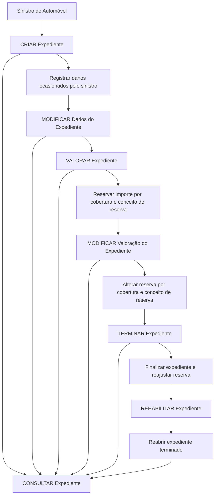

# Documentação de Operações de Sinistros (Automóvel) — Tramitação de Expedientes

## 1. Metadados do Documento
- **Arquivo de Origem:** Não informado
- **Tipo de Documento:** Manual Operacional
- **Domínio / Sistema:** Sinistros de Automóvel — Tramitação de Expedientes
- **Público-Alvo:** Operação, Negócio e Desenvolvimento
- **Data/Versão Identificada:** Não identificada

---

## 2. Resumo Executivo & Contexto de Negócio

O documento descreve operações aplicáveis aos possíveis expedientes de um sinistro de automóvel, no contexto de tramitação de expedientes. As operações podem ser realizadas tanto **em linha** quanto de forma **diferida**.

O expediente é tratado como o registro onde são consolidados os danos ocasionados por um sinistro. O processo operacional prevê a criação, alteração, valoração, encerramento, reabilitação e consulta de expedientes.

A operação de valoração está relacionada à reserva de um importe por cobertura e por conceito de reserva. O documento também prevê a modificação dessa reserva, preservando a segmentação por cobertura e conceito de reserva.

O encerramento de um expediente reajusta a sua reserva. Caso seja necessário, um expediente terminado pode ser reaberto por meio da operação de reabilitação. O documento não detalha métodos HTTP, contratos JSON, regras de autorização, ambientes, URLs ou integrações técnicas.

---

## 3. Arquitetura, Componentes & Tecnologias Envolvidas

O conteúdo fornecido não apresenta uma arquitetura de software detalhada, tecnologias, servidores, APIs, ambientes ou contratos de integração. São identificadas referências textuais a “Home Solutions APIs Documentation Zeus” e “CF”, mas não há contexto suficiente para caracterizá-las como componentes técnicos, sistemas ou tecnologias.

O fluxo funcional identificado para o ciclo de vida do expediente é:



> **Nota de Análise:** O documento descreve operações funcionais sobre expedientes, porém não detalha os sistemas responsáveis pela execução dessas operações nem as interfaces técnicas utilizadas.

---

## 4. Regras de Negócio, Especificações Funcionais & Processos

### Operações aplicáveis aos expedientes

1. As operações descritas são aplicáveis a cada um dos possíveis expedientes de um sinistro.
2. As operações podem ser executadas em linha ou de maneira diferida.
3. A criação de um expediente registra os distintos danos ocasionados pelo sinistro.
4. A modificação dos dados de um expediente permite alterar as informações e os dados registrados no expediente.
5. A valoração de um expediente permite reservar um importe associado ao expediente.
6. A reserva de importe deve ser realizada por:
   - Cobertura;
   - Conceito de reserva.
7. A modificação da valoração do expediente permite alterar a reserva existente.
8. A alteração da reserva também é realizada por cobertura e por conceito de reserva.
9. O término de um expediente finaliza o expediente e reajusta a sua reserva.
10. A reabilitação reabre um expediente que esteja terminado.
11. A consulta de expediente mostra toda a informação do expediente.

### Fluxo operacional do expediente

| Etapa | Operação | Resultado funcional |
| :--- | :--- | :--- |
| 1 | CRIAR Expediente | Registro dos distintos danos causados pelo sinistro. |
| 2 | MODIFICAR Dados do Expediente | Alteração das informações já registradas no expediente. |
| 3 | VALORAR Expediente | Reserva de importe por cobertura e conceito de reserva. |
| 4 | MODIFICAR Valoração Expediente | Alteração da reserva por cobertura e conceito de reserva. |
| 5 | TERMINAR Expediente | Finalização do expediente com reajuste da reserva. |
| 6 | REHABILITAR Expediente | Reabertura de um expediente terminado. |
| 7 | CONSULTAR Expediente | Exibição de toda a informação do expediente. |

---

## 5. Tabelas de Parâmetros, Ambientes e Estruturas de Dados

| Item / Parâmetro | Descrição / Função | Tipo / Valores / Formato | Ambiente / Observações |
| :--- | :--- | :--- | :--- |
| Expediente | Registro operacional associado ao sinistro. | Entidade funcional. | O documento não detalha a estrutura de dados. |
| Sinistro | Evento que ocasiona danos e origina expedientes. | Domínio de negócio. | Especificamente relacionado a automóvel. |
| Danos | Danos ocasionados pelo sinistro e registrados no expediente. | Informação de negócio. | Sem classificação ou estrutura detalhada. |
| Cobertura | Critério utilizado para reservar ou modificar importes de reserva. | Categoria funcional. | Não são listados valores de cobertura. |
| Conceito de reserva | Critério utilizado em conjunto com a cobertura para reserva de importe. | Categoria funcional. | Não são listados conceitos possíveis. |
| Importe de reserva | Valor reservado em um expediente. | Valor monetário não especificado. | Sem moeda, formato ou regra de cálculo informados. |
| Execução em linha | Modalidade de realização das operações. | Modalidade operacional. | Sem detalhamento técnico. |
| Execução diferida | Modalidade de realização das operações. | Modalidade operacional. | Sem detalhamento de agendamento ou processamento. |
| Home Solutions APIs Documentation Zeus | Referência textual presente no conteúdo extraído. | Não detalhado. | Não há informação suficiente para classificá-la tecnicamente. |
| CF | Referência textual presente no conteúdo extraído. | Não detalhado. | Significado não identificado. |

---

## 6. Bateria de Perguntas & Respostas para RAG (FAQ Sintético)

### P1: Quais operações podem ser realizadas sobre um expediente de sinistro de automóvel?
**R:** O documento lista as operações de criar expediente, modificar dados do expediente, valorar expediente, modificar valoração do expediente, terminar expediente, reabilitar expediente e consultar expediente.

### P2: As operações sobre expedientes podem ser realizadas de forma assíncrona?
**R:** O documento informa que as operações sobre os possíveis expedientes do sinistro podem ser realizadas tanto em linha quanto de forma diferida. Não há detalhamento adicional sobre mecanismos técnicos de processamento diferido.

### P3: O que acontece na operação CRIAR Expediente?
**R:** A operação CRIAR Expediente registra os distintos danos ocasionados pelo sinistro.

### P4: O que pode ser alterado pela operação MODIFICAR Dados do Expediente?
**R:** A operação MODIFICAR Dados do Expediente permite mudar a informação e os dados que já foram registrados em um expediente.

### P5: Como é realizada a reserva de importe em um expediente?
**R:** A operação VALORAR Expediente permite reservar um importe para um expediente por cobertura e por conceito de reserva.

### P6: O que faz a operação MODIFICAR Valoração Expediente?
**R:** A operação MODIFICAR Valoração Expediente permite alterar a reserva de um expediente por cobertura e por conceito de reserva.

### P7: Qual é o efeito de TERMINAR Expediente?
**R:** TERMINAR Expediente finaliza o expediente e reajusta a sua reserva.

### P8: É possível reabrir um expediente que já foi terminado?
**R:** Sim. A operação REHABILITAR Expediente reabre um expediente terminado.

### P9: O que é apresentado na operação CONSULTAR Expediente?
**R:** CONSULTAR Expediente mostra toda a informação disponível do expediente.

### P10: O documento especifica APIs, métodos HTTP ou contratos JSON para as operações de expediente?
**R:** Não. O conteúdo fornecido descreve operações funcionais, mas não especifica APIs, métodos HTTP, contratos JSON, URLs, tecnologias, ambientes ou regras de autenticação.

---

## 7. Glossário de Termos, Siglas & Conceitos-Chave

- **Sinistro:** Evento que ocasiona danos e está relacionado, neste documento, ao domínio de automóvel.
- **Expediente:** Registro sobre o qual são realizadas operações de criação, alteração, valoração, término, reabilitação e consulta.
- **CRIAR Expediente:** Operação para registrar os distintos danos ocasionados pelo sinistro.
- **MODIFICAR Dados do Expediente:** Operação para alterar informações e dados registrados em um expediente.
- **VALORAR Expediente:** Operação para reservar um importe por cobertura e conceito de reserva.
- **MODIFICAR Valoração Expediente:** Operação para alterar a reserva de um expediente por cobertura e conceito de reserva.
- **TERMINAR Expediente:** Operação que finaliza o expediente e reajusta a reserva.
- **REHABILITAR Expediente:** Operação que reabre um expediente terminado.
- **CONSULTAR Expediente:** Operação que mostra toda a informação do expediente.
- **Cobertura:** Critério usado para associar uma reserva a um expediente.
- **Conceito de reserva:** Critério usado, em conjunto com a cobertura, para classificar uma reserva.
- **CF:** Sigla ou referência presente no texto extraído, sem significado detalhado.
- **Home Solutions APIs Documentation Zeus:** Referência textual presente no documento, sem explicação adicional.

---

## 8. Notas Críticas, Riscos & Limitações

- O documento não identifica o arquivo de origem, a data, a versão ou o responsável pela documentação.
- Não são especificados métodos HTTP, endpoints, contratos de API, formatos JSON, tecnologias, mecanismos de autenticação ou autorização.
- Não há detalhamento de regras de validação para criação, alteração, valoração, término ou reabilitação de expedientes.
- Não são definidos valores possíveis para cobertura, conceito de reserva, importes, moedas ou critérios de reajuste de reserva.
- O documento afirma que as operações podem ser realizadas em linha ou diferidamente, mas não especifica os comportamentos operacionais, tempos de processamento, filas, agendamentos ou tratamento de erros.
- As referências “CF” e “Home Solutions APIs Documentation Zeus” não possuem detalhamento suficiente para interpretação técnica confiável.

---

## 9. Conteúdo Bruto Estruturado (Referência Fiel)

```text
--- [PÁGINA 1 DE 2] ---

DOCUMENTACIÓN OPERACIONES de
SINIESTROS (Automóvil) - TRAMITACIÓN
EXPEDIENTES
EXPEDIENTE
Operaciones que se pueden realizar a cada uno de los posibles
expedientes del siniestro, se pueden realizar tanto en línea como
diferido
CREAR Expediente
En esta operación se registran los distintos
daños que ha ocasionado el siniestro
MODIFICAR Datos del Expediente
Permite cambiar la información, los datos
registrados de un expediente
VALORAR Expediente
 MODIFICAR Valoración Expediente
 / 
 CF
Home Solutions APIs Documentation Zeus
EN


--- [PÁGINA 2 DE 2] ---

Permite reservar un importe a un expediente
por cobertura y concepto de reserva
Permite cambiar la reserva de un expediente
por cobertura y concepto de reserva
TERMINAR Expediente
Finaliza expedientes reajustando su reserva
REHABILITAR Expediente
Reabre un Expediente Terminado
CONSULTAR Expediente
Muestra toda la información del Expediente
```
