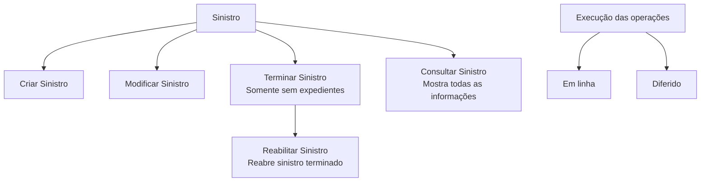
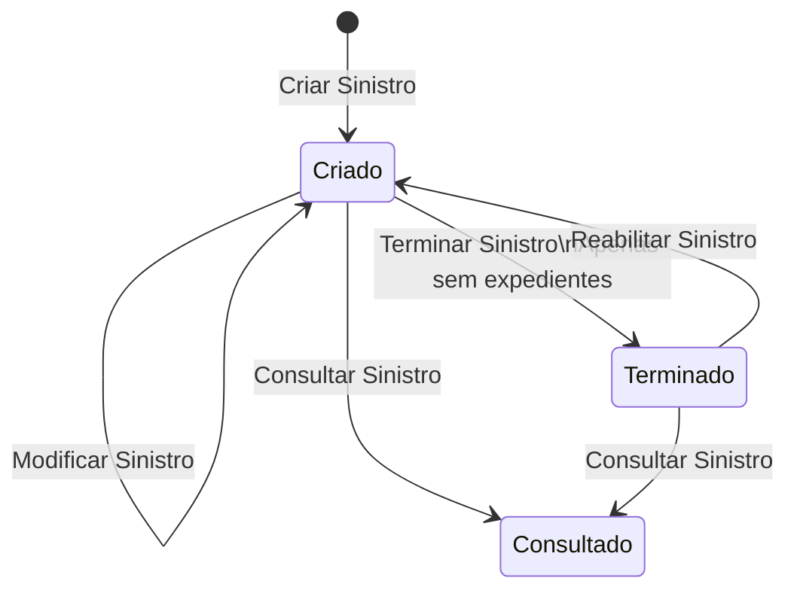

# Documentação de Operações de Sinistros de Automóvel — Tramitação de Sinistros

## 1. Metadados do Documento
- **Arquivo de Origem:** Não informado; conteúdo bruto fornecido na solicitação.
- **Tipo de Documento:** Manual Operacional
- **Domínio / Sistema:** Sinistros de Automóvel — Tramitação de Sinistros
- **Público-Alvo:** Operação, negócio e equipes responsáveis por sinistros
- **Data/Versão Identificada:** Não identificada

---

## 2. Resumo Executivo & Contexto de Negócio

O documento descreve operações disponíveis para o tratamento de um **siniestro** — termo apresentado no material original em espanhol e associado ao domínio de sinistros de automóvel. As operações podem ser realizadas tanto **em linha** quanto de forma **diferida**.

O escopo funcional inclui o ciclo de vida básico de um sinistro: criação, modificação, término, reabilitação e consulta. Cada operação possui uma finalidade declarada, embora o documento não informe pré-requisitos, perfis autorizados, regras de validação, contratos de integração ou detalhes de interface.

A operação **Terminar Sinistro** é explicitamente limitada a sinistros sem expedientes. A operação **Reabilitar Sinistro** permite reabrir um sinistro previamente terminado. A consulta disponibiliza todas as informações do sinistro.

O conteúdo também apresenta as expressões **Home Solutions APIs Documentation**, **Zeus** e **CF**, mas não descreve suas responsabilidades, integrações, tecnologias, URLs, métodos HTTP ou contratos de dados.

---

## 3. Arquitetura, Componentes & Tecnologias Envolvidas

### Componentes e referências identificadas

| Componente / Termo | Descrição sustentada pelo documento | Detalhamento disponível |
| :--- | :--- | :--- |
| Tramitação de Sinistros | Contexto das operações aplicáveis a um sinistro. | Não detalhado além das operações listadas. |
| Sinistro | Entidade sobre a qual podem ser executadas operações em linha ou diferidas. | Não são informados atributos, identificadores ou estrutura de dados. |
| Home Solutions APIs Documentation | Texto citado no conteúdo bruto. | Não é definida a relação com as operações de sinistro. |
| Zeus | Texto citado no conteúdo bruto. | Não é definida a função, arquitetura ou integração. |
| CF | Sigla apresentada junto à operação de consulta. | Não expandida nem explicada no documento. |



> **Nota de Análise:** O documento não descreve uma arquitetura técnica de sistemas, camadas, serviços, APIs, tecnologias, protocolos ou fluxos de dados. O diagrama representa exclusivamente as operações funcionais explicitamente apresentadas.

---

## 4. Regras de Negócio, Especificações Funcionais & Processos

### Operações disponíveis para um sinistro

1. As operações sobre um sinistro podem ser realizadas **em linha** ou de forma **diferida**.
2. **Criar Sinistro:** permite gerar um novo sinistro.
3. **Modificar Sinistro:** permite alterar as informações de um sinistro.
4. **Terminar Sinistro:** finaliza sinistros que não possuem expedientes.
5. **Reabilitar Sinistro:** reabre um sinistro que está no estado terminado.
6. **Consultar Sinistro:** mostra todas as informações do sinistro.

### Fluxo funcional inferível do ciclo de vida



> **Nota de Análise:** O documento afirma que a reabilitação reabre um sinistro terminado, mas não define o estado resultante formal, nem informa se existem outros estados, aprovações, auditoria, validações ou impedimentos adicionais.

---

## 5. Tabelas de Parâmetros, Ambientes e Estruturas de Dados

| Item / Parâmetro | Descrição / Função | Tipo / Valores / Formato | Ambiente / Observações |
| :--- | :--- | :--- | :--- |
| Modalidade de execução | Forma pela qual as operações de sinistro podem ser realizadas. | Em linha; Diferido | O documento não detalha diferenças operacionais entre as modalidades. |
| Criar Sinistro | Gera um novo sinistro. | Operação funcional | Não são informados campos obrigatórios, identificadores ou validações. |
| Modificar Sinistro | Altera informações de um sinistro. | Operação funcional | Não são informados campos alteráveis, restrições ou versionamento. |
| Terminar Sinistro | Finaliza um sinistro. | Operação funcional | Aplicável a sinistros sem expedientes. |
| Reabilitar Sinistro | Reabre um sinistro terminado. | Operação funcional | Não são informadas validações ou condições adicionais. |
| Consultar Sinistro | Mostra todas as informações do sinistro. | Operação funcional | A sigla `CF` aparece associada à consulta, sem definição. |
| Home Solutions APIs Documentation | Referência textual no documento. | Não informado | Não há URL, endpoint, contrato ou explicação. |
| Zeus | Referência textual no documento. | Não informado | Não há descrição funcional ou técnica. |

---

## 6. Bateria de Perguntas & Respostas para RAG (FAQ Sintético)

### P1: Quais operações podem ser realizadas sobre um sinistro?
**R:** O documento lista cinco operações para um sinistro: criar, modificar, terminar, reabilitar e consultar. Essas operações podem ser realizadas em linha ou de forma diferida.

### P2: O que faz a operação Criar Sinistro?
**R:** A operação Criar Sinistro permite gerar um novo sinistro. O documento não especifica os dados necessários para a criação, os campos obrigatórios ou as validações aplicáveis.

### P3: Qual é a finalidade da operação Modificar Sinistro?
**R:** A operação Modificar Sinistro permite alterar as informações de um sinistro. O conteúdo não identifica quais informações podem ser modificadas nem as regras de autorização ou validação.

### P4: Em que condição um sinistro pode ser terminado?
**R:** A operação Terminar Sinistro finaliza sinistros que não possuem expedientes. O documento não apresenta outras condições, validações ou exceções para a finalização.

### P5: O que significa reabilitar um sinistro?
**R:** Reabilitar um sinistro significa reabrir um sinistro que está terminado. O documento não informa o estado operacional resultante após a reabilitação nem se existem restrições adicionais.

### P6: O que a consulta de sinistro apresenta?
**R:** A operação Consultar Sinistro mostra todas as informações do sinistro. O documento não enumera os dados exibidos, filtros de consulta, critérios de acesso ou formato de retorno.

### P7: As operações de sinistro são realizadas somente em tempo real?
**R:** Não. O documento afirma que as operações aplicáveis a um sinistro podem ser realizadas tanto em linha quanto de forma diferida. Não há detalhamento sobre mecanismos, filas, agendamentos ou tempos de processamento da execução diferida.

### P8: O que é CF no contexto da consulta de sinistro?
**R:** A sigla CF aparece no conteúdo junto da operação Consultar Sinistro, mas o documento não fornece sua expansão nem sua finalidade. Portanto, não é possível atribuir significado técnico ou funcional à sigla com base no material disponível.

### P9: Qual é o papel de Zeus na tramitação de sinistros?
**R:** O termo Zeus aparece no conteúdo bruto, mas não é explicado. O documento não informa se Zeus é um sistema, módulo, ambiente, API ou componente envolvido nas operações de sinistro.

### P10: Existem detalhes de APIs ou contratos técnicos para as operações de sinistro?
**R:** Não. Embora o texto mencione “Home Solutions APIs Documentation”, não são fornecidos endpoints, métodos HTTP, estruturas JSON, URLs, protocolos, autenticação ou contratos de integração.

---

## 7. Glossário de Termos, Siglas & Conceitos-Chave

- **Sinistro / Siniestro:** Entidade do domínio tratada pelas operações de criar, modificar, terminar, reabilitar e consultar.
- **Criar Sinistro:** Operação que permite gerar um novo sinistro.
- **Modificar Sinistro:** Operação que permite alterar informações de um sinistro.
- **Terminar Sinistro:** Operação que finaliza sinistros sem expedientes.
- **Reabilitar Sinistro:** Operação que reabre um sinistro terminado.
- **Consultar Sinistro:** Operação que mostra todas as informações de um sinistro.
- **Em linha:** Modalidade de realização de operações mencionada no documento, sem detalhamento adicional.
- **Diferido:** Modalidade de realização de operações mencionada no documento, sem detalhamento adicional.
- **Expedientes:** Termo usado como condição para a operação de término; não definido no documento.
- **CF:** Sigla citada junto à consulta de sinistro, sem expansão identificada.
- **Zeus:** Termo citado no conteúdo bruto, sem definição.
- **Home Solutions APIs Documentation:** Referência textual a documentação de APIs, sem URL ou detalhamento.

---

## 8. Notas Críticas, Riscos & Limitações

- O documento não identifica arquivo de origem, autor, versão ou data.
- Não há descrição de arquitetura técnica, ambientes, servidores, URLs, endpoints, métodos HTTP, contratos JSON, autenticação ou tecnologias.
- Não são fornecidas matrizes de permissão, perfis de acesso, trilhas de auditoria ou responsabilidades operacionais.
- A condição “sem expedientes” é apresentada para a finalização de sinistros, mas o conceito de expediente não é definido.
- As modalidades “em linha” e “diferido” são mencionadas sem especificar comportamento, diferenças de processamento, SLA ou mecanismos técnicos.
- Os termos `CF`, `Zeus` e `Home Solutions APIs Documentation` não possuem explicação suficiente para estabelecer relações técnicas ou funcionais.
- O documento não detalha métodos HTTP ou contratos JSON de quaisquer APIs.

---

## 9. Conteúdo Bruto Estruturado (Referência Fiel)

```text
--- [PÁGINA 1 DE 2] ---

DOCUMENTACIÓN OPERACIONES de
SINIESTROS (Automóvil) - TRAMITACIÓN
SINIESTROS
SINIESTRO
Operaciones que se pueden realizar a un siniestro, se pueden realizar
tanto en línea como diferido
CREAR Siniestro
Permite generar un nuevo siniestro
MODIFICAR Siniestro
Permite cambiar la información del siniestro
TERMINAR Siniestro
Finaliza siniestros sin expedientes
REHABILITAR Siniestro
Reabre un siniestro Terminado
CONSULTAR Siniestro
 / 
 CF
Home Solutions APIs Documentation Zeus
EN


--- [PÁGINA 2 DE 2] ---

Muestra toda la información del siniestro
```
