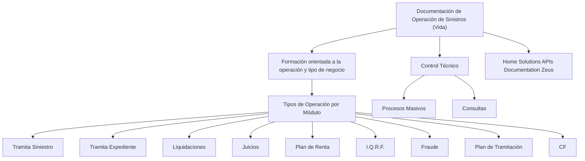

# Documentação de Operação de Sinistros (Vida)

## 1. Metadados do Documento
- **Arquivo de Origem:** Não identificado
- **Tipo de Documento:** Manual Operacional / Material de Formação
- **Domínio / Sistema:** Operação de Sinistros (Vida)
- **Público-Alvo:** Operação e profissionais em formação orientada ao tipo de negócio
- **Data/Versão Identificada:** Não identificada

---

## 2. Resumo Executivo & Contexto de Negócio

O documento apresenta uma visão resumida da documentação de operação de **Sinistros (Vida)**. O material é explicitamente caracterizado como uma formação orientada à operação e ao tipo de negócio.

A estrutura do conteúdo organiza os tipos de operação por módulo. Os módulos listados incluem atividades de tramitação de sinistro, tramitação de expediente, liquidações, juízos, plano de renda, I.Q.R.F., fraude, plano de tramitação, CF, controle técnico, processos massivos e consultas.

O material também referencia **Home Solutions APIs Documentation Zeus**, sem detalhar a finalidade dessa referência, interfaces, métodos, contratos, URLs ou integrações.

O conteúdo extraído funciona como um índice temático de capacidades operacionais. Não há detalhamento adicional sobre procedimentos, responsabilidades, regras de decisão, dados de entrada, saídas, permissões ou exceções para os módulos apresentados.

---

## 3. Arquitetura, Componentes & Tecnologias Envolvidas

Os componentes, módulos e referências explicitamente citados são:

- Operação de Sinistros (Vida)
- Tramita Siniestro
- Tramita Expediente
- Liquidaciones
- Juicios
- Plan de Renta
- I.Q.R.F.
- Fraude
- Plan de Tramitación
- CF
- Control Técnico
- Procesos Masivos
- Consultas
- Home Solutions APIs Documentation Zeus



> **Nota de Análise:** O documento cita módulos operacionais e a referência “Home Solutions APIs Documentation Zeus”, mas não descreve arquitetura de software, protocolos, métodos HTTP, contratos de integração, tecnologias implementadas ou dependências técnicas.

---

## 4. Regras de Negócio, Especificações Funcionais & Processos

O documento não apresenta regras de negócio detalhadas, critérios de validação, cálculos, fluxos sequenciais, condições de aprovação, rejeição ou exceções operacionais.

A única organização funcional explícita é a classificação dos seguintes itens como **tipos de operação por módulo**:

1. Tramita Siniestro.
2. Tramita Expediente.
3. Liquidaciones.
4. Juicios.
5. Plan de Renta.
6. I.Q.R.F.
7. Fraude.
8. Plan de Tramitación.
9. CF.

Além dos tipos de operação por módulo, o documento apresenta a área de **Control Técnico**, contendo:

1. Procesos Masivos.
2. Consultas.

> **Nota de Análise:** Não há detalhamento sobre como cada módulo é executado, quais dados são processados, quais usuários podem utilizá-los ou quais resultados são produzidos.

---

## 5. Tabelas de Parâmetros, Ambientes e Estruturas de Dados

| Item / Parâmetro | Descrição / Função | Tipo / Valores / Formato | Ambiente / Observações |
| :--- | :--- | :--- | :--- |
| Operação de Sinistros (Vida) | Domínio principal identificado no documento. | Operação / tipo de negócio. | Não há ambiente informado. |
| Formación orientada a la operación y tipo de negocio | Caracterização declarada do material. | Formação. | Sem detalhamento adicional. |
| Tramita Siniestro | Tipo de operação por módulo. | Módulo operacional. | Não há regras ou fluxo descritos. |
| Tramita Expediente | Tipo de operação por módulo. | Módulo operacional. | Não há regras ou fluxo descritos. |
| Liquidaciones | Tipo de operação por módulo. | Módulo operacional. | Não há regras ou fluxo descritos. |
| Juicios | Tipo de operação por módulo. | Módulo operacional. | Não há regras ou fluxo descritos. |
| Plan de Renta | Tipo de operação por módulo. | Módulo operacional. | Não há regras ou fluxo descritos. |
| I.Q.R.F. | Tipo de operação por módulo. | Sigla / módulo operacional. | Significado não expandido no documento. |
| Fraude | Tipo de operação por módulo. | Módulo operacional. | Não há regras ou fluxo descritos. |
| Plan de Tramitación | Tipo de operação por módulo. | Módulo operacional. | Não há regras ou fluxo descritos. |
| CF | Tipo de operação por módulo. | Sigla / módulo operacional. | Significado não expandido no documento. |
| Control Técnico | Área ou agrupamento técnico apresentado. | Controle técnico. | Sem detalhamento de responsabilidades. |
| Procesos Masivos | Item sob Control Técnico. | Processo operacional. | Não há periodicidade, entrada ou saída informada. |
| Consultas | Item sob Control Técnico. | Consulta operacional. | Não há consultas, filtros ou fontes informadas. |
| Home Solutions APIs Documentation Zeus | Referência documental citada. | Documentação de APIs. | Não há URL, contratos ou especificações no conteúdo. |

---

## 6. Bateria de Perguntas & Respostas para RAG (FAQ Sintético)

### P1: Qual é o domínio principal abordado pelo documento?
**R:** O documento aborda a **operação de Sinistros (Vida)**, apresentada como conteúdo de formação orientada à operação e ao tipo de negócio.

### P2: Quais tipos de operação por módulo são listados para Sinistros (Vida)?
**R:** Os tipos de operação por módulo listados são: Tramita Siniestro, Tramita Expediente, Liquidaciones, Juicios, Plan de Renta, I.Q.R.F., Fraude, Plan de Tramitación e CF.

### P3: O que o documento informa sobre o módulo Tramita Siniestro?
**R:** O documento identifica **Tramita Siniestro** como um tipo de operação por módulo. Não são informados procedimentos, regras, dados, telas, contratos ou critérios operacionais para esse módulo.

### P4: O documento detalha o funcionamento de Liquidaciones?
**R:** Não. **Liquidaciones** é listado como um tipo de operação por módulo, mas o documento não descreve seu fluxo, condições de execução, cálculos ou resultados.

### P5: Qual conteúdo está agrupado sob Control Técnico?
**R:** Sob **Control Técnico**, o documento lista **Procesos Masivos** e **Consultas**.

### P6: Existem informações sobre frequência ou agendamento de Procesos Masivos?
**R:** Não. O documento apenas lista **Procesos Masivos** sob Control Técnico, sem informar frequência, agendamento, volume, entradas, saídas ou mecanismos de monitoramento.

### P7: O que significa a sigla I.Q.R.F. no documento?
**R:** O documento apresenta **I.Q.R.F.** como um tipo de operação por módulo, mas não expande ou define o significado da sigla.

### P8: O que significa CF no contexto do documento?
**R:** **CF** é listado como um tipo de operação por módulo. O conteúdo fornecido não apresenta a expansão ou definição dessa sigla.

### P9: Há uma arquitetura técnica ou diagrama de integração detalhado?
**R:** Não. O documento não descreve serviços, bancos de dados, protocolos, integrações, ambientes ou dependências técnicas. O diagrama deste relatório representa somente a relação hierárquica explícita entre os tópicos listados.

### P10: O que é Home Solutions APIs Documentation Zeus?
**R:** O documento cita **Home Solutions APIs Documentation Zeus**, mas não explica sua finalidade, componentes, URLs, APIs, métodos HTTP, autenticação ou contratos de integração.

### P11: O documento define regras de negócio para tratamento de fraude?
**R:** Não. **Fraude** é citado como um tipo de operação por módulo, sem regras de negócio, critérios de identificação, fluxo de tratamento ou responsabilidades.

### P12: O material identifica uma data ou versão?
**R:** Não. Não foi identificada data, versão ou histórico de revisões no conteúdo extraído.

---

## 7. Glossário de Termos, Siglas & Conceitos-Chave

- **Sinistros (Vida):** Domínio operacional central mencionado no documento.
- **Tramita Siniestro:** Tipo de operação por módulo listado no material.
- **Tramita Expediente:** Tipo de operação por módulo listado no material.
- **Liquidaciones:** Tipo de operação por módulo listado no material.
- **Juicios:** Tipo de operação por módulo listado no material.
- **Plan de Renta:** Tipo de operação por módulo listado no material.
- **I.Q.R.F.:** Sigla apresentada como tipo de operação por módulo; significado não definido no documento.
- **Fraude:** Tipo de operação por módulo listado no material.
- **Plan de Tramitación:** Tipo de operação por módulo listado no material.
- **CF:** Sigla apresentada como tipo de operação por módulo; significado não definido no documento.
- **Control Técnico:** Agrupamento técnico que contém Procesos Masivos e Consultas.
- **Procesos Masivos:** Item apresentado sob Control Técnico.
- **Consultas:** Item apresentado sob Control Técnico.
- **Home Solutions APIs Documentation Zeus:** Referência documental citada sem explicação adicional.

---

## 8. Notas Críticas, Riscos & Limitações

- O conteúdo é resumido e não detalha os procedimentos operacionais de nenhum módulo.
- Não há regras de negócio, critérios de validação, cálculos, exceções ou fluxos de aprovação documentados.
- Não há informações sobre ambientes, servidores, URLs, autenticação, permissões, logs ou monitoramento.
- As siglas **I.Q.R.F.** e **CF** não possuem expansão no conteúdo original.
- A referência **Home Solutions APIs Documentation Zeus** não contém URL, especificação de API ou contratos técnicos.
- Não foram identificados data, versão, autoria, responsáveis ou controle de revisões.
- Qualquer interpretação adicional sobre integração, comportamento ou responsabilidade dos módulos extrapolaria o conteúdo-fonte.

---

## 9. Conteúdo Bruto Estruturado (Referência Fiel)

```text
--- [PÁGINA 1 DE 2] ---

DOCUMENTACIÓN de OPERACIÓN de
SINIESTROS (Vida)
 Formación orientada a la operación y tipo de negocio
TIPOS DE OPERACIÓN por MÓDULO
 TRAMITA SINIESTRO
  TRAMITA EXPEDIENTE
 LIQUIDACIONES
  JUICIOS
 PLAN DE RENTA
  I.Q.R.F.
 FRAUDE
  PLAN DE TRAMITACIÓN
 / 
 CF
Home Solutions APIs Documentation Zeus
EN


--- [PÁGINA 2 DE 2] ---

CONTROL TÉCNICO
  PROCESOS MASIVOS
 CONSULTAS
```
