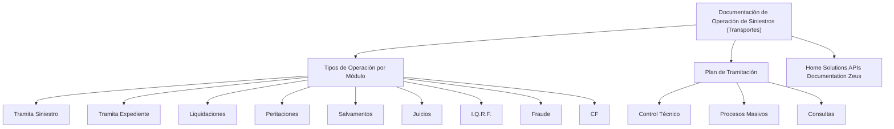

# Documentação de Operação de Sinistros (Transportes): Módulos, Tipos de Operação e Plano de Tramitação

## 1. Metadados do Documento
- **Arquivo de Origem:** `Não identificado`
- **Tipo de Documento:** `Manual Operacional`
- **Domínio / Sistema:** `Operação de Sinistros — Transportes`
- **Público-Alvo:** `Operação, Negócio e equipes envolvidas na tramitação de sinistros`
- **Data/Versão Identificada:** `Não identificada`

---

## 2. Resumo Executivo & Contexto de Negócio

O documento apresenta uma visão de formação orientada à operação de sinistros no domínio de Transportes. O conteúdo organiza os tipos de operação por módulo e lista elementos relacionados ao processo de tramitação.

A operação de sinistros contempla os módulos ou áreas denominadas: Tramita Siniestro, Tramita Expediente, Liquidaciones, Peritaciones, Salvamentos, Juicios, I.Q.R.F., Fraude e CF. O documento também cita “Home Solutions APIs Documentation Zeus”, sem descrever a relação técnica ou funcional desse elemento com os módulos operacionais.

O plano de tramitação listado no documento inclui Controle Técnico, Processos Massivos e Consultas. Não há detalhamento sobre etapas, responsáveis, critérios de entrada, critérios de saída, regras de priorização ou integrações entre esses itens.

> **Nota de Análise:** o documento enumera módulos e elementos de processo, mas não descreve métodos HTTP, contratos de integração, modelos de dados, permissões, URLs, ambientes, tecnologias ou regras detalhadas de execução.

---

## 3. Arquitetura, Componentes & Tecnologias Envolvidas

O documento não fornece uma arquitetura técnica detalhada. A estrutura abaixo representa exclusivamente a organização conceitual explícita: documentação operacional de sinistros para Transportes, tipos de operação por módulo e itens do plano de tramitação.



### Componentes e termos citados

| Componente / Termo | Classificação inferida do texto | Descrição fiel ao documento |
| :--- | :--- | :--- |
| Documentación de Operación de Siniestros (Transportes) | Documentação operacional | Material de formação orientado à operação e ao tipo de negócio de Transportes. |
| Tramita Siniestro | Tipo de operação / módulo | Item listado em “Tipos de Operación por Módulo”. |
| Tramita Expediente | Tipo de operação / módulo | Item listado em “Tipos de Operación por Módulo”. |
| Liquidaciones | Tipo de operação / módulo | Item listado em “Tipos de Operación por Módulo”. |
| Peritaciones | Tipo de operação / módulo | Item listado em “Tipos de Operación por Módulo”. |
| Salvamentos | Tipo de operação / módulo | Item listado em “Tipos de Operación por Módulo”. |
| Juicios | Tipo de operação / módulo | Item listado em “Tipos de Operación por Módulo”. |
| I.Q.R.F. | Tipo de operação / módulo | Item listado em “Tipos de Operación por Módulo”; significado não detalhado. |
| Fraude | Tipo de operação / módulo | Item listado em “Tipos de Operación por Módulo”. |
| CF | Tipo de operação / módulo | Item listado em “Tipos de Operación por Módulo”; significado não detalhado. |
| Home Solutions APIs Documentation Zeus | Referência citada | Expressão citada sem detalhamento de função, integração ou responsabilidade. |
| Control Técnico | Item do plano de tramitação | Item listado em “Plan de Tramitación”. |
| Procesos Masivos | Item do plano de tramitação | Item listado em “Plan de Tramitación”. |
| Consultas | Item do plano de tramitação | Item listado em “Plan de Tramitación”. |

---

## 4. Regras de Negócio, Especificações Funcionais & Processos

O documento identifica a formação como orientada à operação e ao tipo de negócio de Transportes.

A classificação “Tipos de Operación por Módulo” contém os seguintes itens:

1. Tramita Siniestro.
2. Tramita Expediente.
3. Liquidaciones.
4. Peritaciones.
5. Salvamentos.
6. Juicios.
7. I.Q.R.F.
8. Fraude.
9. CF.

O “Plan de Tramitación” contém os seguintes itens:

1. Control Técnico.
2. Procesos Masivos.
3. Consultas.

Não foram identificadas no conteúdo bruto regras explícitas de negócio, fórmulas de cálculo, validações, estados, transições, critérios de aprovação, regras antifraude, tratamento de exceções ou processos sequenciais entre os módulos listados.

> **Nota de Análise:** o texto não estabelece se “Tramita Siniestro” e “Tramita Expediente” são etapas consecutivas, módulos independentes ou funcionalidades do mesmo processo. Também não descreve como “Control Técnico”, “Procesos Masivos” e “Consultas” se relacionam com os tipos de operação.

---

## 5. Tabelas de Parâmetros, Ambientes e Estruturas de Dados

| Item / Parâmetro | Descrição / Função | Tipo / Valores / Formato | Ambiente / Observações |
| :--- | :--- | :--- | :--- |
| Tipo de negócio | Contexto operacional citado no material | Transportes | Não há detalhamento adicional. |
| Formação | Orientação do documento | Orientada à operação e ao tipo de negócio | Não há carga horária, público específico ou conteúdo programático. |
| Tipos de operação por módulo | Agrupamento funcional mencionado | Tramita Siniestro; Tramita Expediente; Liquidaciones; Peritaciones; Salvamentos; Juicios; I.Q.R.F.; Fraude; CF | Não há definição individual dos módulos. |
| Plano de tramitação | Agrupamento de atividades ou capacidades mencionado | Control Técnico; Procesos Masivos; Consultas | Não há fluxo, ordem ou regras associadas. |
| Referência adicional | Termo citado no conteúdo | Home Solutions APIs Documentation Zeus | Não há URL, tecnologia, contrato de API ou descrição disponível. |
| Ambientes | Dados de ambiente | Não informado | O documento não lista desenvolvimento, homologação, produção ou servidores. |
| Parâmetros técnicos | Dados de configuração | Não informado | O documento não lista portas, variáveis, credenciais, logs ou caminhos. |
| Estruturas de dados | Campos, entidades ou contratos | Não informado | O documento não apresenta tabelas de dados, payloads ou esquemas. |

---

## 6. Bateria de Perguntas & Respostas para RAG (FAQ Sintético)

### P1: Qual é o domínio de negócio abordado pela documentação?
**R:** A documentação aborda a operação de sinistros no tipo de negócio de Transportes. O texto identifica o material como “Documentación de Operación de SINIESTROS (Transportes)” e como uma formação orientada à operação e ao tipo de negócio.

### P2: Quais tipos de operação por módulo são apresentados no documento?
**R:** O documento lista os seguintes tipos de operação por módulo: Tramita Siniestro, Tramita Expediente, Liquidaciones, Peritaciones, Salvamentos, Juicios, I.Q.R.F., Fraude e CF.

### P3: O que o documento informa sobre o módulo Tramita Siniestro?
**R:** O documento informa somente que “Tramita Siniestro” é um item da seção “Tipos de Operación por Módulo”. Não há descrição de fluxo, funcionalidades, entradas, saídas, regras de negócio ou integrações desse módulo.

### P4: Quais itens compõem o plano de tramitação?
**R:** O plano de tramitação contém três itens: Control Técnico, Procesos Masivos e Consultas. O conteúdo não especifica a sequência de execução nem as responsabilidades associadas a cada item.

### P5: O documento descreve o processo de liquidações?
**R:** Não. “Liquidaciones” aparece como um dos tipos de operação por módulo, mas o documento não apresenta regras, cálculos, critérios de liquidação, dados necessários ou resultados esperados.

### P6: Há informações sobre tratamento de fraude no processo de sinistros?
**R:** O termo “Fraude” é listado entre os tipos de operação por módulo. Porém, o documento não detalha fluxos de detecção, análise, investigação, validação ou tratamento de casos de fraude.

### P7: O que significa a sigla I.Q.R.F. no documento?
**R:** O documento cita “I.Q.R.F.” como um tipo de operação por módulo, mas não apresenta a expansão da sigla nem uma definição funcional ou técnica. Portanto, o significado não pode ser determinado a partir do conteúdo fornecido.

### P8: O documento apresenta APIs ou contratos de integração?
**R:** Não. O texto contém a expressão “Home Solutions APIs Documentation Zeus”, mas não fornece endpoints, métodos HTTP, URLs, autenticação, payloads, contratos JSON ou relação explícita dessa referência com os módulos de sinistros.

### P9: Existem ambientes de desenvolvimento, homologação ou produção documentados?
**R:** Não. O conteúdo não informa nomes de ambientes, URLs, servidores, portas, variáveis de configuração, rotas de log ou procedimentos de implantação.

### P10: O documento explica como Controle Técnico se relaciona aos sinistros?
**R:** Não. “Control Técnico” aparece no “Plan de Tramitación”, mas não há explicação sobre responsabilidades, regras de controle, critérios de aprovação ou relação operacional com Tramita Siniestro, Tramita Expediente ou outros módulos.

### P11: O documento define um fluxo entre perícias, salvamentos e juízos?
**R:** Não. Peritaciones, Salvamentos e Juicios são listados como tipos de operação por módulo, mas não há ordem de execução, dependências, transições de estado ou regras de encaminhamento entre esses itens.

### P12: Qual é o objetivo declarado da formação apresentada?
**R:** O objetivo declarado é fornecer formação orientada à operação e ao tipo de negócio. O texto não descreve objetivos de aprendizagem adicionais, conteúdo detalhado, pré-requisitos ou critérios de conclusão.

---

## 7. Glossário de Termos, Siglas & Conceitos-Chave

- **Sinistros:** termo presente no título do documento; o conteúdo não oferece uma definição formal.
- **Transportes:** tipo de negócio associado à documentação de operação de sinistros.
- **Tramita Siniestro:** item listado como tipo de operação por módulo; sem definição adicional.
- **Tramita Expediente:** item listado como tipo de operação por módulo; sem definição adicional.
- **Liquidaciones:** item listado como tipo de operação por módulo; sem definição adicional.
- **Peritaciones:** item listado como tipo de operação por módulo; sem definição adicional.
- **Salvamentos:** item listado como tipo de operação por módulo; sem definição adicional.
- **Juicios:** item listado como tipo de operação por módulo; sem definição adicional.
- **I.Q.R.F.:** sigla listada como tipo de operação por módulo; significado não identificado no documento.
- **Fraude:** item listado como tipo de operação por módulo; sem detalhamento de processo.
- **CF:** sigla listada como tipo de operação por módulo; significado não identificado no documento.
- **Control Técnico:** item do plano de tramitação; sem definição adicional.
- **Procesos Masivos:** item do plano de tramitação; sem definição adicional.
- **Consultas:** item do plano de tramitação; sem definição adicional.
- **Home Solutions APIs Documentation Zeus:** expressão citada no documento; sem definição de responsabilidade, integração ou tecnologia.

---

## 8. Notas Críticas, Riscos & Limitações

- O conteúdo é altamente resumido e não fornece especificações funcionais detalhadas para os módulos listados.
- Não há identificação de arquivo, versão, data, autor, organização responsável ou histórico de alterações.
- Não há diagramas originais, fluxos sequenciais, matrizes de responsabilidade, regras de decisão ou modelos de estado.
- Não são fornecidos contratos de API, endpoints, métodos HTTP, modelos de dados, mecanismos de autenticação ou informações de infraestrutura.
- O significado das siglas **I.Q.R.F.** e **CF** não é informado.
- A expressão **Home Solutions APIs Documentation Zeus** não possui descrição contextual suficiente para determinar se representa uma plataforma, documentação, serviço, sistema ou repositório.
- Não há evidência textual que permita afirmar relações de dependência, ordem de execução ou integração entre Tramita Siniestro, Tramita Expediente, Liquidaciones, Peritaciones, Salvamentos, Juicios, Fraude e os itens do plano de tramitação.

---

## 9. Conteúdo Bruto Estruturado (Referência Fiel)

```text
--- [PÁGINA 1 DE 2] ---

DOCUMENTACIÓN de OPERACIÓN de
SINIESTROS (Transportes)
 Formación orientada a la operación y tipo de negocio
TIPOS DE OPERACIÓN por MÓDULO
 TRAMITA SINIESTRO
  TRAMITA EXPEDIENTE
 LIQUIDACIONES
  PERITACIONES
 SALVAMENTOS
  JUICIOS
 I.Q.R.F.
  FRAUDE
 / 
 CF
Home Solutions APIs Documentation Zeus
EN


--- [PÁGINA 2 DE 2] ---

PLAN DE TRAMITACIÓN
  CONTROL TÉCNICO
 PROCESOS MASIVOS
  CONSULTAS
```
