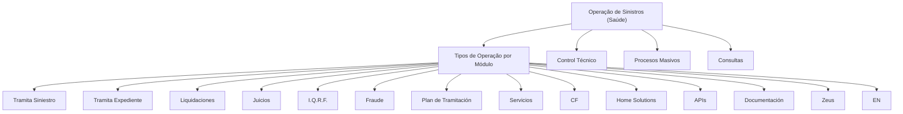

# Documentação de Operação de Sinistros (Saúde): Módulos e Tipos de Operação

## 1. Metadados do Documento
- **Arquivo de Origem:** Não identificado no conteúdo fornecido
- **Tipo de Documento:** Apresentação Executiva / Material de Formação Operacional
- **Domínio / Sistema:** Operação de Sinistros (Saúde)
- **Público-Alvo:** Operação e profissionais de negócio
- **Data/Versão Identificada:** Não identificada

---

## 2. Resumo Executivo & Contexto de Negócio

O documento apresenta uma formação orientada à operação de sinistros no domínio de Saúde e ao respectivo tipo de negócio. O conteúdo organiza os tipos de operação por módulo, sem detalhar procedimentos, regras de elegibilidade, sistemas de apoio ou responsabilidades operacionais.

Os módulos listados incluem tramitação de sinistro, tramitação de expediente, liquidações, juízos, I.Q.R.F., fraude, plano de tramitação, serviços, CF, Home Solutions, APIs, documentação, Zeus, EN, controlo técnico, processos massivos e consultas.

A apresentação estabelece um inventário funcional de áreas operacionais relacionadas a sinistros, mas não descreve integrações, contratos de API, métodos de processamento, parâmetros de liquidação ou fluxos detalhados entre os módulos.

> **Nota de Análise:** O conteúdo fornecido é predominantemente uma lista de módulos e capacidades. Não há detalhamento adicional sobre os processos, tecnologias, siglas ou regras de negócio associadas.

---

## 3. Arquitetura, Componentes & Tecnologias Envolvidas

| Componente / Módulo | Evidência no Documento | Detalhamento Disponível |
| :--- | :--- | :--- |
| Tramita Siniestro | Tipo de operação por módulo | Não detalhado |
| Tramita Expediente | Tipo de operação por módulo | Não detalhado |
| Liquidaciones | Tipo de operação por módulo | Não detalhado |
| Juicios | Tipo de operação por módulo | Não detalhado |
| I.Q.R.F. | Tipo de operação por módulo | Não detalhado |
| Fraude | Tipo de operação por módulo | Não detalhado |
| Plan de Tramitación | Tipo de operação por módulo | Não detalhado |
| Servicios | Tipo de operação por módulo | Não detalhado |
| CF | Tipo de operação por módulo | Não detalhado |
| Home Solutions | Item citado no material | Não detalhado |
| APIs | Item citado no material | Não detalhado |
| Documentación | Item citado no material | Não detalhado |
| Zeus | Item citado no material | Não detalhado |
| EN | Item citado no material | Não detalhado |
| Control Técnico | Área operacional citada | Não detalhado |
| Procesos Masivos | Área operacional citada | Não detalhado |
| Consultas | Área operacional citada | Não detalhado |



---

## 4. Regras de Negócio, Especificações Funcionais & Processos

O documento não apresenta regras de negócio, condições de validação, fórmulas de cálculo, critérios de decisão ou sequências operacionais detalhadas.

Os seguintes tópicos são identificados como tipos de operação ou áreas relacionadas à operação de sinistros em Saúde:

1. Tramita Siniestro.
2. Tramita Expediente.
3. Liquidaciones.
4. Juicios.
5. I.Q.R.F.
6. Fraude.
7. Plan de Tramitación.
8. Servicios.
9. CF.
10. Home Solutions.
11. APIs.
12. Documentación.
13. Zeus.
14. EN.
15. Control Técnico.
16. Procesos Masivos.
17. Consultas.

> **Nota de Análise:** O documento não especifica como os módulos se relacionam, quais dados processam, quais usuários os utilizam ou quais regras governam a operação de sinistros.

---

## 5. Tabelas de Parâmetros, Ambientes e Estruturas de Dados

| Item / Parâmetro | Descrição / Função | Tipo / Valores / Formato | Ambiente / Observações |
| :--- | :--- | :--- | :--- |
| Domínio | Operação abordada pelo material | Sinistros (Saúde) | Formação orientada à operação e tipo de negócio |
| Tramita Siniestro | Tipo de operação por módulo | Nome de módulo/operação | Sem detalhamento adicional |
| Tramita Expediente | Tipo de operação por módulo | Nome de módulo/operação | Sem detalhamento adicional |
| Liquidaciones | Tipo de operação por módulo | Nome de módulo/operação | Sem detalhamento adicional |
| Juicios | Tipo de operação por módulo | Nome de módulo/operação | Sem detalhamento adicional |
| I.Q.R.F. | Tipo de operação por módulo | Sigla não expandida | Sem detalhamento adicional |
| Fraude | Tipo de operação por módulo | Nome de módulo/operação | Sem detalhamento adicional |
| Plan de Tramitación | Tipo de operação por módulo | Nome de módulo/operação | Sem detalhamento adicional |
| Servicios | Tipo de operação por módulo | Nome de módulo/operação | Sem detalhamento adicional |
| CF | Tipo de operação por módulo | Sigla não expandida | Sem detalhamento adicional |
| Home Solutions | Item listado no documento | Nome citado | Sem detalhamento adicional |
| APIs | Item listado no documento | Termo técnico citado | Não há contratos ou endpoints |
| Documentación | Item listado no documento | Nome citado | Sem detalhamento adicional |
| Zeus | Item listado no documento | Nome citado | Sem detalhamento adicional |
| EN | Item listado no documento | Sigla não expandida | Sem detalhamento adicional |
| Control Técnico | Área operacional listada | Nome citado | Sem detalhamento adicional |
| Procesos Masivos | Área operacional listada | Nome citado | Sem detalhamento adicional |
| Consultas | Área operacional listada | Nome citado | Sem detalhamento adicional |

---

## 6. Bateria de Perguntas & Respostas para RAG (FAQ Sintético)

### P1: Qual é o domínio de negócio abordado pelo documento?
**R:** O documento aborda a operação de sinistros no domínio de Saúde.

### P2: Qual é o objetivo declarado do material?
**R:** O material é uma formação orientada à operação e ao tipo de negócio associado a sinistros de Saúde.

### P3: Quais módulos de tramitação são mencionados?
**R:** O documento menciona os módulos ou operações denominados **Tramita Siniestro**, **Tramita Expediente** e **Plan de Tramitación**.

### P4: O documento descreve regras para liquidações?
**R:** Não. O conteúdo apenas lista **Liquidaciones** como um tipo de operação por módulo; não há regras, cálculos, condições ou parâmetros de liquidação descritos.

### P5: Existe um módulo relacionado a fraude?
**R:** Sim. **Fraude** é listada entre os tipos de operação por módulo. O documento não detalha processos, critérios de identificação ou tratamento de fraude.

### P6: Quais áreas de controlo e processamento são citadas?
**R:** O documento cita **Control Técnico**, **Procesos Masivos** e **Consultas**. Não há explicação adicional sobre suas funções ou interdependências.

### P7: O material fornece URLs, ambientes ou contratos de APIs?
**R:** Não. Embora **APIs** seja citado como item do conteúdo, o documento não apresenta URLs, endpoints, métodos HTTP, autenticação, contratos JSON ou ambientes.

### P8: O que significa a sigla I.Q.R.F. no documento?
**R:** O documento lista **I.Q.R.F.** como um tipo de operação por módulo, mas não expande nem define a sigla.

### P9: O que significa a sigla CF no documento?
**R:** O documento cita **CF** entre os itens de operação, mas não informa o significado da sigla.

### P10: Quais nomes de sistemas ou componentes adicionais são mencionados?
**R:** Além dos módulos operacionais, o documento cita **Home Solutions**, **APIs**, **Documentación**, **Zeus** e **EN**, sem fornecer descrição técnica ou funcional adicional.

### P11: O documento explica o fluxo entre Tramita Siniestro e Tramita Expediente?
**R:** Não. Ambos são listados como tipos de operação por módulo, mas o documento não apresenta fluxo, sequência, integração ou dependência entre eles.

### P12: O documento detalha a operação de juízos?
**R:** Não. **Juicios** é listado como um tipo de operação por módulo, sem regras, etapas de processo ou informações complementares.

---

## 7. Glossário de Termos, Siglas & Conceitos-Chave

- **APIs:** Termo citado no documento; não há definição, contratos ou interfaces especificadas.
- **CF:** Sigla citada como tipo de operação por módulo; significado não identificado.
- **Control Técnico:** Área ou tópico operacional citado; detalhamento não fornecido.
- **Documentación:** Item citado no conteúdo; detalhamento não fornecido.
- **EN:** Sigla citada no conteúdo; significado não identificado.
- **Expediente:** Termo presente em “Tramita Expediente”; não definido no documento.
- **Fraude:** Tipo de operação por módulo citado; processo não detalhado.
- **Home Solutions:** Nome citado no conteúdo; função não detalhada.
- **I.Q.R.F.:** Sigla citada como tipo de operação por módulo; significado não identificado.
- **Juicios:** Tipo de operação por módulo citado; processo não detalhado.
- **Liquidaciones:** Tipo de operação por módulo citado; processo não detalhado.
- **Plan de Tramitación:** Tipo de operação por módulo citado; processo não detalhado.
- **Procesos Masivos:** Área operacional citada; detalhamento não fornecido.
- **Servicios:** Tipo de operação por módulo citado; detalhamento não fornecido.
- **Siniestros:** Domínio operacional principal do documento, associado a Saúde.
- **Tramita Expediente:** Tipo de operação por módulo citado; processo não detalhado.
- **Tramita Siniestro:** Tipo de operação por módulo citado; processo não detalhado.
- **Zeus:** Nome citado no conteúdo; função não detalhada.

---

## 8. Notas Críticas, Riscos & Limitações

- O conteúdo não identifica o arquivo de origem, autor, versão ou data.
- O material não fornece procedimentos operacionais detalhados para os módulos listados.
- Não há especificação de integrações, arquitetura técnica, infraestrutura, ambientes, servidores ou rotas de logs.
- Não há URLs, endpoints, protocolos, métodos HTTP, contratos de dados ou mecanismos de autenticação para APIs.
- As siglas **I.Q.R.F.**, **CF** e **EN** não são expandidas no conteúdo fornecido.
- Não há definição funcional ou técnica para **Home Solutions**, **Zeus** e **Documentación**.
- Não há critérios de decisão, regras de negócio, métricas, matrizes de responsabilidade ou fluxos de exceção.
- O diagrama Mermaid representa exclusivamente a organização temática observada no documento; não comprova integrações técnicas ou fluxos transacionais.

---

## 9. Conteúdo Bruto Estruturado (Referência Fiel)

```text
--- [PÁGINA 1 DE 2] ---

DOCUMENTACIÓN de OPERACIÓN de
SINIESTROS (Salud)
 Formación orientada a la operación y tipo de negocio
TIPOS DE OPERACIÓN por MÓDULO
 TRAMITA SINIESTRO
  TRAMITA EXPEDIENTE
 LIQUIDACIONES
  JUICIOS
 I.Q.R.F.
  FRAUDE
 PLAN DE TRAMITACIÓN
  SERVICIOS
 / 
 CF
Home Solutions APIs Documentation Zeus
EN


--- [PÁGINA 2 DE 2] ---

CONTROL TÉCNICO
  PROCESOS MASIVOS
 CONSULTAS
```
