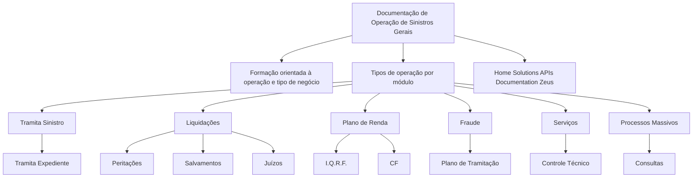

# Documentação de Operação de Sinistros Gerais — Módulos, Tipos de Operação e Capacitação

## 1. Metadados do Documento
- **Arquivo de Origem:** Não identificado no conteúdo fornecido
- **Tipo de Documento:** Manual Operacional / Material de Formação
- **Domínio / Sistema:** Operação de Sinistros Gerais
- **Público-Alvo:** Operação de sinistros e profissionais envolvidos nos tipos de negócio
- **Data/Versão Identificada:** Não identificada

---

## 2. Resumo Executivo & Contexto de Negócio

O documento apresenta uma visão resumida da documentação de operação de **Sinistros Gerais**, orientada à formação de profissionais conforme a operação executada e o tipo de negócio atendido.

O conteúdo organiza a operação por módulos e tipos de atividades, incluindo tramitação de sinistros e expedientes, liquidações, peritações, salvamentos, juízos, plano de renda, I.Q.R.F., CF, fraude, plano de tramitação, serviços, controle técnico, processos massivos e consultas.

A finalidade identificável é oferecer uma taxonomia operacional dos temas que compõem a gestão de sinistros. O documento também referencia “Home Solutions APIs Documentation Zeus”, sem esclarecer se essa expressão representa uma plataforma, documentação de APIs, integração ou ambiente específico.

O material não descreve fluxos detalhados, contratos de integração, responsabilidades por módulo, regras de elegibilidade, métodos HTTP, estruturas de dados ou procedimentos operacionais passo a passo. Portanto, a classificação apresentada deve ser tratada como referência de escopo funcional, não como especificação técnica completa.

---

## 3. Arquitetura, Componentes & Tecnologias Envolvidas

O documento não apresenta uma arquitetura técnica de infraestrutura, microsserviços, bancos de dados, ambientes ou integrações. A estrutura abaixo representa exclusivamente a organização conceitual dos módulos e tópicos operacionais explicitamente citados.



| Componente / Tema | Classificação identificada | Descrição sustentada pelo documento |
| :--- | :--- | :--- |
| Documentação de Operação de Sinistros Gerais | Documento de formação | Material voltado à operação e ao tipo de negócio. |
| Tipos de Operação por Módulo | Estrutura funcional | Agrupa os módulos e tópicos operacionais listados. |
| Tramita Sinistro | Operação / módulo | Tópico listado no documento. |
| Tramita Expediente | Operação / módulo relacionado | Aparece subordinado visualmente a “Tramita Sinistro”. |
| Liquidações | Operação / módulo | Tópico listado no documento. |
| Peritações | Operação / módulo relacionado | Aparece subordinado visualmente a “Liquidações”. |
| Salvamentos | Operação / módulo relacionado | Aparece subordinado visualmente a “Liquidações”. |
| Juízos | Operação / módulo relacionado | Aparece subordinado visualmente a “Liquidações”. |
| Plano de Renda | Operação / módulo | Tópico listado no documento. |
| I.Q.R.F. | Sigla / tópico relacionado | Aparece subordinado visualmente a “Plano de Renda”. |
| CF | Sigla / tópico relacionado | Aparece subordinado visualmente a “Plano de Renda”. |
| Fraude | Operação / módulo | Tópico listado no documento. |
| Plano de Tramitação | Processo relacionado | Aparece subordinado visualmente a “Fraude”. |
| Serviços | Operação / módulo | Tópico listado no documento. |
| Controle Técnico | Processo relacionado | Aparece subordinado visualmente a “Serviços”. |
| Processos Massivos | Operação / módulo | Tópico listado no documento. |
| Consultas | Operação / módulo relacionado | Aparece subordinado visualmente a “Processos Massivos”. |
| Home Solutions APIs Documentation Zeus | Referência documental / tecnológica | Expressão mencionada sem detalhamento técnico adicional. |

> **Nota de Análise:** O documento cita “Home Solutions APIs Documentation Zeus”, mas não detalha APIs, tecnologias, métodos HTTP, endpoints, autenticação, contratos JSON ou relações técnicas com os módulos de Sinistros Gerais.

---

## 4. Regras de Negócio, Especificações Funcionais & Processos

O conteúdo fornecido não especifica regras de negócio formais, condições de validação, cálculos, critérios de aprovação, estados processuais, exceções ou responsabilidades operacionais.

A única organização processual explicitamente observável é a associação visual entre tópicos:

1. **Tramita Sinistro** contém ou se relaciona com **Tramita Expediente**.
2. **Liquidações** contém ou se relaciona com **Peritações**, **Salvamentos** e **Juízos**.
3. **Plano de Renda** contém ou se relaciona com **I.Q.R.F.** e **CF**.
4. **Fraude** contém ou se relaciona com **Plano de Tramitação**.
5. **Serviços** contém ou se relaciona com **Controle Técnico**.
6. **Processos Massivos** contém ou se relaciona com **Consultas**.

> **Nota de Análise:** Não há detalhamento suficiente para afirmar se as relações apresentadas representam dependência funcional, sequência de processo, hierarquia de menu, etapas obrigatórias ou agrupamento temático.

---

## 5. Tabelas de Parâmetros, Ambientes e Estruturas de Dados

| Item / Parâmetro | Descrição / Função | Tipo / Valores / Formato | Ambiente / Observações |
| :--- | :--- | :--- | :--- |
| Domínio funcional | Operação de Sinistros Gerais | Texto | Apresentado como tema central da documentação. |
| Orientação da formação | Formação orientada à operação e tipo de negócio | Texto | Não há carga horária, público específico ou plano de capacitação detalhado. |
| Tramita Sinistro | Tipo de operação por módulo | Nome de módulo ou operação | Relacionado visualmente a “Tramita Expediente”. |
| Tramita Expediente | Tópico associado à tramitação de sinistro | Nome de módulo ou operação | Sem descrição de etapas, regras ou campos. |
| Liquidações | Tipo de operação por módulo | Nome de módulo ou operação | Relacionado visualmente a Peritações, Salvamentos e Juízos. |
| Peritações | Tópico associado a Liquidações | Nome de módulo ou operação | Sem detalhamento adicional. |
| Salvamentos | Tópico associado a Liquidações | Nome de módulo ou operação | Sem detalhamento adicional. |
| Juízos | Tópico associado a Liquidações | Nome de módulo ou operação | Sem detalhamento adicional. |
| Plano de Renda | Tipo de operação por módulo | Nome de módulo ou operação | Relacionado visualmente a I.Q.R.F. e CF. |
| I.Q.R.F. | Tópico associado ao Plano de Renda | Sigla não expandida | O significado não é definido no documento. |
| CF | Tópico associado ao Plano de Renda | Sigla não expandida | O significado não é definido no documento. |
| Fraude | Tipo de operação por módulo | Nome de módulo ou operação | Relacionado visualmente ao Plano de Tramitação. |
| Plano de Tramitação | Tópico associado a Fraude | Nome de processo ou operação | Sem regras ou etapas descritas. |
| Serviços | Tipo de operação por módulo | Nome de módulo ou operação | Relacionado visualmente a Controle Técnico. |
| Controle Técnico | Tópico associado a Serviços | Nome de processo ou operação | Sem critérios técnicos descritos. |
| Processos Massivos | Tipo de operação por módulo | Nome de módulo ou operação | Relacionado visualmente a Consultas. |
| Consultas | Tópico associado a Processos Massivos | Nome de operação | Sem filtros, fontes de dados ou formatos especificados. |
| Home Solutions APIs Documentation Zeus | Referência citada | Texto | Não há URL, ambiente, versão ou documentação de interface. |

---

## 6. Bateria de Perguntas & Respostas para RAG (FAQ Sintético)

### P1: Qual é o objetivo da documentação de operação de Sinistros Gerais?
**R:** O documento apresenta uma formação orientada à operação e ao tipo de negócio no domínio de Sinistros Gerais, organizando os principais tipos de operação por módulo.

### P2: Quais são os tipos de operação por módulo listados no documento?
**R:** O documento lista Tramita Sinistro, Liquidações, Plano de Renda, Fraude, Serviços e Processos Massivos como tipos de operação por módulo.

### P3: Qual tópico está associado a Tramita Sinistro?
**R:** “Tramita Expediente” aparece visualmente subordinado ou associado a “Tramita Sinistro”. O documento não descreve as etapas nem as regras dessa tramitação.

### P4: Quais tópicos estão relacionados a Liquidações?
**R:** O documento associa Peritações, Salvamentos e Juízos ao tópico de Liquidações. Não são fornecidas regras de liquidação, critérios de peritação, tratamento de salvamentos ou procedimentos de juízos.

### P5: O que o documento informa sobre Plano de Renda?
**R:** Plano de Renda é apresentado como um tipo de operação por módulo e possui associação visual com os tópicos I.Q.R.F. e CF. O documento não expande essas siglas nem descreve suas funções.

### P6: Qual processo é mencionado dentro do contexto de Fraude?
**R:** O documento relaciona “Plano de Tramitação” ao tópico de Fraude. Não há informação sobre critérios de identificação de fraude, etapas de análise ou responsáveis pelo processo.

### P7: Como Controle Técnico aparece na estrutura operacional?
**R:** Controle Técnico é listado como um tópico associado a Serviços. O conteúdo não define controles, métricas, indicadores ou procedimentos técnicos específicos.

### P8: O que são Processos Massivos no documento?
**R:** Processos Massivos são listados como um tipo de operação por módulo, com “Consultas” visualmente associado. O documento não detalha processamento em lote, periodicidade, entradas, saídas ou mecanismos de consulta.

### P9: A documentação descreve APIs ou endpoints do Zeus?
**R:** Não. O texto menciona “Home Solutions APIs Documentation Zeus”, mas não apresenta endpoints, URLs, métodos HTTP, contratos de integração, autenticação, versões ou ambientes.

### P10: O documento pode ser usado como especificação técnica completa dos módulos?
**R:** Não. O documento fornece apenas uma enumeração estruturada de módulos e tópicos operacionais. Ele não contém requisitos funcionais detalhados, arquitetura técnica, regras de negócio, estruturas de dados ou procedimentos completos.

---

## 7. Glossário de Termos, Siglas & Conceitos-Chave

- **Sinistros Gerais:** Domínio central citado no título da documentação de operação.
- **Tramita Sinistro:** Tipo de operação por módulo citado no documento.
- **Tramita Expediente:** Tópico associado visualmente a Tramita Sinistro.
- **Liquidações:** Tipo de operação por módulo citado no documento.
- **Peritações:** Tópico associado visualmente a Liquidações.
- **Salvamentos:** Tópico associado visualmente a Liquidações.
- **Juízos:** Tópico associado visualmente a Liquidações.
- **Plano de Renda:** Tipo de operação por módulo citado no documento.
- **I.Q.R.F.:** Sigla citada como tópico relacionado ao Plano de Renda; significado não definido no conteúdo fornecido.
- **CF:** Sigla citada como tópico relacionado ao Plano de Renda; significado não definido no conteúdo fornecido.
- **Fraude:** Tipo de operação por módulo citado no documento.
- **Plano de Tramitação:** Tópico associado visualmente a Fraude.
- **Serviços:** Tipo de operação por módulo citado no documento.
- **Controle Técnico:** Tópico associado visualmente a Serviços.
- **Processos Massivos:** Tipo de operação por módulo citado no documento.
- **Consultas:** Tópico associado visualmente a Processos Massivos.
- **Home Solutions APIs Documentation Zeus:** Expressão referenciada no documento sem definição técnica adicional.

---

## 8. Notas Críticas, Riscos & Limitações

- O documento possui conteúdo resumido e não fornece especificações operacionais detalhadas para os módulos citados.
- Não há identificação de arquivo, autoria, versão, data de emissão ou histórico de alterações.
- Não são descritos ambientes, URLs, servidores, credenciais, rotas de logs, APIs, contratos, bancos de dados ou dependências externas.
- As siglas **I.Q.R.F.** e **CF** não são expandidas; qualquer interpretação adicional seria especulativa.
- A relação hierárquica entre os tópicos foi inferida exclusivamente da disposição visual do conteúdo bruto, sem confirmação de que represente sequência de processo ou dependência funcional.
- A referência a “Home Solutions APIs Documentation Zeus” não possui contexto suficiente para caracterizar uma integração ou arquitetura técnica.

---

## 9. Conteúdo Bruto Estruturado (Referência Fiel)

```text
--- [PÁGINA 1 DE 2] ---

DOCUMENTACIÓN de OPERACIÓN de
SINIESTROS (Generales)
 Formación orientada a la operación y tipo de negocio
TIPOS DE OPERACIÓN por MÓDULO
 TRAMITA SINIESTRO
  TRAMITA EXPEDIENTE
 LIQUIDACIONES
  PERITACIONES
 SALVAMENTOS
  JUICIOS
 PLAN DE RENTA
  I.Q.R.F.
 / 
 CF
Home Solutions APIs Documentation Zeus
EN


--- [PÁGINA 2 DE 2] ---

FRAUDE
  PLAN DE TRAMITACIÓN
 SERVICIOS
  CONTROL TÉCNICO
 PROCESOS MASIVOS
  CONSULTAS
```
