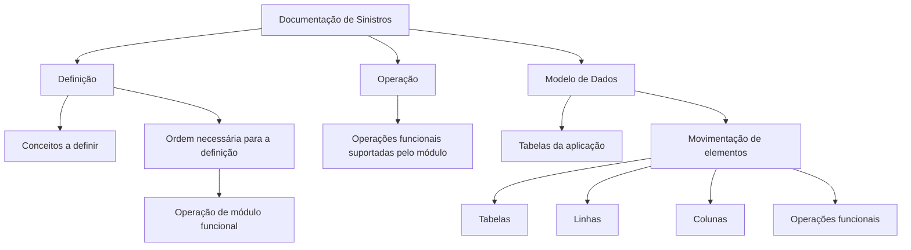

# Documentação de Sinistros — Estrutura Funcional, Operação e Modelo de Dados

## 1. Metadados do Documento
- **Arquivo de Origem:** Não identificado
- **Tipo de Documento:** Manual Operacional
- **Domínio / Sistema:** Sinistros; “Home Solutions APIs Documentation Zeus”
- **Público-Alvo:** Desenvolvedores, Arquitetos, Operação e Negócio
- **Data/Versão Identificada:** Não identificada

---

## 2. Resumo Executivo & Contexto de Negócio

O documento apresenta a estrutura de documentação referente à funcionalidade do sistema de **Sinistros**. O conteúdo é organizado em três áreas principais: **Definição**, **Operação** e **Modelo de Dados**.

A seção de **Definição** descreve documentos destinados a registrar conceitos que precisam ser definidos e a ordem de atividades necessária para alcançar a configuração ou definição exigida para operar um módulo funcional.

A seção de **Operação** concentra a documentação relacionada às operações funcionais suportadas pelo módulo. O trecho disponível não detalha quais operações específicas são suportadas, nem seus fluxos, pré-condições ou resultados.

A seção de **Modelo de Dados** é orientada às tabelas da aplicação e informa que há descrição detalhada da movimentação de elementos como tabelas, linhas e colunas conforme as operações funcionais. O documento não identifica nomes de tabelas, estruturas de campos, chaves, regras de integridade ou tecnologias de persistência.

---

## 3. Arquitetura, Componentes & Tecnologias Envolvidas

Os elementos explicitamente citados são:

| Componente / Elemento | Papel descrito no documento |
| :--- | :--- |
| Documentação de Sinistros | Conjunto documental voltado à funcionalidade do sistema ou módulo de Sinistros. |
| Definição | Área documental para conceitos e sequência necessária à definição de um módulo funcional. |
| Operação | Área documental para operações funcionais suportadas pelo módulo. |
| Modelo de Dados | Área documental orientada às tabelas da aplicação e à movimentação de tabelas, linhas e colunas. |
| Home Solutions APIs Documentation Zeus | Texto de navegação ou identificação presente no conteúdo bruto; o papel técnico não é detalhado. |
| CF | Sigla presente no conteúdo bruto sem expansão ou contexto suficiente. |



> *Nota de Análise: O texto não descreve arquitetura de software, integrações, APIs, microsserviços, protocolos, ambientes, tecnologias ou fluxos técnicos executáveis.*

---

## 4. Regras de Negócio, Especificações Funcionais & Processos

### Organização funcional da documentação

1. A documentação relacionada ao sistema de Sinistros é dividida nos apartados:
   - Definição.
   - Operação.
   - Modelo de Dados.

2. A documentação de **Definição** deve detalhar:
   - Os conceitos que precisam ser definidos.
   - A ordem que deve ser seguida para obter a definição necessária.
   - A definição que permite operar um módulo funcional.

3. A documentação de **Operação** deve abranger:
   - As operações funcionais suportadas pelo módulo.

4. A documentação de **Modelo de Dados** deve abranger:
   - As tabelas da aplicação.
   - A movimentação de tabelas, linhas e colunas.
   - A relação entre a movimentação desses elementos e as operações funcionais.

### Limitações da especificação funcional disponível

O documento não apresenta regras de cálculo, critérios de elegibilidade, validações, estados de processo, exceções, permissões, responsabilidades, entradas, saídas, contratos de API ou sequências operacionais detalhadas.

> *Nota de Análise: O conteúdo define a classificação da documentação, mas não descreve as operações funcionais de Sinistros em nível suficiente para derivar regras de negócio adicionais.*

---

## 5. Tabelas de Parâmetros, Ambientes e Estruturas de Dados

| Item / Parâmetro | Descrição / Função | Tipo / Valores / Formato | Ambiente / Observações |
| :--- | :--- | :--- | :--- |
| Definição | Documentos que detalham conceitos a definir e a ordem necessária para alcançar uma definição operacional. | Categoria documental | Aplicável a módulos funcionais. |
| Operação | Documentos relacionados às operações funcionais suportadas pelo módulo. | Categoria documental | Operações específicas não identificadas. |
| Modelo de Dados | Documentação orientada às tabelas da aplicação e ao movimento de tabelas, linhas e colunas. | Categoria documental | Não informa tabelas, campos ou formatos. |
| Tabelas | Elementos da aplicação abordados pelo Modelo de Dados. | Estrutura de dados | Nomes e esquemas não identificados. |
| Linhas | Elementos cuja movimentação é descrita no contexto das operações funcionais. | Estrutura de dados | Regras de inserção, alteração ou exclusão não identificadas. |
| Colunas | Elementos cuja movimentação é descrita no contexto das operações funcionais. | Estrutura de dados | Tipos, restrições e valores não identificados. |
| Home Solutions APIs Documentation Zeus | Identificação textual presente no documento. | Não especificado | Papel funcional ou técnico não detalhado. |
| CF | Sigla textual presente no documento. | Não especificado | Significado não identificado. |

---

## 6. Bateria de Perguntas & Respostas para RAG (FAQ Sintético)

### P1: Qual é o objetivo da documentação de Sinistros?
**R:** A documentação de Sinistros aborda a funcionalidade do sistema e organiza as informações em três áreas: Definição, Operação e Modelo de Dados.

### P2: Quais são as seções em que a documentação de Sinistros está dividida?
**R:** A documentação está dividida nos apartados Definição, Operação e Modelo de Dados.

### P3: O que deve constar na documentação de Definição?
**R:** A documentação de Definição deve detalhar os conceitos que precisam ser definidos e a ordem que deve ser seguida para alcançar a definição necessária para operar um módulo funcional.

### P4: Qual é a finalidade da seção Operação?
**R:** A seção Operação reúne documentos relacionados às operações funcionais suportadas pelo módulo.

### P5: Quais operações funcionais são suportadas pelo módulo de Sinistros?
**R:** O documento informa que existem operações funcionais suportadas pelo módulo, mas não identifica nem descreve quais são essas operações.

### P6: Qual é o foco da documentação de Modelo de Dados?
**R:** A documentação de Modelo de Dados é orientada às tabelas da aplicação e descreve a movimentação de elementos como tabelas, linhas e colunas conforme as operações funcionais.

### P7: O documento informa os nomes das tabelas da aplicação?
**R:** Não. O documento menciona tabelas da aplicação, mas não fornece nomes de tabelas, campos, chaves ou relacionamentos.

### P8: O documento apresenta regras para movimentação de linhas e colunas?
**R:** Não em detalhe. O conteúdo apenas informa que a movimentação de tabelas, linhas e colunas é descrita considerando as operações funcionais.

### P9: Há especificação de APIs, métodos HTTP ou contratos JSON no conteúdo disponível?
**R:** Não. Embora o texto contenha a expressão “Home Solutions APIs Documentation Zeus”, não há detalhamento de APIs, endpoints, métodos HTTP, payloads ou contratos JSON.

### P10: É possível identificar ambientes, URLs, servidores ou parâmetros de configuração?
**R:** Não. O documento não fornece ambientes, URLs, servidores, portas, variáveis de configuração ou parâmetros operacionais.

---

## 7. Glossário de Termos, Siglas & Conceitos-Chave

- **Sinistros:** Domínio ou sistema ao qual a documentação se refere; o documento não apresenta definição adicional.
- **Definição:** Área documental que registra conceitos a definir e a sequência necessária para permitir a operação de um módulo funcional.
- **Operação:** Área documental relacionada às operações funcionais suportadas por um módulo.
- **Modelo de Dados:** Área documental orientada às tabelas da aplicação e ao movimento de tabelas, linhas e colunas.
- **Módulo Funcional:** Módulo que pode ser operado após a definição necessária; não há identificação de módulos específicos.
- **CF:** Sigla presente no conteúdo bruto sem significado explicitado.
- **Home Solutions APIs Documentation Zeus:** Expressão presente no conteúdo bruto; o documento não define seu significado ou responsabilidade técnica.

---

## 8. Notas Críticas, Riscos & Limitações

- O arquivo de origem, a data e a versão do documento não foram identificados no conteúdo fornecido.
- O conteúdo disponível é introdutório e não apresenta detalhamento das operações funcionais do módulo de Sinistros.
- Não há identificação de tabelas, modelos relacionais, tipos de dados, chaves, índices ou regras de integridade.
- Não há especificação de APIs, integrações, serviços, URLs, ambientes, credenciais, servidores ou logs.
- A expressão “Home Solutions APIs Documentation Zeus” aparece no texto, mas não possui explicação técnica suficiente para estabelecer sua função.
- A sigla “CF” é apresentada sem expansão ou contexto.
- Não é possível inferir regras de negócio adicionais sem extrapolar o conteúdo original.

---

## 9. Conteúdo Bruto Estruturado (Referência Fiel)

```text
--- [PÁGINA 1 DE 2] ---

DOCUMENTACIÓN - SINIESTROS
En este apartado se aborda todo aquello relacionado con la funcionalidad del sistema. La información
se encuentra dividida en los apartados siguientes:
Definición
Operación
Modelo de datos
DEFINICIÓN
Documentos que detallan aquellos conceptos que se han de definir y el orden que se ha de seguir
para conseguir la definición necesaria con lo que poder operar un módulo funcional.
OPERACIÓN
Documentos relacionados con las operaciones funcionales que el módulo soporta.
MODELO DE DATOS
Documentación orientada hacia las tablas de la aplicación. Adicionalmente, se describe con detalle el
movimiento de distintos elementos como tablas, filas y columnas atendiendo a las operaciones
 / 
 CF
Home Solutions APIs Documentation Zeus
EN


--- [PÁGINA 2 DE 2] ---

funcionales.
```
