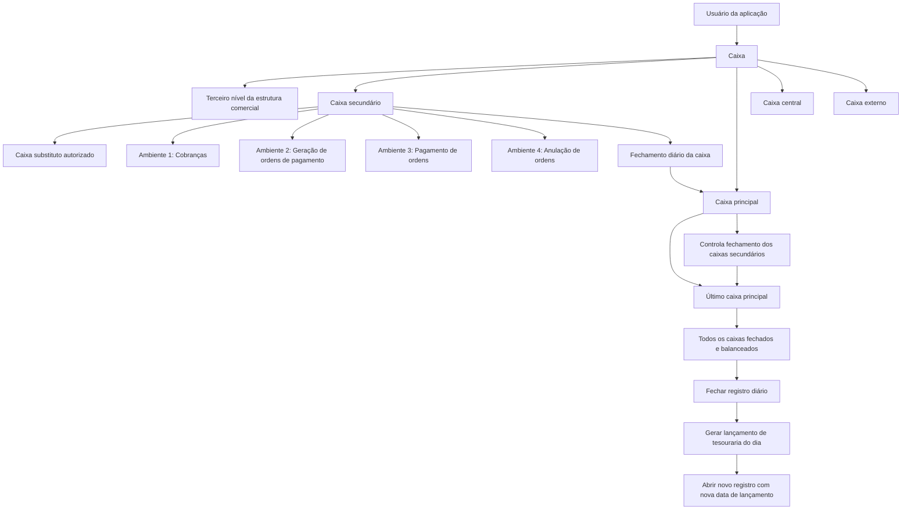

# Definição de Caixa — Propriedades, Acessos, Estado e Auditoria no Registro Diário

## 1. Metadados do Documento
- **Arquivo de Origem:** Não informado; conteúdo extraído apresentado em 6 páginas.
- **Tipo de Documento:** Especificação Funcional.
- **Domínio / Sistema:** Tesouraria, registro diário, operações de cobrança e pagamento.
- **Público-Alvo:** Operação, analistas funcionais, desenvolvedores e equipes de contabilidade/tesouraria.
- **Data/Versão Identificada:** Não identificada.

---

## 2. Resumo Executivo & Contexto de Negócio

O documento define o conceito de **caixa** (*cajero*) no contexto de uma aplicação de tesouraria. O objetivo declarado é identificar os usuários da aplicação que podem acessar operações de tesouraria e sua contabilização. A definição do caixa reúne propriedades gerais, permissões de acesso aos ambientes do registro diário, indicadores de estado operacional e dados de auditoria.

A estrutura diferencia caixas **principais** e **secundários**. Caixas secundários executam operações de cobrança, pagamento, compensação e fechamento diário de sua própria caixa. Caixas principais controlam o fechamento dos caixas secundários antes de efetuar o fechamento da caixa. Para cada terceiro nível da estrutura comercial, deve existir um caixa principal e a quantidade necessária de caixas secundários.

O papel de **último principal** centraliza o encerramento diário da companhia. Mesmo existindo mais de um caixa principal — um por terceiro nível da estrutura comercial — somente o último principal é responsável por fechar o registro diário e gerar o lançamento contábil de tesouraria do dia. Esse fechamento exige que todos os caixas da companhia estejam fechados e balanceados.

A operação é segmentada em quatro ambientes do registro diário: cobranças, geração de ordens de pagamento, pagamento de ordens de pagamento e anulação de ordens de pagamento. As permissões são atribuídas por caixa. O documento também estabelece mecanismos operacionais para prevenir desequilíbrios e bloqueios contábeis: um caixa somente pode executar um processo do registro diário por vez.

As propriedades de estado registram se o caixa está ativo, se os lançamentos estão balanceados e quais foram as últimas transações executadas em cada ambiente. Já as propriedades de auditoria registram habilitação, data de alta, data de baixa e observações associadas à inabilitação do caixa.

---

## 3. Arquitetura, Componentes & Tecnologias Envolvidas

O documento não descreve tecnologias, protocolos, bancos de dados, APIs, microsserviços, URLs, ambientes de infraestrutura ou ferramentas de desenvolvimento. O conteúdo descreve exclusivamente componentes funcionais da aplicação de tesouraria e do registro diário.

### Componentes funcionais identificados

| Componente | Função descrita |
| :--- | :--- |
| Caixa (*cajero*) | Usuário identificado para acessar operações de tesouraria e contabilização. |
| Caixa secundário | Realiza operações de cobrança e pagamento, compensações e fechamento diário da própria caixa. |
| Caixa principal | Controla o fechamento dos caixas secundários para realizar o fechamento da caixa. |
| Último principal | Caixa principal responsável por fechar o registro diário e gerar o lançamento de tesouraria diário. |
| Caixa substituto | Caixa secundário autorizado a substituir o caixa principal. |
| Caixa central | Caixa pertencente ao terceiro nível identificado como escritório central, com permissão para pagar qualquer tipo de ordem de pagamento. |
| Caixa externo | Caixa utilizado em processos automáticos de cobrança executados por operadores ou usuários externos à tesouraria. |
| Registro diário | Contexto operacional e contábil no qual são executadas cobranças, ordens de pagamento, pagamentos e anulações. |
| Parte contábil | Contexto no qual são verificados os lançamentos do caixa, incluindo equilíbrio entre saldo credor e devedor. |
| Estrutura comercial | Estrutura organizacional associada ao caixa, com referência explícita ao terceiro nível. |
| Ambiente 1 | Ambiente do registro diário para cobranças. |
| Ambiente 2 | Ambiente do registro diário para geração de ordens de pagamento. |
| Ambiente 3 | Ambiente do registro diário para pagamento de ordens de pagamento. |
| Ambiente 4 | Ambiente do registro diário para anulação de ordens de pagamento. |



> **Nota de Análise:** O documento descreve relações funcionais entre caixas, estrutura comercial e ambientes do registro diário, mas não detalha implementação técnica, contratos de integração, métodos HTTP, persistência de dados ou responsabilidades de sistemas externos.

---

## 4. Regras de Negócio, Especificações Funcionais & Processos

### 4.1 Identificação e classificação de caixas

1. A propriedade **Caixa** contém a chave usada para identificar o usuário da aplicação.
2. A propriedade **Nome do caixa** contém o nome do caixa.
3. O nome do caixa pode manter o mesmo nome utilizado na criação do usuário da aplicação ou pode receber um nome específico para identificar o caixa.
4. A propriedade **Tipo de caixa** identifica como o caixa pode atuar na aplicação.
5. Os tipos apresentados são:
   - **(S) Secundário**
   - **(P) Principal**

### 4.2 Responsabilidades por tipo de caixa

1. O caixa secundário realiza:
   - Operações de cobrança.
   - Operações de pagamento.
   - Compensações das operações.
   - Fechamento diário da própria caixa.
2. O caixa principal controla que todos os caixas secundários estejam fechados para poder realizar o fechamento da caixa.
3. Para cada terceiro nível da estrutura comercial, deve existir:
   - Um caixa principal.
   - Tantos caixas secundários quanto forem necessários.

### 4.3 Último caixa principal e fechamento do registro diário

1. A propriedade **Último principal** indica se o caixa é o último principal da companhia.
2. Pode existir mais de um caixa principal dentro da companhia, sendo um caixa principal para cada terceiro nível da estrutura comercial.
3. É necessário indicar qual caixa principal é o último principal.
4. O último principal é responsável por:
   - Fechar o registro diário.
   - Gerar o lançamento de tesouraria do dia.
5. Para fechar o registro diário:
   - Todos os caixas da companhia devem ter fechado.
   - Todos os caixas da companhia devem estar balanceados.
6. Depois de fechado o registro diário, somente o último principal pode abrir o novo registro com a nova data de lançamento.

### 4.4 Substituição do caixa principal

1. A propriedade **Tipo de substituição** indica se o caixa pode substituir o caixa principal.
2. Os valores apresentados para o tipo de substituição são:
   - **(P) Principal**
   - **(R) Substituto**
   - **Sem valor**
3. O valor **(P) Principal** somente pode ser informado quando o caixa é principal.
4. O valor **(R) Substituto** é atribuído a caixas secundários que podem substituir o caixa principal.
5. Quando um caixa atua como substituto, pode executar as tarefas do caixa principal que está substituindo.
6. Se um caixa secundário habilitado como substituto entrar na parte contábil antes do caixa principal do escritório comercial, o caixa secundário assume o papel de caixa principal naquele dia.
7. A ausência de valor indica que o caixa não pode substituir o caixa principal.

### 4.5 Consulta de movimentos por estrutura comercial

1. A propriedade **Principal do segundo nível de estrutura comercial** determina se o caixa pode acessar a consulta de movimentos de outros caixas dentro de sua estrutura comercial.

### 4.6 Modificação da data de valor

1. A **data de valor** identifica a data real da cobrança dos recibos.
2. Em recibos em moeda estrangeira, a data de valor determina a data do tipo de câmbio usado para obter o valor do recibo em moeda local.
3. A propriedade **Modifica data de valor** determina se o caixa pode modificar a data das cobranças durante as operações de cobrança.

### 4.7 Caixa central

1. A propriedade **Caixa central** indica se o caixa pertence ao terceiro nível da estrutura comercial identificado pela companhia como escritório central em nível contábil.
2. Um caixa central pode pagar qualquer tipo de ordem de pagamento, incluindo:
   - Ordens de pagamento de sinistros.
   - Ordens de pagamento de tesouraria.
   - Ordens de pagamento de agente.
   - Outros tipos indicados pelo documento por meio de “etc.”.

### 4.8 Pagamento direto

1. A propriedade **Pagamento direto** indica se o caixa pode realizar o pagamento diretamente a partir da geração da ordem de pagamento.

### 4.9 Associação à estrutura comercial

1. A propriedade **Terceiro nível da estrutura comercial** identifica a estrutura comercial à qual o caixa pertence.
2. A estrutura comercial associada ao caixa é a mesma estrutura comercial atribuída quando o usuário é criado na aplicação.

### 4.10 Transferências de caixa para banco

1. Todo o dinheiro em espécie, cheques ou comprovantes de cartão recebidos pelo caixa por meio das cobranças deve ser transferido ao banco ao final do dia.
2. A propriedade **Transferências de caixa para banco** determina se o caixa pode realizar essa transferência.
3. Nem todos os caixas são autorizados a realizar transferências para o banco.
4. Normalmente, o total arrecadado no dia é transferido ao caixa principal do escritório.
5. O caixa principal do escritório normalmente é o responsável por realizar a transferência ao banco.

### 4.11 Caixa externo e processos automáticos

1. A propriedade **Externo** identifica o caixa utilizado em processos automáticos de cobrança.
2. Os processos automáticos de cobrança podem ser executados por operadores ou usuários externos à tesouraria.
3. Deve ser identificado um caixa externo por cada terceiro nível da estrutura comercial no qual possam ser executados processos automáticos.

### 4.12 Acesso aos ambientes do registro diário

1. O acesso a cada ambiente é controlado por propriedade específica do caixa.
2. **Ambiente 1** permite operar no ambiente de cobranças do registro diário.
3. **Ambiente 2** permite operar no ambiente de geração de ordens de pagamento.
4. **Ambiente 3** permite operar no ambiente de pagamento de ordens de pagamento.
5. **Ambiente 4** permite operar no ambiente de anulação de ordens de pagamento.

### 4.13 Estado operacional do caixa

1. Um caixa somente pode executar um processo do registro diário por vez.
2. Não é possível acessar mais de uma operação simultaneamente.
3. A restrição existe para evitar desequilíbrios e bloqueios na contabilidade.
4. O caixa permanece ativo enquanto trabalha em qualquer operação do registro diário.
5. Enquanto está ativo, o caixa não pode acessar o registro diário utilizando a mesma chave.
6. O caixa deixa de estar ativo quando sai do registro diário.

### 4.14 Balanceamento contábil

1. A propriedade **Balanceado** indica se todos os lançamentos realizados pelo caixa na parte contábil estão balanceados.
2. O valor da propriedade é atualizado em cada fechamento de caixa.
3. A atualização verifica se não existe diferença entre:
   - Saldo credor.
   - Saldo devedor.
4. A verificação considera todas as operações realizadas pelo caixa na parte contábil.

### 4.15 Rastreabilidade das últimas operações

1. A propriedade **Último ambiente** contém o último ambiente do registro diário no qual o caixa trabalhou.
2. A propriedade **Último número de recibo** contém o último número de transação realizado pelo caixa no ambiente de cobranças.
3. A propriedade **Última ordem de pagamento** contém o último número de transação realizado pelo caixa no ambiente de pagamento de ordens de pagamento.
4. A propriedade **Último número de giro** contém o último número de transação realizado pelo caixa no ambiente de geração de ordens de pagamento.
5. A propriedade **Último número de anulação** contém o último número de transação realizado pelo caixa no ambiente de anulação de ordens de pagamento.
6. Essas propriedades são atualizadas pelos processos do registro diário.

### 4.16 Auditoria e habilitação

1. A propriedade **Inabilitado** indica se o caixa está habilitado para trabalhar.
2. Um caixa inabilitado não pode acessar o registro diário de operações.
3. A propriedade **Data de alta** indica a data em que o usuário da aplicação foi identificado como caixa.
4. A propriedade **Data de baixa** indica o momento em que o caixa foi inabilitado.
5. A propriedade **Observações** armazena comentários incluídos durante a inabilitação do caixa.
6. As observações são normalmente usadas para indicar o motivo da inabilitação.

---

## 5. Tabelas de Parâmetros, Ambientes e Estruturas de Dados

### 5.1 Propriedades gerais do caixa

| Item / Parâmetro | Descrição / Função | Tipo / Valores / Formato | Ambiente / Observações |
| :--- | :--- | :--- | :--- |
| Caixa | Chave que identifica o usuário da aplicação como caixa. | Chave; formato não detalhado. | Propriedade geral. |
| Nome do caixa | Nome usado para identificar o caixa. | Texto; formato não detalhado. | Pode manter o nome do usuário ou usar nome específico. |
| Tipo de caixa | Identifica como o caixa atua na aplicação. | `(S) Secundário`; `(P) Principal`. | Secundário executa operações; principal controla fechamento de secundários. |
| Último principal | Indica se o caixa principal é o último principal da companhia. | Indicador; valores não detalhados. | Responsável por fechamento do registro diário e geração do lançamento de tesouraria diário. |
| Tipo de substituição | Indica se o caixa pode substituir o caixa principal. | `(P) Principal`; `(R) Substituto`; sem valor. | `(P)` somente para caixa principal; `(R)` para caixa secundário substituto. |
| Principal do segundo nível de estrutura comercial | Determina permissão para consultar movimentos de outros caixas da estrutura comercial. | Indicador; valores não detalhados. | Refere-se a outros caixas dentro da estrutura comercial. |
| Modifica data de valor | Determina se o caixa pode alterar a data de cobranças. | Indicador; valores não detalhados. | Aplicável durante operações de cobrança. |
| Caixa central | Indica se o caixa pertence ao escritório central contábil. | Indicador; valores não detalhados. | Pode pagar qualquer tipo de ordem de pagamento. |
| Pagamento direto | Indica se o caixa pode pagar diretamente ao gerar uma ordem de pagamento. | Indicador; valores não detalhados. | Relacionado à geração de ordens de pagamento. |
| Terceiro nível da estrutura comercial | Identifica a estrutura comercial do caixa. | Referência à estrutura comercial; formato não detalhado. | É a mesma estrutura associada ao usuário na criação. |
| Transferências de caixa para banco | Determina se o caixa pode transferir arrecadação diária ao banco. | Indicador; valores não detalhados. | Inclui dinheiro, cheques e comprovantes de cartões. |
| Externo | Identifica o caixa usado em processos automáticos de cobrança. | Indicador/identificação; formato não detalhado. | Deve existir um por terceiro nível com processos automáticos. |

### 5.2 Tipos de caixa e responsabilidades

| Tipo / Papel | Descrição / Função | Restrições / Condições | Observações |
| :--- | :--- | :--- | :--- |
| Caixa secundário | Realiza cobranças, pagamentos, compensações e fechamento diário. | Pode ser substituto se receber valor `(R)`. | Pode assumir papel principal no dia se entrar antes do principal na parte contábil. |
| Caixa principal | Controla que os caixas secundários estejam fechados para fechar a caixa. | Deve existir um por terceiro nível da estrutura comercial. | Pode receber valor `(P)` em tipo de substituição. |
| Último principal | Fecha o registro diário e gera o lançamento de tesouraria do dia. | Todos os caixas da companhia devem estar fechados e balanceados. | Somente este caixa pode abrir novo registro após o fechamento. |
| Caixa substituto | Executa tarefas do caixa principal substituído. | Deve ser caixa secundário com tipo `(R)`. | Assume papel principal naquele dia se entrar antes do principal. |
| Caixa central | Paga qualquer tipo de ordem de pagamento. | Deve pertencer ao terceiro nível identificado como escritório central. | Exemplos de ordens: sinistros, tesouraria e agente. |
| Caixa externo | É usado em processos automáticos de cobrança. | Deve haver um por terceiro nível onde processos automáticos possam ser executados. | Processos podem ser executados por usuários externos à tesouraria. |

### 5.3 Ambientes do registro diário

| Item / Parâmetro | Descrição / Função | Tipo / Valores / Formato | Ambiente / Observações |
| :--- | :--- | :--- | :--- |
| Ambiente 1 | Permite executar operações relacionadas a cobranças de recibos. | Permissão de acesso; valores não detalhados. | Registro diário: Cobranças. |
| Ambiente 2 | Permite gerir ordens de pagamento. | Permissão de acesso; valores não detalhados. | Inclui ordens de sinistros, agentes e recibos negativos. |
| Ambiente 3 | Permite executar operações de pagamento de ordens de pagamento. | Permissão de acesso; valores não detalhados. | Registro diário: Pagamento de ordens. |
| Ambiente 4 | Permite executar operações de anulação de ordens de pagamento. | Permissão de acesso; valores não detalhados. | Registro diário: Anulação de ordens. |

### 5.4 Propriedades de estado do caixa

| Item / Parâmetro | Descrição / Função | Tipo / Valores / Formato | Ambiente / Observações |
| :--- | :--- | :--- | :--- |
| Ativo | Indica que o caixa está trabalhando em operação do registro diário. | Estado; valores não detalhados. | Um caixa só pode executar um processo por vez; deixa de estar ativo ao sair do registro diário. |
| Balanceado | Indica se os lançamentos do caixa na parte contábil estão balanceados. | Estado; valores não detalhados. | Atualizado a cada fechamento; verifica ausência de diferença entre saldo credor e devedor. |
| Último ambiente | Armazena o último ambiente do registro diário utilizado pelo caixa. | Referência de ambiente; formato não detalhado. | Atualizado nos processos do registro diário. |
| Último número de recibo | Armazena a última transação realizada no ambiente de cobranças. | Número de transação; formato não detalhado. | Atualizado nos processos do registro diário. |
| Última ordem de pagamento | Armazena a última transação realizada no ambiente de pagamento de ordens. | Número de transação; formato não detalhado. | Atualizado nos processos do registro diário. |
| Último número de giro | Armazena a última transação realizada no ambiente de geração de ordens de pagamento. | Número de transação; formato não detalhado. | Atualizado nos processos do registro diário. |
| Último número de anulação | Armazena a última transação realizada no ambiente de anulação de ordens. | Número de transação; formato não detalhado. | Atualizado nos processos do registro diário. |

### 5.5 Propriedades de auditoria

| Item / Parâmetro | Descrição / Função | Tipo / Valores / Formato | Ambiente / Observações |
| :--- | :--- | :--- | :--- |
| Inabilitado | Indica se o caixa está habilitado para trabalhar. | Estado; valores não detalhados. | Caixa inabilitado não acessa o registro diário de operações. |
| Data de alta | Data em que o usuário foi identificado como caixa. | Data; formato não detalhado. | Auditoria. |
| Data de baixa | Momento em que o caixa foi inabilitado. | Data/hora; formato não detalhado. | Auditoria. |
| Observações | Comentários incluídos na inabilitação do caixa. | Texto; formato não detalhado. | Normalmente registra o motivo da inabilitação. |

---

## 6. Bateria de Perguntas & Respostas para RAG (FAQ Sintético)

### P1: Qual é o objetivo da definição de caixa na aplicação de tesouraria?
**R:** O objetivo é identificar os usuários da aplicação que podem acessar operações de tesouraria e sua contabilização. A definição de caixa organiza propriedades gerais, permissões de acesso aos ambientes do registro diário, estado operacional e informações de auditoria.

### P2: Qual é a diferença entre um caixa principal e um caixa secundário?
**R:** O caixa secundário realiza operações de cobrança, pagamento, compensações e fechamento diário da própria caixa. O caixa principal controla que todos os caixas secundários estejam fechados para poder realizar o fechamento da caixa. Para cada terceiro nível da estrutura comercial deve existir um caixa principal e a quantidade necessária de caixas secundários.

### P3: Quais condições são obrigatórias para fechar o registro diário da companhia?
**R:** Para fechar o registro diário, todos os caixas da companhia devem ter fechado e estar balanceados. O fechamento do registro diário e a geração do lançamento de tesouraria do dia são responsabilidades do caixa identificado como último principal.

### P4: Quem pode abrir um novo registro diário após o fechamento?
**R:** Depois que o registro diário é fechado, somente o caixa último principal pode abrir o novo registro com a nova data de lançamento.

### P5: Como funciona a substituição de um caixa principal?
**R:** Um caixa secundário pode receber o valor `(R) Substituto` na propriedade Tipo de substituição. Quando atua como substituto, esse caixa pode executar as tarefas do caixa principal substituído. Se o caixa secundário substituto entrar na parte contábil antes do caixa principal do escritório comercial, ele assume o papel de caixa principal naquele dia.

### P6: O que representa a data de valor em uma cobrança?
**R:** A data de valor identifica a data real da cobrança dos recibos. Em recibos em moeda estrangeira, a data de valor determina a data do tipo de câmbio aplicado para obter o valor do recibo em moeda local. A propriedade Modifica data de valor determina se o caixa pode alterar essa data durante operações de cobrança.

### P7: O que um caixa central pode fazer?
**R:** Um caixa central pertence ao terceiro nível da estrutura comercial que a companhia identifica como escritório central em nível contábil. Esse caixa pode pagar qualquer tipo de ordem de pagamento, incluindo ordens de sinistros, tesouraria e agente.

### P8: Quais operações são permitidas nos quatro ambientes do registro diário?
**R:** O Ambiente 1 permite operações de cobrança de recibos. O Ambiente 2 permite gerir ordens de pagamento de sinistros, agentes e recibos negativos. O Ambiente 3 permite operações de pagamento de ordens de pagamento. O Ambiente 4 permite operações de anulação de ordens de pagamento.

### P9: Por que um caixa não pode executar mais de uma operação do registro diário simultaneamente?
**R:** Um caixa só pode executar um processo do registro diário por vez para evitar desequilíbrios e bloqueios na contabilidade. Enquanto estiver trabalhando em qualquer operação do registro diário, o caixa permanece ativo e não pode acessar novamente o registro diário com a mesma chave.

### P10: Como o sistema determina se um caixa está balanceado?
**R:** A propriedade Balanceado indica se os lançamentos realizados pelo caixa na parte contábil estão balanceados. Esse valor é atualizado em cada fechamento de caixa, verificando que não exista diferença entre o saldo credor e o saldo devedor de todas as operações realizadas pelo caixa.

### P11: Qual informação é registrada para rastrear a última atividade do caixa?
**R:** O documento prevê o registro do último ambiente utilizado, do último número de recibo, da última ordem de pagamento, do último número de giro e do último número de anulação. Essas propriedades são atualizadas nos processos do registro diário.

### P12: O que acontece quando um caixa é inabilitado?
**R:** Um caixa inabilitado não pode acessar o registro diário de operações. A auditoria registra a data de baixa e pode armazenar observações, normalmente usadas para informar o motivo da inabilitação.

---

## 7. Glossário de Termos, Siglas & Conceitos-Chave

- **Caixa (*cajero*):** Usuário da aplicação identificado para acessar operações de tesouraria e contabilização.
- **Caixa principal:** Caixa que controla o fechamento dos caixas secundários para realizar o fechamento da caixa.
- **Caixa secundário:** Caixa que executa cobranças, pagamentos, compensações e fechamento diário da própria caixa.
- **Último principal:** Caixa principal da companhia encarregado de fechar o registro diário, gerar o lançamento de tesouraria do dia e abrir o novo registro após o fechamento.
- **Caixa substituto:** Caixa secundário autorizado a executar tarefas do caixa principal substituído.
- **Caixa central:** Caixa pertencente ao escritório central contábil, autorizado a pagar qualquer tipo de ordem de pagamento.
- **Caixa externo:** Caixa utilizado por processos automáticos de cobrança executáveis por usuários externos à tesouraria.
- **Registro diário:** Contexto de operações de tesouraria que inclui cobranças, geração de ordens de pagamento, pagamentos e anulações.
- **Parte contábil:** Contexto no qual os lançamentos do caixa são verificados quanto ao equilíbrio entre saldos credores e devedores.
- **Estrutura comercial:** Estrutura organizacional à qual o caixa está associado; o documento referencia especialmente o terceiro nível.
- **Data de valor:** Data real da cobrança de recibos; em moeda estrangeira, define a data do tipo de câmbio aplicável.
- **Saldo credor:** Saldo utilizado na verificação de equilíbrio contábil do caixa.
- **Saldo devedor:** Saldo utilizado na verificação de equilíbrio contábil do caixa.
- **Ordem de pagamento:** Ordem gerada e gerida no registro diário, com exemplos de sinistros, agentes e recibos negativos.
- **(S) Secundário:** Valor de tipo de caixa correspondente a caixa secundário.
- **(P) Principal:** Valor de tipo de caixa correspondente a caixa principal; também aparece como valor do tipo de substituição para caixas principais.
- **(R) Substituto:** Valor atribuído a caixas secundários que podem substituir caixas principais.

---

## 8. Notas Críticas, Riscos & Limitações

- O fechamento do registro diário depende do fechamento e do balanceamento de todos os caixas da companhia. A indisponibilidade operacional ou o desbalanceamento de um único caixa pode impedir o fechamento diário.
- Somente o último principal pode fechar o registro diário, gerar o lançamento de tesouraria do dia e abrir um novo registro após o fechamento. Essa centralização representa uma dependência operacional explícita.
- Um caixa pode executar somente um processo do registro diário por vez. A restrição reduz riscos de desequilíbrio e bloqueio contábil, mas também limita a simultaneidade de operações por uma mesma chave de caixa.
- A substituição do caixa principal depende da configuração prévia do caixa secundário como `(R) Substituto` e da ordem de entrada na parte contábil.
- A autorização para transferências de caixa para banco não é universal. Nem todos os caixas podem realizar essa operação.
- Um caixa inabilitado não pode acessar o registro diário de operações.
- O documento não especifica formatos de chaves, tipos de dados, regras de validação de campos, interfaces de usuário, integrações, APIs, mecanismos de autenticação, trilhas de auditoria técnicas ou procedimentos de contingência.
- **Nota de Análise:** O documento menciona exemplos em diversos pontos, mas o conteúdo extraído não apresenta os exemplos correspondentes.

---

## 9. Conteúdo Bruto Estruturado (Referência Fiel)

```text
--- [PÁGINA 1 DE 6] ---

DEFINICIÓN de cajero
Objetivo
Identificar los usuarios de la aplicación que podrán tener acceso a las operaciones de tesorería y su
contabilización.
Propiedades generales
Propiedades de acceso a entornos
Propiedades del estado del cajero
Propiedades de auditoría
Propiedades generales
Cajero
Esta propiedad contiene la clave con la que se identifica el usuario de la aplicación.
Nombre del cajero
Esta propiedad contiene el nombre del cajero, puede mantenerse el mismo nombre con el que se
creó el usuario al darle de alta en la aplicación, o pude indicarse un nombre específico para
identificar al cajero.
Tipo de cajero
Esta propiedad identifica como puede actuar el cajero en la aplicación.
 /
 CF
Inicio Soluciones APIs Documentación Zeus
ES


--- [PÁGINA 2 DE 6] ---

(S)Secundario
(P)Principal
(S)Secundario
Realizan las operaciones de cobro y pago, así como las compensaciones de estas operaciones y
el cierre diario de su caja.
(P)Principal
Controla que todos los cajeros secundarios están cerrados para poder realizar el cierre caja.
Por cada tercer nivel de la estructura comercial, debe existir un cajero principal y tantos
secundarios como sea necesario.
Último principal
Esta propiedad indica si el cajero es el último principal de la compañía.
Debido a que puede haber más de un cajero principal dentro de la compañía (uno por cada tercer
nivel de la estructura comercial), es necesario indicar cuál de ellos es el último principal y por lo tanto,
será el encargado de cerrar el registro diario y generar el asiento de tesorería del día.
Para poder cerrar el registro diario, todos los cajeros de la compañía deben haber cerrado y estar
cuadrados.
Una vez cerrado el registro diario, solamente el cajero último principal podrá abrir el nuevo registro
con la nueva fecha de asiento.
Tipo de reemplazo
Esta propiedad indica si el cajero puede reemplazar al cajero principal.
(P)Principal
(R)Reemplazante
Sin valor
(P)Principal
Este valor solamente se podrá indicar cuando el cajero es principal.
(R)Reemplazante
Cajeros por estructura comercial


--- [PÁGINA 3 DE 6] ---

Se dará este valor a los cajeros secundarios que puedan reemplazar al cajero principal.
Cuando el cajero actúe como reemplazante, podrá hacer las tareas del cajero principal al que
reemplaza.
Si un cajero secundario, que puede ser reemplazante, entra en el parte contable antes que el
cajero principal de la oficina comercial, éste tomará el rol de cajero principal por ese día.
Sin valor
Indica que el cajero no puede reemplazar al cajero principal.
Principal del segundo nivel de estructura comercial
Esta propiedad determina si el cajero puede acceder a consultar movimientos de otros cajeros dentro
su estructura comercial.
Modifica fecha de valor
La fecha de valor se utiliza para identificar la fecha real del cobro de los recibos. En recibos en
moneda extranjera, determina la fecha del tipo de cambio que se aplica para obtener el importe del
recibo en moneda local.
Esta propiedad determina si el cajero puede modificar la fecha de los cobros, durante las
operaciones de cobranza.
Cajero central
Esta propiedad indica si el cajero pertenece al tercer nivel de la estructura comercial, que cada
compañía tenga identificado como oficina central, a nivel contable.
Este cajero podrá pagar cualquier tipo de orden de pago (de siniestros, tesorería, agente, etc.).
Pago directo
Esta propiedad indica si el cajero puede realizar el pago directamente desde la generación de la
orden de pago.
Tercer nivel de la estructura comercial
Esta propiedad identifica la estructura comercial a la que pertenece el cajero. Es la misma que se le
asocia al crear el usuario de la aplicación.
Traspasos de caja a banco
Ejemplo:
Ejemplo:


--- [PÁGINA 4 DE 6] ---

Todo el efectivo, cheques o comprobantes de tarjetas que cada cajero ingresa por lo cobros
realizados, al final del día, debe ser traspasado al banco.
Esta propiedad determina si el cajero puede realizar este traspaso, ya que no todos los cajeros están
autorizados para realizar esta operación.
Normalmente todo lo recaudado en el día se suele traspasar al cajero principal de la oficina y es este
cajero el que realiza el traspaso.
Externo
Esta propiedad identifica el cajero que se utiliza para procesos automáticos de cobro, que pueden ser
ejecutados por operadores o usuarios que son ajenos a la tesorería.
Se debe identificar un cajero externo por cada tercer nivel de la estructura comercial en la que se
puedan ejecutar procesos automáticos.
Propiedades de Acceso a entornos
Entorno 1
Esta propiedad indica si el cajero puede operar en el entorno 1 del registro diario (Cobros).
Los cajeros con acceso a este entorno podrán ejecutar las operaciones relacionadas con los cobros
de los recibo.
Entorno 2
Esta propiedad indica si el cajero puede operar en el entorno 2 del registro diario (Generación de
órdenes de pago).
Los cajeros con acceso a este entorno podrán gestionar órdenes de pago tanto de siniestros, como
de agentes, como de recibos negativos.
Entorno 3
Esta propiedad indica si el cajero puede operar en el entorno 3 del registro diario (Pago de órdenes
de pago).
Los cajeros con acceso a este entorno podrán ejecutar las operaciones relacionadas con el pago de
órdenes de pago.
Entorno 4
Esta propiedad indica si el cajero puede operar en el entorno 4 del registro diario (Anulación de
órdenes de pago).
Los cajeros con acceso a este entorno podrán ejecutar las operaciones relacionadas con la anulación
de órdenes de pago.
Ejemplo:


--- [PÁGINA 5 DE 6] ---

Propiedades de Estado del cajero
Activo
Un cajero solamente puede ejecutar un proceso del registro diario, no es posible acceder a más de
una operación a la vez, para evitar descuadres y bloqueos en la contabilidad.
El cajero está activo mientras esté trabajando en cualquier operación de registro diario, por tanto, no
podrá acceder con la misma clave al registro diario. Dejará de estar activo cuando salga del registro
diario.
Cuadrado
Esta propiedad indica si todos los apuntes que ha realizados el cajero en el parte contable cuadran.
El valor de esta propiedad se actualiza en cada cierre de cajero, verificando que no exista diferencia
entre el saldo acreedor y el saldo deudor de todas las operaciones realizadas por el cajero en el
parte contable.
Último entorno
Esta propiedad contiene el último entorno del registro diario en el que ha trabajado el cajero.
Se actualiza en los procesos del registro diario.
Último número de recibo
Esta propiedad contiene el último número de transacción que ha hecho el cajero en el entorno de
cobros.
Se actualiza en los procesos del registro diario.
Última orden de pago
Esta propiedad contiene el último número de transacción que ha hecho el cajero en el entorno de
pago de órdenes de pago.
Se actualiza en los procesos del registro diario.
Último número de giro
Esta propiedad contiene el último número de transacción que ha hecho el cajero en el entorno de
generación de órdenes de pago.
Se actualiza en los procesos del registro diario.
Último número de anulación


--- [PÁGINA 6 DE 6] ---

Esta propiedad contiene el último número de transacción que ha hecho el cajero en el entorno de
anulación de órdenes de pago.
Se actualiza en los procesos del registro diario.
Propiedades de Auditoría
Inhabilitado
Esta propiedad indica si el cajero está habilitado o no, para poder trabajar. Un cajero inhabilitado no
podrá acceder al registro diario de operaciones.
Fecha de alta
Esta propiedad indica la fecha en la que el usuario de la aplicación se ha identificado como cajero.
Fecha de baja
Esta fecha indica el momento en el que se ha inhabilitado el cajero.
Observaciones
Esta propiedad contiene cualquier comentario que se quiera incluir al inhabilitar un cajero.
Normalmente se utiliza para indicar el motivo por el cual se ha inhabilitado el cajero.
```
