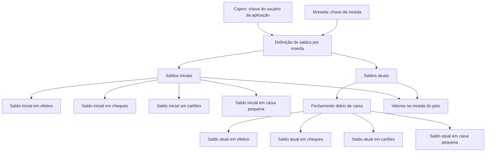
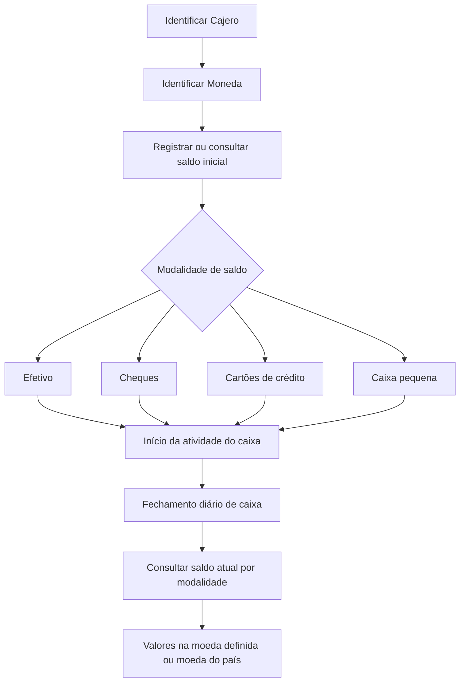

# Definição de Saldos Inicial e Atual do Caixa por Moeda

## 1. Metadados do Documento
- **Arquivo de Origem:** Não identificado
- **Tipo de Documento:** Especificação Técnica
- **Domínio / Sistema:** Soluções APIs — Zeus
- **Público-Alvo:** Desenvolvedores, Analistas Funcionais, Operação
- **Data/Versão Identificada:** Não identificada

---

## 2. Resumo Executivo & Contexto de Negócio

O documento define propriedades para identificar os saldos financeiros com os quais um caixa inicia a atividade e os saldos mantidos após cada fechamento diário de caixa. A definição é realizada por caixa e por moeda.

O conceito central é o controle de disponibilidade financeira por quatro modalidades: efetivo, cheques, cartões de crédito e caixa pequena. Para cada modalidade, o documento diferencia o valor inicial do valor atual.

Os saldos são registrados em dois escopos monetários: a moeda definida para o registro e a moeda do país. A propriedade **Cajero** identifica o usuário da aplicação associado aos saldos, enquanto a propriedade **Moneda** identifica a moeda em que os valores são expressos.

O documento não descreve operações de atualização, fórmulas de conversão monetária, regras de conciliação, APIs, métodos HTTP, persistência de dados ou validações de entrada. O único evento operacional explicitamente associado à atualização dos saldos atuais é o fechamento diário de caixa.

---

## 3. Arquitetura, Componentes & Tecnologias Envolvidas

Os elementos explicitamente citados são:

| Componente / Conceito | Descrição sustentada pelo documento |
| :--- | :--- |
| Soluções APIs | Elemento de navegação identificado no conteúdo bruto. |
| Documentação Zeus | Elemento de navegação identificado no conteúdo bruto. |
| Caixa (`Cajero`) | Usuário da aplicação identificado por uma chave; associado à definição dos saldos. |
| Moeda (`Moneda`) | Chave da moeda na qual os valores dos saldos são expressos. |
| Fechamento diário de caixa | Evento após o qual são referenciados os saldos atuais. |
| Efetivo | Modalidade de saldo controlada no início e após fechamento diário. |
| Cheques | Modalidade de saldo controlada no início e após fechamento diário. |
| Cartões de crédito | Modalidade de saldo controlada no início e após fechamento diário. |
| Caixa pequena | Modalidade de saldo controlada no início e após fechamento diário. |



**Nota de Análise:** O documento lista a navegação “Soluções APIs”, “Documentação” e “Zeus”, porém não detalha a arquitetura de software, os contratos de integração, os serviços, os bancos de dados ou as tecnologias utilizadas.

---

## 4. Regras de Negócio, Especificações Funcionais & Processos

1. A definição de saldo inicial tem como objetivo identificar o valor com o qual o caixa inicia sua atividade para cada moeda.
2. A propriedade **Cajero** contém a chave que identifica o usuário da aplicação.
3. A propriedade **Moneda** contém a chave da moeda em que os valores dos saldos são expressos.
4. O saldo inicial é controlado para quatro modalidades: efetivo, cheques, cartões de crédito e caixa pequena.
5. O saldo atual é controlado para as mesmas quatro modalidades: efetivo, cheques, cartões de crédito e caixa pequena.
6. Os saldos atuais representam os valores que o caixa possui após cada fechamento diário de caixa.
7. Há propriedades distintas para valores na moeda definida e para valores na moeda do país.
8. As propriedades na moeda do país abrangem saldos iniciais e atuais para efetivo, cheques, cartões de crédito e caixa pequena.

### Fluxo funcional identificado



**Nota de Análise:** O documento não especifica como os saldos iniciais são cadastrados, se podem ser alterados, quem possui autorização para fazê-lo, nem como os saldos atuais são calculados ou atualizados durante o fechamento diário.

---

## 5. Tabelas de Parâmetros, Ambientes e Estruturas de Dados

| Item / Parâmetro | Descrição / Função | Tipo / Valores / Formato | Ambiente / Observações |
| :--- | :--- | :--- | :--- |
| Cajero | Contém a chave com a qual o usuário da aplicação é identificado. | Chave de identificação; formato não informado. | Associado à definição de saldo. |
| Moneda | Chave da moeda na qual os valores dos saldos são expressos. | Chave de moeda; formato não informado. | Aplicável aos saldos definidos por moeda. |
| Saldo inicial em efetivo | Valor em efetivo com o qual o caixa inicia sua atividade na moeda que está sendo definida. | Valor monetário; formato não informado. | Saldo inicial por moeda. |
| Saldo inicial em cheques | Valor disponível em cheques com o qual o caixa inicia sua atividade na moeda que está sendo definida. | Valor monetário; formato não informado. | Saldo inicial por moeda. |
| Saldo inicial em cartões | Valor disponível em cartões de crédito com o qual o caixa inicia sua atividade na moeda que está sendo definida. | Valor monetário; formato não informado. | Saldo inicial por moeda. |
| Saldo inicial em caixa pequena | Valor disponível de caixa pequena com o qual o caixa inicia sua atividade na moeda que está sendo definida. | Valor monetário; formato não informado. | Saldo inicial por moeda. |
| Saldo atual em efetivo | Valor em efetivo que o caixa possui após cada fechamento diário de caixa, na moeda que está sendo definida. | Valor monetário; formato não informado. | Saldo atual por moeda. |
| Saldo atual em cheques | Valor disponível em cheques que o caixa possui após cada fechamento diário de caixa, na moeda que está sendo definida. | Valor monetário; formato não informado. | Saldo atual por moeda. |
| Saldo atual em cartões | Valor disponível em cartões de crédito que o caixa possui após cada fechamento diário de caixa, na moeda que está sendo definida. | Valor monetário; formato não informado. | Saldo atual por moeda. |
| Saldo atual em caixa pequena | Valor disponível de caixa pequena que o caixa possui após cada fechamento diário de caixa, na moeda que está sendo definida. | Valor monetário; formato não informado. | Saldo atual por moeda. |
| Saldo inicial em efetivo moeda país | Valor em efetivo com o qual o caixa inicia sua atividade na moeda do país. | Valor monetário; formato não informado. | Saldo inicial na moeda do país. |
| Saldo inicial em cheques moeda país | Valor disponível em cheques com o qual o caixa inicia sua atividade na moeda do país. | Valor monetário; formato não informado. | Saldo inicial na moeda do país. |
| Saldo inicial em cartões moeda país | Valor disponível em cartões de crédito com o qual o caixa inicia sua atividade na moeda do país. | Valor monetário; formato não informado. | Saldo inicial na moeda do país. |
| Saldo inicial em caixa pequena moeda país | Valor disponível de caixa pequena com o qual o caixa inicia sua atividade na moeda do país. | Valor monetário; formato não informado. | Saldo inicial na moeda do país. |
| Saldo atual em efetivo moeda país | Valor em efetivo que o caixa possui após cada fechamento diário de caixa, na moeda do país. | Valor monetário; formato não informado. | Saldo atual na moeda do país. |
| Saldo atual em cheques moeda país | Valor disponível em cheques que o caixa possui após cada fechamento diário de caixa, na moeda do país. | Valor monetário; formato não informado. | Saldo atual na moeda do país. |
| Saldo atual em cartões moeda país | Valor disponível em cartões de crédito que o caixa possui após cada fechamento diário de caixa, na moeda do país. | Valor monetário; formato não informado. | Saldo atual na moeda do país. |
| Saldo atual em caixa pequena moeda país | Valor disponível de caixa pequena que o caixa possui após cada fechamento diário de caixa, na moeda do país. | Valor monetário; formato não informado. | Saldo atual na moeda do país. |

---

## 6. Bateria de Perguntas & Respostas para RAG (FAQ Sintético)

### P1: Qual é o objetivo da definição de saldo inicial do caixa?
**R:** O objetivo é identificar o valor com o qual o caixa inicia sua atividade para cada moeda.

### P2: O que representa a propriedade Cajero?
**R:** A propriedade **Cajero** contém a chave que identifica o usuário da aplicação associado à definição dos saldos.

### P3: O que representa a propriedade Moneda?
**R:** A propriedade **Moneda** é a chave da moeda na qual os valores dos saldos são expressos.

### P4: Quais modalidades financeiras possuem saldo inicial controlado?
**R:** O documento define saldo inicial para efetivo, cheques, cartões de crédito e caixa pequena.

### P5: Quando o saldo atual em efetivo é aplicável?
**R:** O saldo atual em efetivo representa o valor em efetivo que o caixa possui após cada fechamento diário de caixa, na moeda que está sendo definida.

### P6: Qual é a diferença entre saldo inicial e saldo atual?
**R:** O saldo inicial corresponde ao valor disponível quando o caixa inicia sua atividade. O saldo atual corresponde ao valor disponível após cada fechamento diário de caixa.

### P7: O documento controla valores na moeda do país?
**R:** Sim. O documento prevê saldos iniciais e atuais na moeda do país para efetivo, cheques, cartões de crédito e caixa pequena.

### P8: Quais são os saldos iniciais disponíveis na moeda do país?
**R:** São definidos saldo inicial em efetivo moeda país, saldo inicial em cheques moeda país, saldo inicial em cartões moeda país e saldo inicial em caixa pequena moeda país.

### P9: Quais são os saldos atuais disponíveis na moeda do país?
**R:** São definidos saldo atual em efetivo moeda país, saldo atual em cheques moeda país, saldo atual em cartões moeda país e saldo atual em caixa pequena moeda país.

### P10: O documento especifica como calcular ou atualizar os saldos atuais?
**R:** Não. O documento apenas estabelece que os saldos atuais correspondem aos valores disponíveis após cada fechamento diário de caixa; não descreve fórmulas, transações, regras de cálculo ou mecanismos de atualização.

### P11: O documento especifica APIs ou contratos técnicos para consulta e atualização dos saldos?
**R:** Não. Embora o conteúdo mencione “Soluções APIs”, “Documentação” e “Zeus”, não são informados métodos HTTP, endpoints, contratos JSON, autenticação, versões ou integrações.

---

## 7. Glossário de Termos, Siglas & Conceitos-Chave

- **Cajero:** Propriedade que contém a chave de identificação do usuário da aplicação.
- **Moneda:** Propriedade que contém a chave da moeda em que os valores dos saldos são expressos.
- **Saldo inicial:** Valor disponível quando o caixa inicia sua atividade.
- **Saldo atual:** Valor disponível após cada fechamento diário de caixa.
- **Efetivo:** Modalidade de saldo referente a dinheiro em espécie.
- **Cheques:** Modalidade de saldo referente a valores disponíveis em cheques.
- **Cartões:** Modalidade de saldo referente a valores disponíveis em cartões de crédito.
- **Caixa pequena:** Modalidade de saldo referente ao valor disponível de caixa pequena.
- **Moeda do país:** Moeda nacional mencionada nas propriedades específicas de saldo inicial e saldo atual.
- **Zeus:** Termo presente na navegação do conteúdo bruto; o documento não detalha seu significado funcional ou técnico.

---

## 8. Notas Críticas, Riscos & Limitações

- O documento não identifica nome de arquivo, data, versão, autor ou responsável.
- O documento não informa o formato, a precisão, a moeda ISO, os limites ou as regras de validação dos valores monetários.
- O documento não especifica a relação entre a moeda definida na propriedade **Moneda** e a moeda do país.
- O documento não descreve conversão cambial, taxa de câmbio ou critérios de equivalência entre valores em moedas distintas.
- O documento não detalha o processo de fechamento diário de caixa, seus gatilhos, responsáveis ou efeitos transacionais.
- O documento não descreve permissões, trilhas de auditoria, tratamento de erros, integrações, persistência de dados, APIs ou contratos JSON.
- **Nota de Análise:** O documento lista propriedades de saldos iniciais e atuais, mas não detalha métodos de consulta, criação, alteração ou exclusão dessas informações.

---

## 9. Conteúdo Bruto Estruturado (Referência Fiel)

```text
--- [PÁGINA 1 DE 3] ---

EN CONSTRUCCIÓN
DEFINICIÓN de saldo inicial del cajero
Objetivo
Se trata de identificar el importe con el que inicia el cajero su actividad para cada moneda.
-Propiedades generales
Propiedades generales
Cajero
Esta propiedad contiene la clave con la que se identifica el usuario de la aplicación.
Moneda
Clave de la moneda en la que están expresados los importes de los saldos.
Saldo inicial en efectivo
Esta propiedad contiene el importe en efectivo con el que inicia el cajero su actividad, en la moneda
que se está definiendo.
Saldo inicial en cheques
Contiene el importe disponible en cheques con el que inicia el cajero su actividad, en la moneda que
se está definiendo.
 / 
 CF
Inicio Soluciones APIs Documentación Zeus
ES


--- [PÁGINA 2 DE 3] ---

Saldo inicial en tarjetas
En esta propiedad se registra el importe disponible en tarjetas de crédito con el que inicia el cajero su
actividad, en la moneda que se está definiendo.
Saldo inicial en caja chica
Contiene el importe disponible de caja chica con el que inicia el cajero su actividad, en la moneda
que se está definiendo.
Saldo actual en efectivo
Esta propiedad contiene el importe en efectivo que tiene el cajero después de cada cierre diario de
caja, en la moneda que se está definiendo.
Saldo actual en cheques
Contiene el importe disponible en cheques que tiene el cajero después de cada cierre diario de caja,
en la moneda que se está definiendo.
Saldo actual en tarjetas
En esta propiedad se registra el importe disponible en tarjetas de crédito que tiene el cajero después
de cada cierre diario de caja, en la moneda que se está definiendo.
Saldo actual en caja chica
Contiene el importe disponible de caja chica que tiene el cajero después de cada cierre diario de
caja, en la moneda que se está definiendo.
Saldo inicial en efectivo moneda país
Esta propiedad contiene el importe en efectivo con el que inicia el cajero su actividad, en la moneda
del país.
Saldo inicial en cheques moneda país
Contiene el importe disponible en cheques con el que inicia el cajero su actividad, en la moneda del
país.
Saldo inicial en tarjetas moneda país
En esta propiedad se registra el importe disponible en tarjetas de crédito con el que inicia el cajero su
actividad, en la moneda del país.
Saldo inicial en caja chica moneda país


--- [PÁGINA 3 DE 3] ---

Contiene el importe disponible de caja chica con el que inicia el cajero su actividad, en la moneda del
país.
Saldo actual en efectivo moneda país
Esta propiedad contiene el importe en efectivo que tiene el cajero después de cada cierre diario de
caja, en la moneda del país.
Saldo actual en cheques moneda país
Contiene el importe disponible en cheques que tiene el cajero después de cada cierre diario de caja,
en la moneda del país.
Saldo actual en tarjetas moneda país
En esta propiedad se registra el importe disponible en tarjetas de crédito que tiene el cajero después
de cada cierre diario de caja, en la moneda del país.
Saldo actual en caja chica moneda país
Contiene el importe disponible de caja chica que tiene el cajero después de cada cierre diario de
caja, en la moneda del país.
```
