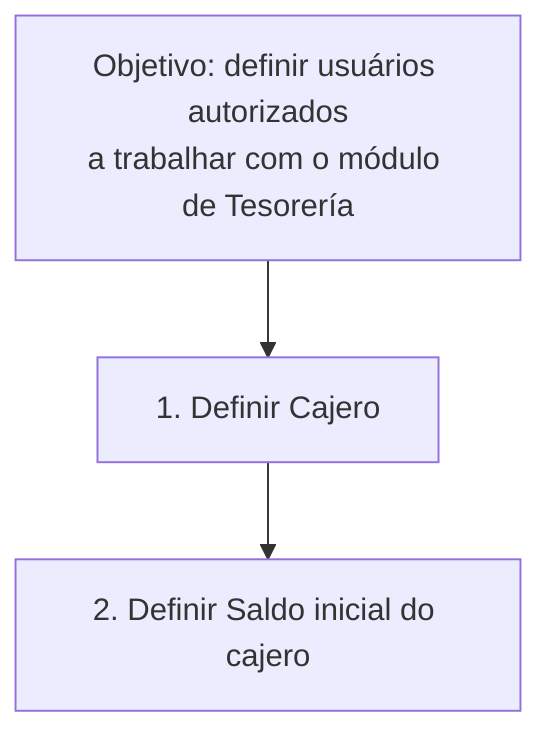

# Definição de Cajero para o Módulo de Tesorería

## 1. Metadados do Documento
- **Arquivo de Origem:** `Não identificado`
- **Tipo de Documento:** `Procedimento`
- **Domínio / Sistema:** `Módulo de Tesorería`
- **Público-Alvo:** `Usuários do sistema autorizados a trabalhar com o módulo de Tesorería`
- **Data/Versão Identificada:** `Não identificada`

---

## 2. Resumo Executivo & Contexto de Negócio

O conteúdo descreve o procedimento de definição de um **cajero** no contexto do módulo de **Tesorería**. O objetivo explicitamente informado é definir os usuários do sistema que podem trabalhar com esse módulo.

O procedimento apresenta duas etapas sequenciais: primeiro, definir o cajero; depois, definir o saldo inicial do cajero. A organização em etapas indica que o cadastro ou a definição do usuário deve preceder a configuração de seu saldo.

O documento não detalha telas, campos obrigatórios, perfis de acesso, regras de validação, valores monetários, métodos HTTP, integrações ou persistência de dados. Também não especifica o significado técnico das siglas e referências presentes no rodapé.

A referência a “Home Solutions APIs Documentation Zeus” e “EN” aparece no conteúdo extraído, mas não há contexto suficiente para afirmar uma relação arquitetural ou funcional com o procedimento de definição de cajero.

---

## 3. Arquitetura, Componentes & Tecnologias Envolvidas

Os elementos identificados são:

| Componente / Termo | Papel identificado |
| :--- | :--- |
| Módulo de Tesorería | Módulo no qual os usuários definidos como cajero podem trabalhar. |
| Cajero | Usuário do sistema a ser definido para atuação no módulo de Tesorería. |
| Saldo inicial do cajero | Configuração definida após a definição do cajero. |
| Home Solutions APIs Documentation Zeus | Referência textual presente no rodapé, sem função detalhada. |
| CF | Referência textual presente no rodapé, sem significado detalhado. |
| EN | Referência textual presente no rodapé, sem significado detalhado. |



> **Nota de Análise:** O documento não descreve arquitetura de software, integrações, tecnologias, APIs, bancos de dados, ambientes ou contratos de comunicação.

---

## 4. Regras de Negócio, Especificações Funcionais & Processos

### Objetivo funcional
- Definir os usuários do sistema que podem trabalhar com o módulo de Tesorería.

### Processo identificado
1. Executar a definição do **Cajero**.
2. Executar a definição do **Saldo inicial do cajero**.

### Restrições e dependências identificadas
- A estrutura apresentada posiciona a definição do cajero como etapa anterior à definição do saldo inicial.
- O conteúdo não informa se um cajero pode possuir mais de um saldo, se há moeda associada, limites de saldo, aprovação, auditoria ou data de vigência.
- O conteúdo não informa quais atributos identificam um cajero, como usuário, código, nome, filial, caixa, centro de custo ou perfil.
- O conteúdo não informa quais critérios autorizam ou bloqueiam um usuário no módulo de Tesorería.

---

## 5. Tabelas de Parâmetros, Ambientes e Estruturas de Dados

| Item / Parâmetro | Descrição / Função | Tipo / Valores / Formato | Ambiente / Observações |
| :--- | :--- | :--- | :--- |
| Cajero | Usuário do sistema que pode trabalhar com o módulo de Tesorería. | Não especificado. | Deve ser definido na etapa 1 do processo. |
| Saldo inicial do cajero | Saldo associado ao cajero após sua definição. | Não especificado. | Deve ser definido na etapa 2 do processo. |
| Módulo de Tesorería | Contexto funcional em que o cajero atua. | Módulo do sistema. | Não há detalhamento adicional. |
| CF | Texto presente no rodapé da extração. | Não especificado. | O documento não define a sigla. |
| Home Solutions APIs Documentation Zeus | Texto presente no rodapé da extração. | Não especificado. | Não há relação funcional ou técnica explicitada. |
| EN | Texto presente no rodapé da extração. | Não especificado. | O documento não define a sigla. |

---

## 6. Bateria de Perguntas & Respostas para RAG (FAQ Sintético)

### P1: Qual é o objetivo do procedimento de definição de cajero?
**R:** O objetivo é definir os usuários do sistema que podem trabalhar com o módulo de Tesorería.

### P2: Quais são as etapas do processo de definição de cajero?
**R:** O processo possui duas etapas: definir o Cajero e, em seguida, definir o Saldo inicial do cajero.

### P3: Qual etapa deve ser executada primeiro no processo apresentado?
**R:** A primeira etapa é a definição do Cajero. A definição do Saldo inicial do cajero é apresentada como a segunda etapa.

### P4: O que é um cajero no contexto do documento?
**R:** Um cajero é um usuário do sistema que pode trabalhar com o módulo de Tesorería. O documento não apresenta atributos adicionais, como identificação, perfil ou escopo organizacional.

### P5: O documento define como calcular o saldo inicial do cajero?
**R:** Não. O documento informa que o saldo inicial do cajero deve ser definido, mas não descreve cálculo, moeda, limites, origem do valor ou regras de validação.

### P6: O documento informa quais campos devem ser preenchidos para definir um cajero?
**R:** Não. O conteúdo apenas indica a etapa “DEFINIR Cajero”, sem listar campos, formatos, obrigatoriedades ou critérios de validação.

### P7: O documento descreve permissões ou perfis de acesso para o módulo de Tesorería?
**R:** Não. O documento informa que usuários do sistema podem trabalhar com o módulo de Tesorería após serem definidos como cajero, mas não detalha perfis, permissões ou matrizes de acesso.

### P8: Há integração com APIs descrita no procedimento?
**R:** Não. Embora o rodapé contenha o texto “Home Solutions APIs Documentation Zeus”, o documento não descreve APIs, endpoints, métodos HTTP, contratos JSON ou integrações.

### P9: O que significa a sigla CF presente no documento?
**R:** O significado de “CF” não é informado no conteúdo extraído. A sigla aparece apenas no rodapé.

### P10: O documento informa ambientes, URLs ou servidores do módulo de Tesorería?
**R:** Não. Não há URLs, nomes de servidores, ambientes, portas, credenciais ou rotas de log no conteúdo fornecido.

---

## 7. Glossário de Termos, Siglas & Conceitos-Chave

- **Cajero:** Usuário do sistema que pode trabalhar com o módulo de Tesorería.
- **Saldo inicial do cajero:** Saldo que deve ser definido após a definição do cajero.
- **Tesorería:** Módulo do sistema no qual os usuários definidos como cajero podem trabalhar.
- **CF:** Sigla presente no rodapé; significado não definido no documento.
- **EN:** Referência presente no rodapé; significado não definido no documento.
- **Zeus:** Termo presente em “Home Solutions APIs Documentation Zeus”; função não definida no documento.

---

## 8. Notas Críticas, Riscos & Limitações

- O documento contém apenas uma visão resumida do procedimento, sem detalhar campos, regras de validação, permissões ou exceções.
- Não há definição de como o saldo inicial do cajero é informado, calculado, aprovado ou alterado.
- Não há evidência de mecanismos de auditoria, segregação de funções, trilha de alterações ou aprovação para a definição de cajeros.
- As referências “CF”, “Home Solutions APIs Documentation Zeus” e “EN” não possuem explicação no conteúdo fornecido.
- Não há informações sobre integrações, APIs, ambiente técnico, logs, URLs, servidores ou versionamento.

---

## 9. Conteúdo Bruto Estruturado (Referência Fiel)

```text
--- [PÁGINA 1 DE 1] ---

DEFINICIÓN de cajero
Objetivo
Definición de los usuarios del sistema que pueden trabajar con el módulo de Tesorería.
Pasos a seguir
DEFINIR
Cajero
(1)
DEFINIR
Saldo cajero
(2)
1. DEFINIR Cajero
2. DEFINIR Saldo inicial cajero
 / 
 CF
Home Solutions APIs Documentation Zeus
EN
```
