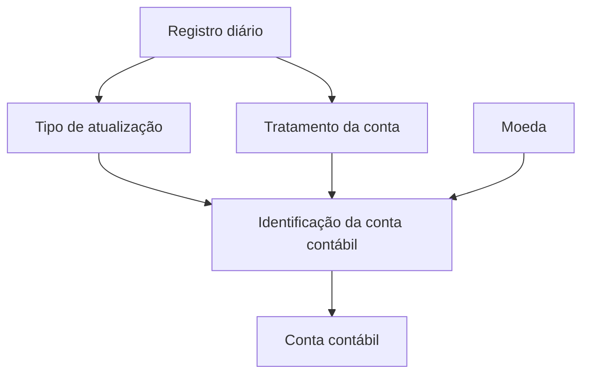

# Definição de Contas Contábeis por Tipo de Atualização de Registro Diário

## 1. Metadados do Documento
- **Arquivo de Origem:** `Não identificado`
- **Tipo de Documento:** Especificação Técnica
- **Domínio / Sistema:** Contas contábeis, registros diários e operações de tesouraria
- **Público-Alvo:** Desenvolvedores, Arquitetos, Operação e Negócio
- **Data/Versão Identificada:** Não identificada

---

## 2. Resumo Executivo & Contexto de Negócio

O documento define critérios para identificar contas contábeis conforme a operação aplicada a um registro diário. O objetivo declarado é associar a conta contábil adequada ao tipo de atualização executado no registro diário.

A classificação considera propriedades gerais da conta, especificamente o **tratamento da conta** e o **tipo de atualização**. O tratamento da conta pode assumir os valores Gerais (`T`) ou Vida (`V`).

O tipo de atualização é representado por códigos operacionais que abrangem anulações, cobranças, compensações, devoluções, pagamentos, recobros, retificações, transferências de tesouraria, descontos e ajustes de comissões.

O documento também identifica os campos-chave de moeda e conta contábil, mas não apresenta formatos técnicos, regras de validação, métodos HTTP, contratos de integração, ambientes ou detalhes de persistência.

---

## 3. Arquitetura, Componentes & Tecnologias Envolvidas

O conteúdo não descreve arquitetura de software, tecnologias, APIs, integrações, ambientes ou componentes técnicos. A referência textual a “Home Solutions APIs Documentation Zeus” aparece no conteúdo bruto, mas o documento não detalha seu papel, interfaces ou relações com a definição de contas contábeis.

O fluxo funcional identificável consiste na seleção de uma conta contábil a partir do tratamento da conta e do tipo de atualização do registro diário.



> **Nota de Análise:** O diagrama representa exclusivamente a relação funcional inferida do objetivo e das propriedades apresentadas. O documento não especifica sistemas responsáveis, fluxos de integração, banco de dados, APIs ou regras de decisão entre códigos e contas.

---

## 4. Regras de Negócio, Especificações Funcionais & Processos

### Objetivo funcional

A regra central é identificar as contas contábeis utilizadas de acordo com a operação do registro diário.

### Propriedades gerais da conta

A identificação da conta contábil considera as seguintes propriedades gerais:

1. **Tratamento da conta**
   - Define o tipo de tratamento aplicável à conta contábil.
   - Valores apresentados:
     - `(T) Generales`
     - `(V) Vida`

2. **Atualização**
   - Define o tipo de atualização aplicado ao registro diário.
   - Cada operação é identificada por uma chave de duas letras.

3. **Moeda**
   - Corresponde à chave da moeda.
   - O documento não define domínio de valores, padrão de código ou relação entre moeda e conta contábil.

4. **Conta contábil**
   - Corresponde à chave da conta contábil.
   - O documento não informa estrutura, tamanho, máscara, plano de contas ou critérios de unicidade.

### Tipos de atualização do registro diário

Os tipos de atualização apresentados são:

- `(AA)` Anulado descuento comisiones.
- `(AC)` Anulado de cobros.
- `(AD)` Anulado de devolución de prima.
- `(CA)` Cobros anticipados.
- `(CB)` Compensaciones.
- `(CG)` Cuentas de gestión.
- `(CT)` Cobros totales de recibos.
- `(CV)` Cobros varios.
- `(DC)` Descuento comisiones.
- `(DP)` Devolución de prima.
- `(MP)` Ajuste comisiones.
- `(PC)` Anticipo de comisiones.
- `(PS)` Pago de siniestros.
- `(PV)` Pagos varios.
- `(RC)` Recobro de siniestros.
- `(RR)` Rectificación recobro pago siniestros.
- `(RS)` Rectificación pagos siniestros.
- `(TT)` Traspasos de tesorería.

> **Nota de Análise:** O documento relaciona códigos de atualização a descrições operacionais, porém não explicita qual conta contábil deve ser utilizada para cada combinação de tratamento, atualização e moeda.

---

## 5. Tabelas de Parâmetros, Ambientes e Estruturas de Dados

| Item / Parâmetro | Descrição / Função | Tipo / Valores / Formato | Ambiente / Observações |
| :--- | :--- | :--- | :--- |
| Tratamento conta | Tipo de tratamento da conta contábil. | `(T) Generales`; `(V) Vida` | Não há ambiente informado. |
| Atualização | Tipo de atualização do registro diário. | Código de duas letras. | Não há regra de associação com conta contábil detalhada. |
| Moeda | Chave da moeda. | Não especificado. | Não há formato ou catálogo de moedas informado. |
| Conta contábil | Chave da conta contábil. | Não especificado. | Não há máscara, tamanho ou plano de contas informado. |

| Código de Atualização | Descrição apresentada no documento | Observações |
| :--- | :--- | :--- |
| `AA` | Anulado descuento comisiones | Anulação de desconto de comissões. |
| `AC` | Anulado de cobros | Anulação de cobranças. |
| `AD` | Anulado de devolución de prima | Anulação de devolução de prêmio. |
| `CA` | Cobros anticipados | Cobranças antecipadas. |
| `CB` | Compensaciones | Compensações. |
| `CG` | Cuentas de gestión | Contas de gestão. |
| `CT` | Cobros totales de recibos | Cobranças totais de recibos. |
| `CV` | Cobros varios | Cobranças diversas. |
| `DC` | Descuento comisiones | Desconto de comissões. |
| `DP` | Devolución de prima | Devolução de prêmio. |
| `MP` | Ajuste comisiones | Ajuste de comissões. |
| `PC` | Anticipo de comisiones | Adiantamento de comissões. |
| `PS` | Pago de siniestros | Pagamento de sinistros. |
| `PV` | Pagos varios | Pagamentos diversos. |
| `RC` | Recobro de siniestros | Recobro de sinistros. |
| `RR` | Rectificación recobro pago siniestros | Retificação de recobro de pagamento de sinistros. |
| `RS` | Rectificación pagos siniestros | Retificação de pagamentos de sinistros. |
| `TT` | Traspasos de tesorería | Transferências de tesouraria. |

---

## 6. Bateria de Perguntas & Respostas para RAG (FAQ Sintético)

### P1: Qual é o objetivo da definição de contas por tipo de atualização?
**R:** O objetivo é identificar as contas contábeis que devem ser utilizadas de acordo com a operação aplicada ao registro diário.

### P2: Quais propriedades gerais são apresentadas para uma conta contábil?
**R:** O documento apresenta o tratamento da conta, o tipo de atualização do registro diário, a moeda e a conta contábil como propriedades relacionadas à definição.

### P3: Quais são os valores possíveis para o tratamento da conta?
**R:** O tratamento da conta pode ser `(T) Generales` ou `(V) Vida`.

### P4: O que representa o campo Atualização?
**R:** O campo Atualização representa o tipo de atualização aplicado ao registro diário, identificado por códigos como `AA`, `CA`, `PS` e `TT`.

### P5: Qual código corresponde a cobranças antecipadas?
**R:** O código `CA` corresponde a **Cobros anticipados**.

### P6: Qual código deve ser consultado para pagamentos de sinistros?
**R:** O código `PS` corresponde a **Pago de siniestros**.

### P7: Quais códigos estão relacionados a retificações de operações de sinistros?
**R:** O código `RR` representa **Rectificación recobro pago siniestros**, enquanto o código `RS` representa **Rectificación pagos siniestros**.

### P8: Qual código identifica transferências de tesouraria?
**R:** O código `TT` identifica **Traspasos de tesorería**.

### P9: Quais operações de comissão são identificadas no documento?
**R:** As operações de comissão apresentadas são: `AA` para anulação de desconto de comissões, `DC` para desconto de comissões, `MP` para ajuste de comissões e `PC` para adiantamento de comissões.

### P10: O documento define o formato da chave de moeda?
**R:** Não. O documento informa apenas que Moeda é a chave da moeda, sem detalhar formato, tamanho, catálogo de valores ou regras de validação.

### P11: O documento especifica qual conta contábil corresponde a cada tipo de atualização?
**R:** Não. O documento lista tratamentos de conta, tipos de atualização, moeda e conta contábil, mas não fornece a matriz de mapeamento entre esses elementos.

### P12: Qual código corresponde à devolução de prêmio?
**R:** O código `DP` corresponde a **Devolución de prima**. O código `AD` corresponde à anulação de devolução de prêmio.

---

## 7. Glossário de Termos, Siglas & Conceitos-Chave

- **AA:** Anulado descuento comisiones.
- **AC:** Anulado de cobros.
- **AD:** Anulado de devolución de prima.
- **CA:** Cobros anticipados.
- **CB:** Compensaciones.
- **CG:** Cuentas de gestión.
- **CT:** Cobros totales de recibos.
- **CV:** Cobros varios.
- **DC:** Descuento comisiones.
- **DP:** Devolución de prima.
- **MP:** Ajuste comisiones.
- **PC:** Anticipo de comisiones.
- **PS:** Pago de siniestros.
- **PV:** Pagos varios.
- **RC:** Recobro de siniestros.
- **RR:** Rectificación recobro pago siniestros.
- **RS:** Rectificación pagos siniestros.
- **T:** Generales, valor de tratamento da conta.
- **TT:** Traspasos de tesorería.
- **V:** Vida, valor de tratamento da conta.
- **Conta contábil:** Chave da conta contábil utilizada conforme a operação do registro diário.
- **Moeda:** Chave da moeda.
- **Registro diário:** Registro cuja atualização determina a identificação da conta contábil.

---

## 8. Notas Críticas, Riscos & Limitações

- O documento não apresenta a matriz que associe tratamento de conta, tipo de atualização, moeda e conta contábil.
- Não há detalhamento de regras de precedência, validação, obrigatoriedade ou tratamento de combinações inválidas.
- Não há informações sobre APIs, métodos HTTP, contratos JSON, banco de dados, ambiente, logs, segurança ou mecanismos de auditoria.
- Não foram identificadas versões, datas, responsáveis, fluxos de aprovação ou dependências entre equipes.
- A referência a “Home Solutions APIs Documentation Zeus” não possui detalhamento adicional no conteúdo fornecido.
- O documento lista as operações de atualização, mas não descreve os efeitos contábeis de cada operação.

---

## 9. Conteúdo Bruto Estruturado (Referência Fiel)

```text
--- [PÁGINA 1 DE 2] ---

EN CONSTRUCCIÓN
DEFINICIÓN de cuentas por tipo de
actualización
Objetivo
Identificar las cuentas contables que se utilizarán según la operación del registro diario.
Propiedades generales
Propiedades generales
Tratamiento cuenta
Tipo de tratamiento de la cuenta contable.
(T)Generales
(V)Vida
Actualización
Tipo de actualización del registro diario.
(AA)Anulado descuento comisiones
(AC)Anulado de cobros
(AD)Anulado de devolución de prima
 /
 CF
Home Solutions APIs Documentation Zeus
EN


--- [PÁGINA 2 DE 2] ---

(CA)Cobros anticipados
(CB)Compensaciones
(CG)Cuentas de gestión
(CT)Cobros totales de recibos
(CV)Cobros varios
(DP)Devolución de prima
(PC)Anticipo de comisiones
(PS)Pago de siniestros
(PV)Pagos varios
(RC)Recobro de siniestros
(RR)Rectificación recobro pago siniestros
(RS)Rectificación pagos siniestros
(TT)Traspasos de tesorería
(DC)Descuento comisiones
(MP)Ajuste comisiones
Moneda
Clave de la moneda.
Cuenta contable
Clave de la cuenta contable.
```
