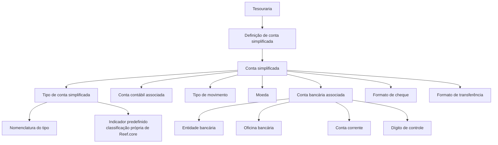

# Definição de Conta Simplificada — Classificação de Contas na Tesouraria

## 1. Metadados do Documento
- **Arquivo de Origem:** Não identificado no conteúdo fornecido
- **Tipo de Documento:** Especificação Técnica
- **Domínio / Sistema:** Tesouraria, Reef.core
- **Público-Alvo:** Desenvolvedores, Arquitetos, Operação e Negócio
- **Data/Versão Identificada:** Não identificada

---

## 2. Resumo Executivo & Contexto de Negócio

O documento define o conceito de **conta simplificada** no contexto de Tesouraria. O objetivo declarado é determinar a classificação utilizada na definição das contas que serão associadas a contas contábeis, com o propósito de simplificar a sua identificação.

A conta simplificada é identificada por uma chave e possui propriedades que descrevem o tipo da conta, sua nomenclatura, a associação com uma conta contábil, o tipo de movimento e informações bancárias relacionadas. O documento também prevê a indicação de que determinado tipo de conta simplificada é uma classificação própria de **Reef.core**.

A especificação contempla atributos aplicáveis a contas bancárias, incluindo moeda, entidade bancária, agência, conta corrente, dígitos de controle e formatos utilizados para cheque e transferência. Esses atributos permitem registrar informações associadas à conta bancária vinculada à conta simplificada.

O conteúdo fornecido não detalha métodos HTTP, contratos JSON, persistência de dados, integrações técnicas, regras de validação, permissões ou fluxos operacionais completos. A documentação concentra-se na finalidade da classificação e na descrição dos seus campos.

---

## 3. Arquitetura, Componentes & Tecnologias Envolvidas

### Componentes e conceitos identificados

| Componente / Conceito | Papel identificado no documento | Observações |
| :--- | :--- | :--- |
| Tesouraria | Contexto no qual a classificação de contas simplificadas é definida. | O documento informa que a definição é realizada “desde Tesorería”. |
| Conta simplificada | Conta identificada por uma chave e associada a uma conta contábil. | Utilizada para simplificar a identificação de contas. |
| Conta contábil | Conta à qual a conta simplificada é associada. | O documento não especifica plano de contas, estrutura ou regras de associação. |
| Tipo de conta simplificada | Identifica a categoria da conta simplificada. | Possui nomenclatura associada e indicação de predefinição. |
| Reef.core | Sistema ou domínio citado como proprietário de determinadas classificações. | Não há detalhamento técnico adicional sobre Reef.core. |
| Conta corrente | Conta bancária associada à conta simplificada. | Relacionada a entidade bancária, agência e dígito de controle. |
| Formato de cheque | Formato de cheque utilizado pela conta simplificada. | Identificado por uma chave. |
| Formato de transferência | Formato de transferência utilizado pela conta simplificada. | Identificado por uma chave. |



> **Nota de Análise:** O documento descreve relações funcionais entre conta simplificada, conta contábil e dados bancários, mas não detalha arquitetura de software, interfaces, APIs, bancos de dados, protocolos ou ambientes técnicos.

---

## 4. Regras de Negócio, Especificações Funcionais & Processos

### Objetivo funcional

A definição de conta simplificada deve determinar a classificação utilizada, a partir da Tesouraria, para as contas que serão associadas às contas contábeis. A finalidade declarada é simplificar a identificação dessas contas.

### Regras e propriedades identificadas

1. A **conta simplificada** deve possuir uma chave que a identifique.
2. A **conta simplificada** deve ser associada a uma **conta contábil**.
3. O **tipo de conta simplificada** identifica o tipo aplicável à conta simplificada.
4. O atributo **Nome** representa a nomenclatura associada ao tipo de conta simplificada.
5. O atributo **Predefinido** indica se o tipo de conta simplificada constitui uma classificação própria de **Reef.core**.
6. O atributo **Tipo de movimento** identifica o tipo de movimento associado à conta simplificada.
7. Os tipos de movimento listados são:
   - **(C) Caja**
   - **(B) Banco**
   - **(G) Gestión**
8. A **moeda** é identificada por uma chave.
9. A **entidade bancária** é identificada por uma chave e corresponde à entidade à qual pertence a conta corrente associada.
10. A **oficina** é identificada por uma chave e corresponde à agência bancária à qual pertence a conta corrente associada.
11. A **conta corrente** corresponde à conta bancária associada à conta simplificada.
12. O **dígito de controle** corresponde aos dígitos de verificação da conta bancária.
13. O **formato de cheque** é identificado pela chave do formato de cheque utilizado pela conta simplificada.
14. O **formato de transferência** é identificado pela chave do formato para transferências utilizado pela conta simplificada.

> **Nota de Análise:** O documento não apresenta critérios de obrigatoriedade, cardinalidade, validações de formato, regras de cálculo para dígitos de controle, comportamento para associações inexistentes ou condições específicas por tipo de movimento.

---

## 5. Tabelas de Parâmetros, Ambientes e Estruturas de Dados

| Item / Parâmetro | Descrição / Função | Tipo / Valores / Formato | Ambiente / Observações |
| :--- | :--- | :--- | :--- |
| Tipo conta simplificada | Identifica o tipo de conta simplificada. | Não especificado. | Propriedade geral. |
| Nome | Nomenclatura associada ao tipo de conta simplificada. | Não especificado. | Propriedade geral. |
| Conta simplificada | Chave que identifica a conta simplificada. | Chave; formato não especificado. | Associada a uma conta contábil. |
| Predefinido | Indica se o tipo de conta simplificada é uma classificação própria de Reef.core. | Indicador; valores não especificados. | Relacionado ao tipo de conta simplificada. |
| Conta contábil | Chave da conta contábil à qual a conta simplificada é associada. | Chave; formato não especificado. | Associação entre conta simplificada e conta contábil. |
| Tipo de movimento | Identifica o tipo de movimento. | `(C) Caja`, `(B) Banco`, `(G) Gestión`. | Não há regras adicionais para cada valor. |
| Moeda | Chave da moeda. | Chave; formato não especificado. | Não há lista de moedas no conteúdo. |
| Entidade bancária | Chave da entidade bancária à qual pertence a conta corrente associada. | Chave; formato não especificado. | Relacionada à conta corrente. |
| Oficina | Chave da oficina bancária à qual pertence a conta corrente associada. | Chave; formato não especificado. | “Oficina” é o termo utilizado no documento original. |
| Conta corrente | Conta bancária associada à conta simplificada. | Não especificado. | Relacionada à entidade bancária e à oficina. |
| Dígito de controle | Dígitos de verificação da conta bancária. | Dígitos; quantidade e algoritmo não especificados. | Associado à conta bancária. |
| Formato cheque | Chave do formato de cheque utilizado pela conta simplificada. | Chave; formato não especificado. | Não há catálogo de formatos fornecido. |
| Formato transferência | Chave do formato para transferências utilizado pela conta simplificada. | Chave; formato não especificado. | Não há catálogo de formatos fornecido. |

> **Nota de Análise:** O conteúdo não apresenta URLs, servidores, ambientes, variáveis de configuração, rotas de logs, credenciais, versões de software ou estruturas de payload.

---

## 6. Bateria de Perguntas & Respostas para RAG (FAQ Sintético)

### P1: Qual é o objetivo da definição de conta simplificada?
**R:** O objetivo é determinar, a partir da Tesouraria, a classificação utilizada para as contas que serão associadas a contas contábeis, simplificando a identificação dessas contas.

### P2: Como uma conta simplificada é identificada?
**R:** A conta simplificada é identificada por uma chave. O documento não informa o formato técnico, tamanho ou regras de composição dessa chave.

### P3: Qual é a relação entre conta simplificada e conta contábil?
**R:** A conta simplificada é associada a uma conta contábil. O campo “Conta contábil” corresponde à chave da conta contábil à qual a conta simplificada está associada.

### P4: O que identifica o campo Tipo conta simplificada?
**R:** O campo “Tipo conta simplificada” identifica o tipo aplicável à conta simplificada. O documento não apresenta uma lista de tipos possíveis.

### P5: Qual é a função do campo Nome no tipo de conta simplificada?
**R:** O campo “Nome” contém a nomenclatura associada ao tipo de conta simplificada.

### P6: O que significa o indicador Predefinido?
**R:** O indicador “Predefinido” informa se o tipo de conta simplificada é uma classificação própria de Reef.core. O documento não define os valores possíveis do indicador.

### P7: Quais tipos de movimento são listados para a conta simplificada?
**R:** O documento lista três tipos de movimento: `(C) Caja`, `(B) Banco` e `(G) Gestión`.

### P8: Quais dados bancários podem estar associados a uma conta simplificada?
**R:** Os dados bancários descritos são moeda, entidade bancária, oficina bancária, conta corrente e dígito de controle. A entidade e a oficina são identificadas por chaves, enquanto o dígito de controle contém os dígitos de verificação da conta bancária.

### P9: O que representa a entidade bancária?
**R:** A entidade bancária representa a entidade à qual pertence a conta corrente associada à conta simplificada. O documento informa que a entidade bancária é identificada por uma chave.

### P10: O que representa a oficina bancária?
**R:** A oficina representa a agência bancária à qual pertence a conta corrente associada. O documento informa que a oficina é identificada por uma chave.

### P11: Para que servem os formatos de cheque e transferência?
**R:** O formato de cheque corresponde à chave do formato de cheque utilizado pela conta simplificada. O formato de transferência corresponde à chave do formato para transferências utilizado pela conta simplificada.

### P12: O documento define como validar o dígito de controle da conta bancária?
**R:** Não. O documento somente informa que o dígito de controle corresponde aos dígitos de verificação da conta bancária; não especifica algoritmo, quantidade de dígitos ou regra de validação.

---

## 7. Glossário de Termos, Siglas & Conceitos-Chave

- **Conta simplificada:** Conta identificada por uma chave, utilizada para classificar contas associadas a contas contábeis e simplificar sua identificação.
- **Conta contábil:** Conta à qual a conta simplificada é associada.
- **Tipo conta simplificada:** Propriedade que identifica o tipo da conta simplificada.
- **Predefinido:** Indicador de que o tipo de conta simplificada é uma classificação própria de Reef.core.
- **Reef.core:** Sistema ou contexto citado como proprietário de classificações de tipos de conta simplificada; o documento não expande ou detalha o termo.
- **Tesouraria:** Contexto responsável pela definição da classificação das contas simplificadas.
- **Tipo de movimento:** Classificação do movimento com os valores `(C) Caja`, `(B) Banco` e `(G) Gestión`.
- **Caja:** Valor de tipo de movimento representado pela letra `C`.
- **Banco:** Valor de tipo de movimento representado pela letra `B`.
- **Gestión:** Valor de tipo de movimento representado pela letra `G`.
- **Moeda:** Elemento identificado por uma chave.
- **Entidade bancária:** Entidade à qual pertence a conta corrente associada.
- **Oficina:** Agência bancária à qual pertence a conta corrente associada.
- **Conta corrente:** Conta bancária associada à conta simplificada.
- **Dígito de controle:** Dígitos de verificação da conta bancária.
- **Formato cheque:** Chave do formato de cheque utilizado pela conta simplificada.
- **Formato transferência:** Chave do formato para transferências utilizado pela conta simplificada.
- **CF:** Sigla exibida na navegação do conteúdo; significado não detalhado no documento.

---

## 8. Notas Críticas, Riscos & Limitações

- O documento não identifica o arquivo de origem, data, versão, autor ou responsável pela especificação.
- O conteúdo não detalha arquitetura técnica, microsserviços, APIs, endpoints, métodos HTTP, contratos de integração ou persistência de dados.
- Não são informados formatos, tamanhos, domínios de valores ou regras de obrigatoriedade para as chaves de conta simplificada, conta contábil, moeda, entidade bancária, oficina e formatos de pagamento.
- O documento não especifica regras de validação para conta corrente nem algoritmo para validação do dígito de controle.
- Não há detalhamento semântico adicional para os tipos de movimento `(C) Caja`, `(B) Banco` e `(G) Gestión`.
- Não são apresentadas permissões, matrizes de acesso, trilhas de auditoria, tratamento de erros ou procedimentos operacionais.
- A expressão **“Oficina”** foi mantida por fidelidade ao conteúdo original; o documento a relaciona à oficina/agência bancária.
- A sigla **CF** aparece no conteúdo extraído, mas não possui definição no texto fornecido.

---

## 9. Conteúdo Bruto Estruturado (Referência Fiel)

```text
--- [PÁGINA 1 DE 2] ---

EN CONSTRUCCIÓN
DEFINICIÓN de cuenta simplificada
Objetivo
Determinar la clasificación que se utilizará en la definición, desde Tesorería, de las cuentas que se
asociarán a las cuentas contables para simplificar su identificación.
Propiedades generales
Propiedades generales
Tipo cuenta simplificada
Identifica el tipo de cuenta simplificada.
Nombre
Nomenclatura asociada al tipo de cuenta simplificada.
Cuenta simplificada
Clave que identifica la cuenta simplificada.
Predefinido
Indica si el tipo de cuenta simplificada es una clasificación propia de Reef.core.
 / 
 CF
Inicio Soluciones APIs Documentación Zeus
ES


--- [PÁGINA 2 DE 2] ---

Cuenta contable
Clave de la cuenta contable a la que se asocia le cuenta simplificada.
Tipo de movimiento
Identifica el tipo de movimiento.
(C)Caja
(B)Banco
(G)Gestión
Moneda
Clave de la moneda.
Entidad bancaria
Clave de la entidad bancaria a la que pertenece la cuenta corriente asociada.
Oficina
Clave de la oficina bancaria a la que pertenece la cuenta corriente asociada.
Cuenta corriente
Cuenta bancaria asociada a la cuenta simplificada.
Dígito de control
Dígitos de verificación de la cuenta bancaria.
Formato cheque
Clave del formato de cheque utilizado por la cuenta simplificada.
Formato transferencia
Clave del formato para transferencias utilizado por la cuenta simplificada.
```
