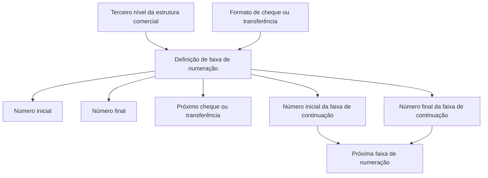

# Definição de Faixas de Numeração para Cheques e Transferências

## 1. Metadados do Documento
- **Arquivo de Origem:** Não identificado
- **Tipo de Documento:** Procedimento
- **Domínio / Sistema:** Estrutura comercial; controle de cheques e transferências
- **Público-Alvo:** Negócio, Operação e equipes responsáveis pela configuração de estruturas comerciais
- **Data/Versão Identificada:** Não identificada

---

## 2. Resumo Executivo & Contexto de Negócio

O documento descreve a definição de faixas de numeração para cheques e transferências. O objetivo declarado é estabelecer os intervalos numéricos desses instrumentos para permitir seu controle conforme a estrutura comercial e os formatos definidos.

A configuração da faixa é associada ao terceiro nível da estrutura comercial. Esse nível identifica a estrutura específica para a qual a numeração de cheques ou transferências será determinada.

O processo considera o formato de cheque ou transferência e os limites inicial e final da faixa numérica. Também são previstos campos para continuidade de faixa, indicando os números inicial e final do próximo intervalo.

O documento informa ainda um campo para identificar o próximo cheque ou transferência a utilizar. Não há detalhamento sobre validações, persistência de dados, APIs, métodos HTTP, contratos JSON, responsáveis operacionais ou tratamento de exceções.

---

## 3. Arquitetura, Componentes & Tecnologias Envolvidas

Os elementos identificados no conteúdo são:

- **Estrutura comercial:** contexto organizacional para o qual a faixa de numeração é definida.
- **Terceiro nível da estrutura comercial:** identificador da estrutura comercial alvo da configuração.
- **Formato:** identifica o formato de cheque ou transferência ao qual a faixa se aplica.
- **Faixa de numeração:** intervalo delimitado por número inicial e número final.
- **Faixa de continuação:** próximo intervalo numérico, definido por número inicial e número final de continuação.
- **Próximo cheque ou transferência:** número identificado para utilização subsequente.



> **Nota de Análise:** O documento não descreve sistemas, microsserviços, bancos de dados, interfaces, integrações, tecnologias ou ambientes técnicos.

---

## 4. Regras de Negócio, Especificações Funcionais & Processos

1. A definição de faixas de numeração aplica-se a **cheques e transferências**.
2. A finalidade da faixa de numeração é permitir o **controle** de cheques e transferências.
3. A faixa deve ser definida por **estrutura comercial**, considerando os diferentes formatos estabelecidos.
4. O **terceiro nível da estrutura comercial** identifica a estrutura comercial para a qual a faixa de numeração será determinada.
5. O campo **Formato** identifica o formato de cheque ou transferência para o qual a faixa será estabelecida.
6. O campo **Número inicial** identifica o número de início da faixa de numeração.
7. O campo **Número final** determina o número de encerramento da faixa de numeração.
8. O campo **Número inicial da faixa de continuação** informa o número de início do intervalo seguinte.
9. O campo **Número final da faixa de continuação** informa o número de encerramento do intervalo seguinte.
10. O campo **Próximo cheque ou transferência** identifica o número de cheque ou transferência a utilizar.

> **Nota de Análise:** O conteúdo não define critérios de sobreposição entre faixas, obrigatoriedade de campos, regras de incremento, tratamento para esgotamento de faixa, aprovação da configuração ou comportamento para numeração inválida.

---

## 5. Tabelas de Parâmetros, Ambientes e Estruturas de Dados

| Item / Parâmetro | Descrição / Função | Tipo / Valores / Formato | Ambiente / Observações |
| :--- | :--- | :--- | :--- |
| Terceiro nível da estrutura comercial | Identifica a estrutura comercial para a qual é determinada a faixa de numeração. | Não especificado | Propriedade geral. |
| Formato | Identifica o formato de cheque ou transferência para o qual a faixa é estabelecida. | Cheque ou transferência; formato não detalhado | Propriedade geral. |
| Número inicial | Identifica o número com o qual começa a faixa de numeração. | Número; formato não especificado | Limite inicial da faixa. |
| Número final | Determina o número com o qual termina a faixa de numeração. | Número; formato não especificado | Limite final da faixa. |
| Número inicial da faixa de continuação | Indica o número com o qual se inicia a próxima faixa. | Número; formato não especificado | Continuidade de numeração. |
| Número final da faixa de continuação | Indica o número com o qual termina a próxima faixa. | Número; formato não especificado | Continuidade de numeração. |
| Próximo cheque ou transferência | Identifica o número de cheque ou transferência a utilizar. | Número; formato não especificado | Campo operacional de utilização. |
| CF | Termo apresentado no conteúdo bruto sem explicação adicional. | Não especificado | Não é possível expandir a sigla com base no documento. |
| Início Soluções APIs Documentação Zeus | Texto de navegação apresentado no conteúdo bruto. | Não especificado | Não há explicação sobre a relação desses termos com a funcionalidade. |

---

## 6. Bateria de Perguntas & Respostas para RAG (FAQ Sintético)

### P1: Qual é o objetivo da definição de faixas de numeração de cheques e transferências?
**R:** O objetivo é estabelecer a faixa de numeração de cheques e transferências para permitir o controle desses instrumentos por estrutura comercial, considerando os diferentes formatos estabelecidos.

### P2: Qual elemento identifica a estrutura comercial para a qual a faixa numérica é configurada?
**R:** O terceiro nível da estrutura comercial identifica a estrutura comercial para a qual a faixa de numeração de cheques ou transferências é determinada.

### P3: Para que serve o campo Formato?
**R:** O campo Formato identifica o formato de cheque ou transferência para o qual a faixa de numeração será estabelecida.

### P4: O que representa o Número inicial em uma faixa de numeração?
**R:** O Número inicial identifica o número com o qual começa a faixa de numeração de cheques ou transferências.

### P5: O que determina o Número final?
**R:** O Número final determina o número com o qual finaliza a faixa de numeração de cheques ou transferências.

### P6: Qual é a finalidade do Número inicial da faixa de continuação?
**R:** O Número inicial da faixa de continuação indica o número com o qual se inicia a próxima faixa de numeração.

### P7: Qual é a finalidade do Número final da faixa de continuação?
**R:** O Número final da faixa de continuação indica o número com o qual finaliza a próxima faixa de numeração.

### P8: O que o campo Próximo cheque ou transferência identifica?
**R:** O campo Próximo cheque ou transferência identifica o número de cheque ou transferência que deve ser utilizado.

### P9: O documento especifica como evitar sobreposição entre faixas de numeração?
**R:** Não. O documento descreve os campos de início, fim e continuação das faixas, mas não apresenta regras de validação para evitar sobreposição entre intervalos numéricos.

### P10: O documento detalha APIs ou contratos técnicos para configurar as faixas?
**R:** Não. O conteúdo não apresenta métodos HTTP, endpoints, contratos JSON, integrações, bancos de dados ou tecnologias utilizadas para implementar a configuração.

---

## 7. Glossário de Termos, Siglas & Conceitos-Chave

- **Estrutura comercial:** Estrutura identificada no documento como o contexto para determinação da faixa de numeração.
- **Terceiro nível da estrutura comercial:** Nível que identifica a estrutura comercial para a qual a faixa de numeração é determinada.
- **Formato:** Identificador do formato de cheque ou transferência ao qual uma faixa de numeração é aplicada.
- **Faixa de numeração:** Intervalo numérico definido por um número inicial e um número final.
- **Faixa de continuação:** Intervalo subsequente definido por número inicial e número final de continuação.
- **Próximo cheque ou transferência:** Número identificado como o próximo a ser utilizado.
- **CF:** Sigla ou texto apresentado sem definição no documento.
- **Zeus:** Termo apresentado na navegação do conteúdo bruto, sem explicação funcional adicional.

---

## 8. Notas Críticas, Riscos & Limitações

- O documento apresenta a marcação **“EN CONSTRUCCIÓN”**, indicando que o conteúdo pode estar em elaboração.
- Não há identificação de arquivo, versão, data, autor, área responsável ou ambiente.
- Não são especificadas regras para impedir faixas sobrepostas, invertidas ou inválidas.
- Não há definição do comportamento quando a faixa atual se encerra.
- Não há detalhamento sobre como o campo **Próximo cheque ou transferência** é atualizado.
- O documento não esclarece o significado de **CF**, **Zeus**, **Início**, **Soluções**, **APIs** ou **Documentação** no contexto funcional.
- Não existem detalhes de implementação, integrações, segurança, auditoria, permissões ou trilhas de log.

---

## 9. Conteúdo Bruto Estruturado (Referência Fiel)

```text
--- [PÁGINA 1 DE 2] ---

EN CONSTRUCCIÓN
DEFINICIÓN de rangos de numeración de
cheques y transferencias
Objetivo
Establecer el rango de numeración de cheques y transferencias, para el control de los mismos, por
estructura comercial, según los distintos formatos establecidos.
Propiedades generales
Propiedades generales
Tercer nivel de la estructura comercial
Identifica la estructura comercial para la que se determina el rango de numeración.
Formato
Identifica el formato de cheque o transferencia para la que se establece el rango de numeración.
Número inicial
Identifica el número con el que comienza el rango de numeración.
Número final
 / 
 CF
Inicio Soluciones APIs Documentación Zeus
ES


--- [PÁGINA 2 DE 2] ---

Determina el número con el que finaliza el rango de numeración.
Número inicial rango continuación
Número con el que inicia el siguiente rango.
Número final rango continuación
Número con el que finaliza el siguiente rango.
Próximo cheque o transferencia
Identifica el número de cheque o transferencia a utilizar.
```
