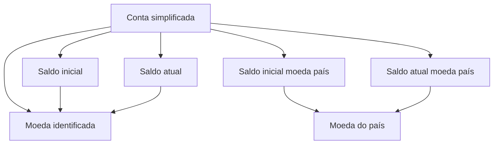

# Definição de Saldos de Contas Simplificadas

## 1. Metadados do Documento
- **Arquivo de Origem:** Não identificado
- **Tipo de Documento:** Especificação Técnica
- **Domínio / Sistema:** Contas simplificadas e saldos por moeda
- **Público-Alvo:** Desenvolvedores, Arquitetos, Negócio
- **Data/Versão Identificada:** Não identificada

---

## 2. Resumo Executivo & Contexto de Negócio

O documento descreve a definição de saldos de contas simplificadas. O objetivo declarado é determinar os valores iniciais dessas contas nas diferentes moedas com as quais a companhia trabalha.

A especificação apresenta propriedades de uma conta simplificada, incluindo a chave identificadora da conta, a moeda dos valores monetários e quatro propriedades de saldo. As propriedades distinguem saldo atual e saldo inicial, tanto na moeda identificada quanto na moeda do país.

O conteúdo estabelece que o saldo atual é atualizado após cada atualização da conta, enquanto o saldo inicial representa o valor com que a conta é iniciada. A separação entre moeda identificada e moeda do país permite representar o saldo sob duas referências monetárias explicitamente citadas no documento.

O documento não detalha processos de atualização, fórmulas de conversão, regras de arredondamento, contratos de API, persistência de dados ou critérios de validação das propriedades.

---

## 3. Arquitetura, Componentes & Tecnologias Envolvidas

Os elementos funcionais identificados são:

- **Conta simplificada:** entidade cuja chave é registrada pela propriedade de conta simplificada.
- **Moeda:** chave da moeda na qual os valores dos saldos são expressos.
- **Saldo atual:** valor do saldo após cada atualização, na moeda identificada.
- **Saldo inicial:** valor de abertura da conta, na moeda identificada.
- **Saldo atual moeda país:** valor do saldo após cada atualização, na moeda do país.
- **Saldo inicial moeda país:** valor de abertura da conta, na moeda do país.



> **Nota de Análise:** O documento não apresenta tecnologias, microsserviços, bancos de dados, métodos HTTP, contratos JSON, ambientes ou mecanismos de integração.

---

## 4. Regras de Negócio, Especificações Funcionais & Processos

1. O objetivo das contas simplificadas é determinar os importes iniciais em diferentes moedas utilizadas pela companhia.
2. A propriedade **Conta simplificada** corresponde à chave da conta simplificada.
3. A propriedade **Moeda** corresponde à chave da moeda na qual os valores dos saldos são expressos.
4. A propriedade **Saldo atual** contém o valor do saldo da conta após cada atualização, na moeda identificada.
5. A propriedade **Saldo inicial** contém o valor com que a conta é iniciada, na moeda identificada.
6. A propriedade **Saldo atual moeda país** contém o valor do saldo da conta após cada atualização, na moeda do país.
7. A propriedade **Saldo inicial moeda país** contém o valor com que a conta é iniciada, na moeda do país.

> **Nota de Análise:** O documento não define quais eventos constituem uma atualização, nem descreve como os valores de saldo atual são calculados ou como as moedas são relacionadas.

---

## 5. Tabelas de Parâmetros, Ambientes e Estruturas de Dados

| Item / Parâmetro | Descrição / Função | Tipo / Valores / Formato | Ambiente / Observações |
| :--- | :--- | :--- | :--- |
| Conta simplificada | Chave da conta simplificada. | Não especificado. | Identificador da conta. |
| Moeda | Chave da moeda em que os valores dos saldos são expressos. | Não especificado. | Referência para saldo inicial e saldo atual. |
| Saldo atual | Valor do saldo da conta após cada atualização. | Importe monetário; formato não especificado. | Expresso na moeda identificada. |
| Saldo inicial | Valor com que a conta é iniciada. | Importe monetário; formato não especificado. | Expresso na moeda identificada. |
| Saldo atual moeda país | Valor do saldo da conta após cada atualização. | Importe monetário; formato não especificado. | Expresso na moeda do país. |
| Saldo inicial moeda país | Valor com que a conta é iniciada. | Importe monetário; formato não especificado. | Expresso na moeda do país. |

---

## 6. Bateria de Perguntas & Respostas para RAG (FAQ Sintético)

### P1: Qual é o objetivo da definição de saldos de contas simplificadas?
**R:** O objetivo é determinar os importes iniciais das contas simplificadas para as diferentes moedas com as quais a companhia trabalha.

### P2: O que identifica uma conta simplificada?
**R:** A propriedade **Conta simplificada** contém a chave da conta simplificada.

### P3: O que representa a propriedade Moeda?
**R:** A propriedade **Moeda** contém a chave da moeda na qual os importes dos saldos são expressos.

### P4: Quando o saldo atual de uma conta simplificada é registrado?
**R:** O saldo atual contém o importe do saldo da conta depois de cada atualização, na moeda identificada.

### P5: Qual é a diferença entre saldo inicial e saldo atual?
**R:** O saldo inicial é o importe com que a conta é iniciada. O saldo atual é o importe do saldo da conta após cada atualização.

### P6: Em qual moeda o saldo inicial é expresso?
**R:** O saldo inicial é expresso na moeda identificada pela propriedade Moeda.

### P7: O que é o saldo atual em moeda país?
**R:** É o importe do saldo da conta depois de cada atualização, expresso na moeda do país.

### P8: O que é o saldo inicial em moeda país?
**R:** É o importe com que a conta é iniciada, expresso na moeda do país.

### P9: O documento define como converter valores entre a moeda identificada e a moeda do país?
**R:** Não. O documento menciona saldos na moeda identificada e na moeda do país, mas não descreve taxas de câmbio, regras de conversão ou critérios de cálculo.

### P10: O documento detalha APIs ou contratos de integração para contas simplificadas?
**R:** Não. O conteúdo apresentado descreve propriedades gerais, mas não detalha métodos HTTP, endpoints, contratos JSON, integrações ou tecnologias.

---

## 7. Glossário de Termos, Siglas & Conceitos-Chave

- **Conta simplificada:** Conta identificada por uma chave e associada a propriedades de saldos.
- **Moeda:** Chave da moeda em que determinados importes de saldo são expressos.
- **Saldo atual:** Importe do saldo após cada atualização, na moeda identificada.
- **Saldo inicial:** Importe com o qual a conta é iniciada, na moeda identificada.
- **Saldo atual moeda país:** Importe do saldo após cada atualização, na moeda do país.
- **Saldo inicial moeda país:** Importe com o qual a conta é iniciada, na moeda do país.
- **Importe:** Valor monetário referido pelas propriedades de saldo.

---

## 8. Notas Críticas, Riscos & Limitações

- O documento não identifica o arquivo de origem, versão ou data de publicação.
- Não há detalhamento sobre tipos de dados, precisão decimal, regras de arredondamento ou validações monetárias.
- Não são descritas regras de conversão entre a moeda identificada e a moeda do país.
- Não são especificados eventos, operações ou processos que acionam atualizações de saldo.
- Não há informações sobre persistência, auditoria, segurança, integrações, URLs, ambientes ou logs.
- Não são apresentados contratos de API, métodos HTTP ou estruturas JSON.

---

## 9. Conteúdo Bruto Estruturado (Referência Fiel)

```text
--- [PÁGINA 1 DE 2] ---

EN CONSTRUCCIÓN
DEFINICIÓN de saldos de cuentas
simplificadas
Objetivo
Determinar los importes iniciales de las cuentas simplificadas por las distintas monedas con las que
trabaja la compañía.
Propiedades generales
Propiedades generales
Cuenta simplificada
Clave de la cuenta simplificada.
Moneda
Clave de la moneda en la que están expresados los importes de los saldos.
Saldo actual
Esta propiedad contiene el importe del saldo de la cuenta después de cada actualización, en la
moneda identificada.
Saldo inicial
 / 
 CF
Inicio Soluciones APIs Documentación Zeus
ES


--- [PÁGINA 2 DE 2] ---

Esta propiedad contiene el importe del saldo con el que inicia la cuenta, en la moneda identificada.
Saldo actual moneda país
Esta propiedad contiene el importe del saldo de la cuenta después de cada actualización, en la
moneda del país.
Saldo inicial moneda país
Esta propiedad contiene el importe del saldo con el que inicia la cuenta, en la moneda del país.
```
