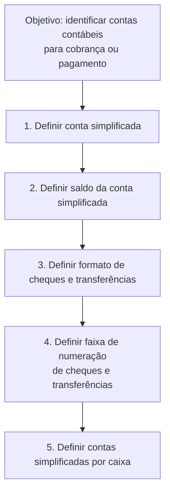

# Definição de Contas Simplificadas

## 1. Metadados do Documento
- **Arquivo de Origem:** Não identificado
- **Tipo de Documento:** Procedimento
- **Domínio / Sistema:** Contas simplificadas; operações de cobrança ou pagamento
- **Público-Alvo:** Operação, negócio e equipes responsáveis por parametrização contábil
- **Data/Versão Identificada:** Não identificada

---

## 2. Resumo Executivo & Contexto de Negócio

O documento descreve a definição de contas simplificadas utilizadas para realizar operações de cobrança ou pagamento. O objetivo explicitamente declarado é definir as chaves que identificam as contas contábeis aplicáveis a essas operações.

O procedimento é organizado em cinco etapas sequenciais de configuração. As etapas abrangem a definição da conta simplificada, o saldo da conta simplificada, o formato de cheques e transferências, a faixa de numeração de cheques e transferências e as contas simplificadas por caixa.

O conteúdo disponibilizado apresenta somente os títulos das etapas, sem detalhar telas, regras de preenchimento, valores permitidos, responsáveis, dependências técnicas ou critérios de validação. Portanto, o documento serve como referência de alto nível para a estrutura do processo de definição de contas simplificadas.

---

## 3. Arquitetura, Componentes & Tecnologias Envolvidas

Os componentes funcionais identificados são:

- **Cuenta simplificada:** conta simplificada a ser definida.
- **Saldo de cuenta simplificada:** saldo associado à conta simplificada.
- **Formato de cheques y transferencias:** formato aplicável a cheques e transferências.
- **Rango numeración de cheques y transferencias:** faixa de numeração para cheques e transferências.
- **Cuentas simplificadas por cajero:** associação de contas simplificadas por caixa.

Não há tecnologias, microsserviços, integrações, ambientes, URLs operacionais, protocolos ou contratos técnicos detalhados no conteúdo fornecido.



---

## 4. Regras de Negócio, Especificações Funcionais & Processos

### Objetivo funcional

As chaves devem identificar as contas contábeis usadas para executar uma operação de cobrança ou pagamento.

### Processo apresentado

1. **Definir conta simplificada:** o documento indica que uma conta simplificada deve ser definida.
2. **Definir saldo de conta simplificada:** o documento indica a definição do saldo relacionado à conta simplificada.
3. **Definir formato de cheques e transferências:** o documento indica a configuração do formato para cheques e transferências.
4. **Definir faixa de numeração de cheques e transferências:** o documento indica a definição de uma faixa de numeração para esses instrumentos.
5. **Definir contas simplificadas por caixa:** o documento indica a definição ou associação de contas simplificadas por caixa.

> **Nota de Análise:** O documento não detalha campos obrigatórios, regras de cálculo de saldo, formatos aceitos, limites das faixas numéricas, comportamento em caso de conflito ou o significado operacional de “cajero”.

---

## 5. Tabelas de Parâmetros, Ambientes e Estruturas de Dados

| Item / Parâmetro | Descrição / Função | Tipo / Valores / Formato | Ambiente / Observações |
| :--- | :--- | :--- | :--- |
| Chaves de contas contábeis | Identificam as contas contábeis utilizadas em operações de cobrança ou pagamento | Não especificado | Objetivo central do procedimento |
| Conta simplificada | Conta que deve ser definida na primeira etapa | Não especificado | Sem campos ou critérios descritos |
| Saldo de conta simplificada | Saldo associado à conta simplificada | Não especificado | Sem regra de cálculo ou atualização descrita |
| Formato de cheques e transferências | Formato aplicável a cheques e transferências | Não especificado | Sem modelos, layouts ou valores permitidos |
| Faixa de numeração de cheques e transferências | Intervalo de numeração para cheques e transferências | Não especificado | Sem início, fim, unicidade ou regras de controle |
| Contas simplificadas por caixa | Contas simplificadas relacionadas a um caixa | Não especificado | O termo “cajero” aparece no original; não há detalhamento adicional |

---

## 6. Bateria de Perguntas & Respostas para RAG (FAQ Sintético)

### P1: Qual é o objetivo da definição de contas simplificadas?
**R:** O objetivo é definir as chaves que identificam as contas contábeis utilizadas para realizar uma operação de cobrança ou pagamento.

### P2: Quais operações usam as contas contábeis identificadas pelas chaves?
**R:** O documento informa que as contas contábeis identificadas pelas chaves são usadas em operações de cobrança ou pagamento.

### P3: Quantas etapas o processo de definição de contas simplificadas possui?
**R:** O processo possui cinco etapas: definir a conta simplificada, definir o saldo da conta simplificada, definir o formato de cheques e transferências, definir a faixa de numeração de cheques e transferências e definir contas simplificadas por caixa.

### P4: Qual é a primeira etapa do procedimento?
**R:** A primeira etapa é **“DEFINIR Cuenta simplificada”**, isto é, definir a conta simplificada.

### P5: O documento explica como calcular o saldo de uma conta simplificada?
**R:** Não. O documento apenas lista a etapa **“DEFINIR Saldo de cuenta simplificada”**; não descreve fórmulas, eventos de atualização, fontes de dados ou regras de cálculo.

### P6: O que deve ser definido para cheques e transferências?
**R:** O documento indica duas definições relacionadas a cheques e transferências: o formato de cheques e transferências e a faixa de numeração de cheques e transferências.

### P7: O documento especifica quais formatos de cheque ou transferência são aceitos?
**R:** Não. O conteúdo apenas apresenta a etapa **“DEFINIR Formato de cheques y transferencias”**, sem listar formatos, layouts, padrões ou valores permitidos.

### P8: A faixa de numeração de cheques e transferências possui limites documentados?
**R:** Não. O documento menciona a definição de uma faixa de numeração, mas não informa números iniciais, finais, regras de reserva, validação ou tratamento de duplicidade.

### P9: O que significa definir contas simplificadas por caixa?
**R:** O documento apresenta **“DEFINIR Cuentas simplificadas por cajero”** como a quinta etapa. Contudo, não detalha a estrutura da associação, os atributos do caixa ou os critérios de vinculação.

### P10: O documento fornece detalhes técnicos de APIs, integrações ou bancos de dados?
**R:** Não. Apesar de o texto apresentar referências de navegação como “Home Solutions APIs Documentation Zeus”, não há especificação de API, endpoint, método HTTP, contrato, banco de dados ou integração técnica.

---

## 7. Glossário de Termos, Siglas & Conceitos-Chave

- **Conta simplificada / Cuenta simplificada:** entidade cuja definição constitui a primeira etapa do procedimento.
- **Conta contábil / Cuenta contable:** conta identificada por chaves para uso em operações de cobrança ou pagamento.
- **Cobrança / Cobro:** tipo de operação mencionado como contexto de uso das contas contábeis.
- **Pagamento / Pago:** tipo de operação mencionado como contexto de uso das contas contábeis.
- **Saldo de conta simplificada / Saldo de cuenta simplificada:** saldo relacionado à conta simplificada; o documento não define seu cálculo.
- **Cheque / Cheque:** instrumento mencionado nos processos de formato e faixa de numeração.
- **Transferência / Transferencia:** operação ou instrumento mencionado nos processos de formato e faixa de numeração.
- **Caixa / Cajero:** termo associado à definição de contas simplificadas por caixa; não há definição adicional no documento.
- **CF:** sigla presente no rodapé do conteúdo bruto, sem significado explicado.

---

## 8. Notas Críticas, Riscos & Limitações

- O documento contém apenas a visão resumida do objetivo e dos cinco passos do procedimento.
- Não há detalhamento de parâmetros, tipos de dados, telas, responsáveis, permissões, ambientes, logs ou procedimentos de operação.
- Não há regras para validação de chaves contábeis, cálculo de saldo, formatos de cheque ou transferência, nem controle de faixas numéricas.
- A relação entre contas simplificadas e caixas é mencionada, mas não é especificada.
- As referências “Home Solutions APIs Documentation Zeus”, “EN” e “CF” não possuem explicação contextual no conteúdo fornecido.

---

## 9. Conteúdo Bruto Estruturado (Referência Fiel)

```text
--- [PÁGINA 1 DE 1] ---

DEFINICIÓN de cuentas simplificadas
Objetivo
Se definen las claves que identifican las cuentas contables que se utilizan para realizar una
operación de cobro o pago.
Pasos a seguir
DEFINIR
Cuenta
simplificada
(1)
DEFINIR
Saldo de cuenta
simplificada
(2)
DEFINIR
Formato de
cheques y transferencias
(3)
DEFINIR
Rango numeración de
cheques y transferencias
(4)
DEFINIR
Cuentas simplificadas
por cajero
(5)
1. DEFINIR Cuenta simplificada
2. DEFINIR Saldo de cuenta simplificada
3. DEFINIR Formato de cheques y transferencias
4. DEFINIR Rango numeración de cheques y transferencias
5. DEFINIR Cuentas simplificadas por cajero
 / 
 CF
Home Solutions APIs Documentation Zeus
EN
```
