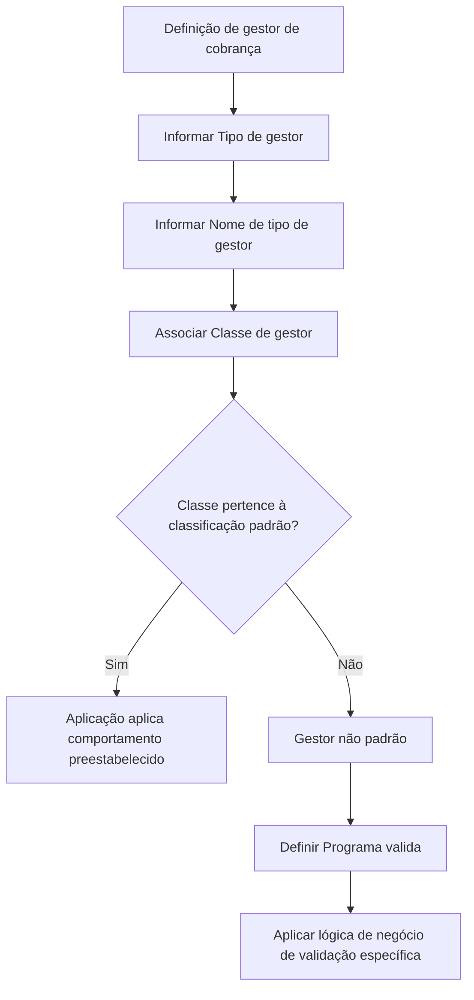

# Definição de Gestor de Cobro: Tipos, Classes e Validação Específica

## 1. Metadados do Documento
- **Arquivo de Origem:** Não identificado
- **Tipo de Documento:** Especificação Funcional
- **Domínio / Sistema:** Gestão de cobrança / gestores de cobro
- **Público-Alvo:** Analistas funcionais, desenvolvedores, arquitetura e operação
- **Data/Versão Identificada:** Não identificada

---

## 2. Resumo Executivo & Contexto de Negócio

O documento define como classificar pessoas ou entidades que atuam como gestores para cobrança de recibos. A classificação é representada pelo **Tipo de gestor**, que identifica o tipo funcional do gestor de cobrança configurado na aplicação.

A aplicação possui classificações padrão para determinados tipos de gestores. Quando um tipo de gestor está associado a uma classificação padrão, o comportamento do gestor já é preestabelecido pela aplicação. Entre os tipos padrão documentados estão gestor direto, agente, banco, oficina comercial, cobrador, líder de co-seguro aceito e modalidades de débito automático.

Também é possível criar tipos de gestores com uma classificação diferente da classificação padrão. Esses gestores são considerados não padrão e exigem a definição da forma de trabalho específica. Para esse cenário, a propriedade **Programa valida** contém a lógica de negócio responsável por determinar a validação particular do gestor de cobrança.

A propriedade **Classe de gestor** é o elemento que determina o comportamento do gestor dentro da aplicação. Portanto, a definição de um gestor requer, no mínimo, uma chave de tipo, uma descrição do tipo e uma classe associada; para gestores não padrão, também pode ser necessária lógica de validação específica.

---

## 3. Arquitetura, Componentes & Tecnologias Envolvidas

O documento não descreve arquitetura técnica, infraestrutura, APIs, tecnologias, bancos de dados, servidores ou ambientes. O conteúdo apresentado descreve a estrutura funcional de cadastro e classificação de gestores de cobrança dentro de uma aplicação não identificada.

### Componentes funcionais identificados

| Componente | Papel no domínio |
| :--- | :--- |
| Tipo de gestor | Chave da classificação do gestor de cobrança que está sendo definido. |
| Nome de tipo de gestor | Descrição textual do tipo de gestor. |
| Classe de gestor | Classificação padrão associada ao tipo de gestor; determina o comportamento do gestor na aplicação. |
| Programa valida | Lógica de negócio usada para validação específica quando o gestor não pertence à classificação padrão. |
| Aplicação | Sistema não identificado que utiliza a classe de gestor para determinar o comportamento do gestor. |
| Gestor de cobrança | Pessoa ou entidade que atua no processo de cobrança de recibos. |



> **Nota de Análise:** O documento não detalha a implementação, a linguagem, os métodos, os contratos de dados ou a execução técnica do campo **Programa valida**.

---

## 4. Regras de Negócio, Especificações Funcionais & Processos

### 4.1 Objetivo da definição de gestor de cobrança

A definição de gestor de cobrança tem o objetivo de determinar a classificação aplicável às pessoas ou entidades que atuam como gestores para cobrança de recibos.

A aplicação permite duas abordagens de configuração:

1. Criar tipos de gestores de cobrança associados à classificação padrão da aplicação.
2. Criar novos tipos de gestores de cobrança com classificação diferente da classificação padrão.

### 4.2 Comportamento de gestores padrão

Quando o tipo de gestor está associado a uma classificação padrão da aplicação:

- O comportamento do gestor de cobrança já está preestabelecido.
- A classe de gestor determina o comportamento desse gestor dentro da aplicação.
- Os tipos e classes padrão documentados incluem agente, banco, cobrador, débito automático em conta, gestor direto, gestor piloto de co-seguro, oficina comercial, débito com cartão de crédito e gestor de inadimplência.

### 4.3 Comportamento de gestores não padrão

Quando o valor da classe de gestor não pertence à classificação padrão documentada:

- O gestor é considerado um gestor não padrão.
- O comportamento não é preestabelecido pela classificação padrão.
- Deve ser estabelecida a forma de trabalho para esse tipo de gestor.
- A propriedade **Programa valida** contém a lógica de negócio que determina a validação específica aplicável ao tipo de gestor de cobrança.

### 4.4 Propriedade: Tipo de gestor

A propriedade **Tipo de gestor** contém a chave da classificação do gestor de cobrança em definição.

Os valores padrão de tipo de gestor apresentados no documento são:

- **GD:** Gestor direto.
- **AG:** Agente.
- **BA:** Banco.
- **OF:** Oficina comercial.
- **CO:** Cobrador.
- **CF:** Valor listado no documento sem descrição adicional.
- **GP:** Líder de co-seguro aceito.
- **DB:** Débito automático em conta.
- **TA:** Débito com cartão de crédito.

### 4.5 Propriedade: Nome de tipo de gestor

A propriedade **Nome de tipo de gestor** contém a descrição do tipo de gestor que está sendo definido.

Exemplos documentados:

- Tipo de gestor **AG** possui nome de tipo de gestor **Agente**.
- Tipo de gestor **BA** possui nome de tipo de gestor **Banco**.
- Tipo de gestor **EX** possui nome de tipo de gestor **Cobrador especial externo**.

### 4.6 Propriedade: Classe de gestor

A propriedade **Classe de gestor** contém a classificação padrão associada ao tipo de gestor em definição. A classe determina o comportamento do gestor dentro da aplicação.

Classificações padrão documentadas:

1. Agente.
2. Banco.
3. Cobrador.
4. Débito automático em conta.
5. Gestor direto.
6. Gestor piloto co-seguro.
7. Oficina comercial.
8. Débito com cartão de crédito.
10. Gestor de inadimplência.

Exemplos documentados:

- O tipo de gestor **AG**, com nome **Agente**, possui classe de gestor **1 (AGENTE)**.
- O tipo de gestor **BA**, com nome **Banco**, possui classe de gestor **2 (BANCO)**.
- O tipo de gestor **EX**, com nome **Cobrador especial externo**, possui classe de gestor **9**, sendo explicitamente identificado como não padrão.

### 4.7 Propriedade: Programa valida

A propriedade **Programa valida** é aplicável quando o gestor não está dentro da classificação padrão.

Nesse cenário, o campo contém a lógica de negócio que determina a validação específica do tipo de gestor de cobrança.

> **Nota de Análise:** O documento não informa quais programas de validação existem, como são identificados, quais regras executam ou quais dados são validados.

---

## 5. Tabelas de Parâmetros, Ambientes e Estruturas de Dados

### 5.1 Tipos de gestor padrão

| Item / Parâmetro | Descrição / Função | Tipo / Valores / Formato | Ambiente / Observações |
| :--- | :--- | :--- | :--- |
| Tipo de gestor | Chave da classificação do gestor de cobrança. | `GD` | Gestor direto. |
| Tipo de gestor | Chave da classificação do gestor de cobrança. | `AG` | Agente. |
| Tipo de gestor | Chave da classificação do gestor de cobrança. | `BA` | Banco. |
| Tipo de gestor | Chave da classificação do gestor de cobrança. | `OF` | Oficina comercial. |
| Tipo de gestor | Chave da classificação do gestor de cobrança. | `CO` | Cobrador. |
| Tipo de gestor | Chave da classificação do gestor de cobrança. | `CF` | Sem descrição adicional no documento. |
| Tipo de gestor | Chave da classificação do gestor de cobrança. | `GP` | Líder de co-seguro aceito. |
| Tipo de gestor | Chave da classificação do gestor de cobrança. | `DB` | Débito automático em conta. |
| Tipo de gestor | Chave da classificação do gestor de cobrança. | `TA` | Débito com cartão de crédito. |

### 5.2 Classes de gestor padrão

| Item / Parâmetro | Descrição / Função | Tipo / Valores / Formato | Ambiente / Observações |
| :--- | :--- | :--- | :--- |
| Classe de gestor | Determina o comportamento do gestor na aplicação. | `1` | Agente. |
| Classe de gestor | Determina o comportamento do gestor na aplicação. | `2` | Banco. |
| Classe de gestor | Determina o comportamento do gestor na aplicação. | `3` | Cobrador. |
| Classe de gestor | Determina o comportamento do gestor na aplicação. | `4` | Débito automático em conta. |
| Classe de gestor | Determina o comportamento do gestor na aplicação. | `5` | Gestor direto. |
| Classe de gestor | Determina o comportamento do gestor na aplicação. | `6` | Gestor piloto co-seguro. |
| Classe de gestor | Determina o comportamento do gestor na aplicação. | `7` | Oficina comercial. |
| Classe de gestor | Determina o comportamento do gestor na aplicação. | `8` | Débito com cartão de crédito. |
| Classe de gestor | Determina o comportamento do gestor na aplicação. | `10` | Gestor de inadimplência. |

### 5.3 Estrutura funcional da definição de gestor

| Item / Parâmetro | Descrição / Função | Tipo / Valores / Formato | Ambiente / Observações |
| :--- | :--- | :--- | :--- |
| Tipo de gestor | Contém a chave da classificação do gestor de cobrança definido. | Código de classificação, como `AG`, `BA` ou `EX`. | Valores padrão listados no documento; gestores adicionais podem existir. |
| Nome de tipo de gestor | Contém a descrição do tipo de gestor definido. | Texto descritivo. | Exemplos: Agente, Banco, Cobrador especial externo. |
| Classe de gestor | Contém a classificação padrão associada ao tipo de gestor. | Código numérico de classe. | Determina o comportamento do gestor na aplicação. |
| Programa valida | Contém a lógica de negócio para validação específica. | Não especificado. | Usado quando o gestor não pertence à classificação padrão. |

### 5.4 Exemplos de configuração apresentados

| Tipo de gestor | Nome de tipo de gestor | Classe de gestor | Classificação | Observações |
| :--- | :--- | :--- | :--- | :--- |
| `AG` | Agente | `1 (AGENTE)` | Padrão | Comportamento preestabelecido pela aplicação. |
| `BA` | Banco | `2 (BANCO)` | Padrão | Comportamento preestabelecido pela aplicação. |
| `EX` | Cobrador especial externo | `9` | Não padrão | Requer lógica específica no campo Programa valida. |

---

## 6. Bateria de Perguntas & Respostas para RAG (FAQ Sintético)

### P1: Qual é o objetivo da definição de gestor de cobrança?
**R:** A definição de gestor de cobrança tem como objetivo determinar a classificação aplicável às pessoas ou entidades que atuam como gestores para cobrança de recibos.

### P2: O que representa a propriedade Tipo de gestor?
**R:** A propriedade **Tipo de gestor** contém a chave da classificação do gestor de cobrança que está sendo definido. Exemplos documentados incluem `AG` para Agente, `BA` para Banco e `GD` para Gestor direto.

### P3: Qual propriedade determina o comportamento do gestor dentro da aplicação?
**R:** A propriedade **Classe de gestor** determina o comportamento do gestor dentro da aplicação. Quando a classe pertence à classificação padrão, o comportamento do gestor já está preestabelecido.

### P4: Quais são as classes de gestor padrão documentadas?
**R:** As classes padrão documentadas são: `1` Agente, `2` Banco, `3` Cobrador, `4` Débito automático em conta, `5` Gestor direto, `6` Gestor piloto co-seguro, `7` Oficina comercial, `8` Débito com cartão de crédito e `10` Gestor de inadimplência.

### P5: Como a aplicação trata um gestor associado a uma classe padrão?
**R:** Um gestor associado a uma classe padrão possui comportamento preestabelecido pela aplicação. A classe de gestor associada ao tipo de gestor define esse comportamento.

### P6: O que ocorre quando a classe de gestor não pertence à classificação padrão?
**R:** Quando a classe de gestor não pertence à classificação padrão, o gestor é considerado não padrão. Nesse caso, é necessário estabelecer a forma de trabalho para o tipo de gestor e utilizar a propriedade **Programa valida** para definir a lógica de validação específica.

### P7: Para que serve a propriedade Programa valida?
**R:** A propriedade **Programa valida** contém a lógica de negócio que determina a validação específica de um tipo de gestor de cobrança que não está dentro da classificação padrão.

### P8: Como são configurados os exemplos de Agente e Banco?
**R:** O exemplo de Agente utiliza tipo de gestor `AG`, nome de tipo de gestor **Agente** e classe de gestor `1 (AGENTE)`. O exemplo de Banco utiliza tipo de gestor `BA`, nome de tipo de gestor **Banco** e classe de gestor `2 (BANCO)`.

### P9: O que caracteriza o tipo de gestor EX?
**R:** O tipo de gestor `EX` é descrito como **Cobrador especial externo** e possui classe de gestor `9`. Como a classe `9` não está na classificação padrão apresentada, o documento o identifica como gestor não padrão.

### P10: Quais tipos de gestor relacionados a débito são citados?
**R:** O documento cita `DB` para **Débito automático em conta** e `TA` para **Débito com cartão de crédito**. As classes correspondentes apresentadas são `4` para débito automático em conta e `8` para débito com cartão de crédito.

### P11: O documento detalha os métodos, contratos ou regras internas do Programa valida?
**R:** Não. O documento informa apenas que **Programa valida** contém a lógica de negócio para validação específica de gestores não padrão; não detalha métodos, contratos, identificadores de programas ou regras internas de validação.

---

## 7. Glossário de Termos, Siglas & Conceitos-Chave

- **AG:** Código de tipo de gestor correspondente a **Agente**.
- **BA:** Código de tipo de gestor correspondente a **Banco**.
- **CF:** Código listado como valor padrão de tipo de gestor, sem descrição adicional no documento.
- **Classe de gestor:** Classificação associada ao tipo de gestor que determina o comportamento do gestor dentro da aplicação.
- **CO:** Código de tipo de gestor correspondente a **Cobrador**.
- **DB:** Código de tipo de gestor correspondente a **Débito automático em conta**.
- **GD:** Código de tipo de gestor correspondente a **Gestor direto**.
- **Gestor de cobrança:** Pessoa ou entidade que atua como gestor para cobrança de recibos.
- **GP:** Código de tipo de gestor correspondente a **Líder de co-seguro aceito**.
- **Gestor não padrão:** Gestor cuja classe não está na classificação padrão documentada; requer validação específica.
- **Nome de tipo de gestor:** Descrição textual do tipo de gestor configurado.
- **OF:** Código de tipo de gestor correspondente a **Oficina comercial**.
- **Programa valida:** Propriedade que contém a lógica de negócio para validar especificamente gestores não padrão.
- **TA:** Código de tipo de gestor correspondente a **Débito com cartão de crédito**.
- **Tipo de gestor:** Chave de classificação do gestor de cobrança que está sendo definido.

---

## 8. Notas Críticas, Riscos & Limitações

- O documento não identifica o nome da aplicação, versão, data, ambiente ou responsável pelo processo.
- Não há detalhamento técnico sobre persistência de dados, telas, APIs, integrações, banco de dados ou autenticação.
- O código `CF` é listado entre os valores padrão de tipo de gestor, mas não possui descrição complementar no conteúdo disponível.
- Não existe um mapeamento explícito entre todos os códigos de tipo de gestor e as classes de gestor; apenas os exemplos `AG`/classe `1` e `BA`/classe `2` são apresentados diretamente.
- A lógica da propriedade **Programa valida** não é detalhada. Não são informados programas disponíveis, critérios de execução, entradas, saídas ou mensagens de erro.
- O gestor `EX`, com classe `9`, é apresentado como não padrão; o documento não descreve o comportamento operacional, as regras de negócio ou o programa de validação aplicável a esse gestor.

---

## 9. Conteúdo Bruto Estruturado (Referência Fiel)

```text
--- [PÁGINA 1 DE 3] ---

DEFINICIÓN de Gestor de cobro
Objetivo
Determinar la clasificación que podrán tener las personas o entidades que actúen como gestores
para el cobro de recibos.
Se pueden crear tipos de gestores de cobro asociados a la clasificación estándar de la aplicación, de
forma que su comportamiento ya está preestablecido, o crear nuevos tipos de gestores con una
clasificación distinta a la estándar, de manera que será necesario establecer la forma de trabajar con
dicho tipo de gestor.
Propiedades generales
Propiedades generales
Tipo de gestor
Esta propiedad contiene la clave de la clasificación del gestor de cobros que se está definiendo.
Los valores estándar son los siguientes:
(GD)Gestor directo
(AG)Agente
(BA)Banco
(OF)Oficina comercial
(CO)Cobrador
 /
 CF
Home Solutions APIs Documentation Zeus
EN


--- [PÁGINA 2 DE 3] ---

(GP)Líder de coaseguro aceptado
(DB)Débito automático en cuenta
(TA)Débito con tarjeta de crédito
Ejemplo: - Tipo de gestor: AG - Tipo de gestor: BA
Nombre de tipo de gestor
Esta propiedad contiene la descripción del tipo de gestor que se está definiendo.
Ejemplo:
- Tipo de gestor: AG
Nombre de tipo de gestor: Agente
Tipo de gestor: BA
Nombre de tipo de gestor: Banco
Clase de gestor
Esta propiedad contiene la clasificación estándar que se asocia al tipo de gestor que se está
definiendo.
(1)Agente
(2)Banco
(3)Cobrador
(4)Débito automático en cuenta
(5)Gestor directo
(6)Gestor piloto coaseguro
(7)Oficina comercial
(8)Débito con tarjeta de crédito
(10)Gestor de impagos
Esta clasificación es la que determina el comportamiento del gestor dentro de la aplicación.
Si el valor no está dentro de la clasificación anterior, indica que no es un gestor estándar.
Ejemplo:
- Tipo de gestor: AG
Nombre de tipo de gestor: Agente
Clase de gestor: 1 (AGENTE)
Tipo de gestor: BA
Nombre de tipo de gestor: Banco
Clase de gestor: 2 (BANCO)


--- [PÁGINA 3 DE 3] ---

Tipo de gestor: EX
Nombre de tipo de gestor: Cobrador especial externo
Clase de gestor: 9 (no es un gestor estándar)
Programa valida
Cuando el gestor no está dentro de la clasificación estándar, esta propiedad contiene la lógica de
negocio que determina la validación específica de este tipo de gestor de cobro.
```
