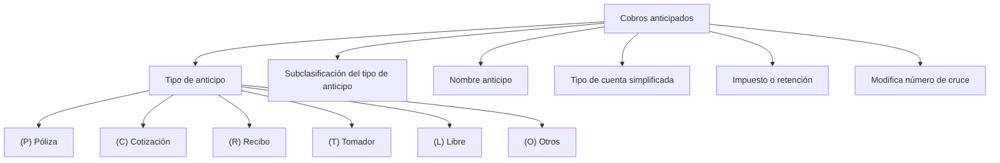

# Definição de Cobros Antecipados

## 1. Metadados do Documento
- **Arquivo de Origem:** Não identificado
- **Tipo de Documento:** Especificação Técnica
- **Domínio / Sistema:** Cobros antecipados; Home Solutions APIs Documentation Zeus
- **Público-Alvo:** Negócio, analistas funcionais e desenvolvedores
- **Data/Versão Identificada:** Não identificada

---

## 2. Resumo Executivo & Contexto de Negócio

O conteúdo define os tipos de **cobros antecipados** permitidos e apresenta as características associadas a cada tipo de anticipo.

A especificação identifica propriedades gerais para classificar um anticipo, incluindo o tipo, a subclasificación, a descrição, o tipo de conta simplificada, o imposto ou retenção aplicável e a possibilidade de alterar um número de cruce automático.

Os tipos de anticipo listados são Póliza, Cotización, Recibo, Tomador, Libre e Otros. Cada tipo é identificado por uma letra entre parênteses: `(P)`, `(C)`, `(R)`, `(T)`, `(L)` e `(O)`.

O documento não descreve fluxos operacionais completos, métodos HTTP, contratos JSON, regras de cálculo tributário, critérios de validação ou o comportamento detalhado da funcionalidade em Home Solutions APIs Documentation Zeus.

---

## 3. Arquitetura, Componentes & Tecnologias Envolvidas

Os elementos citados são:

| Componente / Termo | Papel identificado no conteúdo |
| :--- | :--- |
| Cobros anticipados | Domínio funcional definido pelo documento. |
| Anticipo | Entidade ou classificação à qual as propriedades são aplicadas. |
| Home Solutions APIs Documentation Zeus | Texto identificado no rodapé/conteúdo extraído; não há detalhamento de integração, arquitetura ou APIs. |



> **Nota de Análise:** O conteúdo não apresenta arquitetura de software, tecnologias, ambientes, endpoints, microsserviços ou fluxos de integração.

---

## 4. Regras de Negócio, Especificações Funcionais & Processos

1. O objetivo declarado é definir os tipos de cobros antecipados permitidos e suas características.
2. A propriedade **Tipo de anticipo** identifica o tipo de anticipo.
3. Os tipos de anticipo permitidos são:
   - `(P)` Póliza;
   - `(C)` Cotización;
   - `(R)` Recibo;
   - `(T)` Tomador;
   - `(L)` Libre;
   - `(O)` Otros.
4. A propriedade **Anticipo** corresponde à subclasificación do tipo de anticipo.
5. A propriedade **Nombre anticipo** recebe a descrição associada ao tipo de anticipo.
6. A propriedade **Tipo de cuenta simplificada** identifica o tipo de conta simplificada utilizado pelo anticipo.
7. A propriedade **Impuesto** contém a chave do imposto ou da retenção aplicada ao anticipo.
8. Quando o tipo de anticipo utiliza um número de cruce automático, a propriedade **Modifica número de cruce** determina se o usuário pode modificar esse número.

> **Nota de Análise:** O documento não informa valores permitidos para subclasificación, tipo de cuenta simplificada, imposto, retenção ou modifica número de cruce.

---

## 5. Tabelas de Parâmetros, Ambientes e Estruturas de Dados

| Item / Parâmetro | Descrição / Função | Tipo / Valores / Formato | Ambiente / Observações |
| :--- | :--- | :--- | :--- |
| Tipo de anticipo | Identifica o tipo de anticipo. | `(P) Póliza`, `(C) Cotización`, `(R) Recibo`, `(T) Tomador`, `(L) Libre`, `(O) Otros` | Não detalhado. |
| Anticipo | Subclasificación do tipo de anticipo. | Não especificado | Não detalhado. |
| Nombre anticipo | Descrição recebida pelo tipo de anticipo. | Texto; formato não especificado | Não detalhado. |
| Tipo de cuenta simplificada | Tipo de conta simplificada a ser usado pelo anticipo. | Não especificado | Não detalhado. |
| Impuesto | Chave do imposto ou retenção aplicada ao anticipo. | Não especificado | Não detalhado. |
| Modifica número de cruce | Determina se um número de cruce automático pode ser alterado pelo usuário. | Não especificado | Aplicável quando o tipo de anticipo usa número de cruce automático. |
| Home Solutions APIs Documentation Zeus | Referência textual presente no conteúdo extraído. | Não especificado | Não há detalhes técnicos adicionais. |

---

## 6. Bateria de Perguntas & Respostas para RAG (FAQ Sintético)

### P1: Qual é o objetivo da definição de cobros antecipados?
**R:** O objetivo é definir os tipos de cobros antecipados permitidos e as características associadas a esses tipos.

### P2: Quais tipos de anticipo são permitidos?
**R:** Os tipos permitidos são `(P) Póliza`, `(C) Cotización`, `(R) Recibo`, `(T) Tomador`, `(L) Libre` e `(O) Otros`.

### P3: O que a propriedade “Tipo de anticipo” identifica?
**R:** A propriedade “Tipo de anticipo” identifica qual é o tipo de anticipo aplicado.

### P4: O que significa a propriedade “Anticipo”?
**R:** A propriedade “Anticipo” corresponde à subclasificación do tipo de anticipo.

### P5: Qual é a função de “Nombre anticipo”?
**R:** “Nombre anticipo” recebe a descrição associada ao tipo de anticipo.

### P6: Para que serve “Tipo de cuenta simplificada”?
**R:** Essa propriedade indica o tipo de conta simplificada que será utilizado pelo anticipo.

### P7: O que deve ser informado no campo “Impuesto”?
**R:** O campo “Impuesto” deve conter a chave do imposto ou da retenção que o anticipo leva.

### P8: Quando a propriedade “Modifica número de cruce” é aplicável?
**R:** A propriedade é aplicável quando o tipo de anticipo utiliza um número de cruce automático.

### P9: O que “Modifica número de cruce” controla?
**R:** A propriedade determina se o número de cruce automático pode ou não ser modificado pelo usuário.

### P10: O documento especifica APIs, métodos HTTP ou contratos JSON?
**R:** Não. O conteúdo menciona “Home Solutions APIs Documentation Zeus”, mas não detalha APIs, métodos HTTP, endpoints ou contratos JSON.

---

## 7. Glossário de Termos, Siglas & Conceitos-Chave

- **Cobros anticipados:** Cobranças antecipadas; domínio funcional definido no documento.
- **Anticipo:** Elemento classificado por tipo e subclasificación.
- **Póliza:** Um dos tipos permitidos de anticipo, identificado por `(P)`.
- **Cotización:** Um dos tipos permitidos de anticipo, identificado por `(C)`.
- **Recibo:** Um dos tipos permitidos de anticipo, identificado por `(R)`.
- **Tomador:** Um dos tipos permitidos de anticipo, identificado por `(T)`.
- **Libre:** Um dos tipos permitidos de anticipo, identificado por `(L)`.
- **Otros:** Um dos tipos permitidos de anticipo, identificado por `(O)`.
- **Cuenta simplificada:** Tipo de conta simplificada utilizado pelo anticipo.
- **Impuesto:** Chave do imposto ou retenção associada ao anticipo.
- **Número de cruce:** Número automático cuja alteração pelo usuário é controlada por uma propriedade.

---

## 8. Notas Críticas, Riscos & Limitações

- O arquivo de origem, a data e a versão não foram identificados no conteúdo fornecido.
- O conteúdo não detalha formatos, tipos de dados, obrigatoriedade ou valores permitidos para os campos.
- Não há descrição de regras de cálculo para imposto ou retenção.
- Não há definição dos critérios que determinam o uso de número de cruce automático.
- Não há detalhamento sobre permissões, validações, mensagens de erro, integrações ou persistência de dados.
- A referência a “Home Solutions APIs Documentation Zeus” não fornece elementos suficientes para documentar APIs ou arquitetura técnica.

---

## 9. Conteúdo Bruto Estruturado (Referência Fiel)

```text
--- [PÁGINA 1 DE 2] ---

DEFINICIÓN de cobros anticipados
Objetivo
Definición de los tipos de cobros anticipados que se permiten y sus características.
Propiedades generales
Propiedades generales
Tipo de anticipo
Identifica el tipo de anticipo
(P)Póliza
(C)Cotización
(R)Recibo
(T)Tomador
(L)Libre
(O)Otros
Anticipo
Subclasificación del tipo de anticipo.
Nombre anticipo
 /
 CF
Home Solutions APIs Documentation Zeus
EN


--- [PÁGINA 2 DE 2] ---

Descripción que recibe el tipo de anticipo.
Tipo de cuenta simplificada
Tipo de cuenta simplificada que utilizará el anticipo.
Impuesto
Clave del impuesto o retención que lleva el anticipo.
Modifica número de cruce
Cuando el tipo de anticipo utiliza un número de cruce automático, esta propiedad determina si dicho
número puede ser modificado o no por el usuario.
```
