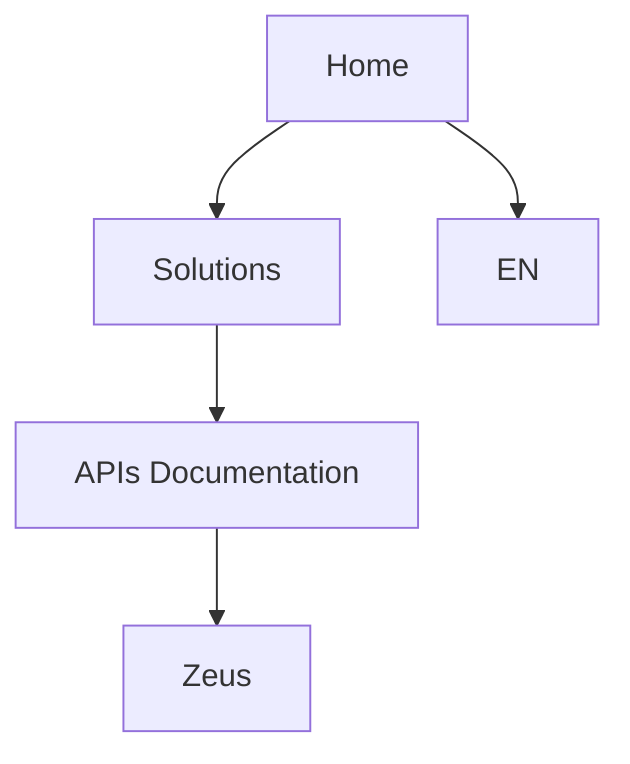

# Página Inicial de Documentação Zeus — Soluções e APIs

## 1. Metadados do Documento
- **Arquivo de Origem:** `Não identificado`
- **Tipo de Documento:** `Não identificado; conteúdo aparenta ser cabeçalho de portal de documentação`
- **Domínio / Sistema:** `Zeus / Solutions / APIs Documentation`
- **Público-Alvo:** `Não identificado`
- **Data/Versão Identificada:** `Não identificada`

---

## 2. Resumo Executivo & Contexto de Negócio

O conteúdo disponível consiste em uma única linha de navegação ou cabeçalho: `Home Solutions APIs Documentation Zeus EN`. O texto sugere a existência de uma área de documentação associada a “Solutions”, “APIs” e “Zeus”.

Não há especificações funcionais, arquitetura, endpoints, tecnologias, contratos, regras de negócio, ambientes ou instruções operacionais no material fornecido. A presença de `EN` indica que a interface ou documentação apresentada está em inglês.

---

## 3. Arquitetura, Componentes & Tecnologias Envolvidas

Os únicos termos de sistema ou navegação identificados são `Home`, `Solutions`, `APIs Documentation`, `Zeus` e `EN`.



> **Nota de Análise:** O documento menciona “Zeus” e “APIs Documentation”, mas não detalha componentes, serviços, métodos HTTP, contratos JSON, tecnologias, integrações ou responsabilidades técnicas.

---

## 4. Regras de Negócio, Especificações Funcionais & Processos

Não foram identificadas regras de negócio, critérios de validação, processos operacionais, cálculos, fluxos funcionais ou restrições técnicas no conteúdo fornecido.

---

## 5. Tabelas de Parâmetros, Ambientes e Estruturas de Dados

| Item / Parâmetro | Descrição / Função | Tipo / Valores / Formato | Ambiente / Observações |
| :--- | :--- | :--- | :--- |
| Home | Item de navegação identificado no conteúdo | Texto | Sem detalhamento adicional |
| Solutions | Termo apresentado no cabeçalho | Texto | Sem detalhamento adicional |
| APIs Documentation | Referência a documentação de APIs | Texto | Não há endpoints ou contratos descritos |
| Zeus | Nome identificado no conteúdo | Texto | Não há definição funcional ou técnica |
| EN | Indicador textual de idioma | Texto | Sugere inglês; não há confirmação adicional |

---

## 6. Bateria de Perguntas & Respostas para RAG (FAQ Sintético)

### P1: Qual sistema ou nome de domínio é mencionado no documento?
**R:** O documento menciona `Zeus`. Não há explicação sobre o propósito, a arquitetura ou as funcionalidades de Zeus.

### P2: O documento contém referência a documentação de APIs?
**R:** Sim. O conteúdo inclui a expressão `APIs Documentation`, porém não fornece endpoints, métodos HTTP, autenticação, exemplos de requisição ou contratos de resposta.

### P3: Quais itens de navegação aparecem no conteúdo bruto?
**R:** Os itens identificados são `Home`, `Solutions`, `APIs Documentation`, `Zeus` e `EN`.

### P4: Qual idioma é indicado no documento?
**R:** O texto contém `EN`, que sugere inglês. O documento não apresenta uma declaração adicional sobre idioma ou regionalização.

### P5: Há detalhes sobre microsserviços no documento?
**R:** Não. Não foram identificados nomes de microsserviços, responsabilidades, interfaces ou comunicações entre serviços.

### P6: O documento especifica URLs ou ambientes técnicos?
**R:** Não. Não há URLs, hosts, portas, servidores, ambientes de desenvolvimento, homologação ou produção.

### P7: Quais tecnologias são explicitamente informadas?
**R:** Nenhuma tecnologia é explicitamente identificada. A expressão `APIs Documentation` apenas indica um contexto de documentação de APIs.

### P8: Existem regras de negócio ou fluxos operacionais descritos?
**R:** Não. O conteúdo fornecido não apresenta regras de negócio, etapas de processo, condições de validação ou critérios operacionais.

### P9: O documento permite identificar o público-alvo da documentação Zeus?
**R:** Não com precisão. A referência a `APIs Documentation` pode indicar uso técnico, mas o público-alvo não é explicitamente declarado.

### P10: Há uma versão ou data associada à documentação?
**R:** Não. O conteúdo não inclui data, versão, histórico de revisões ou identificação de release.

---

## 7. Glossário de Termos, Siglas & Conceitos-Chave

- **API:** Termo presente em `APIs Documentation`; o documento não expande a sigla nem descreve APIs específicas.
- **APIs Documentation:** Referência a uma área ou conteúdo de documentação de APIs.
- **EN:** Indicador textual que sugere idioma inglês.
- **Home:** Item de navegação identificado no conteúdo.
- **Solutions:** Termo de navegação ou categorização, sem definição adicional.
- **Zeus:** Nome identificado no conteúdo, sem detalhamento funcional ou técnico.

---

## 8. Notas Críticas, Riscos & Limitações

- O material contém apenas uma linha de texto e não apresenta conteúdo técnico suficiente para documentar a solução Zeus.
- Não há evidências de arquitetura, componentes, dependências, integrações, segurança, observabilidade, contratos de API ou procedimentos operacionais.
- Não foi possível identificar arquivo de origem, tipo documental, público-alvo, data ou versão.
- O diagrama Mermaid representa apenas a relação inferida entre itens textuais de navegação; não representa uma arquitetura técnica validada.

---

## 9. Conteúdo Bruto Estruturado (Referência Fiel)

```text
--- [PÁGINA 1 DE 1] ---

/
CF
Home Solutions APIs Documentation Zeus
EN
```
