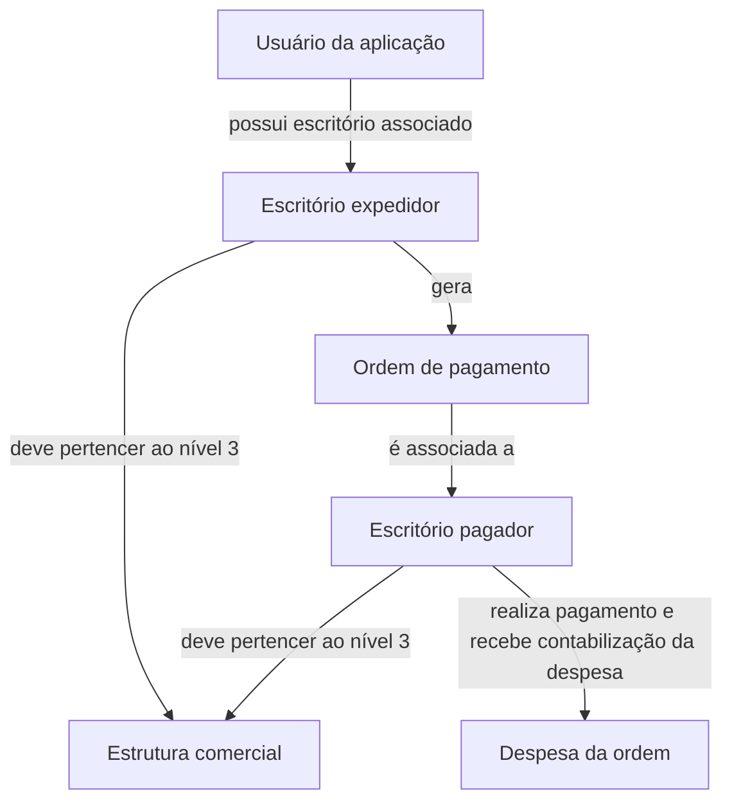
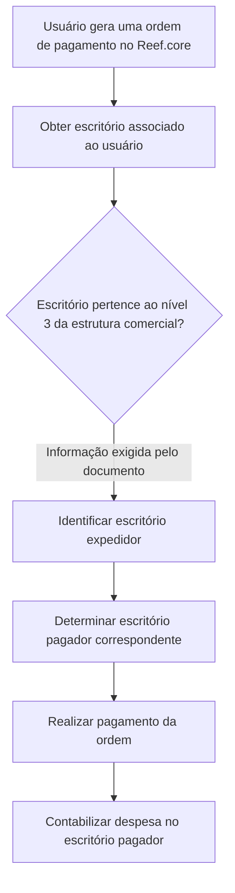

# Definição da Relação entre Escritórios Geradores e Pagadores de Ordens de Pagamento

## 1. Metadados do Documento
- **Arquivo de Origem:** Não identificado
- **Tipo de Documento:** Procedimento
- **Domínio / Sistema:** Reef.core; estrutura comercial da companhia
- **Público-Alvo:** Desenvolvedores, Operação e Negócio
- **Data/Versão Identificada:** Não identificada

---

## 2. Resumo Executivo & Contexto de Negócio

O documento define a relação entre escritórios que geram ordens de pagamento e escritórios responsáveis pelo pagamento dessas ordens. O objetivo é identificar, para cada escritório expedidor autorizado a gerar uma ordem de pagamento, qual escritório pagador correspondente receberá a contabilização da despesa.

A definição utiliza propriedades de configuração para os dois papéis: **escritório expedidor** e **escritório pagador**. Ambos devem existir no catálogo da estrutura comercial da companhia e corresponder ao nível 3 dessa estrutura.

No Reef.core, a identificação do escritório que gera uma ordem de pagamento é derivada do usuário que cria a ordem. Cada usuário da aplicação possui um escritório associado, pertencente ao nível 3 da estrutura comercial.

O documento não detalha mecanismos técnicos de persistência, endpoints, contratos JSON, regras de exceção, critérios para múltiplos escritórios pagadores ou o processo de manutenção do relacionamento entre escritórios.

---

## 3. Arquitetura, Componentes & Tecnologias Envolvidas

Os elementos explicitamente citados são:

| Componente / Conceito | Papel descrito |
| :--- | :--- |
| Reef.core | Aplicação na qual é identificada a unidade que gera a ordem de pagamento. |
| Usuário da aplicação | Entidade cuja unidade/escritório associado determina o escritório gerador da ordem. |
| Estrutura comercial | Catálogo corporativo no qual os escritórios expedidores e pagadores devem estar definidos. |
| Nível 3 da estrutura comercial | Nível organizacional ao qual correspondem os escritórios expedidores, pagadores e o escritório associado ao usuário. |
| Escritório expedidor | Escritório que pode gerar ordens de pagamento. |
| Escritório pagador | Escritório que realiza o pagamento das ordens e ao qual a despesa da ordem será contabilizada. |
| CF Home Solutions APIs Documentation Zeus | Referência textual apresentada na seção de perguntas frequentes; o documento não explica a função dessa referência. |



> *Nota de Análise: O documento define os papéis organizacionais e o critério de identificação do escritório expedidor no Reef.core, mas não descreve serviços, APIs, bancos de dados, métodos HTTP ou contratos de integração.*

---

## 4. Regras de Negócio, Especificações Funcionais & Processos

1. Para cada escritório capaz de gerar ordens de pagamento, deve existir a identificação do escritório pagador correspondente.
2. O escritório pagador identificado é o escritório ao qual será contabilizada a despesa da ordem de pagamento.
3. A propriedade **escritório expedidor** contém os escritórios que podem gerar ordens de pagamento.
4. Os escritórios expedidores devem estar definidos no catálogo da estrutura comercial da companhia.
5. Os escritórios expedidores correspondem ao nível 3 da estrutura comercial.
6. A propriedade **escritório pagador** contém os escritórios que realizarão o pagamento das ordens de pagamento.
7. Os escritórios pagadores devem estar definidos no catálogo da estrutura comercial da companhia.
8. Os escritórios pagadores correspondem ao nível 3 da estrutura comercial.
9. No Reef.core, o escritório gerador da ordem de pagamento é obtido a partir do escritório do usuário que cria a ordem.
10. Cada usuário da aplicação possui atribuição a um escritório pertencente ao nível 3 da estrutura comercial.

### Fluxo funcional identificado



> *Nota de Análise: O documento não especifica o comportamento caso o usuário não possua escritório associado, o escritório não pertença ao nível 3, ou não exista escritório pagador correspondente.*

---

## 5. Tabelas de Parâmetros, Ambientes e Estruturas de Dados

| Item / Parâmetro | Descrição / Função | Tipo / Valores / Formato | Ambiente / Observações |
| :--- | :--- | :--- | :--- |
| Escritório expedidor | Contém os escritórios que podem gerar ordens de pagamento. | Escritório definido no nível 3 da estrutura comercial. | Deve estar cadastrado no catálogo da estrutura comercial. |
| Escritório pagador | Contém os escritórios que realizarão o pagamento das ordens de pagamento. | Escritório definido no nível 3 da estrutura comercial. | A despesa da ordem será contabilizada nesse escritório. |
| Escritório do usuário | Escritório utilizado para identificar o escritório que está gerando a ordem no Reef.core. | Escritório associado a cada usuário da aplicação; nível 3 da estrutura comercial. | Aplicável à geração de ordens de pagamento no Reef.core. |
| Ordem de pagamento | Ordem gerada por um escritório expedidor e paga por um escritório pagador correspondente. | Não detalhado. | O documento não apresenta campos, identificadores ou status. |
| Catálogo da estrutura comercial | Catálogo corporativo que deve conter escritórios expedidores e pagadores. | Estrutura organizacional; nível 3 citado. | Não são descritos mecanismos de consulta ou manutenção. |

---

## 6. Bateria de Perguntas & Respostas para RAG (FAQ Sintético)

### P1: Qual é o objetivo da relação entre escritórios geradores e pagadores?
**R:** O objetivo é identificar, para cada escritório que pode gerar ordens de pagamento, qual escritório pagador corresponde a esse escritório. O escritório pagador correspondente é aquele no qual será contabilizada a despesa da ordem de pagamento.

### P2: O que é um escritório expedidor no contexto das ordens de pagamento?
**R:** O escritório expedidor é o escritório que pode gerar ordens de pagamento. Os escritórios expedidores devem estar definidos no catálogo da estrutura comercial da companhia e corresponder ao nível 3 dessa estrutura.

### P3: O que é um escritório pagador?
**R:** O escritório pagador é o escritório responsável por realizar o pagamento das ordens de pagamento. O escritório pagador também é o escritório ao qual será contabilizada a despesa da ordem.

### P4: Como o Reef.core identifica o escritório que está gerando uma ordem de pagamento?
**R:** O Reef.core utiliza o escritório associado ao usuário que está gerando a ordem de pagamento. Cada usuário da aplicação possui um escritório atribuído.

### P5: A qual nível da estrutura comercial devem pertencer os escritórios expedidores?
**R:** Os escritórios expedidores devem corresponder ao nível 3 da estrutura comercial e estar definidos no catálogo dessa estrutura.

### P6: A qual nível da estrutura comercial devem pertencer os escritórios pagadores?
**R:** Os escritórios pagadores devem corresponder ao nível 3 da estrutura comercial e estar definidos no catálogo dessa estrutura.

### P7: Onde a despesa de uma ordem de pagamento é contabilizada?
**R:** A despesa de uma ordem de pagamento é contabilizada no escritório pagador correspondente ao escritório que gerou a ordem de pagamento.

### P8: O documento descreve APIs ou métodos HTTP para consultar a relação entre escritórios?
**R:** Não. O documento apresenta uma referência textual a “CF Home Solutions APIs Documentation Zeus”, mas não detalha endpoints, métodos HTTP, contratos JSON ou mecanismos técnicos de consulta.

### P9: O que acontece se um usuário não tiver escritório associado?
**R:** O documento não especifica o comportamento para usuários sem escritório associado. Apenas informa que cada usuário da aplicação possui um escritório atribuído, pertencente ao nível 3 da estrutura comercial.

### P10: O documento explica como manter ou alterar a relação entre escritório expedidor e escritório pagador?
**R:** Não. O documento define o objetivo e as propriedades gerais da relação, mas não descreve interfaces, procedimentos, permissões ou regras para criar, atualizar ou remover essa relação.

---

## 7. Glossário de Termos, Siglas & Conceitos-Chave

- **Reef.core:** Aplicação citada como fonte para identificação do escritório que gera a ordem de pagamento.
- **Escritório expedidor:** Escritório que pode gerar ordens de pagamento.
- **Escritório pagador:** Escritório que realiza o pagamento das ordens de pagamento e recebe a contabilização da despesa correspondente.
- **Estrutura comercial:** Catálogo corporativo no qual os escritórios relevantes devem estar definidos.
- **Nível 3:** Nível da estrutura comercial ao qual correspondem os escritórios expedidores, pagadores e o escritório associado ao usuário.
- **Ordem de pagamento:** Ordem que pode ser gerada por um escritório expedidor e paga por um escritório pagador.
- **CF:** Sigla exibida na referência “CF Home Solutions APIs Documentation Zeus”; sem expansão ou definição no documento.
- **Zeus:** Termo exibido na referência “CF Home Solutions APIs Documentation Zeus”; sem definição adicional no documento.

---

## 8. Notas Críticas, Riscos & Limitações

- O documento não informa o nome do arquivo de origem, data, versão ou responsável.
- O documento não apresenta critérios para configurar o relacionamento entre cada escritório expedidor e seu escritório pagador correspondente.
- Não há detalhamento sobre validações de cadastro, exceções, mensagens de erro ou tratamento de inconsistências.
- Não são descritos endpoints, serviços, APIs, métodos HTTP, bancos de dados ou modelos de dados.
- O documento não define como proceder quando o usuário não possui escritório associado ou quando a relação entre escritório expedidor e pagador não está configurada.
- A referência a “CF Home Solutions APIs Documentation Zeus” não contém explicação funcional ou técnica adicional.

---

## 9. Conteúdo Bruto Estruturado (Referência Fiel)

```text
--- [PÁGINA 1 DE 2] ---

DEFINICIÓN de la relación entre oficinas
generadoras y pagadoras
Objetivo
Identificar para cada oficina que puede generar órdenes de pago, qué oficina de pago le
corresponde, es decir a qué oficina se le va a contabilizar el gasto de esa orden de pago.
Propiedades generales
Propiedades generales
Oficina expedidora
Esta propiedad contiene las oficinas que pueden generar órdenes de pago.
Estas oficinas tienen que estar definidas en el catálogo de la estructura comercial de la compañía, se
corresponde al nivel 3.
Oficina pagadora
Esta propiedad contiene las oficinas que realizarán el pago de las órdenes de pago.
Estas oficinas tienen que estar definidas en el catálogo de la estructura comercial de la compañía, se
corresponde al nivel 3.
Preguntas frecuentes
¿Cómo se sabe la oficina que está generando la orden de pago en Reef.core?
 /
 CF
Home Solutions APIs Documentation Zeus
EN


--- [PÁGINA 2 DE 2] ---

R/ Se toma la oficina del usuario que la está generando. Cada usuario de la aplicación tiene asignada
la oficina a la que pertenece, nivel 3 de la estructura comercial.
```
