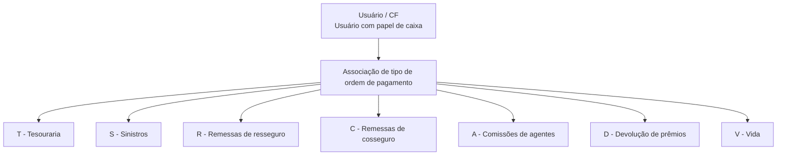

# Definição de Tipo de Ordem de Pagamento por Usuário no Sistema Zeus

## 1. Metadados do Documento
- **Arquivo de Origem:** Não identificado no conteúdo fornecido
- **Tipo de Documento:** Especificação Funcional
- **Domínio / Sistema:** Zeus — ordens de pagamento
- **Público-Alvo:** Usuários com papel de caixa e equipes funcionais do sistema Zeus
- **Data/Versão Identificada:** Não identificada

---

## 2. Resumo Executivo & Contexto de Negócio

O documento define a associação entre usuários do sistema Zeus e os tipos de ordem de pagamento que cada usuário pode utilizar. O objetivo declarado é identificar, individualmente, o tipo de ordem de pagamento disponível para cada usuário do sistema.

A especificação apresenta uma propriedade denominada **Tipo de ordem de pagamento**, responsável por identificar a classificação da ordem. São listadas sete classificações: Tesouraria, Sinistros, Remessas de resseguro, Remessas de cosseguro, Comissões de agentes, Devolução de prêmios e Vida.

A segunda propriedade apresentada é **Usuário / CF**. Essa propriedade identifica o usuário que possui o papel de caixa e que poderá trabalhar com o tipo de ordem de pagamento previamente identificado.

O conteúdo não descreve telas, persistência de dados, APIs, contratos JSON, métodos HTTP, critérios de autorização além do papel de caixa, nem o comportamento do sistema para usuários sem associação configurada.

---

## 3. Arquitetura, Componentes & Tecnologias Envolvidas

O conteúdo menciona o sistema **Zeus** e a navegação “Início Soluções APIs Documentação Zeus”. Não há detalhamento de arquitetura de software, tecnologias, bancos de dados, serviços, APIs ou ambientes.

A relação funcional explicitada é entre um usuário com papel de caixa e um tipo de ordem de pagamento.



**Nota de Análise:** o documento lista “APIs” na navegação, porém não detalha APIs, métodos HTTP, endpoints, autenticação ou contratos de integração.

---

## 4. Regras de Negócio, Especificações Funcionais & Processos

1. O sistema deve identificar, para cada usuário, o tipo de ordem de pagamento que o usuário pode utilizar.
2. O tipo de ordem de pagamento identifica a classificação da ordem de pagamento.
3. O usuário identificado deve possuir o papel de **caixa**.
4. O usuário com papel de caixa poderá trabalhar com o tipo de ordem de pagamento identificado.
5. As classificações de tipo de ordem de pagamento apresentadas são:
   - **T:** Tesouraria.
   - **S:** Sinistros.
   - **R:** Remessas de resseguro.
   - **C:** Remessas de cosseguro.
   - **A:** Comissões de agentes.
   - **D:** Devolução de prêmios.
   - **V:** Vida.

**Nota de Análise:** o documento não especifica se um mesmo usuário pode possuir mais de um tipo de ordem de pagamento, se a associação é obrigatória, como ela é cadastrada, nem quais validações são executadas durante o uso da ordem.

---

## 5. Tabelas de Parâmetros, Ambientes e Estruturas de Dados

| Item / Parâmetro | Descrição / Função | Tipo / Valores / Formato | Ambiente / Observações |
| :--- | :--- | :--- | :--- |
| Tipo de ordem de pagamento | Identifica a classificação da ordem de pagamento. | Código de classificação. | Aplicável ao sistema Zeus. |
| Usuário / CF | Identifica o usuário com papel de caixa que poderá trabalhar com o tipo de ordem de pagamento identificado. | Usuário / CF. | O documento não define o significado de “CF”. |
| T | Classificação de ordem de pagamento para Tesouraria. | Código `T`. | Sem detalhamento adicional. |
| S | Classificação de ordem de pagamento para Sinistros. | Código `S`. | Sem detalhamento adicional. |
| R | Classificação de ordem de pagamento para Remessas de resseguro. | Código `R`. | Sem detalhamento adicional. |
| C | Classificação de ordem de pagamento para Remessas de cosseguro. | Código `C`. | Sem detalhamento adicional. |
| A | Classificação de ordem de pagamento para Comissões de agentes. | Código `A`. | Sem detalhamento adicional. |
| D | Classificação de ordem de pagamento para Devolução de prêmios. | Código `D`. | Sem detalhamento adicional. |
| V | Classificação de ordem de pagamento para Vida. | Código `V`. | Sem detalhamento adicional. |

---

## 6. Bateria de Perguntas & Respostas para RAG (FAQ Sintético)

### P1: Qual é o objetivo da definição de ordem de pagamento por usuário?
**R:** O objetivo é identificar, para cada usuário do sistema Zeus, o tipo de ordem de pagamento que esse usuário pode utilizar.

### P2: Qual propriedade identifica a classificação de uma ordem de pagamento?
**R:** A propriedade **Tipo de ordem de pagamento** identifica a classificação da ordem de pagamento.

### P3: Quais tipos de ordem de pagamento estão disponíveis no documento?
**R:** O documento lista sete tipos: Tesouraria (`T`), Sinistros (`S`), Remessas de resseguro (`R`), Remessas de cosseguro (`C`), Comissões de agentes (`A`), Devolução de prêmios (`D`) e Vida (`V`).

### P4: O que representa o código T no tipo de ordem de pagamento?
**R:** O código `T` representa a classificação de ordem de pagamento de **Tesouraria**.

### P5: O que representa o código S no tipo de ordem de pagamento?
**R:** O código `S` representa a classificação de ordem de pagamento de **Sinistros**.

### P6: O que representam os códigos R e C?
**R:** O código `R` representa **Remessas de resseguro**. O código `C` representa **Remessas de cosseguro**.

### P7: O que representam os códigos A, D e V?
**R:** O código `A` representa **Comissões de agentes**; o código `D` representa **Devolução de prêmios**; e o código `V` representa **Vida**.

### P8: Que tipo de usuário pode trabalhar com o tipo de ordem de pagamento identificado?
**R:** O documento determina que o usuário identificado deve possuir o papel de **caixa** e poderá trabalhar com o tipo de ordem de pagamento identificado.

### P9: O que significa a propriedade Usuário / CF?
**R:** A propriedade **Usuário / CF** identifica o usuário com papel de caixa que poderá trabalhar com o tipo de ordem de pagamento identificado. O documento não expande ou define a sigla `CF`.

### P10: O documento informa APIs ou endpoints para consultar as ordens de pagamento?
**R:** Não. Embora a navegação mencione “APIs”, o conteúdo não apresenta endpoints, métodos HTTP, contratos de integração ou mecanismos de consulta.

---

## 7. Glossário de Termos, Siglas & Conceitos-Chave

- **Zeus:** Sistema citado na navegação do conteúdo original.
- **Tipo de ordem de pagamento:** Propriedade que identifica a classificação da ordem de pagamento.
- **Usuário / CF:** Propriedade que identifica o usuário com papel de caixa apto a trabalhar com o tipo de ordem de pagamento identificado.
- **CF:** Sigla apresentada no campo “Usuário / CF”; o significado não é definido pelo documento.
- **Tesouraria:** Classificação de ordem de pagamento identificada pelo código `T`.
- **Sinistros:** Classificação de ordem de pagamento identificada pelo código `S`.
- **Remessas de resseguro:** Classificação de ordem de pagamento identificada pelo código `R`.
- **Remessas de cosseguro:** Classificação de ordem de pagamento identificada pelo código `C`.
- **Comissões de agentes:** Classificação de ordem de pagamento identificada pelo código `A`.
- **Devolução de prêmios:** Classificação de ordem de pagamento identificada pelo código `D`.
- **Vida:** Classificação de ordem de pagamento identificada pelo código `V`.

---

## 8. Notas Críticas, Riscos & Limitações

- O documento não informa o nome do arquivo de origem, data, versão, autor ou responsável.
- O documento não detalha a arquitetura técnica do sistema Zeus.
- Não há descrição de APIs, telas, banco de dados, integração, logs, ambientes, URLs ou permissões adicionais.
- O documento não define a sigla `CF`.
- Não está explícito se um usuário com papel de caixa pode trabalhar com um ou vários tipos de ordem de pagamento.
- Não há regras para criação, atualização, remoção ou consulta da associação entre usuário e tipo de ordem de pagamento.
- Não são apresentados critérios de validação, tratamento de erros ou comportamento para usuários sem tipo de ordem associado.

---

## 9. Conteúdo Bruto Estruturado (Referência Fiel)

```text
--- [PÁGINA 1 DE 2] ---

EN CONSTRUCCIÓN
DEFINICIÓN de orden de pago por usuario
Objetivo
Identificar, por cada usuario del sistema, el tipo de orden de pago que pude utilizar.
Propiedades generales
Propiedades generales
Tipo de orden de pago
Identifica la clasificación de la orden de pago.
(T)Tesorería
(S)Siniestros
(R)Remesas de reaseguro
(C)Remesas de coaseguro
(A)Comisiones agentes
(D)Devolución de primas
(V)Vida
Usuario
 / 
 CF
Inicio Soluciones APIs Documentación Zeus
ES


--- [PÁGINA 2 DE 2] ---

Identifica el usuario, con rol cajero, que podrá trabajar con el tipo de orden de pago identificado.
```
