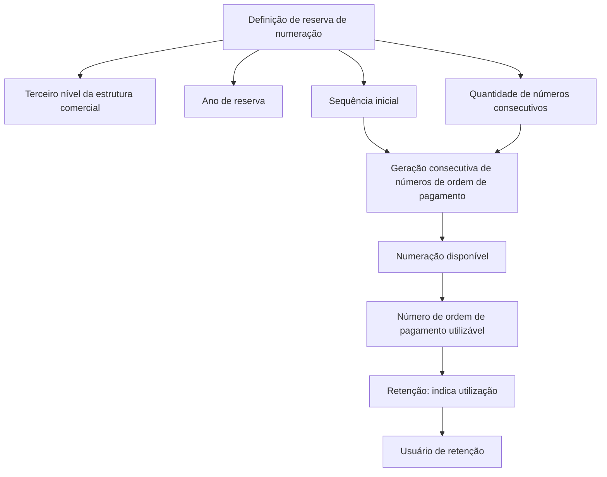

# Definição de Reserva de Numeração de Ordem de Pagamento

## 1. Metadados do Documento
- **Arquivo de Origem:** `Não identificado`
- **Tipo de Documento:** Especificação Técnica
- **Domínio / Sistema:** Reserva de numeração de ordem de pagamento
- **Público-Alvo:** Desenvolvedores, Arquitetos, Operação e Negócio
- **Data/Versão Identificada:** Não identificada

---

## 2. Resumo Executivo & Contexto de Negócio

O documento descreve a funcionalidade de **definição de reserva de numeração de ordem de pagamento**. O objetivo declarado é determinar antecipadamente os números sequenciais que poderão ser usados na criação de ordens de pagamento.

A reserva é configurada para uma estrutura comercial específica, identificada pelo terceiro nível da estrutura comercial, e para um ano de reserva. A configuração também determina a sequência inicial e a quantidade de números consecutivos de ordens de pagamento a gerar.

Após a geração, os números compõem a numeração disponível. Cada número de ordem de pagamento disponível pode ser consultado quanto à sua utilização, incluindo a indicação de retenção e o usuário associado ao uso do número.

O conteúdo não detalha interfaces, métodos HTTP, contratos JSON, persistência, mecanismos de concorrência, critérios de expiração ou integração com outros sistemas. O documento apresenta propriedades funcionais da reserva e da numeração disponível.

---

## 3. Arquitetura, Componentes & Tecnologias Envolvidas

O documento cita os seguintes conceitos funcionais:

- Definição de reserva de numeração.
- Estrutura comercial, identificada por seu terceiro nível.
- Ano de reserva.
- Sequência inicial.
- Quantidade de números consecutivos a gerar.
- Numeração disponível.
- Número de ordem de pagamento.
- Retenção do número.
- Usuário de retenção.

Não são informadas tecnologias, bancos de dados, microsserviços, APIs, URLs, ambientes, protocolos ou ferramentas de implantação.



**Nota de Análise:** o diagrama representa apenas a relação funcional explicitada pelo documento. O texto não especifica componentes técnicos responsáveis por armazenar, gerar, reservar ou consumir os números de ordem de pagamento.

---

## 4. Regras de Negócio, Especificações Funcionais & Processos

### Objetivo da reserva de numeração

A definição de reserva de numeração tem como objetivo determinar números sequenciais gerados previamente para utilização durante a criação de ordens de pagamento.

### Identificação da reserva

A reserva de numeração é definida considerando:

1. **Terceiro nível da estrutura comercial:** identifica a estrutura comercial para a qual a reserva de numeração é definida.
2. **Ano de reserva:** identifica o ano para o qual a definição de reserva está sendo realizada.
3. **Sequência:** determina o número sequencial a partir do qual deve começar a geração consecutiva da numeração de ordens de pagamento.
4. **Número de reserva até:** identifica a quantidade de números consecutivos de ordens de pagamento que devem ser gerados.

### Numeração disponível

Após a geração da reserva, a numeração disponível contém números de ordem de pagamento que podem ser utilizados.

Para cada número de ordem de pagamento disponível, o documento apresenta os seguintes atributos:

- **Número de ordem de pagamento:** número que pode ser utilizado.
- **Retenção:** indica se o número de ordem de pagamento está sendo utilizado.
- **Usuário de retenção:** indica o usuário que está utilizando o número de ordem de pagamento.

### Fluxo funcional identificado

1. Definir a reserva para o terceiro nível de uma estrutura comercial.
2. Informar o ano de reserva.
3. Determinar a sequência inicial.
4. Informar a quantidade de números consecutivos a gerar.
5. Gerar previamente a numeração consecutiva de ordens de pagamento.
6. Disponibilizar os números de ordem de pagamento gerados para utilização.
7. Indicar, para cada número disponível, se existe retenção.
8. Registrar ou apresentar o usuário associado à retenção do número, quando aplicável.

**Nota de Análise:** o documento não informa se a retenção impede reutilização, como a retenção é criada ou removida, nem quais eventos alteram o status de utilização de um número de ordem de pagamento.

---

## 5. Tabelas de Parâmetros, Ambientes e Estruturas de Dados

| Item / Parâmetro | Descrição / Função | Tipo / Valores / Formato | Ambiente / Observações |
| :--- | :--- | :--- | :--- |
| Terceiro nível da estrutura comercial | Identifica a estrutura comercial para a qual a reserva de numeração é definida. | Não especificado | Propriedade geral da reserva. |
| Ano de reserva | Contém o ano para o qual a definição de reserva está sendo realizada. | Ano; formato não especificado | Propriedade geral da reserva. |
| Sequência | Determina o número de sequência a partir do qual começa a geração consecutiva da numeração de ordens de pagamento. | Número sequencial; formato não especificado | Propriedade geral da reserva. |
| Número de reserva até | Identifica a quantidade de números consecutivos de ordens de pagamento que devem ser gerados. | Quantidade; formato não especificado | Define o volume de números na reserva. |
| Numeração disponível | Conjunto de números de ordem de pagamento gerados e disponíveis para uso. | Não especificado | Resultante da geração consecutiva. |
| Número de ordem de pagamento | Número de ordem de pagamento que pode ser utilizado. | Não especificado | Campo associado à numeração disponível. |
| Retenção | Indica se o número de ordem de pagamento está sendo utilizado. | Indicador; valores não especificados | Campo associado ao número de ordem de pagamento. |
| Usuário de retenção | Indica o usuário que está utilizando o número de ordem de pagamento. | Identificador de usuário; formato não especificado | Campo associado à retenção. |

**Ambientes, servidores, URLs e rotas de log:** não identificados no conteúdo fornecido.

---

## 6. Bateria de Perguntas & Respostas para RAG (FAQ Sintético)

### P1: Qual é o objetivo da definição de reserva de numeração de ordem de pagamento?
**R:** O objetivo é determinar previamente números sequenciais que poderão ser utilizados na criação de ordens de pagamento.

### P2: Para qual unidade organizacional a reserva de numeração é definida?
**R:** A reserva de numeração é definida para o terceiro nível da estrutura comercial, que identifica a estrutura comercial à qual a reserva se aplica.

### P3: Qual é a finalidade do campo Ano de reserva?
**R:** O campo Ano de reserva contém o ano para o qual a definição de reserva de numeração está sendo realizada.

### P4: O que a propriedade Sequência determina na reserva de numeração?
**R:** A propriedade Sequência determina o número a partir do qual deve começar a geração consecutiva da numeração de ordens de pagamento.

### P5: O que significa o campo Número de reserva até?
**R:** O campo Número de reserva até identifica a quantidade de números consecutivos de ordens de pagamento que devem ser gerados na reserva.

### P6: O que é a numeração disponível?
**R:** A numeração disponível corresponde aos números de ordem de pagamento gerados previamente que podem ser utilizados na criação de ordens de pagamento.

### P7: Como o documento define um número de ordem de pagamento disponível?
**R:** Um número de ordem de pagamento disponível é um número de ordem de pagamento que pode ser utilizado.

### P8: O que o indicador Retenção informa?
**R:** O indicador Retenção informa se um número de ordem de pagamento está sendo utilizado.

### P9: O que o campo Usuário de retenção informa?
**R:** O campo Usuário de retenção indica qual usuário está utilizando o número de ordem de pagamento.

### P10: O documento especifica métodos HTTP ou contratos JSON para a reserva de numeração?
**R:** Não. O documento apresenta propriedades funcionais da reserva e da numeração disponível, mas não detalha métodos HTTP, contratos JSON, APIs ou interfaces técnicas.

### P11: O documento define como a retenção é removida ou liberada?
**R:** Não. O conteúdo apenas informa que a retenção indica se o número de ordem de pagamento está sendo utilizado e que o usuário de retenção identifica o usuário que o utiliza.

---

## 7. Glossário de Termos, Siglas & Conceitos-Chave

- **Reserva de numeração:** definição prévia de números sequenciais para posterior utilização na criação de ordens de pagamento.
- **Ordem de pagamento:** entidade para a qual são gerados números sequenciais que podem ser utilizados.
- **Terceiro nível da estrutura comercial:** nível da estrutura comercial que identifica a unidade para a qual uma reserva de numeração é definida.
- **Ano de reserva:** ano associado à definição da reserva de numeração.
- **Sequência:** número a partir do qual a geração consecutiva da numeração de ordens de pagamento deve começar.
- **Número de reserva até:** quantidade de números consecutivos de ordem de pagamento que devem ser gerados.
- **Numeração disponível:** números de ordem de pagamento que podem ser utilizados.
- **Retenção:** indicação de que o número de ordem de pagamento está sendo utilizado.
- **Usuário de retenção:** usuário que está utilizando o número de ordem de pagamento.

---

## 8. Notas Críticas, Riscos & Limitações

- O documento não identifica o arquivo de origem, data, versão, autor ou responsáveis pelo conteúdo.
- Não há detalhamento de tecnologias, componentes técnicos, APIs, serviços, bancos de dados, URLs, ambientes ou credenciais.
- Não são especificadas validações para ano de reserva, sequência inicial ou quantidade de números consecutivos.
- O documento não esclarece se reservas podem se sobrepor para a mesma estrutura comercial e ano.
- Não há definição de comportamento para números já utilizados, retenções expiradas, cancelamentos ou liberação de retenção.
- Não são descritas regras de concorrência, auditoria, rastreabilidade, controle de acesso ou permissões.
- O documento lista propriedades funcionais, mas não detalha os métodos HTTP ou contratos JSON eventualmente expostos para essa funcionalidade.

---

## 9. Conteúdo Bruto Estruturado (Referência Fiel)

```text
--- [PÁGINA 1 DE 2] ---

EN CONSTRUCCIÓN
DEFINICIÓN de reserva de numeración de
orden de pago
Objetivo
Determinar los números secuenciales que se generarán previamente, para que puedan ser utilizados
en la creación de órdenes de pago.
Propiedades generales
Numeración disponible
Propiedades generales
Tercer nivel de la estructura comercial
Identifica la estructura comercial para la que se define la reserva de numeración.
Año de reserva
Esta propiedad contiene el año para el que se está realizando la definición.
Secuencia
Determina el número de secuencia desde el que debe comenzar la generación consecutiva de
numeración de órdenes de pago.
 / 
 CF
Inicio Soluciones APIs Documentación Zeus
ES


--- [PÁGINA 2 DE 2] ---

Número de reserva hasta
Esta propiedad identifica la cantidad de números consecutivos de órdenes de pago que se deben
generar.
Numeración disponible
Número de orden de pago
Número de orden de pago que puede ser utilizado.
Retención
Indica si el número de orden de pago está siendo utilizado.
Usuario retención
Indica el usuario que está utilizando el número de orden de pago.
```
