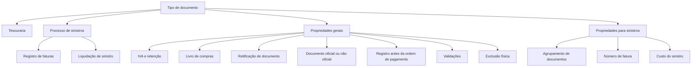

# Definição de Tipos de Documento de Cobrança e Pagamento

## 1. Metadados do Documento
- **Arquivo de Origem:** Não identificado no conteúdo bruto
- **Tipo de Documento:** Especificação Funcional
- **Domínio / Sistema:** Tesouraria e Siniestros (Sinistros)
- **Público-Alvo:** Analistas Funcionais, Desenvolvedores, Operação, Negócio
- **Data/Versão Identificada:** Não identificada

---

## 2. Resumo Executivo & Contexto de Negócio

O documento define a configuração de tipos de documentos utilizados como comprovantes de cobranças e pagamentos na companhia. Cada tipo possui uma chave identificadora e um nome associado, permitindo seu uso tanto em processos de tesouraria quanto em processos de sinistros.

A especificação descreve propriedades gerais que determinam como cada documento deve ser classificado, tratado contabilmente, validado, registrado e eventualmente removido. Entre os controles definidos estão incidência de IVA, retenção, registro no livro de compras, classificação como documento oficial e capacidade de retificar documentos emitidos anteriormente.

O processo também contempla documentos não oficiais, empregados em pagamentos como indenizações a segurados, reembolsos de faturas previamente pagas por terceiros envolvidos em sinistros e adiantamentos de comissões a agentes. Esses documentos não exigem a mesma classificação fiscal de documentos oficiais.

Para o domínio de sinistros, o documento adiciona propriedades específicas para determinar se um tipo documental participa do processo, o nome apresentado ao usuário, a possibilidade de agrupar liquidações, a obrigatoriedade de número de fatura, a relação de impostos com o custo do sinistro e o registro no processo denominado registro de faturas.

---

## 3. Arquitetura, Componentes & Tecnologias Envolvidas

Os componentes e domínios explicitamente mencionados são:

| Componente / Domínio | Função descrita |
| :--- | :--- |
| Tipos de documento | Representam documentos usados como justificantes de cobrança ou pagamento. |
| Tesouraria | Utiliza tipos de documento para cobrar ou pagar. |
| Siniestros / Sinistros | Utiliza tipos de documento em processos relacionados a sinistros. |
| Livro de compras | Pode receber o registro do documento conforme a propriedade configurada. |
| Ordem de pagamento | É gerada após ou em relação ao registro documental; documentos previamente registrados devem ser validados contra as informações registradas. |
| Registro de faturas | Processo de registro de documentos de pagamento no contexto de sinistros. |
| Liquidação de sinistro | Processo que valida a existência de todas as liquidações agrupadas quando o documento permite agrupamento. |
| Home Solutions APIs Documentation Zeus | Texto citado no conteúdo bruto, sem contexto funcional, técnico ou arquitetural adicional. |



> **Nota de Análise:** O conteúdo não descreve tecnologias de implementação, integrações de API, contratos HTTP, banco de dados, ambientes, URLs ou mecanismos de autenticação.

---

## 4. Regras de Negócio, Especificações Funcionais & Processos

### Identificação do tipo de documento
1. Cada tipo de documento possui uma chave usada para identificá-lo.
2. A chave identifica o documento utilizado para cobrança ou pagamento em tesouraria e em sinistros.
3. Cada chave possui um nome de documento associado.

### Classificação operacional
1. A propriedade **Documento de cobro o pago** informa em quais tipos de operações o documento pode ser utilizado, de acordo com sua classificação.
2. A propriedade **Incluye IVA** indica se o documento pode conter IVA.
3. A propriedade **Incluye retención** indica se o documento pode conter retenção.
4. A propriedade **Libro de compras** informa se o documento deve ser registrado no livro de compras.

### Retificação de documentos oficiais
1. Quando um documento oficial já emitido precisa ser modificado, deve ser criado um novo documento.
2. O novo documento deve ajustar o documento original emitido.
3. A propriedade **Rectifica documento** informa se um documento modifica outro documento original.
4. Notas de crédito e notas de débito são normalmente utilizadas para atualizações de documentos.
5. A escolha entre nota de crédito e nota de débito depende de o ajuste representar uma entrada ou uma saída de dinheiro.

### Classificação fiscal e oficialidade
1. A propriedade **Documento real** identifica se o tipo documental é oficial ou não oficial.
2. Documentos oficiais são documentos que devem levar impostos.
3. Documentos não oficiais não possuem essa exigência fiscal indicada no texto.
4. Documentos não oficiais podem ser utilizados para:
   - Pagamentos de indenizações a segurados.
   - Adiantamentos de comissões a agentes.
   - Reembolsos de faturas pagas previamente por terceiros envolvidos em um sinistro.
5. Os documentos de indenização ou reembolso apresentados como exemplo não são documentos oficiais.

### Registro e validação
1. A propriedade **Registra documento** informa se o documento deve ser registrado antes da geração da ordem de pagamento.
2. Quando, no momento da geração da ordem de pagamento, o documento já estiver registrado, o documento deve ser validado contra as informações previamente registradas.
3. A propriedade **Procesos de validación** representa lógica de negócio capaz de realizar validações sobre o documento.
4. Uma validação possível é verificar se uma numeração ou codificação específica foi inserida corretamente.
5. A propriedade **Permite borrado físico** determina se um documento pode ser apagado fisicamente após seu registro.

### Regras específicas de sinistros
1. A propriedade **Documento para siniestros** indica se um tipo documental é usado no processo de sinistros.
2. A propriedade **Nombre del documento para siniestros** define o nome exibido no processo de sinistros para aquele tipo de documento.
3. A propriedade **Agrupa documentos** determina se um documento pode agrupar outros documentos.
4. Durante a liquidação de um sinistro, caso o documento permita agrupamento, deve ser validado se todas as liquidações agrupadas pelo documento foram geradas.
5. A propriedade **Número de factura** define se é obrigatório identificar um número para o documento no processo de sinistros.
6. A propriedade **Coste del siniestro** indica se o imposto associado ao documento integra o custo do sinistro.
7. A propriedade **Registra documento siniestros** indica se o documento é registrado no processo de registro de documentos de pagamento, denominado registro de faturas.

---

## 5. Tabelas de Parâmetros, Ambientes e Estruturas de Dados

| Item / Parâmetro | Descrição / Função | Tipo / Valores / Formato | Ambiente / Observações |
| :--- | :--- | :--- | :--- |
| Tipo de documento | Chave que identifica o documento usado para cobrar ou pagar. | Chave documental; formato não detalhado. | Tesouraria e sinistros. |
| Nome do documento | Nome associado à chave do tipo documental. | Texto; formato não detalhado. | Exemplo: `FA` = Factura. |
| Documento de cobro o pago | Define em que operações o documento pode ser utilizado segundo sua classificação. | Classificação não detalhada. | Cobrança e pagamento. |
| Incluye IVA | Indica se o documento pode conter IVA. | Indicador lógico; valores não detalhados. | Aplicável ao documento. |
| Incluye retención | Indica se o documento pode conter retenção. | Indicador lógico; valores não detalhados. | Aplicável ao documento. |
| Libro de compras | Indica se o documento deve ser registrado no livro de compras. | Indicador lógico; valores não detalhados. | Processo de compras. |
| Rectifica documento | Indica se o documento modifica um documento original emitido. | Indicador lógico; valores não detalhados. | Usado em ajustes de documentos oficiais. |
| Documento real | Identifica se o documento é oficial e deve levar impostos, ou não oficial. | Documento oficial / não oficial. | Indenização e reembolso são exemplos de documentos não oficiais. |
| Registra documento | Indica se o documento é registrado antes de gerar a ordem de pagamento. | Indicador lógico; valores não detalhados. | Exige validação contra informações registradas caso já esteja registrado. |
| Procesos de validación | Lógica de negócio que executa validações sobre o documento. | Regras de validação; formato não detalhado. | Pode validar numeração ou codificação específica. |
| Permite borrado físico | Indica se o documento registrado pode ser apagado fisicamente. | Indicador lógico; valores não detalhados. | Aplicável após o registro. |
| Documento para siniestros | Indica se o documento é utilizado no processo de sinistros. | Indicador lógico; valores não detalhados. | Processo de sinistros. |
| Nombre del documento para siniestros | Nome exibido para o documento no processo de sinistros. | Texto; formato não detalhado. | Processo de sinistros. |
| Agrupa documentos | Indica se o documento pode agrupar outros documentos. | Indicador lógico; valores não detalhados. | Liquidação de sinistro. |
| Número de factura | Indica se o número do documento é obrigatório no processo de sinistros. | Indicador lógico; valores não detalhados. | Processo de sinistros. |
| Coste del siniestro | Indica se o imposto do documento faz parte do custo do sinistro. | Indicador lógico; valores não detalhados. | Processo de sinistros. |
| Registra documento siniestros | Indica se o documento é registrado no processo de registro de faturas. | Indicador lógico; valores não detalhados. | Registro de documentos de pagamento em sinistros. |

| Código de Documento | Nome do Documento | Observação |
| :--- | :--- | :--- |
| FA | Factura | Exemplo fornecido no documento. |
| IN | Indemnización | Exemplo fornecido no documento. |
| NC | Nota de Crédito | Usada normalmente para atualização de documento, conforme o sentido financeiro do ajuste. |
| ND | Nota de Débito | Usada normalmente para atualização de documento, conforme o sentido financeiro do ajuste. |

---

## 6. Bateria de Perguntas & Respostas para RAG (FAQ Sintético)

### P1: Qual é o objetivo da definição de tipos de documento de cobrança e pagamento?
**R:** O objetivo é identificar os documentos tratados pela companhia como justificantes de cobranças ou pagamentos e estabelecer as características de cada tipo documental.

### P2: Onde um tipo de documento pode ser utilizado?
**R:** Um tipo de documento pode ser utilizado para cobrança ou pagamento nos domínios de tesouraria e de sinistros, conforme a chave e as propriedades configuradas para o documento.

### P3: Quando um documento deve retificar outro documento?
**R:** Um documento deve retificar outro quando um documento oficial já emitido necessita ser modificado. Nesse caso, é necessário criar um novo documento para ajustar o documento original emitido.

### P4: Quais documentos são normalmente usados para atualizar documentos emitidos?
**R:** Notas de crédito e notas de débito são normalmente utilizadas para atualizar documentos emitidos. A escolha depende de o ajuste representar uma entrada ou uma saída de dinheiro.

### P5: O que significa a propriedade “Documento real”?
**R:** A propriedade “Documento real” identifica se um documento é oficial ou não oficial. Um documento oficial deve levar impostos; documentos não oficiais podem ser usados, por exemplo, para indenizações a segurados, adiantamentos de comissão a agentes e reembolsos relacionados a sinistros.

### P6: O que acontece se o documento já estiver registrado ao gerar a ordem de pagamento?
**R:** Se o documento já estiver registrado no momento da geração da ordem de pagamento, ele deve ser validado contra as informações que já foram registradas.

### P7: Que validações podem ser executadas pelos processos de validação?
**R:** Os processos de validação podem executar qualquer validação de negócio sobre o documento. O exemplo apresentado consiste em validar se uma numeração ou codificação específica foi informada corretamente.

### P8: Quando um documento pode ser apagado fisicamente?
**R:** Um documento pode ser apagado fisicamente após o registro somente quando a propriedade “Permite borrado físico” indicar que a exclusão física é permitida.

### P9: Como funciona o agrupamento de documentos em sinistros?
**R:** Quando um documento permite agrupar outros documentos, a liquidação de um sinistro deve validar se todas as liquidações agrupadas por esse documento foram geradas.

### P10: O número de fatura é sempre obrigatório no processo de sinistros?
**R:** O documento não afirma que o número de fatura é sempre obrigatório. A obrigatoriedade é definida pela propriedade “Número de factura” para cada tipo de documento utilizado no processo de sinistros.

### P11: O imposto de um documento pode compor o custo do sinistro?
**R:** Sim. A propriedade “Coste del siniestro” informa se o imposto associado ao documento é considerado parte do custo do sinistro.

### P12: O que é o registro de faturas em sinistros?
**R:** O registro de faturas é o processo de registro de documentos de pagamento no contexto de sinistros. A propriedade “Registra documento siniestros” indica se um tipo documental deve ser registrado nesse processo.

---

## 7. Glossário de Termos, Siglas & Conceitos-Chave

- **FA:** Código de documento associado a `Factura`.
- **IN:** Código de documento associado a `Indemnización`.
- **NC:** Código de documento associado a `Nota de Crédito`.
- **ND:** Código de documento associado a `Nota de Débito`.
- **IVA:** Imposto que um documento pode ou não incluir; o significado expandido não é apresentado no conteúdo.
- **Tesouraria:** Domínio que utiliza tipos de documento para processos de cobrança e pagamento.
- **Siniestros / Sinistros:** Domínio de processamento de sinistros no qual existem propriedades documentais específicas.
- **Documento oficial:** Documento que deve levar impostos.
- **Documento não oficial:** Documento utilizado em casos como indenizações, reembolsos e adiantamentos de comissões, sem a classificação fiscal indicada para documentos oficiais.
- **Retenção:** Encargo que um documento pode incluir conforme sua configuração.
- **Livro de compras:** Registro no qual um documento pode precisar ser lançado.
- **Ordem de pagamento:** Etapa de pagamento cuja geração pode exigir validação de documentos já registrados.
- **Liquidação de sinistro:** Processo que valida a geração de liquidações agrupadas por documento.
- **Registro de faturas:** Processo de registro de documentos de pagamento em sinistros.

---

## 8. Notas Críticas, Riscos & Limitações

- O documento não informa valores permitidos, formatos, obrigatoriedades padrão ou regras de preenchimento para as propriedades descritas.
- Não há detalhamento de telas, APIs, contratos JSON, serviços, persistência de dados, integrações, tecnologias ou ambientes.
- A regra para selecionar nota de crédito ou nota de débito menciona entrada ou saída de dinheiro, mas não define o mapeamento explícito entre cada tipo de nota e cada direção financeira.
- O texto cita `Home Solutions APIs Documentation Zeus`, porém não explica sua relação com a especificação de tipos de documento.
- A propriedade de validação admite “qualquer validação” de negócio, mas o documento fornece somente o exemplo de validação de numeração ou codificação.
- Não são definidos critérios de auditoria, autorização, rastreabilidade ou tratamento de erro para registro, validação, retificação ou exclusão física.

---

## 9. Conteúdo Bruto Estruturado (Referência Fiel)

```text
--- [PÁGINA 1 DE 4] ---

DEFINIR Tipo de documento de cobro y pago
Objetivo
Identificar los distintos documentos que se tratan en la compañía como justificantes de cobros o de
pagos, estableciendo las características de cada uno de ellos.
Propiedades generales
Propiedades para siniestros
Propiedades generales
Tipo de documento
Esta propiedad contendrá la clave con la que se va a identificar al documento que se va a utilizar
para cobrar o pagar tanto en tesorería como en siniestros.
Nombre del documento
Esta propiedad contiene el nombre que se asocia a la clave del documento.
Ejemplo:
DOCUMENTO NOMBRE
FA Factura
 /
 CF
Home Solutions APIs Documentation Zeus
EN


--- [PÁGINA 2 DE 4] ---

DOCUMENTO NOMBRE
IN Indemnización
NC Nota de Crédito
ND Nota de Débito
Documento de cobro o pago
Indica en que tipo de operaciones se puede utilizar el documento, según su clasificación
Incluye IVA
Esta propiedad indica si el documento puede llevar IVA.
Incluye retención
Indica si el documento puede llevar retención.
Libro de compras
Indica si el documento se debe registrar en el libro de compras.
Rectifica documento
Si un documento oficial ya emitido, necesita ser modificado, es necesario crear un nuevo documento
para ajustar dicho documento original.
Esta propiedad indica si se trata de un documento que modifica otro documento original emitido.
Normalmente, los documentos utilizados para estas actualizaciones son notas de crédito o notas de
débito, en función de que suponga una entrada o una salida de dinero.
Documento real
Esta propiedad identifica el tipo de documento como documento oficial o no, es decir, documento que
debe llevar impuestos, o no.
Se utilizan documentos no oficiales para pagos de indemnizaciones a asegurados, adelantos de
comisiones a agentes, etc.
Ejemplo:
Los documentos que se utilizan para Indemnización o Reembolso no son documentos oficiales, son
documentos que se van a utilizar para pagar a terceros involucrados en un siniestro, a los cuales hay


--- [PÁGINA 3 DE 4] ---

que indemnizar o hay que reembolsar una factura pagada previamente por estos.
Registra documento
Indica si el documento se registra antes de generar la orden de pago.
Si en el momento de la generación de la orden de pago, el documento ya está registrado, se debe
validar contra la información registrada.
Procesos de validación
Lógica de negocio que puede realizar cualquier validación sobre el documento.
Ejemplo
Si el documento tiene una numeración o codificación específica, se podría validar si dicha
codificación se ha introducido correctamente.
Permite borrado físico
Indica si el documento se puede borrar físicamente, una vez registrado.
Propiedades para siniestros
Documento para siniestros
Indica si el documento es utilizado en el proceso de siniestros.
Nombre del documento para siniestros
Contiene el nombre que se mostrará en el proceso de siniestros cuando se utilice este tipo de
documento.
Agrupa documentos
Indica si el documento puede agrupar a otros documentos. En el momento de la liquidación de un
siniestro, si el documento permite agrupación, se valida que estén generadas todas las liquidaciones
agrupadas por el documento.
Número de factura
Indica si en el proceso de siniestros es obligatorio identificar un número para el documento.
Coste del siniestro
Esta propiedad indica si el impuesto que lleva el documento es parte del coste del siniestro.


--- [PÁGINA 4 DE 4] ---

Registra documento siniestros
Indica si el documento se registra en el proceso de registro de documentos de pago, llamado registro
de facturas.
```
