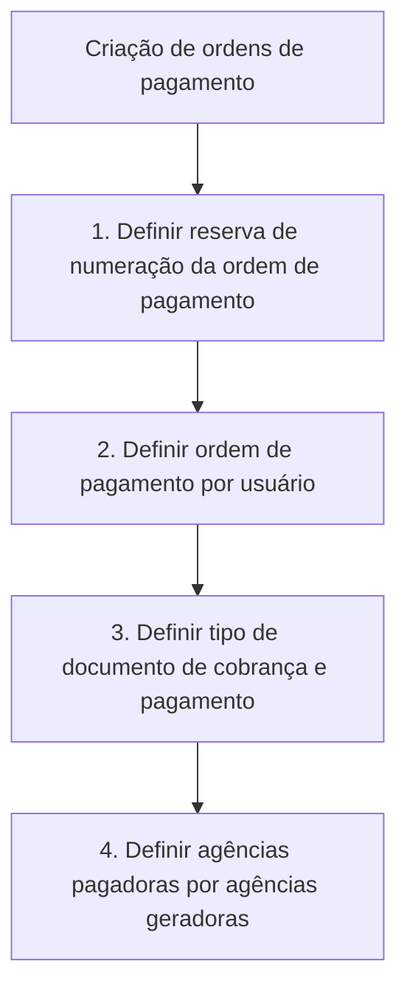

# Definição de Ordem de Pagamento — Documento em Construção

## 1. Metadados do Documento
- **Arquivo de Origem:** Não identificado no conteúdo fornecido
- **Tipo de Documento:** Especificação Técnica
- **Domínio / Sistema:** Ordens de pagamento; Home Solutions APIs Documentation Zeus
- **Público-Alvo:** Desenvolvedores, Arquitetos, Operação e Negócio
- **Data/Versão Identificada:** Não identificada

---

## 2. Resumo Executivo & Contexto de Negócio

O documento apresenta uma definição em construção para a criação de ordens de pagamento. O objetivo explicitamente declarado é definir a informação necessária para a criação dessas ordens de pagamento.

O processo indicado é composto por quatro definições: reserva de numeração da ordem de pagamento, definição da ordem de pagamento por usuário, definição do tipo de documento de cobrança e pagamento, e definição de agências pagadoras por agências geradoras.

A sequência visual do documento numera as quatro definições de 1 a 4, indicando uma ordenação do processo. Entretanto, o texto disponível não detalha critérios, responsáveis, regras de validação, formatos de dados, contratos de API ou condições de exceção.

O rodapé referencia “Home Solutions APIs Documentation Zeus” e “CF”. O conteúdo fornecido não explica o significado de “Zeus”, “CF” ou a relação desses termos com a definição de ordem de pagamento.

---

## 3. Arquitetura, Componentes & Tecnologias Envolvidas

Os elementos identificados no documento são:

- Processo de criação de ordens de pagamento.
- Reserva de numeração de ordem de pagamento.
- Ordem de pagamento por usuário.
- Tipo de documento de cobrança e pagamento.
- Agências pagadoras e agências geradoras.
- Referência a “Home Solutions APIs Documentation Zeus”.
- Referência a “CF”.



> **Nota de Análise:** O documento não descreve arquitetura de software, integrações, microsserviços, métodos HTTP, contratos JSON, bancos de dados, ambientes ou tecnologias de implementação.

---

## 4. Regras de Negócio, Especificações Funcionais & Processos

O documento define como objetivo a identificação das informações necessárias para criar ordens de pagamento.

O processo apresentado contém as seguintes etapas:

1. **Definir reserva de numeração da ordem de pagamento**  
   O documento exige uma definição relacionada à reserva de numeração para ordens de pagamento. Não são informados formato, sequência, unicidade, reinicialização, responsável pela reserva ou mecanismo técnico.

2. **Definir ordem de pagamento por usuário**  
   O documento exige definir a ordem de pagamento por usuário. Não são detalhados os atributos do usuário, permissões, regras de associação, limites ou fluxo de aprovação.

3. **Definir tipo de documento de cobrança e pagamento**  
   O documento exige definir o tipo de documento utilizado para cobrança e pagamento. Não apresenta catálogo de tipos, códigos, regras de obrigatoriedade ou mapeamentos contábeis.

4. **Definir agências pagadoras por agências geradoras**  
   O documento exige definir a relação entre agências pagadoras e agências geradoras. Não especifica cardinalidade, critérios de seleção, exceções ou estrutura de dados para essa relação.

---

## 5. Tabelas de Parâmetros, Ambientes e Estruturas de Dados

| Item / Parâmetro | Descrição / Função | Tipo / Valores / Formato | Ambiente / Observações |
| :--- | :--- | :--- | :--- |
| Objetivo | Definir a informação necessária para criação de ordens de pagamento | Texto descritivo | Documento marcado como “EN CONSTRUCCIÓN” |
| Reserva de numeração da ordem de pagamento | Primeira definição do processo | Não informado | Sem regras de numeração detalhadas |
| Ordem de pagamento por usuário | Segunda definição do processo | Não informado | Sem atributos ou permissões detalhados |
| Tipo de documento de cobrança e pagamento | Terceira definição do processo | Não informado | Sem catálogo ou códigos de documento |
| Agências pagadoras por agências geradoras | Quarta definição do processo | Não informado | Sem mapeamento de agências apresentado |
| Home Solutions APIs Documentation Zeus | Referência presente no rodapé | Não informado | Relação com o processo não detalhada |
| CF | Referência presente no rodapé | Não informado | Significado não definido no conteúdo |

---

## 6. Bateria de Perguntas & Respostas para RAG (FAQ Sintético)

### P1: Qual é o objetivo da definição de ordem de pagamento?
**R:** O objetivo declarado é definir a informação necessária para a criação de ordens de pagamento.

### P2: Quantas etapas compõem o processo de definição de ordem de pagamento?
**R:** O processo apresentado possui quatro etapas: definir a reserva de numeração, definir a ordem de pagamento por usuário, definir o tipo de documento de cobrança e pagamento e definir as agências pagadoras por agências geradoras.

### P3: Qual é a primeira etapa do processo de criação de ordens de pagamento?
**R:** A primeira etapa é definir a reserva de numeração da ordem de pagamento.

### P4: O documento especifica o formato ou a regra de geração da numeração da ordem de pagamento?
**R:** Não. O documento apenas indica que a reserva de numeração da ordem de pagamento deve ser definida, sem informar formato, sequência ou regras de unicidade.

### P5: Como a ordem de pagamento é relacionada a usuários?
**R:** O documento apresenta “definir ordem de pagamento por usuário” como a segunda etapa do processo, mas não detalha a forma de associação, permissões ou regras aplicáveis aos usuários.

### P6: O que deve ser definido sobre documentos de cobrança e pagamento?
**R:** Deve ser definido o tipo de documento de cobrança e pagamento. O conteúdo não apresenta os tipos disponíveis, códigos ou regras de uso.

### P7: Qual é a relação de agências que precisa ser definida?
**R:** O documento determina que sejam definidas agências pagadoras por agências geradoras. Não há detalhamento sobre os critérios ou a estrutura desse relacionamento.

### P8: O documento descreve APIs, métodos HTTP ou contratos JSON para ordens de pagamento?
**R:** Não. Embora o rodapé mencione “Home Solutions APIs Documentation Zeus”, o conteúdo fornecido não descreve APIs, métodos HTTP, endpoints, contratos JSON ou integrações.

### P9: O documento está finalizado?
**R:** Não. O cabeçalho contém a expressão “EN CONSTRUCCIÓN”, indicando que o conteúdo está em construção.

### P10: O que significa a referência “CF” no documento?
**R:** O significado de “CF” não é definido no conteúdo fornecido. A sigla aparece no rodapé sem explicação adicional.

---

## 7. Glossário de Termos, Siglas & Conceitos-Chave

- **Ordem de pagamento:** Entidade central mencionada no documento, cuja criação requer a definição de determinadas informações. O documento não fornece uma definição funcional adicional.
- **Reserva de numeração:** Elemento que deve ser definido para a ordem de pagamento. O documento não informa como ocorre a reserva.
- **Documento de cobrança e pagamento:** Tipo de documento que deve ser definido no processo. Não há tipos ou atributos especificados.
- **Agência pagadora:** Agência relacionada ao pagamento, mencionada na definição de agências pagadoras por agências geradoras.
- **Agência geradora:** Agência relacionada à geração, mencionada na definição de agências pagadoras por agências geradoras.
- **CF:** Sigla exibida no rodapé; significado não informado.
- **Zeus:** Termo presente em “Home Solutions APIs Documentation Zeus”; significado e função não informados.

---

## 8. Notas Críticas, Riscos & Limitações

- O documento está explicitamente marcado como **“EN CONSTRUCCIÓN”**.
- Não há nome de arquivo, data, versão ou autoria identificados.
- Não há definição de modelo de dados, campos obrigatórios, formatos, valores permitidos ou regras de validação.
- Não há detalhamento sobre autenticação, autorização, responsabilidades por usuário ou matriz de permissões.
- Não há informações sobre APIs, URLs, ambientes, logs, servidores, integrações ou tecnologias.
- Não há especificação de exceções, erros, contingência ou auditoria.
- “CF” e “Home Solutions APIs Documentation Zeus” aparecem sem contextualização suficiente para interpretação conclusiva.

---

## 9. Conteúdo Bruto Estruturado (Referência Fiel)

```text
--- [PÁGINA 1 DE 1] ---

EN CONSTRUCCIÓN
DEFINICIÓN de orden de pago
Objetivo
Definición de la información necesaria para la creación de órdenes de pago
Proceso a seguir
DEFINIR reserva
numeración
orden pago
(1)
DEFINIR orden
pago por
usuario
(2)
DEFINIR tipo
de documento
de cobro y pago
(3)
DEFINIR agencias
pagadoras por
generadoras
(4)
1. DEFINIR reserva numeración orden pago
1. DEFINIR orden pago por usuario
1. DEFINIR tipo de documento de cobro y pago
1. DEFINIR agencias pagadoras por generadoras
 / 
 CF
Home Solutions APIs Documentation Zeus
EN
```
