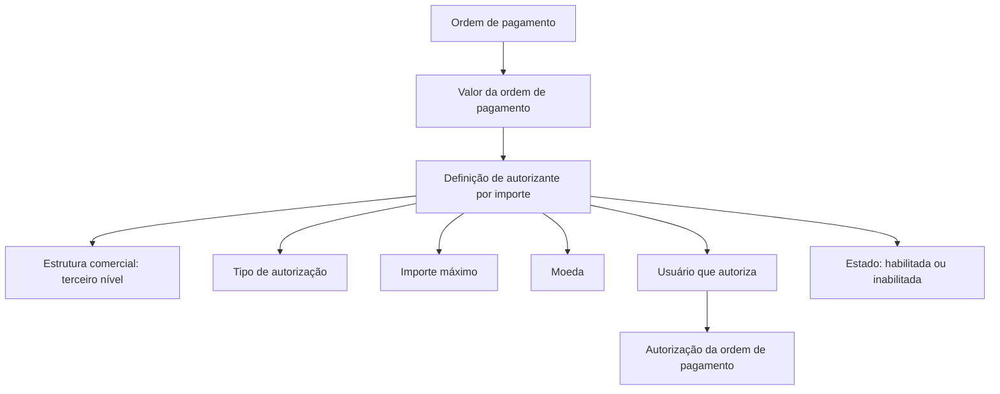

# Definição de Autorizante por Importe para Ordens de Pagamento

## 1. Metadados do Documento
- **Arquivo de Origem:** Não identificado no conteúdo fornecido
- **Tipo de Documento:** Especificação Funcional
- **Domínio / Sistema:** Autorização de ordens de pagamento / Tesouraria
- **Público-Alvo:** Desenvolvedores, Analistas Funcionais, Operação e Negócio
- **Data/Versão Identificada:** Não identificada

---

## 2. Resumo Executivo & Contexto de Negócio

O documento descreve a funcionalidade **“Definición de autorizante por importe”**, destinada a determinar quais usuários podem autorizar uma ordem de pagamento conforme o valor da ordem. A definição combina estrutura comercial, usuário autorizante, tipo de autorização, valor máximo permitido e moeda.

A estrutura comercial utilizada na configuração corresponde ao **terceiro nível da estrutura comercial**. Para cada definição, é registrado um usuário apto a realizar a autorização e o tipo de autorização ao qual a regra se aplica.

O controle financeiro é realizado por meio de um **importe máximo**: o usuário configurado pode autorizar ordens de pagamento até o valor definido, expresso em uma moeda igualmente configurada. O documento não detalha o comportamento para valores acima do importe máximo, múltiplas definições concorrentes ou ausência de configuração aplicável.

A definição pode ser marcada como **inhabilitada**, permitindo que uma regra deixe de ser considerada sem que o documento informe a necessidade de exclusão do registro. O documento apresenta os tipos de autorização disponíveis, incluindo Tesouraria, Sinistros, Devolução de prêmio, Agentes, Coasseguro, Resseguro e Vida.

---

## 3. Arquitetura, Componentes & Tecnologias Envolvidas

O conteúdo fornecido não descreve arquitetura de software, microsserviços, APIs, bancos de dados, tecnologias, ambientes ou integrações técnicas.

Os elementos funcionais identificados são:

- Configuração de definição de autorizante por importe.
- Estrutura comercial no terceiro nível.
- Usuário que realiza a autorização.
- Tipo de autorização.
- Importe máximo autorizável.
- Moeda do importe.
- Indicador de inabilitação da definição.
- Ordem de pagamento como objeto sujeito à autorização.

O fluxo funcional inferível a partir do objetivo declarado é limitado à determinação do usuário autorizado segundo o importe da ordem de pagamento. O documento não detalha regras de seleção, prioridade, persistência, interfaces ou contratos técnicos.



> **Nota de Análise:** O diagrama representa somente os elementos explicitamente descritos no documento. O conteúdo não define a lógica de comparação entre o importe da ordem de pagamento e o importe máximo, nem o tratamento de definições inabilitadas.

---

## 4. Regras de Negócio, Especificações Funcionais & Processos

### 4.1 Objetivo da definição

A funcionalidade determina os usuários que poderão autorizar o pagamento de uma ordem de pagamento de acordo com o seu importe.

### 4.2 Estrutura comercial

A propriedade de estrutura comercial identifica a estrutura comercial para a qual a definição de autorizante por importe é realizada. O documento estabelece que essa estrutura corresponde ao **terceiro nível da estrutura comercial**.

### 4.3 Usuário autorizante

A propriedade **“Usuario que autoriza”** contém a chave do usuário que poderá realizar a autorização da ordem de pagamento.

### 4.4 Tipo de autorização

A propriedade **“Tipo de autorización”** identifica o tipo de autorização afetado pela definição. Os valores apresentados são:

- **(T) Tesorería**
- **(S) Siniestros**
- **(D) Devolución de prima**
- **(A) Agentes**
- **(C) Coaseguro**
- **(R) Reaseguro**
- **(V) Vida**

### 4.5 Importe máximo

A propriedade **“Importe máximo”** representa o valor máximo das ordens de pagamento que podem ser autorizadas pelo usuário configurado na definição.

### 4.6 Moeda

A propriedade **“Moneda”** armazena a chave da moeda na qual o importe definido é expresso.

### 4.7 Inabilitação da definição

A propriedade **“Inhabilitado”** determina se a definição está ativa ou se não pode mais ser considerada.

> **Nota de Análise:** O documento não informa os valores possíveis do indicador de inabilitação, nem detalha se uma definição inabilitada é ignorada imediatamente, preservada para auditoria ou substituída por outra definição.

---

## 5. Tabelas de Parâmetros, Ambientes e Estruturas de Dados

| Item / Parâmetro | Descrição / Função | Tipo / Valores / Formato | Ambiente / Observações |
| :--- | :--- | :--- | :--- |
| Definição de autorizante por importe | Configuração para determinar os usuários aptos a autorizar o pagamento de uma ordem de pagamento conforme o seu importe. | Definição funcional | Não são informados ambiente, sistema técnico ou persistência. |
| Estrutura comercial | Identifica a estrutura comercial à qual a definição é aplicada. | Terceiro nível da estrutura comercial | O documento não informa a chave, código ou modelo dessa estrutura. |
| Usuário que autoriza | Contém a chave do usuário que poderá realizar a autorização. | Chave de usuário | O formato da chave não é detalhado. |
| Tipo de autorização | Identifica o tipo de autorização afetado pela definição. | `(T)`, `(S)`, `(D)`, `(A)`, `(C)`, `(R)`, `(V)` | Os significados estão detalhados na tabela de tipos de autorização. |
| Importe máximo | Define o valor máximo das ordens de pagamento que o usuário pode autorizar. | Importe monetário | A precisão decimal, limites e regras de comparação não são informados. |
| Moeda | Define a chave da moeda na qual o importe é expresso. | Chave de moeda | Não são apresentados códigos de moeda ou formatos aceitos. |
| Inhabilitado | Define se a configuração está ativa ou se não deve mais ser considerada. | Indicador de estado | Os valores técnicos e efeitos operacionais não são detalhados. |

| Código | Tipo de autorização | Descrição disponível no documento |
| :--- | :--- | :--- |
| T | Tesorería | Tipo de autorização de Tesouraria. |
| S | Siniestros | Tipo de autorização de Sinistros. |
| D | Devolución de prima | Tipo de autorização de Devolução de prêmio. |
| A | Agentes | Tipo de autorização de Agentes. |
| C | Coaseguro | Tipo de autorização de Coasseguro. |
| R | Reaseguro | Tipo de autorização de Resseguro. |
| V | Vida | Tipo de autorização de Vida. |

---

## 6. Bateria de Perguntas & Respostas para RAG (FAQ Sintético)

### P1: Qual é o objetivo da definição de autorizante por importe?
**R:** A definição de autorizante por importe determina os usuários que poderão autorizar o pagamento de uma ordem de pagamento de acordo com o importe da ordem.

### P2: Qual nível da estrutura comercial é utilizado na definição?
**R:** A definição utiliza o terceiro nível da estrutura comercial para identificar a estrutura comercial à qual a configuração se aplica.

### P3: Onde é informado o usuário que pode autorizar uma ordem de pagamento?
**R:** O usuário é informado na propriedade **“Usuario que autoriza”**, que contém a chave do usuário habilitado a realizar a autorização.

### P4: O que representa o importe máximo na definição?
**R:** O importe máximo representa o valor máximo das ordens de pagamento que podem ser autorizadas pelo usuário configurado.

### P5: Como a moeda é associada ao importe máximo?
**R:** A propriedade **“Moneda”** contém a chave da moeda na qual o importe definido é expresso.

### P6: Quais tipos de autorização são listados no documento?
**R:** O documento lista os tipos Tesorería, Siniestros, Devolución de prima, Agentes, Coaseguro, Reaseguro e Vida, identificados respectivamente pelos códigos T, S, D, A, C, R e V.

### P7: O que significa marcar uma definição como inabilitada?
**R:** Marcar uma definição como **“Inhabilitado”** determina se a definição permanece ativa ou se já não pode ser considerada.

### P8: O documento descreve métodos HTTP, APIs ou contratos JSON para a funcionalidade?
**R:** Não. O documento apresenta propriedades funcionais da definição de autorizante por importe, mas não detalha métodos HTTP, APIs, contratos JSON, microsserviços ou integrações técnicas.

### P9: O documento explica o que acontece quando o importe da ordem supera o importe máximo?
**R:** Não. O conteúdo informa apenas que o importe máximo é o valor máximo das ordens de pagamento que podem ser autorizadas pelo usuário, sem especificar o tratamento para valores superiores.

### P10: O documento informa o formato da chave de usuário e da chave de moeda?
**R:** Não. O documento afirma que as propriedades contêm uma chave de usuário e uma chave de moeda, mas não especifica formato, tamanho, catálogo ou regras de validação.

---

## 7. Glossário de Termos, Siglas & Conceitos-Chave

- **Autorizante por importe:** Configuração que determina o usuário apto a autorizar uma ordem de pagamento conforme o seu valor.
- **Estrutura comercial:** Estrutura organizacional ou comercial identificada pelo documento; a definição utiliza o terceiro nível dessa estrutura.
- **Importe máximo:** Valor máximo de uma ordem de pagamento que pode ser autorizada por um usuário configurado.
- **Inhabilitado:** Estado que determina se uma definição está ativa ou se já não pode ser considerada.
- **Moeda:** Chave da moeda usada para expressar o importe definido.
- **Ordem de pagamento:** Objeto cujo pagamento pode ser autorizado por um usuário definido conforme o importe.
- **Tesorería (T):** Tipo de autorização associado à Tesouraria.
- **Siniestros (S):** Tipo de autorização associado a Sinistros.
- **Devolución de prima (D):** Tipo de autorização associado à Devolução de prêmio.
- **Agentes (A):** Tipo de autorização associado a Agentes.
- **Coaseguro (C):** Tipo de autorização associado a Coasseguro.
- **Reaseguro (R):** Tipo de autorização associado a Resseguro.
- **Vida (V):** Tipo de autorização associado a Vida.

---

## 8. Notas Críticas, Riscos & Limitações

- O documento não identifica o nome do arquivo de origem, data, versão, autor, sistema técnico ou ambiente.
- Não há detalhamento de arquitetura, APIs, bancos de dados, integrações, tecnologias, logs ou rotas operacionais.
- Não é especificado o algoritmo de escolha do autorizante quando houver mais de uma definição potencialmente aplicável.
- Não há regra documentada para ordens de pagamento com valor superior ao importe máximo.
- Não são detalhados formatos, catálogos ou validações para a chave de usuário, chave de moeda ou terceiro nível da estrutura comercial.
- O efeito operacional exato de uma definição inabilitada não é descrito além de ela não poder mais ser considerada.
- Não há informação sobre auditoria, histórico de alterações, aprovação de configuração ou controle de permissões para manutenção das definições.

---

## 9. Conteúdo Bruto Estruturado (Referência Fiel)

```text
--- [PÁGINA 1 DE 2] ---

EN CONSTRUCCIÓN
DEFINICIÓN de autorizante por importe
Objetivo
Determina los usuarios que podrán autorizar el pago de la orden de pago, según su importe.
Propiedades generales
Propiedades generales
Tercer nivel de la estructura comercial
Identifica la estructura comercial para la que se realiza la definición.
Usuario que autoriza
Esta propiedad contiene la clave del usuario que podrá realizar la autorización.
Tipo de autorización
Identifica el tipo de autorización afectado por la definición.
(T)Tesorería
(S)Siniestros
(D)Devolución de prima
(A)Agentes
 / 
 CF
Inicio Soluciones APIs Documentación Zeus
ES


--- [PÁGINA 2 DE 2] ---

(C)Coaseguro
(R)Reaseguro
(V)Vida
Importe máximo
Importe máximo de las órdenes de pago que pueden ser autorizadas por el usuario.
Moneda
Clave de la moneda en la que se expresa el importe definido.
Inhabilitado
En este punto se determina si la definición está activa, o por el contrario ya no puede tenerse en
cuenta.
```
