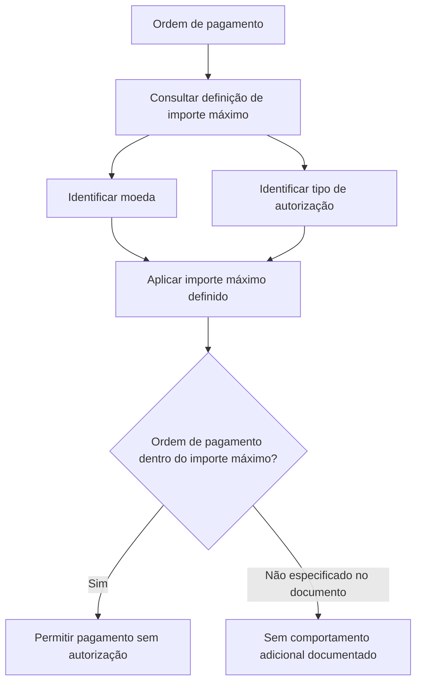

# Definição de Importe Máximo sem Autorização para Ordens de Pagamento

## 1. Metadados do Documento
- **Arquivo de Origem:** Não identificado
- **Tipo de Documento:** Especificação Funcional
- **Domínio / Sistema:** Definição de importe máximo sem autorização; Tesorería, Siniestros e categorias relacionadas
- **Público-Alvo:** Negócio, Operação, Desenvolvedores e Arquitetos
- **Data/Versão Identificada:** Não identificada

---

## 2. Resumo Executivo & Contexto de Negócio

O documento descreve uma definição funcional em construção para determinar até qual valor uma ordem de pagamento pode ser paga sem necessidade de autorização. O objetivo explícito é estabelecer um importe máximo associado a uma moeda e a um tipo de autorização.

A configuração apresentada possui três propriedades gerais: `Moneda`, `Importe máximo` e `Tipo de autorización`. A moeda define a chave monetária na qual o importe é expresso; o importe máximo representa o limite da ordem de pagamento; e o tipo de autorização identifica a categoria afetada pela definição.

Os tipos de autorização listados abrangem Tesorería, Siniestros, Devolución de prima, Agentes, Coaseguro, Reaseguro e Vida. O documento apresenta os códigos associados a essas categorias, porém não descreve regras específicas por tipo, precedência entre configurações, persistência dos dados ou comportamento para valores acima do limite.

O estado `EN CONSTRUCCIÓN` indica que o conteúdo pode representar funcionalidade ainda não concluída ou documentação em elaboração. Não há detalhamento de telas, serviços, métodos HTTP, contratos de integração, trilha de auditoria ou mecanismos de autorização.

---

## 3. Arquitetura, Componentes & Tecnologias Envolvidas

Os elementos identificados no conteúdo são:

| Componente / Conceito | Descrição fundamentada no documento |
| :--- | :--- |
| Ordem de pagamento | Entidade cujo pagamento pode ocorrer sem autorização, desde que respeite o importe máximo definido. |
| Definição de importe máximo | Configuração destinada a determinar o valor até o qual uma ordem de pagamento pode ser paga sem autorização. |
| Moneda | Chave da moeda na qual o importe definido é expresso. |
| Importe máximo | Valor máximo permitido para pagamento sem que seja necessário autorizar a ordem de pagamento. |
| Tipo de autorización | Identificador do tipo de autorização afetado pela definição. |
| Tesorería | Tipo de autorização identificado pelo código `(T)`. |
| Siniestros | Tipo de autorização identificado pelo código `(S)`. |
| Devolución de prima | Tipo de autorização identificado pelo código `(D)`. |
| Agentes | Tipo de autorização identificado pelo código `(A)`. |
| Coaseguro | Tipo de autorização identificado pelo código `(C)`. |
| Reaseguro | Tipo de autorização identificado pelo código `(R)`. |
| Vida | Tipo de autorização identificado pelo código `(V)`. |
| Zeus | Termo presente na navegação do conteúdo, sem detalhamento de função. |
| CF | Termo exibido junto de Tesorería e Siniestros, sem expansão ou explicação. |



> **Nota de Análise:** O diagrama representa apenas o objetivo funcional declarado: pagamentos de ordens dentro de um importe máximo podem ocorrer sem autorização. O documento não especifica a regra para valores que excedem o importe máximo.

---

## 4. Regras de Negócio, Especificações Funcionais & Processos

1. Deve ser possível determinar até qual importe uma ordem de pagamento pode ser paga sem necessidade de autorização.
2. A definição do importe máximo é expressa em uma moeda identificada pela propriedade `Moneda`.
3. A propriedade `Importe máximo` define o valor máximo que uma ordem de pagamento pode possuir para permitir pagamento sem autorização.
4. A propriedade `Tipo de autorización` identifica o tipo de autorização impactado pela definição de importe máximo.
5. Os tipos de autorização listados são:
   - `(T) Tesorería`
   - `(S) Siniestros`
   - `(D) Devolución de prima`
   - `(A) Agentes`
   - `(C) Coaseguro`
   - `(R) Reaseguro`
   - `(V) Vida`
6. O documento não define:
   - O comportamento de uma ordem de pagamento cujo importe excede o importe máximo.
   - A existência de múltiplas definições para a mesma moeda e tipo de autorização.
   - Critérios de prioridade, vigência ou sobrescrita das definições.
   - Regras de arredondamento, precisão decimal, conversão monetária ou validação da moeda.
   - Fluxo de aprovação, usuários autorizadores ou integração com outros sistemas.
   - Requisitos técnicos, APIs, tabelas de banco de dados, logs ou mensagens de erro.

---

## 5. Tabelas de Parâmetros, Ambientes e Estruturas de Dados

| Item / Parâmetro | Descrição / Função | Tipo / Valores / Formato | Ambiente / Observações |
| :--- | :--- | :--- | :--- |
| Moneda | Chave da moeda na qual o importe definido é expresso. | Não especificado | Não há lista de moedas, formato ou regra de conversão. |
| Importe máximo | Importe máximo permitido para uma ordem de pagamento ser paga sem autorização. | Não especificado | Não há unidade, precisão decimal, mínimo ou máximo técnico informado. |
| Tipo de autorización | Identifica o tipo de autorização afetado pela definição. | Código e categoria | Tipos listados no documento. |
| `(T)` | Tesorería. | Código de tipo de autorização | Sem detalhamento adicional. |
| `(S)` | Siniestros. | Código de tipo de autorização | O texto também apresenta `CF` junto desta área, sem explicação. |
| `(D)` | Devolución de prima. | Código de tipo de autorização | Sem detalhamento adicional. |
| `(A)` | Agentes. | Código de tipo de autorização | Sem detalhamento adicional. |
| `(C)` | Coaseguro. | Código de tipo de autorização | Sem detalhamento adicional. |
| `(R)` | Reaseguro. | Código de tipo de autorização | Sem detalhamento adicional. |
| `(V)` | Vida. | Código de tipo de autorização | Sem detalhamento adicional. |
| Zeus | Item visível na navegação. | Não especificado | A função de Zeus não é detalhada. |
| CF | Termo visível no conteúdo. | Não especificado | Não há expansão ou significado fornecido. |

---

## 6. Bateria de Perguntas & Respostas para RAG (FAQ Sintético)

### P1: Qual é o objetivo da definição de importe máximo sem autorização?
**R:** O objetivo é determinar até qual importe uma ordem de pagamento pode ser paga sem necessidade de ser autorizada.

### P2: Qual propriedade informa a moeda do importe máximo?
**R:** A propriedade `Moneda` informa a chave da moeda na qual o importe definido é expresso.

### P3: O que representa o campo “Importe máximo”?
**R:** `Importe máximo` é o valor máximo que uma ordem de pagamento pode ter para permitir seu pagamento sem necessidade de autorização.

### P4: Qual é a finalidade do campo “Tipo de autorización”?
**R:** `Tipo de autorización` identifica o tipo de autorização afetado pela definição de importe máximo.

### P5: Quais tipos de autorização estão associados à definição de importe máximo?
**R:** O documento lista Tesorería `(T)`, Siniestros `(S)`, Devolución de prima `(D)`, Agentes `(A)`, Coaseguro `(C)`, Reaseguro `(R)` e Vida `(V)`.

### P6: Qual código identifica o tipo de autorização Tesorería?
**R:** O tipo de autorização Tesorería é identificado pelo código `(T)`.

### P7: Qual código identifica o tipo de autorização Siniestros?
**R:** O tipo de autorização Siniestros é identificado pelo código `(S)`.

### P8: O que acontece quando uma ordem de pagamento excede o importe máximo?
**R:** O documento não especifica o comportamento aplicável quando uma ordem de pagamento excede o importe máximo definido. Ele apenas afirma que o limite permite pagamento sem autorização.

### P9: O documento informa métodos HTTP ou contratos de API para a configuração?
**R:** Não. O conteúdo não descreve métodos HTTP, endpoints, contratos JSON, integrações técnicas ou serviços relacionados.

### P10: O que significa a sigla CF exibida no conteúdo?
**R:** O documento apresenta o termo `CF`, mas não fornece sua expansão, definição ou relação funcional detalhada.

---

## 7. Glossário de Termos, Siglas & Conceitos-Chave

- **Moneda:** Chave da moeda em que o importe definido é expresso.
- **Importe máximo:** Valor máximo que uma ordem de pagamento pode ter para permitir pagamento sem autorização.
- **Tipo de autorización:** Identificador da categoria de autorização afetada pela definição.
- **Tesorería `(T)`:** Tipo de autorização listado no documento.
- **Siniestros `(S)`:** Tipo de autorização listado no documento.
- **Devolución de prima `(D)`:** Tipo de autorização listado no documento.
- **Agentes `(A)`:** Tipo de autorização listado no documento.
- **Coaseguro `(C)`:** Tipo de autorização listado no documento.
- **Reaseguro `(R)`:** Tipo de autorização listado no documento.
- **Vida `(V)`:** Tipo de autorização listado no documento.
- **CF:** Termo apresentado sem significado definido no conteúdo.
- **Zeus:** Termo presente na navegação, sem função explicada no conteúdo.

---

## 8. Notas Críticas, Riscos & Limitações

- O conteúdo está marcado como `EN CONSTRUCCIÓN`, o que sugere documentação ou funcionalidade em elaboração.
- Não há identificação do arquivo de origem, autoria, data, versão ou histórico de alterações.
- Não há definição do fluxo para ordens de pagamento acima do importe máximo.
- Não há regras de conversão entre moedas, precisão decimal, arredondamento ou validação de valores.
- Não há especificação de permissões, perfis de usuário, auditoria, persistência ou tratamento de erro.
- O documento lista o termo `CF`, porém não detalha seu significado.
- O documento apresenta `Zeus` na navegação, porém não descreve seu papel no processo.
- Não há APIs, contratos JSON, bancos de dados, logs, URLs, ambientes ou dependências técnicas documentadas.

---

## 9. Conteúdo Bruto Estruturado (Referência Fiel)

```text
--- [PÁGINA 1 DE 2] ---

EN CONSTRUCCIÓN
DEFINICIÓN de importe máximo sin
autorización
Objetivo
Determinar hasta que importe se puede pagar una orden de pago sin necesidad de ser autorizada.
Propiedades generales
Propiedades generales
Moneda
Clave de la moneda en la que se expresa el importe definido.
Importe máximo
Importe máximo que puede tener una orden de pago para permitir el pago sin que se tenga que
autorizar.
Tipo de autorización
Identifica el tipo de autorización afectado por la definición.
(T)Tesorería
(S)Siniestros
 /
 CF
Inicio Soluciones APIs Documentación Zeus
ES


--- [PÁGINA 2 DE 2] ---

(D)Devolución de prima
(A)Agentes
(C)Coaseguro
(R)Reaseguro
(V)Vida
```
