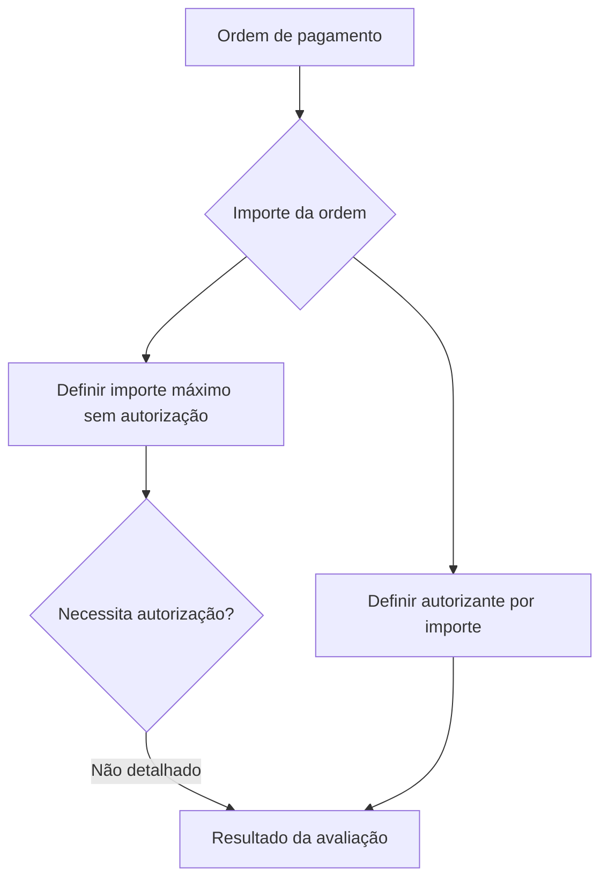

# Definição de Autorização de Ordem de Pagamento

## 1. Metadados do Documento
- **Arquivo de Origem:** Não identificado
- **Tipo de Documento:** Procedimento
- **Domínio / Sistema:** Autorização de ordem de pagamento; Home Solutions APIs Documentation Zeus
- **Público-Alvo:** Negócio, Operação e Desenvolvedores
- **Data/Versão Identificada:** Não identificada

---

## 2. Resumo Executivo & Contexto de Negócio

O documento descreve a definição de autorização para uma ordem de pagamento. O objetivo declarado é determinar em quais situações uma ordem de pagamento exige autorização e identificar quem pode realizar essa autorização.

O processo apresentado possui duas definições centrais: estabelecer o importe máximo que não requer autorização e definir o autorizante aplicável conforme o importe. A relação entre o valor da ordem de pagamento e o autorizante é mencionada, mas não são apresentados valores monetários, faixas, cargos ou critérios adicionais.

O conteúdo também referencia “CF”, “Home Solutions APIs Documentation” e “Zeus”, porém não explica o significado de “CF”, o papel de Zeus, interfaces técnicas, APIs, contratos, ambientes ou integração entre esses elementos.

A apresentação é resumida e não detalha exceções, regras de aprovação múltipla, status da ordem, trilha de auditoria, métodos de autorização ou responsabilidades operacionais adicionais.

---

## 3. Arquitetura, Componentes & Tecnologias Envolvidas

| Componente / Termo | Papel identificado no documento | Detalhamento disponível |
| :--- | :--- | :--- |
| Ordem de pagamento | Entidade sujeita à avaliação de necessidade de autorização | Não são informados atributos, ciclo de vida ou formato |
| Importe máximo sem autorização | Limite a ser definido para determinar ordens que não precisam de autorização | Valor não informado |
| Autorizante por importe | Responsável pela autorização conforme o importe da ordem | Perfis, faixas e regras não informados |
| CF | Termo referenciado no conteúdo | Significado não identificado |
| Home Solutions APIs Documentation | Referência textual apresentada no documento | Não há APIs, URLs ou contratos descritos |
| Zeus | Termo referenciado no conteúdo | Papel arquitetural não detalhado |



> **Nota de Análise:** O documento apresenta uma sequência conceitual de decisão para autorização de ordem de pagamento, mas não detalha sistemas, métodos HTTP, contratos JSON, tecnologias, integrações ou persistência de dados.

---

## 4. Regras de Negócio, Especificações Funcionais & Processos

1. O objetivo do processo é determinar quando é necessário autorizar uma ordem de pagamento.
2. O objetivo do processo também é determinar quem pode autorizar uma ordem de pagamento.
3. Deve ser definido um importe máximo sem autorização.
4. Deve ser definido um autorizante por importe.
5. A decisão de autorização está relacionada ao importe da ordem de pagamento.
6. A definição de autorizante deve considerar o importe.

### Processo apresentado

1. Definir o importe máximo sem autorização.
2. Definir o autorizante por importe.

> **Nota de Análise:** O documento não informa se uma ordem acima do importe máximo exige uma ou mais autorizações, nem define valores, moedas, regras de arredondamento, exceções, níveis hierárquicos, substitutos ou mecanismos de validação.

---

## 5. Tabelas de Parâmetros, Ambientes e Estruturas de Dados

| Item / Parâmetro | Descrição / Função | Tipo / Valores / Formato | Ambiente / Observações |
| :--- | :--- | :--- | :--- |
| Importe máximo sem autorização | Limite que deve ser definido para ordens de pagamento sem autorização | Valor não informado | Não informado |
| Autorizante por importe | Responsável que deve ser definido conforme o importe | Perfil ou responsável não informado | Não informado |
| Ordem de pagamento | Elemento avaliado no processo de autorização | Estrutura não informada | Não informado |
| CF | Referência textual presente no documento | Não identificado | Não detalhado |
| Home Solutions APIs Documentation | Referência textual presente no documento | Não informado | Não detalhado |
| Zeus | Referência textual presente no documento | Não informado | Não detalhado |
| EN | Texto apresentado ao final do conteúdo | Não identificado | Não detalhado |

---

## 6. Bateria de Perguntas & Respostas para RAG (FAQ Sintético)

### P1: Qual é o objetivo da definição de autorização de ordem de pagamento?
**R:** O objetivo é determinar quando é necessário autorizar uma ordem de pagamento e identificar quem pode autorizá-la.

### P2: Quais definições fazem parte do processo de autorização de ordem de pagamento?
**R:** O processo possui duas definições: definir o importe máximo sem autorização e definir o autorizante por importe.

### P3: O documento informa qual é o valor máximo sem autorização?
**R:** Não. O documento determina que o importe máximo sem autorização deve ser definido, mas não apresenta o valor desse limite.

### P4: Como o autorizante de uma ordem de pagamento deve ser definido?
**R:** O autorizante deve ser definido por importe. O documento não especifica as faixas de importe nem os perfis autorizantes correspondentes.

### P5: O que determina a necessidade de autorização de uma ordem de pagamento?
**R:** O documento relaciona a necessidade de autorização à definição de um importe máximo sem autorização. Contudo, não apresenta o valor do limite nem a regra explícita para importes acima desse valor.

### P6: O documento identifica quem pode autorizar uma ordem de pagamento?
**R:** O documento estabelece que deve ser definido um autorizante por importe, mas não informa nomes, cargos, grupos, perfis ou níveis de aprovação.

### P7: Existem APIs ou contratos técnicos detalhados para a autorização da ordem de pagamento?
**R:** Não. Embora “Home Solutions APIs Documentation” e “Zeus” sejam citados, o documento não detalha endpoints, métodos HTTP, payloads, autenticação ou contratos de integração.

### P8: O documento descreve um fluxo completo de aprovação?
**R:** Não. O fluxo apresentado limita-se à definição do importe máximo sem autorização e à definição do autorizante por importe.

### P9: O que significa a sigla CF no contexto da autorização de ordem de pagamento?
**R:** O significado de “CF” não é explicado no conteúdo fornecido.

### P10: Há informações sobre ambientes, URLs ou servidores?
**R:** Não. O documento não fornece URLs, nomes de ambientes, servidores, portas ou configurações operacionais.

---

## 7. Glossário de Termos, Siglas & Conceitos-Chave

- **Ordem de pagamento:** Entidade para a qual o documento busca determinar a necessidade de autorização.
- **Autorização:** Ação cuja necessidade deve ser determinada para uma ordem de pagamento.
- **Importe:** Valor utilizado como critério para definir ausência de autorização e autorizante aplicável.
- **Importe máximo sem autorização:** Limite a ser definido para ordens de pagamento que não requerem autorização.
- **Autorizante por importe:** Responsável a ser definido conforme o importe da ordem de pagamento.
- **CF:** Termo citado no documento; significado não identificado.
- **Home Solutions APIs Documentation:** Referência textual citada; função não detalhada.
- **Zeus:** Termo citado no documento; papel não detalhado.
- **EN:** Termo apresentado no conteúdo; significado não identificado.

---

## 8. Notas Críticas, Riscos & Limitações

- O documento não informa o valor do importe máximo sem autorização.
- O documento não define faixas de importe nem os autorizantes correspondentes.
- Não há descrição de exceções, recusas, escalonamento, aprovação múltipla ou substituição de autorizantes.
- Não são apresentados fluxos de sistema, APIs, métodos HTTP, contratos de dados ou integrações.
- Os termos “CF”, “Home Solutions APIs Documentation”, “Zeus” e “EN” não possuem explicação contextual adicional.
- Não há data, versão, autor, sistema proprietário ou ambiente identificado.
- **Nota de Análise:** O conteúdo fornecido apresenta regras conceituais resumidas e não permite inferir configurações técnicas ou operacionais adicionais sem risco de alucinação.

---

## 9. Conteúdo Bruto Estruturado (Referência Fiel)

```text
--- [PÁGINA 1 DE 1] ---

EN CONSTRUCCIÓN
DEFINICIÓN de autorización de orden de pago
Objetivo
Determinar cuándo es necesario autorizar una orden de pago y quien puede autorizarla
Proceso a seguir
DEFINIR importe
máximo sin
autorización
(1)
DEFINIR autorizante
por importe
(2)
1. DEFINIR importe máximo sin autorización
2. DEFINIR autorizante por importe
 / 
 CF
Home Solutions APIs Documentation Zeus
EN
```
