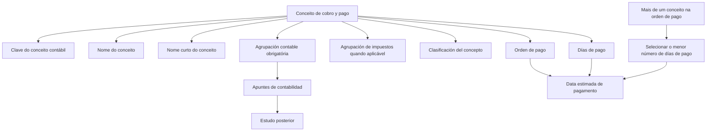
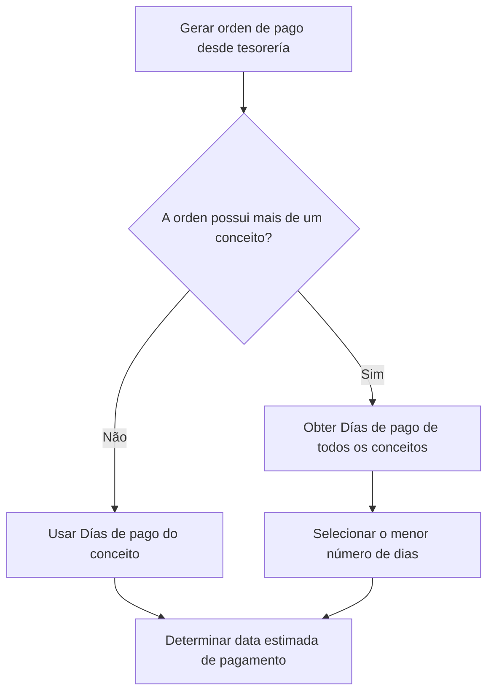

# Definição de Conceitos de Cobro y Pago e suas Propriedades Contábeis

## 1. Metadados do Documento
- **Arquivo de Origem:** `Não identificado no conteúdo fornecido`
- **Tipo de Documento:** `Manual Operacional`
- **Domínio / Sistema:** `Gestão de ordens de pagamento, tesouraria e contabilidade`
- **Público-Alvo:** `Negócio, Tesouraria, Contabilidade, Siniestros e Agentes`
- **Data/Versão Identificada:** `Não identificada`

---

## 2. Resumo Executivo & Contexto de Negócio

O documento descreve como definir conceitos de cobro y pago, incluindo suas características e propriedades principais. Esses conceitos representam chaves contábeis utilizadas para classificar itens associados à geração de ordens de pagamento na companhia.

Os conceitos de cobro y pago são empregados por diferentes áreas corporativas conforme o tipo de ordem de pagamento. O documento cita explicitamente ordens de pagamento de siniestros, remesas de reaseguro, coaseguro, tesorería e demais ordens de pagamento existentes na companhia.

Cada conceito possui uma chave identificadora, um nome, um nome curto, uma associação obrigatória com uma agrupación contable e, quando aplicável, uma agrupación de impuestos. A agrupación contable é registrada em cada apontamento contábil para posterior estudo.

A classificação do conceito identifica a natureza do gasto ou o âmbito de uso do conceito de cobro y pago. Além disso, a propriedade Días de pago pode determinar a data estimada de pagamento de uma ordem de pagamento criada a partir de tesorería.

Quando uma ordem de pagamento contém mais de um conceito de cobro y pago, a data estimada de pagamento deve considerar o menor número de dias de pagamento entre todos os conceitos que compõem a ordem.

---

## 3. Arquitetura, Componentes & Tecnologias Envolvidas

O conteúdo fornecido não descreve tecnologias, APIs, bancos de dados, protocolos, URLs, servidores ou componentes de software. O documento apresenta um modelo funcional-contábil para cadastro e utilização de conceitos de cobro y pago.

Componentes e entidades identificados:

| Componente / Entidade | Descrição |
| :--- | :--- |
| Conceito de cobro y pago | Conceito contábil utilizado na geração de ordens de pagamento. |
| Clave de concepto | Chave que identifica o conceito contábil definido como conceito de cobro y pago. |
| Nombre concepto cobro y pago | Nome associado à chave identificadora do conceito. |
| Nombre corto concepto cobro y pago | Nome abreviado associado à chave do conceito. |
| Agrupación contable | Agrupamento contábil obrigatório associado ao conceito; fica registrado nos apontamentos contábeis. |
| Agrupación de impuestos | Chave que identifica os impostos aplicáveis ao conceito, quando o conceito deve levar impostos. |
| Clasificación del concepto | Identifica a natureza do gasto ou o âmbito de uso do conceito. |
| Días de pago | Número de dias que pode determinar a data estimada de pagamento de uma ordem criada em tesorería. |
| Orden de pago | Ordem que pode conter um ou mais conceitos de cobro y pago. |
| Tesorería | Área a partir da qual uma ordem de pagamento pode ser gerada. |
| Siniestros | Área e classificação associada a pagamentos de sinistros. |
| Agentes comisiones | Classificação associada a conceitos relativos a comissões de agentes. |



> *Nota de Análise: O documento não detalha métodos de cadastro, telas, contratos de API, persistência de dados, tecnologias ou regras de validação técnica para os conceitos de cobro y pago.*

---

## 4. Regras de Negócio, Especificações Funcionais & Processos

### 4.1 Finalidade dos conceitos de cobro y pago

1. Os conceitos de cobro y pago são utilizados para gerar diferentes ordens de pagamento dentro da companhia.
2. Cada área deve utilizar os conceitos pertinentes ao seu tipo de ordem de pagamento.
3. Para uma ordem de pagamento de siniestros, a área de siniestros deve utilizar conceitos destinados à liquidação de sinistros.
4. Os conceitos também são utilizados em remesas de reaseguro, coaseguro, tesorería e no restante das ordens de pagamento.

### 4.2 Propriedades gerais do conceito

1. O conceito de cobro y pago contém a chave que identifica o conceito contábil estabelecido como conceito de cobro y pago.
2. O nombre concepto cobro y pago contém o nome associado à chave identificadora do conceito.
3. O nombre corto concepto cobro y pago contém o nome abreviado associado à chave do conceito.

### 4.3 Associação com agrupación contable

1. Todo conceito de cobro y pago deve estar associado a uma agrupación contable.
2. A agrupación contable é um dado refletido em cada apontamento da contabilidade.
3. Os apontamentos contábeis registram a agrupación contable para permitir estudo posterior.
4. A chave da agrupación contable identifica o agrupamento ao qual o conceito de cobro y pago pertence.

### 4.4 Associação com agrupación de impuestos

1. Quando um conceito de cobro y pago deve levar impostos, a propriedade agrupación de impuestos deve conter a chave da agrupación de impuestos.
2. A agrupación de impuestos identifica os impostos aplicáveis ao conceito de cobro y pago.
3. O documento não apresenta exemplos de chaves de agrupación de impuestos nem critérios para determinar quando impostos são aplicáveis.

### 4.5 Classificação do conceito

1. A clasificación del concepto identifica a natureza do gasto ou o âmbito de uso do conceito de cobro y pago.
2. A classificação depende do tipo de conceito associado.
3. Nos exemplos apresentados, `SI` corresponde a `Siniestros` e `AC` corresponde a `Agentes comisiones`.

### 4.6 Determinação da data estimada de pagamento

1. A propriedade Días de pago contém um número de dias.
2. O número de Días de pago pode determinar a data estimada de pagamento de uma ordem de pagamento gerada desde tesorería.
3. Uma ordem de pagamento pode conter mais de um conceito de cobro y pago.
4. Quando uma ordem de pagamento possui múltiplos conceitos, a data estimada de pagamento deve ser determinada pelo menor número de Días de pago entre todos os conceitos integrantes da ordem.



---

## 5. Tabelas de Parâmetros, Ambientes e Estruturas de Dados

| Item / Parâmetro | Descrição / Função | Tipo / Valores / Formato | Ambiente / Observações |
| :--- | :--- | :--- | :--- |
| Concepto de cobro y pago | Contém a chave que identifica o conceito contábil estabelecido como conceito de cobro y pago. | Chave de conceito contábil. | Utilizado na geração de ordens de pagamento. |
| Nombre concepto cobro y pago | Nome associado à chave identificadora do conceito. | Texto. | Exemplo: `Honorarios perito`. |
| Nombre corto concepto cobro y pago | Nome abreviado associado à chave do conceito. | Texto abreviado. | Exemplo: `Honorarios`. |
| Agrupación contable | Chave que identifica o agrupamento contábil ao qual pertence o conceito. | Chave de agrupamento contábil. | Associação obrigatória; registrada nos apontamentos contábeis. |
| Agrupación de impuestos | Chave da agrupação que identifica impostos aplicáveis ao conceito. | Chave de agrupamento de impostos. | Aplicável quando o conceito deve levar impostos. |
| Clasificación del concepto | Identifica a natureza do gasto ou o âmbito de uso do conceito. | Tipo de conceito. | Exemplos: `SI` e `AC`. |
| Días de pago | Número de dias que pode determinar a data estimada de pagamento. | Número de dias. | Para múltiplos conceitos em uma ordem, prevalece o menor número de dias. |
| Orden de pago | Ordem de pagamento gerada pela companhia. | Entidade funcional. | Pode possuir mais de um conceito de cobro y pago. |
| Tesorería | Área associada à geração de ordens de pagamento e à determinação da data estimada de pagamento. | Área corporativa. | Citada como origem de geração da ordem. |
| Siniestros | Área associada a ordens para liquidação de sinistros. | Área corporativa / classificação. | Classificação `SI`. |
| Agentes comisiones | Classificação para conceitos relacionados a comissões de agentes. | Classificação. | Classificação `AC`. |

### Exemplos de conceitos

| Conceito | Nome | Nome curto |
| :--- | :--- | :--- |
| S07 | Honorarios perito | Honorarios |
| DCT | Descuento comisiones | Dcto.Comi. |
| S06 | Indemnización lesionado | Indemniza. |
| DC | Descuento de comisiones cobro | Dcto.Cobro |
| PC1 | Comisiones anticipadas | Anticipo |

### Exemplos de associação entre agrupación contable e conceito

| Agrupación contable | Descrição da agrupación contable | Conceito | Descrição do conceito |
| :--- | :--- | :--- | :--- |
| PS | Pago de siniestros | S07 | Honorarios Perito |
| PS | Pago de siniestros | S06 | Indemnización lesionado |
| DC | Comisión automática | DC | Descuento de comisiones cobro |
| PC | Comisión anticipada | DCT | Descuento comisión |
| PC | Comisión anticipada | PC1 | Comisión anticipada |

### Exemplos de classificação de conceitos

| Conceito | Descrição do conceito | Tipo de conceito | Descrição do tipo |
| :--- | :--- | :--- | :--- |
| S07 | Honorarios Perito | SI | Siniestros |
| S06 | Indemnización lesionado | SI | Siniestros |
| DC | Descuento de comisiones cobro | AC | Agentes comisiones |
| DCT | Descuento comisión | AC | Agentes comisiones |
| PC1 | Comisión anticipada | AC | Agentes comisiones |

---

## 6. Bateria de Perguntas & Respostas para RAG (FAQ Sintético)

### P1: Qual é a finalidade de um conceito de cobro y pago?
**R:** Um conceito de cobro y pago é utilizado para gerar diferentes ordens de pagamento dentro da companhia. Esses conceitos são aplicados conforme o tipo de pagamento, incluindo pagamentos de siniestros, remesas de reaseguro, coaseguro, tesorería e outras ordens de pagamento.

### P2: Qual propriedade identifica o conceito contábil de um conceito de cobro y pago?
**R:** A propriedade Concepto de cobro y pago contém a chave que identifica o conceito contábil estabelecido como conceito de cobro y pago.

### P3: Qual é a diferença entre Nombre concepto cobro y pago e Nombre corto concepto cobro y pago?
**R:** Nombre concepto cobro y pago contém o nome associado à chave do conceito, enquanto Nombre corto concepto cobro y pago contém o nome abreviado associado à mesma chave. Por exemplo, o conceito `S07` possui o nome `Honorarios perito` e o nome curto `Honorarios`.

### P4: A associação de um conceito de cobro y pago a uma agrupación contable é obrigatória?
**R:** Sim. O documento estabelece que o conceito de cobro y pago deve estar associado a uma agrupación contable. Esse dado é refletido em cada apontamento contábil para posterior estudo.

### P5: Qual é a finalidade da agrupación contable?
**R:** A agrupación contable identifica o agrupamento contábil ao qual pertence um conceito de cobro y pago. A chave da agrupación é registrada em cada apontamento da contabilidade, permitindo análise posterior desses registros.

### P6: Quando deve ser informada uma agrupación de impuestos?
**R:** A agrupación de impuestos deve ser informada quando o conceito de cobro y pago deve levar impostos. A propriedade contém a chave da agrupación de impostos que identifica os impostos aplicáveis ao conceito.

### P7: O que identifica a clasificación del concepto?
**R:** A clasificación del concepto identifica a natureza do gasto ou o âmbito de uso do conceito de cobro y pago, conforme o tipo de conceito associado. Nos exemplos, `SI` representa `Siniestros` e `AC` representa `Agentes comisiones`.

### P8: Quais conceitos apresentados pertencem à classificação SI (Siniestros)?
**R:** Os conceitos `S07`, correspondente a `Honorarios Perito`, e `S06`, correspondente a `Indemnización lesionado`, pertencem ao tipo de conceito `SI`, cuja descrição é `Siniestros`.

### P9: Quais conceitos apresentados pertencem à classificação AC (Agentes comisiones)?
**R:** Os conceitos `DC` (`Descuento de comisiones cobro`), `DCT` (`Descuento comisión`) e `PC1` (`Comisión anticipada`) pertencem ao tipo de conceito `AC`, cuja descrição é `Agentes comisiones`.

### P10: Como a data estimada de pagamento é definida quando uma ordem possui vários conceitos?
**R:** Quando uma ordem de pagamento possui mais de um conceito de cobro y pago, a data estimada de pagamento deve considerar o menor número de Días de pago entre todos os conceitos que formam a ordem de pagamento.

### P11: Para que serve a propriedade Días de pago?
**R:** Días de pago contém um número de dias que pode determinar a data estimada de pagamento de uma ordem de pagamento quando a ordem é gerada desde tesorería.

### P12: Quais conceitos estão associados à agrupación contable PS?
**R:** A agrupación contable `PS`, descrita como `Pago de siniestros`, está associada aos conceitos `S07` (`Honorarios Perito`) e `S06` (`Indemnización lesionado`).

---

## 7. Glossário de Termos, Siglas & Conceitos-Chave

- **AC:** Tipo de conceito correspondente a `Agentes comisiones`.
- **Agrupación contable:** Agrupamento contábil associado obrigatoriamente a um conceito de cobro y pago e refletido nos apontamentos contábeis.
- **Agrupación de impuestos:** Agrupamento que identifica os impostos aplicáveis a um conceito de cobro y pago.
- **Apuntes de contabilidad:** Apontamentos ou registros da contabilidade nos quais a agrupación contable fica refletida.
- **Clasificación del concepto:** Propriedade que identifica a natureza do gasto ou o âmbito de uso de um conceito de cobro y pago.
- **Cobro y pago:** Conceito utilizado para classificar itens empregados na geração de ordens de pagamento.
- **Concepto:** Chave que identifica o conceito contábil.
- **Días de pago:** Número de dias usado para determinar a data estimada de pagamento.
- **Orden de pago:** Ordem de pagamento que pode conter um ou mais conceitos de cobro y pago.
- **PS:** Agrupación contable correspondente a `Pago de siniestros`.
- **SI:** Tipo de conceito correspondente a `Siniestros`.
- **Siniestros:** Área ou âmbito de uso associado a sinistros.
- **Tesorería:** Área citada como origem de geração de ordens de pagamento.
- **DC:** Conceito `Descuento de comisiones cobro` e também código de agrupación contable `Comisión automática`, conforme exemplos apresentados.
- **DCT:** Conceito `Descuento comisiones` ou `Descuento comisión`, conforme exemplos apresentados.
- **PC:** Agrupación contable `Comisión anticipada`.
- **PC1:** Conceito `Comisiones anticipadas` ou `Comisión anticipada`, conforme exemplos apresentados.
- **S06:** Conceito `Indemnización lesionado`.
- **S07:** Conceito `Honorarios perito` ou `Honorarios Perito`.

---

## 8. Notas Críticas, Riscos & Limitações

- O documento não identifica arquivo de origem, data, versão, autor, área responsável ou sistema específico.
- Não há detalhamento de interfaces, telas, APIs, integrações, regras de persistência, validações de campos ou permissões de usuários.
- O documento não define os valores possíveis completos para classificação, agrupación contable ou agrupación de impuestos; apresenta somente exemplos.
- Não são apresentados critérios para decidir quando um conceito deve possuir agrupación de impuestos.
- Não são apresentados valores de Días de pago para os conceitos exemplificados.
- Há variações textuais nos exemplos: `Descuento comisiones` e `Descuento comisión`; `Comisiones anticipadas` e `Comisión anticipada`; `Honorarios perito` e `Honorarios Perito`.
- O código `DC` aparece como conceito e como agrupación contable, ambos associados a `Descuento de comisiones cobro` e `Comisión automática`, respectivamente.
- *Nota de Análise: O documento lista conceitos e propriedades funcionais, porém não detalha métodos HTTP, contratos JSON, estruturas de banco de dados ou mecanismos de integração.*

---

## 9. Conteúdo Bruto Estruturado (Referência Fiel)

```text
--- [PÁGINA 1 DE 3] ---

DEFINIR Conceptos de cobro y pago
Objetivo
La finalidad de este documento es conocer como definir un concepto de cobro y pago, así como sus
características principales.
Estos conceptos son los que se utilizan para generar las distintas órdenes de pago dentro de la
compañía, sean del tipo que sean, es decir, para generar una orden de pago de siniestros, el área de
siniestros utilizara estos conceptos y no otros, para poder hacer la liquidación del siniestro, lo mismo
con las remesas de reaseguro, coaseguro y el resto de las órdenes de pago, tesorería, etc.
Propiedades generales
Propiedades generales
Concepto de cobro y pago
Contiene la clave que identifica el concepto contable que se establece como concepto de cobro y
pago.
Nombre concepto cobro y pago
Esta propiedad contiene el nombre asociado a la clave que identifica el concepto.
Nombre corto concepto cobro y pago
Contiene el nombre abreviado asociado a la clave del concepto.
 / 
 RS
Inicio Soluciones APIs Documentación Zeus
ES


--- [PÁGINA 2 DE 3] ---

Ejemplo
CONCEPTO NOMBRE NOMBRE CORTO
S07 Honorarios perito Honorarios
DCT Descuento comisiones Dcto.Comi.
S06 Indemnización lesionado Indemniza.
DC Descuento de comisiones cobro Dcto.Cobro
PC1 Comisiones anticipadas Anticipo
Agrupación contable
El concepto de cobro y pago debe estar asociado a una agrupación contable, que es un dato que
queda reflejado en cada uno de los apuntes de la contabilidad para su posterior estudio.
Esta propiedad contiene la clave que identifica la agrupación contable a la que pertenece el concepto
de cobro y pago.
Ejemplo
AGRUPACIÓN CONTABLE CONCEPTO
PS (Pago de siniestros) S07 (Honorarios Perito)
PS (Pago de siniestros) S06 (Indemnización lesionado)
DC (Comisión automática) DC (Descuento de comisiones cobro)
PC (Comisión anticipada) DCT (Descuento comisión)
PC (Comisión anticipada) PC1 (Comisión anticipada)
Agrupación de impuestos
Si el concepto de cobro y pago debe llevar impuestos, esta propiedad contiene la clave de la
agrupación de impuestos, que identifica los impuestos que aplican al concepto de cobro y pago.


--- [PÁGINA 3 DE 3] ---

Clasificación del concepto
Identifica la naturaleza del gasto, o el ámbito de uso del concepto de cobro y pago, según el tipo de
concepto que se asocie.
Ejemplo
CONCEPTO TIPO DE CONCEPTO
S07 (Honorarios Perito) SI (Siniestros)
S06 (Indemnización lesionado) SI (Siniestros)
DC (Descuento de comisiones cobro) AC (Agentes comisiones)
DCT (Descuento comisión) AC (Agentes comisiones)
PC1 (Comisión anticipada) AC (Agentes comisiones)
Días de pago
Esta propiedad contiene un número de días, que puede determinar la fecha estimada de pago de la
orden de pago, cuando se genera desde tesorería.
Una orden de pago puede tener más de un concepto de cobro pago, en este caso, para determinar la
fecha estimada de pago, se tomará el menor número de días de pago de todos los conceptos de
cobro y pago que forman la orden de pago.
```
