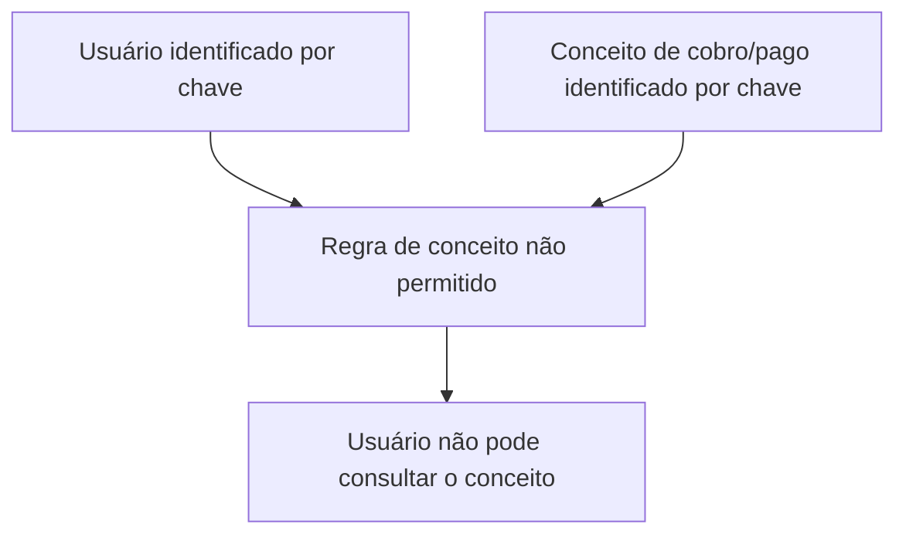

# Definição de Conceitos de Cobro/Pago Não Permitidos por Usuário

## 1. Metadados do Documento
- **Arquivo de Origem:** Não identificado
- **Tipo de Documento:** Especificação Funcional
- **Domínio / Sistema:** Soluções / APIs / Zeus
- **Público-Alvo:** Desenvolvedores, analistas funcionais e operação
- **Data/Versão Identificada:** Não identificada

---

## 2. Resumo Executivo & Contexto de Negócio

O documento descreve a definição de conceitos de cobrança e pagamento que um usuário não está autorizado a consultar. O objetivo explícito é identificar os conceitos de cobro/pago cuja consulta deve ser restringida para um usuário na aplicação.

A regra funcional apresentada baseia-se na associação entre um usuário identificado por uma chave e um conceito de cobro/pago identificado por outra chave. Essa associação representa uma proibição de consulta: o conceito vinculado não poderá ser consultado pelo usuário correspondente.

O conteúdo disponibilizado é resumido e não especifica fluxos de cadastro, persistência, APIs, métodos HTTP, contratos JSON, perfis de autorização, mensagens de erro ou mecanismos técnicos de aplicação da restrição.

---

## 3. Arquitetura, Componentes & Tecnologias Envolvidas

Os elementos citados são:

- **Aplicação:** contexto no qual o usuário é identificado e consulta conceitos de cobro/pago.
- **Usuário:** entidade identificada por uma chave na aplicação.
- **Conceito de cobro/pago:** entidade identificada por uma chave e sujeita a restrição de consulta.
- **Soluções, APIs, Documentação e Zeus:** termos exibidos na navegação do conteúdo; o documento não detalha a função técnica de cada item.
- **CF:** sigla exibida sem definição contextual.

O documento permite inferir somente a relação funcional de bloqueio entre usuário e conceito de cobro/pago:



> **Nota de Análise:** O documento não detalha componentes de backend, banco de dados, serviços, endpoints, protocolos, ambientes ou tecnologias de implementação.

---

## 4. Regras de Negócio, Especificações Funcionais & Processos

1. A aplicação identifica o usuário por meio de uma chave.
2. Um conceito de cobro/pago é identificado por uma chave própria.
3. A definição de conceito não permitido vincula um usuário a um conceito de cobro/pago.
4. Quando um conceito de cobro/pago estiver definido como não permitido para um usuário, esse usuário não poderá consultar o conceito.
5. O objetivo da definição é identificar todos os conceitos de cobro e pagamento indisponíveis para consulta por um usuário.
6. O documento não informa se a restrição é aplicada apenas à consulta ou também a outras operações, como criação, alteração, exclusão, aprovação ou execução de pagamentos.
7. O documento não informa critérios de exceção, herança de permissões, precedência entre permissões, auditoria ou tratamento de tentativa de acesso negado.

---

## 5. Tabelas de Parâmetros, Ambientes e Estruturas de Dados

| Item / Parâmetro | Descrição / Função | Tipo / Valores / Formato | Ambiente / Observações |
| :--- | :--- | :--- | :--- |
| Usuário | Entidade que utiliza a aplicação e para a qual são identificados conceitos não permitidos. | Chave de identificação. | O formato da chave não é detalhado. |
| Conceito de cobro/pago | Conceito de cobrança ou pagamento cuja consulta pode ser proibida para um usuário. | Chave de identificação do conceito. | O formato da chave e o catálogo de conceitos não são detalhados. |
| Definição de conceito não permitido | Regra que identifica um conceito de cobro/pago que um usuário não poderá consultar. | Associação entre usuário e conceito de cobro/pago. | Não há detalhamento de persistência, validação ou administração da associação. |
| Aplicação | Contexto no qual o usuário é identificado e realiza consultas. | Não especificado. | Nome técnico da aplicação não identificado. |
| Soluções | Item de navegação exibido no conteúdo. | Não especificado. | Sem detalhamento funcional. |
| APIs | Item de navegação exibido no conteúdo. | Não especificado. | Não há endpoints, contratos ou métodos descritos. |
| Documentação | Item de navegação exibido no conteúdo. | Não especificado. | Sem detalhamento adicional. |
| Zeus | Termo exibido no conteúdo. | Não especificado. | A função de Zeus não é definida. |
| CF | Sigla exibida no conteúdo. | Não especificado. | Significado não identificado. |
| Idioma | Opção de idioma exibida como `ES`. | Espanhol. | Indica que o conteúdo-fonte está em espanhol. |

---

## 6. Bateria de Perguntas & Respostas para RAG (FAQ Sintético)

### P1: Qual é o objetivo da definição de conceitos de cobro/pago não permitidos?
**R:** O objetivo é identificar os conceitos de cobrança e pagamento que um usuário não poderá consultar na aplicação.

### P2: Como o usuário é identificado na aplicação?
**R:** O usuário é identificado por uma chave. O documento não informa o formato, o tamanho ou a origem dessa chave.

### P3: Como um conceito de cobro/pago é identificado?
**R:** O conceito de cobro/pago é identificado por uma chave própria. O documento não detalha o formato dessa chave nem o catálogo de conceitos disponíveis.

### P4: Qual ação é bloqueada para um conceito não permitido?
**R:** A consulta do conceito de cobro/pago é bloqueada para o usuário associado à definição de conceito não permitido.

### P5: A restrição de conceito não permitido bloqueia pagamentos ou outras operações?
**R:** Não é possível afirmar. O documento informa somente que o usuário não poderá consultar o conceito; não detalha impactos sobre criação, alteração, exclusão, aprovação ou execução de operações.

### P6: O documento especifica endpoints ou métodos HTTP para administrar conceitos não permitidos?
**R:** Não. Embora o termo “APIs” apareça na navegação, não são apresentados endpoints, métodos HTTP, parâmetros de requisição ou contratos de resposta.

### P7: Existe uma matriz de permissões ou perfis de acesso descrita?
**R:** Não. O documento descreve apenas a relação entre um usuário e um conceito de cobro/pago que não pode ser consultado por esse usuário.

### P8: O que representa a associação entre usuário e conceito de cobro/pago?
**R:** A associação representa uma regra de proibição de consulta: o conceito de cobro/pago associado não está autorizado para consulta pelo usuário identificado.

### P9: O documento define o significado de Zeus?
**R:** Não. “Zeus” é exibido no conteúdo, mas não há explicação sobre sua função, escopo ou relação com a regra de negócio.

### P10: O documento define o significado da sigla CF?
**R:** Não. A sigla “CF” aparece no conteúdo sem expansão ou contextualização adicional.

---

## 7. Glossário de Termos, Siglas & Conceitos-Chave

- **Usuário:** entidade identificada por uma chave na aplicação.
- **Conceito de cobro/pago:** conceito de cobrança ou pagamento identificado por uma chave.
- **Conceito não permitido:** conceito de cobro/pago que um usuário não está autorizado a consultar.
- **Chave:** identificador utilizado para reconhecer um usuário ou um conceito de cobro/pago.
- **API:** termo exibido na navegação; o documento não detalha interfaces, operações ou contratos de API.
- **Zeus:** termo citado sem definição no conteúdo.
- **CF:** sigla citada sem significado identificado.
- **ES:** indicador de idioma espanhol exibido na navegação.

---

## 8. Notas Críticas, Riscos & Limitações

- O documento apresenta somente uma definição funcional resumida.
- Não há detalhamento da implementação técnica da restrição de consulta.
- Não são informados endpoints, contratos, métodos HTTP, banco de dados, tabelas, campos, logs, URLs, servidores ou ambientes.
- Não há descrição de fluxos de inclusão, atualização, remoção ou consulta de conceitos não permitidos.
- Não são definidos critérios de precedência para permissões conflitantes.
- Não são especificados mecanismos de auditoria, mensagens de erro ou comportamento para tentativas de consulta negada.
- **Nota de Análise:** O documento cita “APIs”, “Zeus” e “CF”, mas não fornece detalhamento suficiente para caracterizar esses termos tecnicamente.

---

## 9. Conteúdo Bruto Estruturado (Referência Fiel)

```text
--- [PÁGINA 1 DE 1] ---

EN CONSTRUCCIÓN
DEFINICIÓN de concepto no permitido por
usuario
Objetivo
Identificar los conceptos de cobro y pago que un usuario no podrá consultar.
Propiedades generales
Propiedades generales
Usuario
Clave con la que se identifica el usuario en la aplicación.
Concepto de cobro pago
Clave del concepto de cobro pago que el usuario no está autorizado a consultar.
 /
 CF
Inicio Soluciones APIs Documentación Zeus
ES
```
