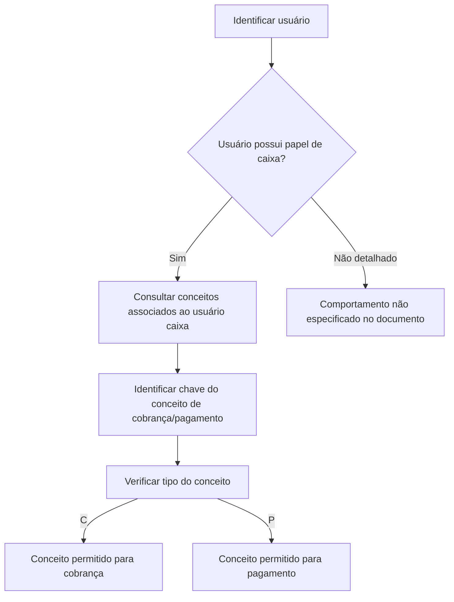

# Definição de Conceitos por Usuário com Papel de Caixa

## 1. Metadados do Documento
- **Arquivo de Origem:** Não identificado no conteúdo fornecido
- **Tipo de Documento:** Especificação Funcional
- **Domínio / Sistema:** Configuração de conceitos de cobrança e pagamento para usuários com papel de caixa
- **Público-Alvo:** Analistas funcionais, desenvolvedores, operação e usuários administrativos
- **Data/Versão Identificada:** Não identificada

---

## 2. Resumo Executivo & Contexto de Negócio

O documento descreve a definição de conceitos que podem ser utilizados por usuários com papel de **cajero** (caixa) para realizar movimentos de cobrança e pagamento no sistema.

O objetivo funcional é identificar, para cada usuário que possua o papel de caixa, quais conceitos estão autorizados para operações de cobrança ou pagamento. A configuração estabelece uma associação entre a chave do usuário caixa e a chave de um conceito de cobrança/pagamento.

Cada conceito possui um tipo que determina sua aplicabilidade operacional: **(C) Cobro** para cobrança ou **(P) Pago** para pagamento. O documento também apresenta o campo `cod_mon`, definido como a chave da moeda.

O conteúdo fornecido é resumido e não detalha telas, persistência de dados, validações técnicas, métodos HTTP, contratos de integração, regras de autorização além do papel de caixa, nem o comportamento do sistema quando um usuário não possui conceitos configurados.

---

## 3. Arquitetura, Componentes & Tecnologias Envolvidas

Os elementos funcionais explicitamente identificados são:

| Componente / Elemento | Papel no contexto |
| :--- | :--- |
| Usuário com papel de caixa (`cajero`) | Usuário identificado no sistema e associado a conceitos permitidos. |
| Conceito de cobrança/pagamento | Conceito que o usuário caixa poderá utilizar em movimentos financeiros. |
| Tipo de cobrança/pagamento | Indicador que classifica o conceito como cobrança `(C)` ou pagamento `(P)`. |
| `cod_mon` | Campo identificado como chave da moeda. |
| CF | Termo exibido no conteúdo, sem definição adicional. |
| Zeus | Termo exibido na navegação do conteúdo, sem definição adicional. |

```mermaid
graph TD
  U[Usuário com papel de caixa] -->|é identificado por| C[Cajero]
  C -->|possui conceitos autorizados| CP[Conceito de cobrança/pagamento]
  CP -->|é classificado por| T[Tipo de cobrança/pagamento]
  T --> COB[(C) Cobro]
  T --> PAG[(P) Pago]
  CP -->|pode estar associado a| MON[cod_mon: chave da moeda]
```

> **Nota de Análise:** O conteúdo não descreve microsserviços, banco de dados, APIs, ambientes, tecnologias de implementação, protocolos de integração ou contratos JSON.

---

## 4. Regras de Negócio, Especificações Funcionais & Processos

### Objetivo funcional

Para cada usuário que tenha o papel de caixa, o sistema deve identificar os conceitos que o usuário pode utilizar em movimentos de:

- Cobranças.
- Pagamentos.

### Propriedades gerais identificadas

1. **Cajero**
   - Representa a chave pela qual o usuário com papel de caixa é identificado no sistema.
   - A chave do usuário caixa é o elemento de associação para determinar os conceitos permitidos.

2. **Concepto de cobro pago**
   - Representa a chave do conceito que o usuário poderá cobrar ou pagar.
   - O conceito está associado a um usuário com papel de caixa.

3. **Tipo de cobro pago**
   - Identifica se o conceito é permitido para cobrança ou pagamento.
   - Os valores explicitamente apresentados são:
     - `(C) Cobro`
     - `(P) Pago`

4. **`cod_mon`**
   - Representa a chave da moeda.

### Fluxo funcional extraído



> **Nota de Análise:** O documento não especifica se um mesmo conceito pode ser associado a mais de um usuário caixa, se um usuário caixa pode possuir múltiplos conceitos, se existem conceitos simultaneamente válidos para cobrança e pagamento, nem quais validações são executadas antes de registrar um movimento.

---

## 5. Tabelas de Parâmetros, Ambientes e Estruturas de Dados

| Item / Parâmetro | Descrição / Função | Tipo / Valores / Formato | Ambiente / Observações |
| :--- | :--- | :--- | :--- |
| Cajero | Chave com a qual o usuário com papel de caixa é identificado no sistema. | Chave de usuário; formato não especificado. | Aplicável a usuários com papel de caixa. |
| Concepto de cobro pago | Chave do conceito que o usuário poderá cobrar ou pagar. | Chave de conceito; formato não especificado. | Associado ao usuário caixa. |
| Tipo de cobro pago | Identifica se o conceito é permitido para cobrança ou pagamento. | `(C) Cobro`; `(P) Pago`. | Não são apresentados outros valores. |
| `(C)` | Código que identifica cobrança. | Cobro. | Aplicável conforme o tipo do conceito. |
| `(P)` | Código que identifica pagamento. | Pago. | Aplicável conforme o tipo do conceito. |
| `cod_mon` | Chave da moeda. | Chave de moeda; formato não especificado. | O relacionamento entre `cod_mon` e os demais campos não é detalhado. |
| CF | Termo exibido no conteúdo. | Não especificado. | Sem definição funcional adicional. |
| Zeus | Termo exibido na navegação do conteúdo. | Não especificado. | Sem definição funcional adicional. |

> **Nota de Análise:** Não foram identificados servidores, URLs, ambientes, portas, rotas de log, variáveis de configuração, credenciais, endpoints ou estruturas formais de payload.

---

## 6. Bateria de Perguntas & Respostas para RAG (FAQ Sintético)

### P1: Qual é o objetivo da definição de conceitos por usuário caixa?
**R:** O objetivo é identificar, para cada usuário com papel de caixa (`cajero`), os conceitos que esse usuário pode utilizar em movimentos de cobrança e de pagamento.

### P2: O que representa o campo Cajero?
**R:** `Cajero` representa a chave pela qual o usuário que possui o papel de caixa é identificado no sistema.

### P3: O que é o conceito de cobrança/pagamento?
**R:** O conceito de cobrança/pagamento é a chave do conceito que um usuário com papel de caixa poderá utilizar para cobrar ou pagar.

### P4: Como o sistema diferencia um conceito de cobrança de um conceito de pagamento?
**R:** O sistema utiliza o campo `Tipo de cobro pago`. O valor `(C)` identifica um conceito permitido para cobrança (`Cobro`) e o valor `(P)` identifica um conceito permitido para pagamento (`Pago`).

### P5: Quais valores são permitidos para o tipo de cobrança/pagamento?
**R:** O documento apresenta exclusivamente os valores `(C) Cobro` e `(P) Pago`. Não há outros valores documentados.

### P6: Um usuário sem papel de caixa pode utilizar conceitos de cobrança ou pagamento?
**R:** O documento define o objetivo apenas para usuários com papel de caixa. O comportamento para usuários sem esse papel não é especificado.

### P7: O que significa o campo `cod_mon`?
**R:** O campo `cod_mon` é definido como a chave da moeda. O conteúdo não detalha seu formato, valores possíveis ou vínculo técnico com o conceito de cobrança/pagamento.

### P8: O documento especifica APIs ou métodos HTTP para consultar os conceitos de um usuário caixa?
**R:** Não. O documento não apresenta métodos HTTP, endpoints, contratos JSON, APIs, operações de consulta ou mecanismos de integração.

### P9: O documento informa como validar se um conceito está ativo ou disponível?
**R:** Não. O conteúdo apenas informa que o usuário com papel de caixa pode utilizar conceitos de cobrança ou pagamento conforme o tipo associado. Regras de vigência, ativação ou disponibilidade não são detalhadas.

### P10: O documento define o formato das chaves de usuário, conceito ou moeda?
**R:** Não. O conteúdo menciona a existência das chaves de usuário caixa, conceito e moeda, mas não informa formato, tamanho, domínio de valores ou regras de validação.

---

## 7. Glossário de Termos, Siglas & Conceitos-Chave

- **Cajero:** Usuário que possui o papel de caixa no sistema.
- **Cobro:** Cobrança; operação identificada pelo código `(C)`.
- **Pago:** Pagamento; operação identificada pelo código `(P)`.
- **Concepto de cobro pago:** Conceito identificado por uma chave e autorizado para uso por um usuário caixa em movimentos de cobrança ou pagamento.
- **Tipo de cobro pago:** Classificação que determina se um conceito é permitido para cobrança ou pagamento.
- **`cod_mon`:** Chave da moeda.
- **CF:** Termo presente no conteúdo original sem significado definido.
- **Zeus:** Termo presente na navegação do conteúdo original sem significado definido.

---

## 8. Notas Críticas, Riscos & Limitações

- O conteúdo fornecido não identifica o arquivo de origem, autor, versão, data, sistema proprietário ou ambiente de execução.
- O documento não define o relacionamento técnico entre usuário caixa, conceito de cobrança/pagamento e `cod_mon`.
- Não há informações sobre persistência de dados, modelo relacional, nomes de tabelas, chaves primárias, chaves estrangeiras ou regras de unicidade.
- Não são documentadas regras para inclusão, alteração, exclusão ou consulta de associações entre usuários caixa e conceitos.
- Não há definição de tratamento de erros, auditoria, permissões administrativas, segregação de funções ou trilha de aprovação.
- Não são descritos endpoints, métodos HTTP, contratos de integração, autenticação, autorização, logs ou monitoramento.
- Os termos `CF` e `Zeus` aparecem no conteúdo, mas não possuem explicação suficiente para definição funcional ou técnica.
- O documento não detalha se o campo `cod_mon` é obrigatório, opcional ou aplicável a todos os conceitos.

---

## 9. Conteúdo Bruto Estruturado (Referência Fiel)

```text
--- [PÁGINA 1 DE 2] ---

EN CONSTRUCCIÓN
DEFINICIÓN de concepto por usuario
Objetivo
Identificar, por cada usuario con rol de cajero, los conceptos que puede utilizar para movimientos de
cobros y de pagos.
Propiedades generales
Propiedades generales
Cajero
Clave con la que se identifica el usuario con rol de cajero en el sistema.
Concepto de cobro pago
Clave del concepto que el usuario podrá cobrar o pagar.
Tipo de cobro pago
Identifica si el concepto se permite para cobros o pagos.
(C)Cobro
(P)Pago
 /
 CF
Inicio Soluciones APIs Documentación Zeus
ES

--- [PÁGINA 2 DE 2] ---

cod_mon
Clave de la moneda.
```
