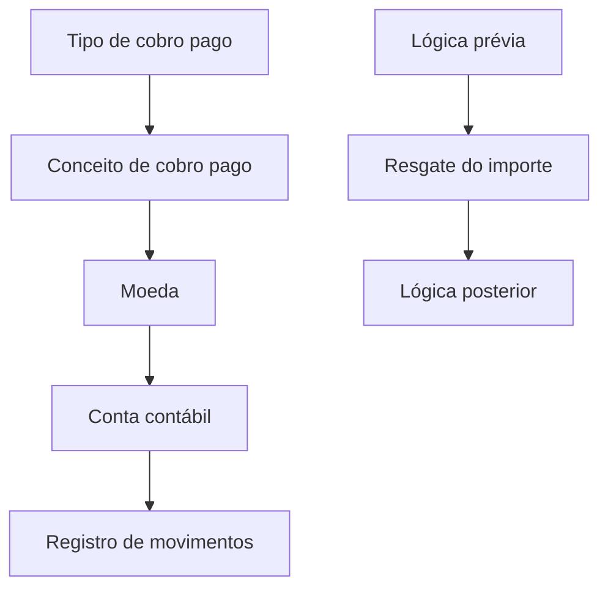

# Definição de Conta Contábil por Conceito de Cobro/Pago

## 1. Metadados do Documento
- **Arquivo de Origem:** Não identificado
- **Tipo de Documento:** Especificação Técnica
- **Domínio / Sistema:** Zeus
- **Público-Alvo:** Não identificado
- **Data/Versão Identificada:** Não identificada

---

## 2. Resumo Executivo & Contexto de Negócio

O documento descreve a definição de contas contábeis associadas a conceitos de cobrança e pagamento. O objetivo declarado é associar cada conceito de cobro/pago às contas contábeis nas quais os movimentos serão registrados.

A especificação apresenta propriedades gerais para identificar o tipo da operação, o conceito associado e a moeda. O tipo de cobro/pago possui dois valores explicitamente definidos: `(C) Cobro` e `(P) Pago`.

Além das chaves de identificação, o documento define a conta contábil e uma conta de fornecedores, indicada como conta padrão para contas a pagar (`cp`). Também prevê lógica de negócio antes e depois do resgate do importe.

> **Nota de Análise:** O conteúdo não detalha interfaces, métodos HTTP, contratos JSON, persistência de dados, critérios de validação, cálculos, fluxos de exceção ou ambientes.

---

## 3. Arquitetura, Componentes & Tecnologias Envolvidas

O único sistema explicitamente citado é **Zeus**. O conteúdo descreve uma estrutura funcional de configuração contábil, mas não apresenta componentes de software, microsserviços, bancos de dados, APIs ou tecnologias adicionais.



> **Nota de Análise:** O diagrama representa apenas as relações funcionais explicitamente mencionadas; o documento não fornece uma arquitetura técnica de integração.

---

## 4. Regras de Negócio, Especificações Funcionais & Processos

1. Um **conceito de cobro/pago** deve ser associado a uma ou mais referências contábeis para registrar movimentos.
2. O **tipo de cobro/pago** identifica se a operação é:
   - `(C) Cobro`
   - `(P) Pago`
3. O **conceito de cobro/pago** é identificado por sua chave.
4. A **moeda** é identificada por sua chave.
5. A **conta contábil** é identificada por sua chave.
6. A **conta de fornecedores** é indicada como conta padrão para contas a pagar (`cp`).
7. A **lógica prévia** corresponde à lógica de negócio executada antes de resgatar o importe.
8. A **lógica posterior** corresponde à lógica de negócio executada depois de rescatar o importe.

> **Nota de Análise:** O documento não explica como ocorre o resgate do importe, quais dados são usados, nem quais regras compõem as lógicas prévia e posterior.

---

## 5. Tabelas de Parâmetros, Ambientes e Estruturas de Dados

| Item / Parâmetro | Descrição / Função | Tipo / Valores / Formato | Ambiente / Observações |
| :--- | :--- | :--- | :--- |
| Tipo de cobro pago | Identifica se a operação é um cobro ou um pago. | `(C) Cobro`; `(P) Pago` | Não informado |
| Conceito de cobro pago | Chave do conceito de cobro/pago. | Chave | Não informado |
| Moeda | Chave da moeda. | Chave | Não informado |
| Conta contábil | Chave da conta contábil. | Chave | Não informado |
| Conta fornecedores | Conta de fornecedores; por padrão, contas a pagar. | `cp` | Não informado |
| Lógica prévia | Lógica de negócio executada antes de resgatar o importe. | Não detalhado | Não informado |
| Lógica posterior | Lógica de negócio executada depois de rescatar o importe. | Não detalhado | Não informado |
| Sistema citado | Sistema referenciado no rodapé da extração. | Zeus | Não informado |

---

## 6. Bateria de Perguntas & Respostas para RAG (FAQ Sintético)

### P1: Qual é o objetivo da definição de conta contábil por conceito de cobro/pago?
**R:** O objetivo é associar os conceitos de cobro/pago às contas contábeis sobre as quais os movimentos serão registrados.

### P2: Quais tipos de cobro/pago são definidos?
**R:** O documento define dois tipos: `(C) Cobro` e `(P) Pago`.

### P3: O que identifica o campo “Tipo de cobro pago”?
**R:** O campo identifica se a operação corresponde a um cobro ou a um pago.

### P4: Como o conceito de cobro/pago é identificado?
**R:** O conceito de cobro/pago é identificado pela chave do conceito de cobro/pago.

### P5: Como a moeda é identificada na definição contábil?
**R:** A moeda é identificada por sua chave.

### P6: O que representa a conta contábil?
**R:** A conta contábil corresponde à chave da conta contábil utilizada na associação com o conceito de cobro/pago.

### P7: Qual é a conta padrão indicada para fornecedores?
**R:** A conta de fornecedores é indicada, por padrão, como contas a pagar (`cp`).

### P8: Quando a lógica prévia é executada?
**R:** A lógica prévia é executada antes de resgatar o importe.

### P9: Quando a lógica posterior é executada?
**R:** A lógica posterior é executada depois de rescatar o importe.

### P10: O documento detalha a implementação da lógica prévia e posterior?
**R:** Não. O documento apenas informa o momento de execução dessas lógicas em relação ao resgate do importe.

---

## 7. Glossário de Termos, Siglas & Conceitos-Chave

- **Cobro:** Tipo de operação identificado pelo valor `(C)`.
- **Pago:** Tipo de operação identificado pelo valor `(P)`.
- **Conceito de cobro/pago:** Conceito identificado por uma chave e associado a contas contábeis para registro de movimentos.
- **Conta contábil:** Conta identificada por uma chave e usada para registrar movimentos associados a conceitos de cobro/pago.
- **Conta fornecedores:** Conta associada a fornecedores; indicada como padrão para contas a pagar.
- **cp:** Abreviação apresentada no documento para contas a pagar.
- **Importe:** Valor cujo resgate ocorre entre a execução da lógica prévia e da lógica posterior.
- **Zeus:** Sistema citado no conteúdo extraído.

---

## 8. Notas Críticas, Riscos & Limitações

- Não há identificação do arquivo original, autoria, data, versão ou público-alvo.
- Não há detalhamento técnico sobre implementação, integração, persistência, APIs ou contratos de dados.
- Não são definidos formatos das chaves, obrigatoriedade dos campos, regras de validação ou comportamento para erros.
- O termo **importe** é mencionado, mas não é definido funcionalmente.
- As lógicas prévia e posterior são citadas sem detalhamento de regras, entradas, saídas ou critérios de execução.
- Não há informações sobre ambientes, URLs, servidores, logs, permissões ou segurança.

---

## 9. Conteúdo Bruto Estruturado (Referência Fiel)

```text
--- [PÁGINA 1 DE 2] ---

EN CONSTRUCCIÓN
DEFINICIÓN de cuenta contable por concepto
Objetivo
Asociar a los conceptos de cobro pago las cuentas contables sobre las que se registrarán los
movimientos
Propiedades generales
Propiedades generales
Tipo de cobro pago
Identifica si se trata de un cobro o un pago.
(C)Cobro
(P)Pago
Concepto de cobro pago
Clave del concepto de cobro pago.
Moneda
Clave de la moneda.
 /
 CF
Inicio Soluciones APIs Documentación Zeus
ES


--- [PÁGINA 2 DE 2] ---

Cuenta contable
Clave de la cuenta contable.
Cuenta proveedores
Cuenta proveedores, por defecto cuentas a pagar (cp).
Lógica previa
Lógica de negocio que se ejecuta antes de rescatar el importe.
Lógica posterior
Lógica de negocio que se ejecuta después de recatar el importe.
```
