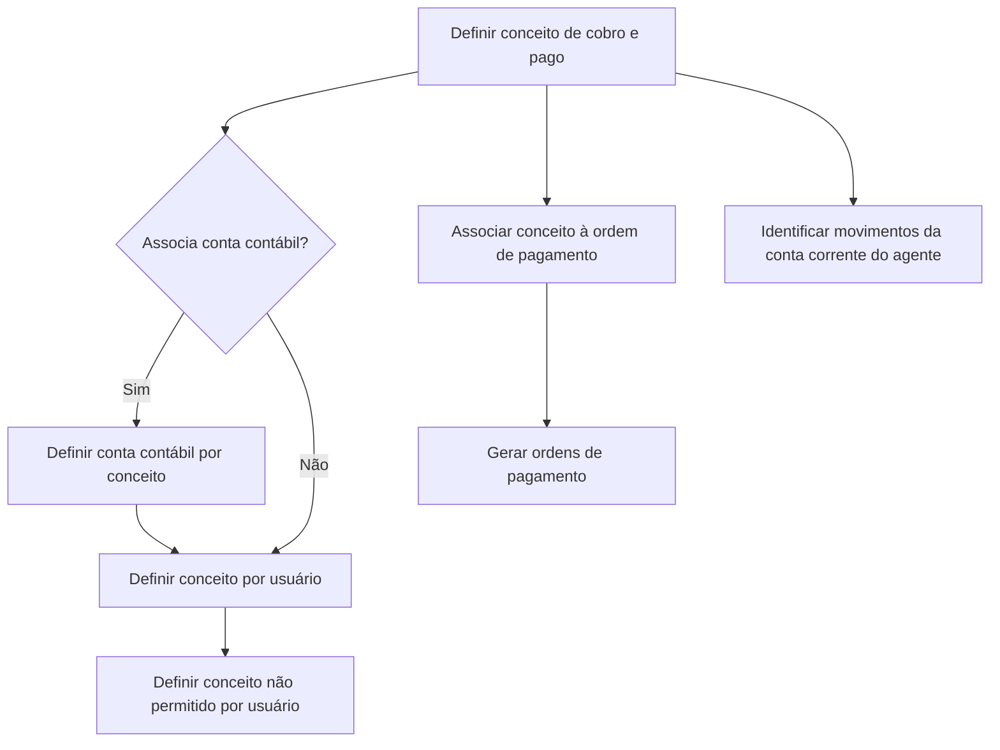

# Definição de Conceitos de Cobro e Pago para Ordens de Pagamento

## 1. Metadados do Documento
- **Arquivo de Origem:** `Não identificado no conteúdo fornecido`
- **Tipo de Documento:** Procedimento
- **Domínio / Sistema:** Ordens de pagamento, conceitos contábeis, conta corrente do agente
- **Público-Alvo:** Operação, negócio e usuários responsáveis pela definição de conceitos de cobro e pago
- **Data/Versão Identificada:** Não identificada

---

## 2. Resumo Executivo & Contexto de Negócio

O documento descreve a definição de conceitos de cobro e pago associados a ordens de pagamento. Um conceito de cobro e pago é apresentado como um conceito contábil associado à ordem de pagamento.

O conceito contábil determina o tipo de despesa incluída na ordem de pagamento, os impostos aplicáveis — quando existirem — e a conta para a qual a despesa é imputada. Portanto, a definição do conceito influencia a classificação contábil e tributária da ordem de pagamento.

Os conceitos de cobro e pago são utilizados na geração de ordens de pagamento de qualquer tipo. Além disso, os conceitos são utilizados para identificar movimentos da conta corrente do agente.

O objetivo explícito do documento é orientar a definição dos conceitos de cobro e pago para que possam ser posteriormente associados a uma ordem de pagamento. O processo apresentado possui quatro definições: conceito de cobro e pago, conta contábil por conceito, conceito por usuário e conceito não permitido por usuário.

---

## 3. Arquitetura, Componentes & Tecnologias Envolvidas

O conteúdo fornecido não descreve arquitetura de software, integrações técnicas, APIs, tecnologias, servidores, ambientes ou contratos de interface. O documento apresenta um fluxo funcional de configuração para ordens de pagamento.

Componentes e entidades citados:

| Componente / Entidade | Papel descrito no documento |
| :--- | :--- |
| Ordem de pagamento | Entidade à qual o conceito de cobro e pago é associado. |
| Conceito de cobro e pago | Conceito contábil que determina tipo de despesa, impostos aplicáveis e conta de imputação da despesa. |
| Conta contábil | Pode ser associada a um conceito de cobro e pago. |
| Usuário | Pode receber uma definição de conceito por usuário e uma restrição de conceito não permitido. |
| Conta corrente do agente | Seus movimentos podem ser identificados por meio dos conceitos de cobro e pago. |



> **Nota de Análise:** O diagrama representa exclusivamente as relações e a sequência funcional visíveis no conteúdo. O documento não detalha sistemas responsáveis, telas, métodos HTTP, contratos JSON, persistência de dados ou regras técnicas de integração.

---

## 4. Regras de Negócio, Especificações Funcionais & Processos

### 4.1 Papel do conceito de cobro e pago

1. O conceito de cobro e pago é um dos elementos que compõem uma ordem de pagamento.
2. O conceito de cobro e pago é um conceito contábil associado à ordem de pagamento.
3. O conceito de cobro e pago determina:
   - O tipo de despesa incluído na ordem de pagamento.
   - Os impostos vinculados à ordem de pagamento, quando a ordem de pagamento possuir impostos.
   - A conta à qual a despesa é imputada.
4. Os conceitos de cobro e pago são utilizados para gerar ordens de pagamento de qualquer tipo.
5. Os conceitos de cobro e pago são utilizados para identificar os movimentos da conta corrente do agente.
6. O conceito de cobro e pago deve ser definido antes de sua associação a uma ordem de pagamento.

### 4.2 Processo de definição

O processo apresentado possui quatro etapas de configuração:

1. **Definir conceito de cobro e pago**
   - Criar ou configurar o conceito contábil que será associado à ordem de pagamento.
   - O conteúdo fornecido não apresenta campos obrigatórios, valores permitidos ou critérios de validação dessa definição.

2. **Definir conta contábil por conceito**
   - Verificar se o conceito de cobro e pago associa uma conta contábil.
   - Quando houver associação de conta contábil, definir a conta contábil por conceito.
   - O documento apresenta a decisão “¿Asocia cuenta contable?” com as alternativas “SI” e “NO”.
   - O conteúdo não detalha o comportamento operacional posterior ao caminho “NO”.

3. **Definir conceito por usuário**
   - Configurar o conceito por usuário.
   - O documento não especifica se essa definição concede autorização, preferência, associação operacional ou outro tipo de vínculo.

4. **Definir conceito não permitido por usuário**
   - Configurar conceitos não permitidos por usuário.
   - O conteúdo não descreve os critérios de restrição, mensagens de erro, precedência entre permissões e bloqueios, nem o comportamento durante a geração da ordem de pagamento.

> **Nota de Análise:** O documento lista as etapas funcionais, mas não detalha regras de prioridade entre “conceito por usuário” e “conceito não permitido por usuário”.

---

## 5. Tabelas de Parâmetros, Ambientes e Estruturas de Dados

| Item / Parâmetro | Descrição / Função | Tipo / Valores / Formato | Ambiente / Observações |
| :--- | :--- | :--- | :--- |
| Conceito de cobro e pago | Conceito contábil associado à ordem de pagamento. | Não especificado. | Determina tipo de despesa, impostos quando aplicáveis e conta de imputação. |
| Tipo de despesa | Tipo de gasto incluído na ordem de pagamento. | Não especificado. | Determinado pelo conceito de cobro e pago. |
| Impostos | Impostos associados à ordem de pagamento quando a ordem possuir impostos. | Não especificado. | Determinados pelo conceito de cobro e pago. |
| Conta de imputação da despesa | Conta para a qual a despesa é imputada. | Não especificado. | Determinada pelo conceito de cobro e pago. |
| Associação de conta contábil | Decisão sobre a associação de uma conta contábil ao conceito. | `SI` ou `NO`. | O documento orienta definir a conta contábil por conceito quando há associação. |
| Conta contábil por conceito | Definição de conta contábil vinculada ao conceito. | Não especificado. | Etapa 2 do processo. |
| Conceito por usuário | Definição de conceito em nível de usuário. | Não especificado. | Etapa 3 do processo. |
| Conceito não permitido por usuário | Restrição de conceito em nível de usuário. | Não especificado. | Etapa 4 do processo. |
| Ordem de pagamento | Entidade que recebe associação de conceito de cobro e pago. | Não especificado. | Pode ser de qualquer tipo. |
| Conta corrente do agente | Conta cujos movimentos podem ser identificados pelos conceitos. | Não especificado. | Não há detalhes sobre estrutura ou integração. |

> **Nota de Análise:** O conteúdo fornecido não contém URLs, servidores, nomes de ambiente, rotas de logs, variáveis de configuração, formatos de campos ou estruturas de dados detalhadas.

---

## 6. Bateria de Perguntas & Respostas para RAG (FAQ Sintético)

### P1: O que é um conceito de cobro e pago?
**R:** Um conceito de cobro e pago é um conceito contábil associado a uma ordem de pagamento. O conceito determina o tipo de despesa incluído na ordem, os impostos aplicáveis quando existirem e a conta à qual a despesa é imputada.

### P2: Qual é o objetivo do procedimento de definição de conceitos de cobro e pago?
**R:** O objetivo é definir os conceitos de cobro e pago para posteriormente associá-los a uma ordem de pagamento.

### P3: Quais informações de uma ordem de pagamento são determinadas pelo conceito de cobro e pago?
**R:** O conceito de cobro e pago determina o tipo de despesa incluído na ordem de pagamento, os impostos da ordem de pagamento quando aplicáveis e a conta à qual a despesa é imputada.

### P4: Os conceitos de cobro e pago podem ser usados em qualquer tipo de ordem de pagamento?
**R:** Sim. O documento informa que os conceitos de cobro e pago são utilizados para a geração de ordens de pagamento de qualquer tipo.

### P5: Para que os conceitos de cobro e pago são usados além da geração de ordens de pagamento?
**R:** Os conceitos de cobro e pago também são utilizados para identificar os movimentos da conta corrente do agente.

### P6: Quais são as etapas apresentadas para definir conceitos de cobro e pago?
**R:** As quatro etapas são: definir o conceito de cobro e pago; definir a conta contábil por conceito; definir o conceito por usuário; e definir o conceito não permitido por usuário.

### P7: Quando deve ser definida uma conta contábil por conceito?
**R:** A conta contábil por conceito deve ser definida quando o conceito de cobro e pago estiver associado a uma conta contábil. O fluxo do documento apresenta a pergunta “¿Asocia cuenta contable?” com as opções “SI” e “NO”.

### P8: O documento informa quais campos devem ser preenchidos na definição de um conceito de cobro e pago?
**R:** Não. O documento identifica a etapa “DEFINIR Concepto de cobro y pago”, mas não detalha campos, formatos, obrigatoriedades ou validações.

### P9: O que significa definir um conceito por usuário?
**R:** O documento apresenta “DEFINIR Concepto por usuario” como a terceira etapa do processo. Contudo, o conteúdo não detalha a finalidade exata do vínculo, os atributos configuráveis ou seu impacto operacional.

### P10: Como funciona a definição de conceito não permitido por usuário?
**R:** O documento apresenta “DEFINIR Concepto no permitido por usuario” como a quarta etapa. Não são descritos critérios de bloqueio, precedência sobre outros vínculos de conceito ou comportamento do sistema diante de uma tentativa de uso de conceito não permitido.

### P11: O documento descreve APIs, métodos HTTP ou contratos de integração para ordens de pagamento?
**R:** Não. O conteúdo fornecido descreve apenas conceitos e etapas funcionais; não apresenta APIs, métodos HTTP, payloads, contratos JSON ou mecanismos de integração.

---

## 7. Glossário de Termos, Siglas & Conceitos-Chave

- **Conceito de cobro e pago:** Conceito contábil associado à ordem de pagamento, utilizado para determinar tipo de despesa, impostos quando aplicáveis e conta de imputação da despesa.
- **Conta contábil:** Conta que pode ser definida por conceito quando o conceito de cobro e pago associa uma conta contábil.
- **Conta corrente do agente:** Conta cujos movimentos podem ser identificados por meio dos conceitos de cobro e pago.
- **Imputação da despesa:** Associação da despesa à conta determinada pelo conceito de cobro e pago.
- **Ordem de pagamento:** Entidade composta, entre outros elementos, pelo conceito de cobro e pago.
- **SI / NO:** Alternativas exibidas no fluxo para decidir se o conceito associa uma conta contábil.

---

## 8. Notas Críticas, Riscos & Limitações

- O nome do arquivo de origem, a data, a versão e a autoria do documento não estão presentes no conteúdo fornecido.
- O documento não detalha campos, formatos, valores permitidos, obrigatoriedades ou validações para as quatro etapas de definição.
- O comportamento após a resposta `NO` à pergunta “¿Asocia cuenta contable?” não é explicado.
- Não há detalhamento sobre prioridade, conflito ou precedência entre conceito por usuário e conceito não permitido por usuário.
- O documento não especifica controles de acesso, perfis autorizados, auditoria, trilha de alterações ou aprovações.
- Não há informações sobre sistemas, bancos de dados, integrações, APIs, tecnologias, ambientes, URLs, servidores ou logs.
- O texto contém referências de interface ou navegação — `CF`, `Home`, `Solutions`, `APIs`, `Documentation`, `Zeus`, `EN` — sem explicar sua função ou relação com o procedimento.

---

## 9. Conteúdo Bruto Estruturado (Referência Fiel)

```text
--- [PÁGINA 1 DE 2] ---

DEFINICIÓN de Conceptos de cobro y pago
Objetivo
Uno de los elementos que componen la orden de pago es el concepto de cobro y pago. Se trata de
un concepto contable que se asocia a la orden de pago y que determina el tipo de gasto que incluye
la orden de pago, los impuestos que lleva la orden de pago, en caso de llevarlos, así como la cuenta
a la que se imputa el gasto.
Estos conceptos se utilizan tanto para la generación de órdenes de pago, de cualquier tipo, como
para identificar los movimientos de la cuenta corriente del agente.
El objetivo de este documento es conocer como definir los conceptos de cobro y pago para
posteriormente poder asociarlo a una orden de pago.
Pasos para definir conceptos de cobro y pago
SI
NO
DEFINIR
Concepto de
cobro y pago
(1)
¿Asocia cuenta
contable? DEFINIR
Cuenta contable
por concepto
(2)
DEFINIR
Concepto por
usuario
(3)
DEFINIR
Concepto no
permitido
por usuario
(4)
1. DEFINIR Concepto de cobro y pago
2. DEFINIR Cuenta contable por concepto
 / 
 CF
Home Solutions APIs Documentation Zeus
EN


--- [PÁGINA 2 DE 2] ---

3. DEFINIR Concepto por usuario
4. DEFINIR Concepto no permitido por usuario
```
