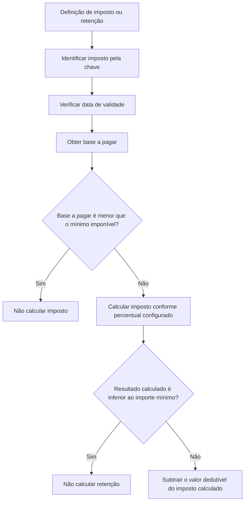

# Definição de Características de Impostos — Construção

## 1. Metadados do Documento
- **Arquivo de Origem:** Não identificado
- **Tipo de Documento:** Especificação Funcional
- **Domínio / Sistema:** Definição de impostos e retenções
- **Público-Alvo:** Negócio, Analistas Funcionais, Desenvolvedores e Operação
- **Data/Versão Identificada:** Não identificada

---

## 2. Resumo Executivo & Contexto de Negócio

O documento descreve a definição de características de impostos, com o objetivo de estabelecer o percentual aplicável ao cálculo de cada imposto e os respectivos valores mínimos. O conteúdo está identificado como “EN CONSTRUCCIÓN”, indicando que o material está em construção.

A configuração de um imposto ou retenção é identificada por uma chave e possui uma data de validade. A data de validade determina quando a definição pode ser utilizada e permite manter um histórico das alterações efetuadas na configuração.

A especificação apresenta três regras financeiras principais: percentual do imposto, mínimo imponível e importe mínimo. O mínimo imponível define o valor mínimo da base de pagamento a partir do qual o imposto é calculado. O importe mínimo atua após o cálculo, impedindo a retenção quando o resultado calculado for inferior ao valor configurado.

Também é apresentada a propriedade dedutível, correspondente a um valor fixo subtraído do valor calculado do imposto. O documento informa que o valor dedutível pode ser zero, mas não detalha ordem completa de cálculo, arredondamentos, moedas aceitas, métodos HTTP, contratos de integração ou telas de manutenção.

---

## 3. Arquitetura, Componentes & Tecnologias Envolvidas

O conteúdo não descreve arquitetura de software, serviços, APIs, bancos de dados, tecnologias ou ambientes técnicos. Os termos “Soluciones”, “APIs”, “Documentación” e “Zeus” aparecem apenas no conteúdo bruto como itens de navegação, sem detalhamento funcional ou arquitetural.

O fluxo funcional de cálculo extraível do documento é:



> **Nota de Análise:** O documento não explicita se o valor dedutível é aplicado antes ou depois da validação do importe mínimo. O diagrama representa a sequência mais diretamente inferível das descrições, mas a ordem formal não está especificada.

---

## 4. Regras de Negócio, Especificações Funcionais & Processos

### Identificação e vigência
1. Cada imposto ou retenção possui uma **chave** que o identifica.
2. Cada definição possui uma **data de validade**.
3. A data de validade determina quando uma definição estará disponível para uso.
4. O uso correto da data de validade permite manter um registro histórico das mudanças realizadas na definição.

### Percentual do imposto
1. A propriedade **porcentaje impuesto** contém o percentual correspondente ao imposto.
2. O documento não informa formato, casas decimais, limites permitidos ou fórmula matemática completa para aplicação do percentual.

### Mínimo imponível
1. A propriedade **mínimo imponible** determina o valor mínimo para cálculo de impostos.
2. Quando a base a pagar for menor que o mínimo imponível, não são calculados impostos.
3. Quando a base a pagar for maior ou igual ao mínimo imponível, o imposto é calculado.
4. Exemplo literal apresentado:
   - Mínimo imponível: `10€`.
   - Valor a pagar menor que `10€`: imposto não é calculado.
   - Valor a pagar maior ou igual a `10€`: imposto é calculado.

### Importe mínimo
1. A propriedade **importe mínimo** é avaliada após o cálculo do imposto ou da retenção.
2. Quando o resultado calculado for inferior ao importe mínimo configurado, não é calculada retenção.
3. O documento não especifica o comportamento quando o valor calculado for igual ao importe mínimo.

### Dedutível
1. A propriedade **deducible** contém um valor fixo.
2. O valor fixo dedutível é subtraído do valor calculado do imposto.
3. O valor dedutível pode ser `0`.
4. O documento não informa se um resultado negativo deve ser limitado a zero, rejeitado ou tratado de outra forma.

---

## 5. Tabelas de Parâmetros, Ambientes e Estruturas de Dados

| Item / Parâmetro | Descrição / Função | Tipo / Valores / Formato | Ambiente / Observações |
| :--- | :--- | :--- | :--- |
| Impuesto | Chave que identifica o imposto ou a retenção. | Chave; formato não especificado. | Aplicável à definição de imposto ou retenção. |
| Fecha de validez | Determina quando a definição estará disponível para uso. Permite histórico de alterações. | Data; formato não especificado. | Não há ambientes informados. |
| Porcentaje impuesto | Contém o percentual correspondente ao imposto. | Percentual; escala e precisão não especificadas. | Fórmula completa não detalhada. |
| Mínimo imponible | Define o valor mínimo da base a pagar para que o imposto seja calculado. | Valor monetário; exemplo: `10€`. | Se a base for menor, não se calculam impostos; se for maior ou igual, calcula-se o imposto. |
| Importe mínimo | Define o limite mínimo do resultado calculado para que a retenção seja calculada. | Valor; formato e moeda não especificados. | Se o resultado for inferior, não se calcula retenção. |
| Deducible | Valor fixo subtraído do valor calculado do imposto. | Valor fixo; pode ser `0`. | Ordem precisa em relação ao importe mínimo não especificada. |
| Soluciones | Item textual de navegação presente na extração. | Não especificado. | Sem detalhamento adicional. |
| APIs | Item textual de navegação presente na extração. | Não especificado. | Sem detalhamento adicional. |
| Documentación | Item textual de navegação presente na extração. | Não especificado. | Sem detalhamento adicional. |
| Zeus | Item textual de navegação presente na extração. | Não especificado. | Sem detalhamento adicional. |

---

## 6. Bateria de Perguntas & Respostas para RAG (FAQ Sintético)

### P1: Qual é o objetivo da definição de características de impostos?
**R:** O objetivo é estabelecer o percentual a ser aplicado no cálculo de cada imposto e os valores mínimos associados a cada imposto ou retenção.

### P2: Como um imposto ou uma retenção é identificado?
**R:** Um imposto ou retenção é identificado por uma chave. O documento não informa o formato, a estrutura ou a origem dessa chave.

### P3: Para que serve a data de validade da definição de imposto?
**R:** A data de validade determina quando a definição estará disponível para utilização. Seu uso correto também permite manter um registro histórico das alterações realizadas na definição.

### P4: Quando um imposto não deve ser calculado devido ao mínimo imponível?
**R:** O imposto não deve ser calculado quando a base a pagar for menor que o valor configurado como mínimo imponível.

### P5: O que ocorre quando a base a pagar é igual ao mínimo imponível?
**R:** O documento afirma que o imposto é calculado quando o valor a pagar é maior ou igual ao mínimo imponível.

### P6: Qual é o exemplo de mínimo imponível apresentado no documento?
**R:** O exemplo utiliza mínimo imponível de `10€`. Se o valor a pagar for menor que `10€`, o imposto não é calculado; se for maior ou igual a `10€`, o imposto é calculado.

### P7: Qual é a função do percentual do imposto?
**R:** O percentual do imposto contém o percentual correspondente ao imposto. O documento não detalha a fórmula completa, precisão decimal ou regras de arredondamento.

### P8: Em que momento o importe mínimo é aplicado?
**R:** O importe mínimo é avaliado após o cálculo do imposto ou da retenção. Se o resultado calculado for inferior ao valor dessa propriedade, a retenção não é calculada.

### P9: O que acontece se o resultado calculado for inferior ao importe mínimo?
**R:** Não é calculada retenção quando o resultado do imposto ou retenção for inferior ao importe mínimo configurado.

### P10: O que é a propriedade dedutível?
**R:** A propriedade dedutível contém um valor fixo que será subtraído do valor calculado do imposto. O valor dessa propriedade pode ser zero.

### P11: O documento define a ordem exata entre o valor dedutível e o importe mínimo?
**R:** Não. O documento descreve que o importe mínimo é verificado após o cálculo e que o dedutível é subtraído do valor calculado, mas não estabelece explicitamente a ordem operacional entre essas duas regras.

### P12: Quais informações técnicas não são detalhadas no documento?
**R:** O documento não detalha APIs, métodos HTTP, contratos JSON, tecnologias, ambientes, URLs, servidores, regras de arredondamento, moedas permitidas, precisão decimal, nem o tratamento de valores negativos após a aplicação do dedutível.

---

## 7. Glossário de Termos, Siglas & Conceitos-Chave

- **Impuesto:** Imposto identificado por uma chave e configurado com propriedades como percentual, vigência e valores mínimos.
- **Retención:** Retenção mencionada no contexto da identificação por chave e da regra de importe mínimo.
- **Fecha de validez:** Data que determina quando uma definição de imposto estará disponível para utilização.
- **Porcentaje impuesto:** Percentual correspondente ao imposto.
- **Mínimo imponible:** Valor mínimo da base a pagar necessário para que o imposto seja calculado.
- **Importe mínimo:** Valor mínimo do resultado calculado; quando o resultado é inferior a esse valor, a retenção não é calculada.
- **Deducible:** Valor fixo subtraído do imposto calculado; pode assumir valor zero.
- **CF:** Termo exibido na extração bruta sem definição adicional.
- **Zeus:** Termo exibido na navegação da extração bruta sem definição adicional.

---

## 8. Notas Críticas, Riscos & Limitações

- O documento está marcado como **“EN CONSTRUCCIÓN”**, o que indica conteúdo potencialmente incompleto.
- Não há identificação de arquivo, versão, data, autor, sistema proprietário ou ambiente.
- Não são informados formatos para chave, data, percentual ou valores monetários.
- Não há especificação de arredondamento, precisão decimal, moeda, regras fiscais por localidade ou comportamento para valores negativos.
- A regra do importe mínimo utiliza a expressão “inferior”; o comportamento para valor exatamente igual ao importe mínimo não é detalhado.
- A ordem de aplicação entre dedutível e importe mínimo não é definida.
- Não são descritos componentes técnicos, endpoints, integrações, APIs, contratos ou mecanismos de auditoria.
- **Nota de Análise:** O documento lista “Soluciones”, “APIs”, “Documentación” e “Zeus”, mas não fornece detalhamento adicional que permita classificá-los como componentes funcionais ou técnicos.

---

## 9. Conteúdo Bruto Estruturado (Referência Fiel)

```text
--- [PÁGINA 1 DE 2] ---

EN CONSTRUCCIÓN
DEFINICIÓN de características de impuestos
Objetivo
Establecer el porcentaje que se debe aplicar para el cálculo del impuesto y los importes mínimos, por
cada uno de ellos.
-Propiedades generales
Propiedades generales
Impuesto
Clave que identifica el impuesto o retención.
Fecha de validez
Determina cuando la definición estará disponible para ser utilizada. Su correcto uso permite tener un
registro histórico de los cambios efectuados en la definición.
Porcentaje impuesto
Contiene el porcentaje que corresponde al impuesto.
Mínimo imponible
 / 
 CF
Inicio Soluciones APIs Documentación Zeus
ES


--- [PÁGINA 2 DE 2] ---

Determina el importe mínimo para el cálculo de impuestos, es decir, cuando la base a pagar es
menor que este importe no se calculan impuestos.
Ejemplo: Si esta propiedad tiene un valor de 10€. Si el valor a pagar es menor a 10€ no se calcula el
impuesto, si es mayor o igual a10€ se calcula el impuesto.
Importe mínimo
Una vez calculado el impuesto o retención, si el resultado es inferior al valor de esta propiedad, no se
calcula retención.
Deducible
Esta propiedad contiene un importe fijo que se restará al importe calculado del impuesto. Su valor
puede ser 0.
```
