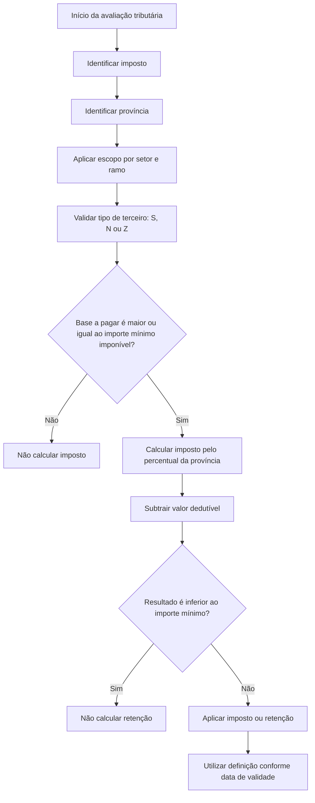

# Definição de Imposto por Província

## 1. Metadados do Documento
- **Arquivo de Origem:** Não identificado
- **Tipo de Documento:** Especificação Técnica
- **Domínio / Sistema:** Definição de imposto por província
- **Público-Alvo:** Desenvolvedores, Analistas Funcionais, Negócio e Operação
- **Data/Versão Identificada:** Não identificada

---

## 2. Resumo Executivo & Contexto de Negócio

O documento descreve a definição de impostos por província, cujo objetivo é determinar o cálculo tributário quando um mesmo imposto possui condições ou percentuais distintos conforme a província aplicável.

A configuração de imposto é identificada por uma chave de imposto e utiliza a província como terceiro nível da estrutura geográfica. A definição também pode ser condicionada por setor, ramo e tipo de terceiro, distinguindo pessoas físicas, empresas ou ambos os tipos.

O cálculo é controlado por um percentual de imposto, por um importe mínimo imponível que define quando o imposto deve começar a ser calculado, por um importe mínimo do resultado calculado e por um valor dedutível fixo.

A data de validade permite que cada definição seja disponibilizada para uso em determinado período e mantém um histórico das alterações efetuadas na definição tributária.

---

## 3. Arquitetura, Componentes & Tecnologias Envolvidas

O conteúdo não apresenta arquitetura de software, microsserviços, APIs, tecnologias, URLs, ambientes ou contratos de integração. O documento descreve uma estrutura funcional de configuração para cálculo de imposto por província.

Componentes funcionais identificados:

| Componente | Função |
| :--- | :--- |
| Imposto | Chave que identifica o imposto configurado. |
| Província | Chave do terceiro nível da estrutura geográfica; identifica a província da definição. |
| Setor | Define se a configuração afeta um setor específico ou utiliza valor genérico. |
| Ramo | Define se a configuração afeta um ramo específico ou utiliza valor genérico. |
| Pessoa física | Determina a aplicabilidade pelo tipo de terceiro: pessoas, empresas ou ambos. |
| Percentual de imposto | Percentual aplicável ao imposto para a província. |
| Importe mínimo imponível | Limite mínimo da base a pagar para permitir cálculo do imposto. |
| Importe mínimo | Limite mínimo do imposto ou retenção calculado para que a retenção seja aplicada. |
| Dedutível | Valor fixo subtraído do imposto calculado. |
| Data de validade | Controla a disponibilidade da definição e o histórico de alterações. |



> **Nota de Análise:** O documento não detalha a fórmula matemática completa do cálculo, a ordem formal entre aplicação do percentual, dedução e validação do importe mínimo, nem métodos HTTP, contratos JSON, bases de dados ou interfaces de manutenção da definição.

---

## 4. Regras de Negócio, Especificações Funcionais & Processos

### 4.1 Objetivo funcional

A definição de imposto por província deve determinar o cálculo dos impostos quando os impostos forem distintos de acordo com a província.

### 4.2 Identificação e escopo da definição

1. A definição possui uma chave de **Imposto**, que identifica o imposto.
2. A propriedade **Província** armazena a chave do terceiro nível da estrutura geográfica e identifica a província.
3. A propriedade **Setor** determina se a definição afeta um setor específico.
4. Quando a definição não afetar um setor específico, a propriedade **Setor** deve possuir valor genérico.
5. A propriedade **Ramo** determina se a definição afeta um ramo específico.
6. Quando a definição não afetar um ramo específico, a propriedade **Ramo** deve possuir valor genérico.

### 4.3 Regra de aplicabilidade por tipo de terceiro

A propriedade denominada **Pessoa física** distingue se o imposto é aplicado conforme o tipo de terceiro.

| Código | Tipo de terceiro | Regra de aplicação |
| :--- | :--- | :--- |
| `S` | Pessoas | A definição aplica-se quando o terceiro é uma pessoa física. |
| `N` | Empresas | A definição aplica-se quando o terceiro é uma pessoa jurídica. |
| `Z` | Ambas | A definição aplica-se quando o terceiro é uma pessoa física ou uma pessoa jurídica. |

### 4.4 Regras de valores tributários

1. **Percentual de imposto:** contém o percentual correspondente ao imposto para a província.
2. **Importe mínimo imponível:** determina o importe mínimo para cálculo dos impostos.
3. Quando a base a pagar for menor que o importe mínimo imponível, não devem ser calculados impostos.
4. Quando a base a pagar for maior ou igual ao importe mínimo imponível, o imposto deve ser calculado.
5. Exemplo documentado: com importe mínimo imponível de `10€`, um valor a pagar inferior a `10€` não gera cálculo de imposto; um valor a pagar maior ou igual a `10€` gera cálculo de imposto.
6. **Importe mínimo:** após o imposto ou retenção ser calculado, se o resultado for inferior ao valor definido nessa propriedade, não deve ser calculada retenção.
7. **Dedutível:** contém um importe fixo que será subtraído do importe calculado do imposto.
8. O valor dedutível pode ser `0`.

### 4.5 Vigência e histórico

A **Data de validade** determina quando a definição estará disponível para utilização. O uso correto da data de validade permite manter um registro histórico das alterações realizadas na definição.

---

## 5. Tabelas de Parâmetros, Ambientes e Estruturas de Dados

| Item / Parâmetro | Descrição / Função | Tipo / Valores / Formato | Ambiente / Observações |
| :--- | :--- | :--- | :--- |
| Imposto | Chave que identifica o imposto. | Chave; formato não detalhado. | Não informado. |
| Província | Chave do terceiro nível da estrutura geográfica. | Chave; formato não detalhado. | Identifica a província da definição tributária. |
| Setor | Define se a definição afeta setor específico. | Valor específico ou genérico. | Deve ser genérico quando não houver setor específico. |
| Ramo | Define se a definição afeta ramo específico. | Valor específico ou genérico. | Deve ser genérico quando não houver ramo específico. |
| Pessoa física | Distingue a aplicação segundo o tipo de terceiro. | `S`, `N` ou `Z`. | `S` para pessoas físicas; `N` para pessoas jurídicas; `Z` para ambos. |
| Percentual de imposto | Percentual correspondente ao imposto para a província. | Percentual; formato não detalhado. | Aplicável após atendimento dos critérios da definição. |
| Importe mínimo imponível | Limite mínimo da base a pagar para calcular imposto. | Valor monetário; exemplo em euros. | Se a base for menor, não se calcula imposto. |
| Importe mínimo | Limite mínimo do resultado calculado para calcular retenção. | Valor monetário; formato não detalhado. | Se o resultado for inferior, não se calcula retenção. |
| Dedutível | Importe fixo subtraído do imposto calculado. | Valor monetário; pode ser `0`. | Ordem precisa de aplicação não detalhada. |
| Data de validade | Determina quando a definição pode ser utilizada. | Data; formato não detalhado. | Permite histórico de alterações. |

---

## 6. Bateria de Perguntas & Respostas para RAG (FAQ Sintético)

### P1: Qual é o objetivo da definição de imposto por província?
**R:** O objetivo é determinar o cálculo dos impostos quando os impostos são distintos conforme a província. A província é identificada pela chave do terceiro nível da estrutura geográfica.

### P2: Como uma definição de imposto é identificada?
**R:** A definição é identificada pela propriedade **Imposto**, que contém a chave que identifica o imposto, e pela propriedade **Província**, que contém a chave da província aplicável.

### P3: O que deve ser informado em Setor e Ramo quando não houver restrição específica?
**R:** Quando a definição não afetar um setor específico, a propriedade **Setor** deve possuir valor genérico. Da mesma forma, quando não afetar um ramo específico, a propriedade **Ramo** deve possuir valor genérico.

### P4: Quais são os valores permitidos para a propriedade Pessoa física?
**R:** A propriedade **Pessoa física** aceita `S`, `N` e `Z`. `S` aplica a definição a pessoas físicas; `N` aplica a empresas ou pessoas jurídicas; e `Z` aplica a definição tanto a pessoas físicas quanto a pessoas jurídicas.

### P5: Quando o imposto não deve ser calculado com base no importe mínimo imponível?
**R:** O imposto não deve ser calculado quando a base a pagar for menor que o importe mínimo imponível configurado na definição.

### P6: Como funciona o exemplo de importe mínimo imponível de 10€?
**R:** Quando o importe mínimo imponível possui valor de `10€`, uma base a pagar inferior a `10€` não gera cálculo de imposto. Uma base a pagar maior ou igual a `10€` gera cálculo de imposto.

### P7: Qual é a função do percentual de imposto?
**R:** O percentual de imposto contém o percentual correspondente ao imposto para a província. O documento não informa a fórmula matemática detalhada que utiliza esse percentual.

### P8: O que ocorre quando o imposto ou a retenção calculada fica abaixo do importe mínimo?
**R:** Após o cálculo do imposto ou retenção, se o resultado for inferior ao valor definido como **Importe mínimo**, não deve ser calculada retenção.

### P9: O que é o valor dedutível na definição de imposto por província?
**R:** O valor **Dedutível** é um importe fixo que será subtraído do importe calculado do imposto. O documento estabelece que esse valor pode ser `0`.

### P10: Para que serve a data de validade?
**R:** A data de validade determina quando uma definição estará disponível para utilização. Seu uso correto permite manter o histórico das alterações efetuadas na definição.

---

## 7. Glossário de Termos, Siglas & Conceitos-Chave

- **Imposto:** Chave que identifica o imposto na definição tributária.
- **Província:** Entidade geográfica identificada pela chave do terceiro nível da estrutura geográfica.
- **Setor:** Critério que pode restringir a definição a um setor específico.
- **Ramo:** Critério que pode restringir a definição a um ramo específico.
- **Pessoa física:** Tipo de terceiro correspondente a uma pessoa natural.
- **Pessoa jurídica / Empresa:** Tipo de terceiro correspondente a uma empresa.
- **`S`:** Código para aplicação da definição a pessoas físicas.
- **`N`:** Código para aplicação da definição a empresas ou pessoas jurídicas.
- **`Z`:** Código para aplicação da definição a pessoas físicas e pessoas jurídicas.
- **Percentual de imposto:** Percentual associado ao imposto para uma província.
- **Importe mínimo imponível:** Valor mínimo da base a pagar a partir do qual o imposto pode ser calculado.
- **Importe mínimo:** Valor mínimo do resultado calculado necessário para calcular retenção.
- **Dedutível:** Importe fixo subtraído do valor calculado do imposto.
- **Data de validade:** Data que controla a disponibilidade da definição e apoia o histórico de alterações.

---

## 8. Notas Críticas, Riscos & Limitações

- O documento não identifica arquivo de origem, data, versão, autor, sistema corporativo ou ambiente técnico.
- O documento não especifica a fórmula completa do imposto, incluindo a ordem inequívoca de aplicação entre percentual, dedutível e importe mínimo.
- Não há detalhamento sobre precedência entre múltiplas definições potencialmente aplicáveis à mesma combinação de imposto, província, setor, ramo e tipo de terceiro.
- Não são informados formatos técnicos das chaves, formato da data de validade, moeda padrão, regras de arredondamento ou precisão decimal.
- O documento estabelece a regra de não cálculo de retenção para resultado inferior ao importe mínimo, mas não especifica se essa regra também elimina o imposto propriamente dito.
- Não há APIs, métodos HTTP, contratos JSON, banco de dados, logs, URLs, servidores ou procedimentos operacionais descritos.

---

## 9. Conteúdo Bruto Estruturado (Referência Fiel)

```text
--- [PÁGINA 1 DE 3] ---

EN CONSTRUCCIÓN
DEFINICIÓN de impuesto por provincia
Objetivo
Determinar el cálculo de los impuestos cuando los impuestos son distintos según la provincia.
-Propiedades generales
Propiedades generales
Impuesto
Clave que identifica el impuesto.
Provincia
Este atributo contiene la clave del tercer nivel de la estructura Geográfica, que identifica la provincia.
Sector
Determina si la definición afecta a un sector específico. En caso de no afectar a un sector, esta
propiedad tendrá un valor genérico.
Ramo
Determina si la definición afecta a un ramo específico. En caso de no afectar a un ramo, esta
propiedad tendrá un valor genérico.
 /
 CF
Inicio Soluciones APIs Documentación Zeus
ES


--- [PÁGINA 2 DE 3] ---

Persona física
Este Atributo distingue si el impuesto se aplica según el tipo de tercero.
(S)Personas
(N)Empresas
(Z)Ambas
(S)Personas
La definición aplica cuando el tercero es una persona física.
(N)Empresas
La definición aplica cuando el tercero es una persona jurídica.
(Z)Ambas
La definición aplica tanto si el tercero es una persona física, como si es una persona jurídica.
Porcentaje impuesto
Contiene el porcentaje que corresponde al impuesto para la provincia.
Importe mínimo imponible
Determina el importe mínimo para el cálculo de impuestos, es decir, cuando la base a pagar es
menor que este importe no se calculan impuestos.
Ejemplo: Si esta propiedad tiene un valor de 10€. Si el valor a pagar es menor a 10€ no se calcula el
impuesto, si es mayor o igual a10€ se calcula el impuesto.
Importe mínimo
Una vez calculado el impuesto o retención, si el resultado es inferior al valor de esta propiedad, no se
calcula retención.
Deducible
Esta propiedad contiene un importe fijo que se restará al importe calculado del impuesto. Su valor
puede ser 0.
Fecha de validez
Determina cuando la definición estará disponible para ser utilizada. Su correcto uso permite tener un
registro histórico de los cambios efectuados en la definición.


--- [PÁGINA 3 DE 3] ---

[Página em branco ou apenas elementos visuais/imagem]
```
