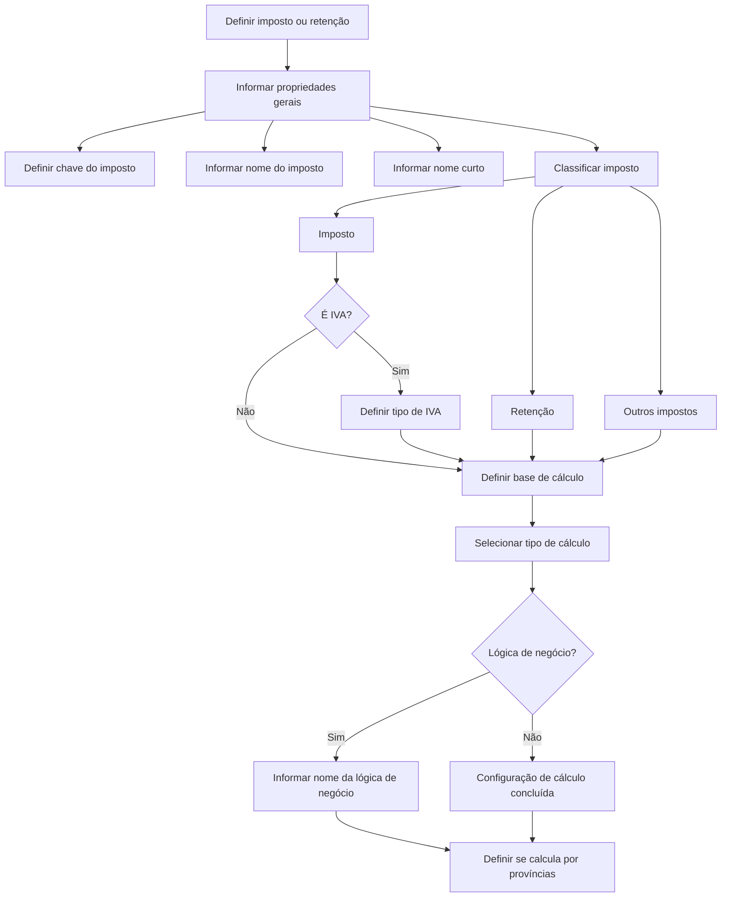

# Definição de Impostos — Propriedades Gerais e Regras de Cálculo

## 1. Metadados do Documento
- **Arquivo de Origem:** `Não identificado no conteúdo fornecido`
- **Tipo de Documento:** `Especificação Funcional`
- **Domínio / Sistema:** `Definição de impostos, retenções e IVA`
- **Público-Alvo:** `Negócio, Analistas Funcionais, Desenvolvedores e Operação`
- **Data/Versão Identificada:** `Não identificada`

---

## 2. Resumo Executivo & Contexto de Negócio

O documento descreve a configuração de impostos no contexto de uma companhia que deve identificar os impostos com os quais necessita trabalhar. Impostos são definidos como quantidades em dinheiro que uma pessoa ou empresa deve pagar à Hacienda Pública para contribuir com o financiamento do gasto e do investimento público.

A definição de cada imposto contém propriedades gerais de identificação, incluindo uma chave, um nome descritivo e um nome curto. O conteúdo também apresenta uma classificação funcional que diferencia imposto, retenção e outros impostos.

Para impostos classificados como IVA, a configuração deve indicar o tipo de IVA: incluído, suportado, repercutido ou isento. O documento define ainda a base de cálculo, distinguindo entre o total da fatura antes de impostos e a quota de IVA aplicável especificamente ao cálculo de retenção sobre IVA.

A forma de cálculo pode ser percentual, por mil, valor fixo, valor fixo por unidade ou lógica de negócio. Quando a lógica de negócio for selecionada, o nome dessa lógica deve ser informado. Há também uma propriedade para determinar se o imposto possui taxas por província.

---

## 3. Arquitetura, Componentes & Tecnologias Envolvidas

O conteúdo fornecido não descreve arquitetura de software, integrações, APIs, microsserviços, servidores, contratos HTTP, ambientes técnicos ou tecnologias de implementação. Os termos de navegação `Inicio`, `Soluciones`, `APIs`, `Documentación`, `Zeus` e `ES` aparecem no conteúdo bruto, mas não recebem detalhamento funcional ou técnico.

O fluxo abaixo representa exclusivamente a sequência funcional de configuração de impostos descrita no documento.



> **Nota de Análise:** O documento não detalha persistência de dados, telas, métodos HTTP, contratos JSON, regras de prioridade entre taxas provinciais ou a implementação das lógicas de negócio.

---

## 4. Regras de Negócio, Especificações Funcionais & Processos

1. A companhia deve identificar os impostos com os quais deve trabalhar.
2. Cada imposto ou retenção possui uma chave que o identifica.
3. Cada definição deve possuir um nome do imposto, correspondente à descrição associada à chave identificadora.
4. Cada definição pode possuir um nome curto, utilizado como nome abreviado do imposto.
5. A classificação do imposto identifica o tipo de definição:
   - `(I)` Imposto;
   - `(R)` Retenção;
   - `(O)` Outros impostos.
6. Quando a definição for um imposto e esse imposto for IVA, deve ser definido o tipo de IVA:
   - `(I)` Incluído;
   - `(S)` Suportado;
   - `(R)` Repercutido;
   - `(E)` Isento.
7. O tipo de base de cálculo identifica o valor utilizado como base para calcular o imposto:
   - `(B)` Base;
   - `(I)` Quota de IVA, isto é, importe de IVA.
8. Para a base de cálculo `(B) Base`, a base corresponde ao total da fatura antes de impostos.
9. Para a base de cálculo `(I) Quota de IVA`, a base é aplicável somente ao cálculo de retenção sobre o IVA; o importe base corresponde à quota de IVA.
10. O tipo de cálculo identifica a forma de cálculo do imposto:
    - `(1)` Tanto por cento;
    - `(2)` Tanto por mil;
    - `(3)` Importe fixo;
    - `(4)` Importe fixo por unidade;
    - `(5)` Lógica de negócio.
11. Quando o tipo de cálculo for `(5) Lógica de negócio`, o nome da lógica de negócio deve ser informado.
12. A propriedade “Calcula por províncias” determina se o imposto possui taxas por província.

---

## 5. Tabelas de Parâmetros, Ambientes e Estruturas de Dados

| Item / Parâmetro | Descrição / Função | Tipo / Valores / Formato | Ambiente / Observações |
| :--- | :--- | :--- | :--- |
| Imposto | Entidade definida como quantia monetária obrigatória paga à Hacienda Pública. | Não especificado | A companhia deve identificar os impostos com os quais trabalha. |
| Chave do imposto | Identifica o imposto ou a retenção. | Não especificado | O documento não informa formato, tamanho ou unicidade da chave. |
| Nome do imposto | Descrição associada à chave que identifica o imposto definido. | Texto | Não especificado. |
| Nome curto | Nome abreviado do imposto. | Texto | Não especificado. |
| Classificação do imposto | Identifica o tipo de imposto definido. | `(I) Imposto`; `(R) Retenção`; `(O) Outros impostos` | O trecho contém a expressão `/ CF`, sem detalhamento adicional. |
| Tipo de IVA | Determina o tipo quando a definição é um imposto classificado como IVA. | `(I) Incluído`; `(S) Suportado`; `(R) Repercutido`; `(E) Isento` | Aplicável quando o imposto é IVA. |
| Tipo de base de cálculo | Identifica o importe usado como base para o cálculo do imposto. | `(B) Base`; `(I) Quota de IVA` | A quota de IVA é o importe de IVA. |
| Base | Usa o total da fatura antes de impostos como base de cálculo. | `(B)` | Aplicável conforme seleção do tipo de base de cálculo. |
| Quota de IVA | Usa a quota de IVA como importe base. | `(I)` | Aplica-se apenas ao cálculo de retenção sobre IVA. |
| Tipo de cálculo | Identifica a forma de cálculo do imposto. | `(1)` Tanto por cento; `(2)` Tanto por mil; `(3)` Importe fixo; `(4)` Importe fixo por unidade; `(5)` Lógica de negócio | Não são detalhadas fórmulas, arredondamentos ou precedências. |
| Nome da lógica de negócio | Identifica a lógica utilizada para cálculo. | Texto / nome não especificado | Obrigatório quando o tipo de cálculo é “Lógica de negócio”. |
| Calcula por províncias | Determina se o imposto tem taxas por província. | Booleano não explicitado | O documento não especifica províncias, taxas ou regra de seleção aplicável. |

---

## 6. Bateria de Perguntas & Respostas para RAG (FAQ Sintético)

### P1: Qual é o objetivo da definição de impostos no documento?
**R:** O objetivo é permitir que a companhia identifique os impostos com os quais deve trabalhar. O documento define imposto como uma quantia de dinheiro que uma pessoa ou empresa é obrigada a pagar à Hacienda Pública para contribuir com o financiamento do gasto e do investimento público.

### P2: Quais dados identificam um imposto ou retenção?
**R:** O documento informa que a chave do imposto ou retenção é o elemento que identifica a definição. Também são previstos o nome do imposto, como descrição associada à chave, e o nome curto, como nome abreviado do imposto.

### P3: Quais classificações de imposto estão disponíveis?
**R:** A classificação do imposto pode assumir `(I) Imposto`, `(R) Retenção` ou `(O) Outros impostos`. O documento indica que essa classificação identifica o tipo de imposto que está sendo definido.

### P4: Quando o tipo de IVA deve ser definido?
**R:** O tipo de IVA deve ser definido quando a classificação corresponde a um imposto e o imposto em questão é IVA. Os valores apresentados são incluído, suportado, repercutido e isento.

### P5: Quais são os tipos de IVA disponíveis?
**R:** Os tipos de IVA listados são `(I) Incluído`, `(S) Suportado`, `(R) Repercutido` e `(E) Isento`. O documento não detalha o comportamento contábil ou fiscal de cada tipo.

### P6: O que significa utilizar “Base” como tipo de base de cálculo?
**R:** O valor `(B) Base` indica que a base para o cálculo do imposto será o total da fatura antes de impostos.

### P7: Em que situação a quota de IVA pode ser usada como base de cálculo?
**R:** A `(I) Quota de IVA`, isto é, o importe de IVA, aplica-se apenas ao cálculo de retenção sobre o IVA. Nessa situação, o importe base é a própria quota de IVA.

### P8: Quais formas de cálculo de imposto são suportadas?
**R:** O documento lista cinco formas: `(1) Tanto por cento`, `(2) Tanto por mil`, `(3) Importe fixo`, `(4) Importe fixo por unidade` e `(5) Lógica de negócio`.

### P9: O que deve ser informado quando o tipo de cálculo é lógica de negócio?
**R:** Quando o tipo de cálculo é definido como lógica de negócio, deve ser incluído o nome da lógica de negócio correspondente.

### P10: O que controla o parâmetro “Calcula por províncias”?
**R:** O parâmetro determina se o imposto possui taxas por província. O documento não informa quais províncias podem ser configuradas, nem como uma taxa provincial é selecionada.

---

## 7. Glossário de Termos, Siglas & Conceitos-Chave

- **Hacienda Pública:** Entidade pública mencionada como destinatária do pagamento obrigatório de impostos.
- **IVA:** Imposto citado no documento para o qual devem ser definidos tipos como incluído, suportado, repercutido ou isento.
- **Imposto:** Quantidade monetária obrigatória paga à Hacienda Pública.
- **Retenção:** Classificação disponível para a definição tributária; o documento associa a quota de IVA ao cálculo de retenção sobre IVA.
- **Quota de IVA:** Importe de IVA que pode ser utilizado como base de cálculo apenas para retenção sobre IVA.
- **Tanto por cento:** Tipo de cálculo listado no documento.
- **Tanto por mil:** Tipo de cálculo listado no documento.
- **Importe fixo:** Tipo de cálculo listado no documento.
- **Importe fixo por unidade:** Tipo de cálculo listado no documento.
- **Lógica de negócio:** Tipo de cálculo que exige a indicação do nome da lógica de negócio.
- **Províncias:** Divisão territorial usada para determinar se um imposto possui taxas por província.

---

## 8. Notas Críticas, Riscos & Limitações

- O documento não identifica arquivo, autor, data, versão, sistema responsável ou ambiente de execução.
- Não são informados formatos, obrigatoriedade, validações, tamanhos ou regras de unicidade para chave, nome, nome curto e nome da lógica de negócio.
- Não são fornecidas fórmulas matemáticas para os tipos “tanto por cento” e “tanto por mil”.
- Não há detalhamento da execução, entradas, saídas ou contratos das lógicas de negócio.
- O documento não descreve regras de arredondamento, prioridade, vigência, tributação acumulada, exceções ou tratamento de erros.
- Embora o parâmetro “Calcula por províncias” seja citado, não há lista de províncias, estrutura de taxas, critério de aplicação ou regra de conflito.
- A expressão `Clasificación del impuesto / CF` aparece no conteúdo, mas `CF` não recebe definição adicional.

---

## 9. Conteúdo Bruto Estruturado (Referência Fiel)

```text
--- [PÁGINA 1 DE 3] ---

EN CONSTRUCCIÓN
DEFINICIÓN de impuesto
Objetivo
Son aquellas cantidades de dinero que una persona o empresa está obligada a pagar a favor de la
Hacienda Pública para contribuir con la financiación del gasto y la inversión pública.
La compañía debe identificar los impuestos con los que debe trabajar.
-Propiedades generales
Propiedades generales
Impuesto
Clave que identifica el impuesto o retención.
Nombre del impuesto
Descripción asociada a la clave que identifica el impuesto que se está definiendo.
Nombre corto
Nombre abreviado del impuesto.
Clasificación del impuesto
 / 
 CF
Inicio Soluciones APIs Documentación Zeus
ES


--- [PÁGINA 2 DE 3] ---

Identifica el tipo de impuesto que se está definiendo
(I)Impuesto
(R)Retención
(O)Otros impuestos
Tipo de IVA
Cuando es un impuesto y este es IVA, determina el tipo.
(I)Incluido
(S)Soportado
(R)Repercutido
(E)Exento
Tipo de base de cálculo
Identifica el importe base para el cálculo del impuesto.
(B)Base
(I)Cuota de iva (importe iva)
(B)Base
La base para el cálculo será el total de la factura antes de impuestos.
(I)Cuota de iva
Esta base solo aplica para el cálculo de retención sobre el IVA y el importe base será la cuota del
IVA.
Tipo de cálculo
Identifica la forma de cálculo del impuesto
(1)Tanto por ciento
(2)Tanto por mil
(3)Importe fijo
(4)Importe fijo por unidad
(5)Lógica de negocio
Nombre de la lógica de negocio


--- [PÁGINA 3 DE 3] ---

Cuando el tipo de cálculo es por una lógica de negocio, en este punto se ha de incluir el nombre de
dicha lógica.
Calcula por provincias
Determina si el impuesto tiene tasas por provincia.
```
