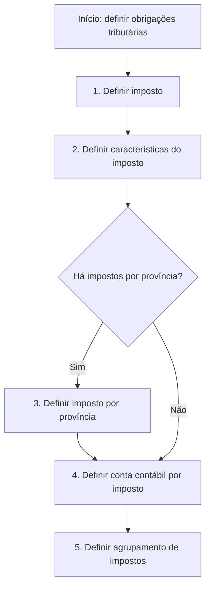

# Definição de Impostos — Processo de Configuração de Obrigações Tributárias

## 1. Metadados do Documento
- **Arquivo de Origem:** Não identificado — conteúdo bruto fornecido na solicitação.
- **Tipo de Documento:** Procedimento funcional.
- **Domínio / Sistema:** Definição de impostos e obrigações tributárias.
- **Público-Alvo:** Negócio, analistas funcionais, configuração contábil e operação.
- **Data/Versão Identificada:** Não identificada.

---

## 2. Resumo Executivo & Contexto de Negócio

O documento descreve um processo para definir os tipos de obrigações tributárias que devem ser considerados. O objetivo declarado é estabelecer tanto as características dos impostos quanto as suas formas de cálculo.

O processo é composto por cinco atividades de definição: imposto, características do imposto, imposto por província, conta contábil por imposto e agrupamento de impostos. A sequência contém uma decisão explícita sobre a existência de impostos por província.

Quando há impostos por província, o fluxo inclui a definição específica de imposto por província antes da configuração da conta contábil por imposto. Quando não há impostos por província, o conteúdo fornecido não detalha visualmente um caminho alternativo nem especifica se alguma atividade é omitida.

O documento não informa regras de cálculo concretas, alíquotas, critérios tributários, formatos de cadastro, sistemas executores, contratos de integração ou responsabilidades organizacionais. A finalidade apresentada é estritamente a definição e organização dos elementos tributários e contábeis relacionados.

---

## 3. Arquitetura, Componentes & Tecnologias Envolvidas

Os componentes funcionais identificados no documento são:

- **Imposto:** entidade tributária a ser definida.
- **Características do imposto:** propriedades associadas ao imposto.
- **Imposto por província:** definição condicional, aplicável quando houver impostos por província.
- **Conta contábil por imposto:** conta contábil associada ao imposto.
- **Agrupamento de impostos:** organização ou agrupamento dos impostos configurados.
- **Decisão “¿Impuestos por provincia?”:** ponto decisório que determina a necessidade de definir imposto por província.

O texto também contém a expressão `CF Home Solutions APIs Documentation Zeus EN`, mas não apresenta contexto suficiente para determinar se representa produto, ambiente, portal, sistema, navegação, tecnologia ou referência documental.



> **Nota de Análise:** O documento apresenta um fluxo de configuração funcional, não uma arquitetura técnica de software. Não são detalhados serviços, bancos de dados, APIs, protocolos, tecnologias, ambientes ou contratos de integração.

---

## 4. Regras de Negócio, Especificações Funcionais & Processos

### Objetivo funcional

Devem ser definidos os tipos de obrigações tributárias a considerar, incluindo:

1. As características dos impostos.
2. As formas de cálculo dos impostos.

### Processo de definição de impostos

1. **Definir imposto**
   - O processo inicia com a definição do imposto.
   - O documento não especifica atributos obrigatórios, identificadores, códigos, categorias, alíquotas ou fórmulas para a definição do imposto.

2. **Definir características do imposto**
   - Após definir o imposto, devem ser definidas as características tributárias correspondentes.
   - O documento não enumera quais características devem ser cadastradas.

3. **Avaliar impostos por província**
   - Deve-se avaliar a questão: **“¿Impuestos por provincia?”**
   - Caso a resposta seja **“SI”**, deve ser realizada a atividade de definição de imposto por província.
   - Caso a resposta seja **“NO”**, o documento não oferece detalhamento adicional do tratamento funcional.

4. **Definir imposto por província**
   - Esta etapa é condicional à existência de impostos por província.
   - O documento não especifica províncias, regras de associação, critérios de aplicação ou diferenças entre impostos gerais e provinciais.

5. **Definir conta contábil por imposto**
   - Deve ser definida uma conta contábil associada ao imposto.
   - O documento não identifica plano de contas, formato da conta, regras de contabilização ou cardinalidade entre impostos e contas contábeis.

6. **Definir agrupamento de impostos**
   - O processo termina com a definição de agrupamento de impostos.
   - O documento não descreve critérios de agrupamento, hierarquia, finalidade operacional ou comportamento do agrupamento.

---

## 5. Tabelas de Parâmetros, Ambientes e Estruturas de Dados

| Item / Parâmetro | Descrição / Função | Tipo / Valores / Formato | Ambiente / Observações |
| :--- | :--- | :--- | :--- |
| Imposto | Entidade tributária inicial a ser definida. | Não informado. | Etapa 1 do processo. |
| Características do imposto | Propriedades associadas ao imposto definido. | Não informado. | Etapa 2 do processo. |
| Impostos por província | Decisão que verifica a necessidade de configuração tributária por província. | `SI` ou `NO`. | O tratamento detalhado para `NO` não é apresentado. |
| Imposto por província | Definição de imposto específica por província. | Não informado. | Executado quando a decisão sobre impostos por província for `SI`. |
| Conta contábil por imposto | Conta contábil vinculada ao imposto. | Não informado. | Etapa 4 do processo. |
| Agrupamento de impostos | Organização ou agrupamento dos impostos definidos. | Não informado. | Etapa 5 do processo. |
| Formas de cálculo | Formas de cálculo dos impostos que devem ser consideradas. | Não informado. | Mencionadas no objetivo, sem detalhamento de fórmulas ou parâmetros. |
| `CF Home Solutions APIs Documentation Zeus EN` | Texto presente no conteúdo original. | Não informado. | Não há contexto suficiente para classificar esta referência. |

---

## 6. Bateria de Perguntas & Respostas para RAG (FAQ Sintético)

### P1: Qual é o objetivo do processo de definição de impostos?
**R:** O objetivo é definir os tipos de obrigações tributárias que devem ser considerados, incluindo as características dos impostos e suas formas de cálculo.

### P2: Quais são as etapas enumeradas no processo de definição de impostos?
**R:** As etapas enumeradas são: definir imposto; definir características do imposto; definir imposto por província; definir conta contábil por imposto; e definir agrupamento de impostos.

### P3: Em que situação deve ser definido um imposto por província?
**R:** O imposto por província deve ser definido quando a decisão “¿Impuestos por provincia?” tiver resposta `SI`.

### P4: O que o documento determina para o caso em que não existem impostos por província?
**R:** O documento apresenta a alternativa `NO` na decisão sobre impostos por província, mas não detalha passos adicionais, exceções ou regras específicas para esse cenário.

### P5: O documento especifica como calcular os impostos?
**R:** Não. O documento afirma que as formas de cálculo devem ser consideradas, mas não apresenta fórmulas, alíquotas, bases de cálculo, periodicidade ou parâmetros de cálculo.

### P6: Qual configuração contábil deve ser realizada para cada imposto?
**R:** Deve ser definida uma conta contábil por imposto. O documento não detalha o plano de contas, o formato da conta ou regras de contabilização.

### P7: Qual é a finalidade do agrupamento de impostos no processo?
**R:** O agrupamento de impostos é a quinta e última atividade listada no processo. A finalidade operacional, os critérios de agrupamento e a estrutura do agrupamento não são detalhados no conteúdo fornecido.

### P8: Quais características do imposto devem ser configuradas?
**R:** O documento exige a definição das características do imposto, porém não lista quais atributos, campos, classificações ou validações compõem essas características.

### P9: O documento descreve APIs ou integrações para o processo tributário?
**R:** Não. Apesar de conter a expressão `CF Home Solutions APIs Documentation Zeus EN`, o conteúdo não descreve APIs, endpoints, métodos HTTP, contratos de dados ou integrações.

### P10: O fluxo de definição de impostos possui uma decisão?
**R:** Sim. O fluxo possui a decisão “¿Impuestos por provincia?”, que verifica se deve haver uma etapa de definição de imposto por província.

---

## 7. Glossário de Termos, Siglas & Conceitos-Chave

- **Obrigação tributária:** Tipo de obrigação relacionada a impostos que deve ser considerado no processo, conforme o objetivo declarado.
- **Imposto:** Entidade tributária que deve ser definida na primeira etapa do processo.
- **Características do imposto:** Propriedades do imposto que devem ser definidas após a criação ou definição do imposto.
- **Imposto por província:** Configuração tributária específica por província, aplicável quando a resposta à decisão correspondente for `SI`.
- **Conta contábil por imposto:** Conta contábil que deve ser definida para o imposto.
- **Agrupamento de impostos:** Configuração de agrupamento a ser definida na etapa final do processo.
- **SI:** Resposta positiva à decisão sobre a existência de impostos por província.
- **NO:** Resposta negativa à decisão sobre a existência de impostos por província.
- **CF Home Solutions APIs Documentation Zeus EN:** Expressão presente no documento original sem definição contextual suficiente.

---

## 8. Notas Críticas, Riscos & Limitações

- O documento não detalha valores, alíquotas, bases de cálculo, fórmulas, periodicidade ou exceções para as formas de cálculo dos impostos.
- Não há descrição dos campos necessários para cadastrar imposto, características, imposto por província, conta contábil ou agrupamento.
- O caminho funcional após uma resposta `NO` para “¿Impuestos por provincia?” não é explicitado.
- Não são fornecidas regras de validação, mensagens de erro, perfis de acesso, aprovações ou trilha de auditoria.
- Não há identificação de sistema, ambiente, API, banco de dados, versão de software ou responsável pelo processo.
- A referência `CF Home Solutions APIs Documentation Zeus EN` não possui detalhamento suficiente para ser interpretada com segurança.

---

## 9. Conteúdo Bruto Estruturado (Referência Fiel)

```text
--- [PÁGINA 1 DE 1] ---

DEFINICIÓN de impuestos
Objetivo
Se definen los tipos de obligaciones tributarias que se deben tener en cuenta, así como sus
características y formas de cálculo.
Pasos a seguir
SI
NO
DEFINIR
Impuesto
(1)
DEFINIR
Características
impuestos
(2)
¿Impuestos por
provincia? DEFINIR
Impuesto por
provincia
(3)
DEFINIR
Cuenta contable
por impuesto
(4)
DEFINIR
Agrupación
impuestos
(5)
1. DEFINIR Impuesto
2. DEFINIR Características impuesto
3. DEFINIR Impuesto por provincia
4. DEFINIR Cuenta contable por impuesto
5. DEFINIR Agrupación impuestos
 / 
 CF
Home Solutions APIs Documentation Zeus
EN
```
