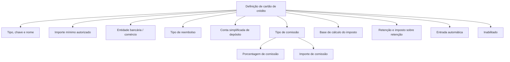

# Definição de Características de Cartões de Crédito — Comissão, Impostos e Configuração Operacional

## 1. Metadados do Documento
- **Arquivo de Origem:** Não identificado no conteúdo fornecido
- **Tipo de Documento:** Especificação Técnica
- **Domínio / Sistema:** Configuração de cartões de crédito para cobrança e tesouraria MAPFRE
- **Público-Alvo:** Desenvolvedores, Analistas Funcionais, Operação e Tesouraria
- **Data/Versão Identificada:** Não identificada

---

## 2. Resumo Executivo & Contexto de Negócio

O documento define características de cartões de crédito necessárias para realizar cálculos de comissões bancárias e impostos associados a cobranças com cartão. O contexto apresentado indica que a utilização de cartões gera comissões cobradas pelo banco e que essas comissões podem estar sujeitas a impostos.

A configuração de cada cartão inclui identificação, entidade bancária, regras de autorização, comércio, forma de reembolso e conta simplificada de depósito em tesouraria. Esses atributos permitem associar uma cobrança com cartão às condições operacionais e financeiras aplicáveis.

O documento especifica sete modalidades de cálculo de comissão, incluindo ausência de comissão, percentuais sujeitos a mínimo ou máximo, valores fixos e cenários que combinam valor fixo, percentual e imposto. Também define se o imposto incide sobre a comissão ou sobre o valor total cobrado no cartão.

Além das regras financeiras, a definição contempla retenção, imposto sobre retenção, restrição de uso exclusivo para transações automáticas e inativação da configuração. O conteúdo não detalha fórmulas matemáticas completas, métodos HTTP, contratos de integração, URLs, ambientes ou componentes técnicos de implementação.

---

## 3. Arquitetura, Componentes & Tecnologias Envolvidas

O conteúdo descreve uma estrutura de configuração funcional para cartões de crédito, bancos, tesouraria e cálculos financeiros. Não há arquitetura de software, microsserviços, tecnologias, endpoints, bancos de dados ou ambientes técnicos explicitamente identificados.



**Nota de Análise:** O documento apresenta propriedades de configuração e regras de cálculo, mas não detalha componentes de software responsáveis por persistir, validar ou executar esses cálculos.

---

## 4. Regras de Negócio, Especificações Funcionais & Processos

### 4.1 Objetivo da definição de cartão

A definição de características de cartão de crédito tem como objetivo determinar os dados necessários para calcular:

1. Comissões cobradas pelo banco pelo uso do cartão.
2. Impostos que podem incidir sobre essas comissões.
3. Dados operacionais associados à cobrança, ao reembolso e ao depósito em tesouraria.

### 4.2 Identificação do cartão

- O **tipo de cartão** identifica que se trata de um cartão de crédito.
- A **chave de cartão** classifica o cartão de acordo com a entidade bancária à qual pertence.
- O **nome** contém a denominação associada à chave de cartão.
- Exemplos fornecidos:
  - Chave `1`: Visa BBVA.
  - Chave `5`: Visa Santander.

### 4.3 Regra de autorização

O **importe mínimo autorizado** contém o valor mínimo para o qual não é necessário informar um número de autorização.

**Nota de Análise:** O documento não especifica a moeda, a unidade monetária, o comportamento para valores acima ou abaixo do limite, nem o formato do número de autorização.

### 4.4 Comércio, reembolso e depósito

- O campo **comércio** contém a chave de comércio exigida pelo banco ao realizar a cobrança com cartão.
- O **tipo de reembolso** define o tipo de compensação ou reembolso que o banco realizará para o valor do cartão.
- A **conta simplificada de depósito** é a chave da conta simplificada de tesouraria que identifica o banco no qual a cobrança do cartão será depositada.

### 4.5 Tipos de comissão

O **tipo de comissão** determina como será calculada a despesa de comissão do cartão assumida pela MAPFRE.

| Código | Tipo de comissão | Regra descrita |
| :--- | :--- | :--- |
| `0` | Sem comissão | Não há comissão. |
| `1` | Percentual com importe mínimo de comissão | A comissão considera um percentual e um importe mínimo. |
| `2` | Percentual com importe máximo de comissão | A comissão considera um percentual e um importe máximo. |
| `3` | Importe fixo de comissão, sem percentual | A comissão é um valor fixo, sem percentual. |
| `4` | Importe fixo mais percentual, um único lançamento | A comissão combina importe fixo e percentual em um único lançamento. |
| `5` | Imposto sobre comissão e importe fixo | Existe imposto sobre a comissão e sobre o importe fixo. |
| `6` | Imposto somente sobre comissão; importe fixo sem imposto | O imposto incide somente sobre a comissão; o importe fixo não possui imposto. |

### 4.6 Percentual e importe de comissão

- A **porcentagem de comissão** contém o valor percentual quando o cálculo de comissão requer percentual.
- O **importe de comissão** contém o valor utilizado quando o cálculo exige:
  - importe mínimo;
  - importe máximo;
  - importe fixo.

### 4.7 Base de cálculo do imposto

A **base de cálculo do imposto** determina o valor-base sobre o qual será calculado o imposto do cartão.

| Código | Base de cálculo | Regra |
| :--- | :--- | :--- |
| `1` | Importe de comissão | O imposto é calculado sobre o importe da comissão do cartão. |
| `2` | Importe do cartão | O imposto é calculado sobre o valor total cobrado com o cartão. |

### 4.8 Retenção e imposto sobre retenção

- A **retenção** contém a chave da retenção assumida pela MAPFRE para o cartão.
- O **imposto sobre retenção** contém a chave do imposto calculado sobre o importe da retenção assumida pela MAPFRE.

**Nota de Análise:** O documento não detalha as alíquotas, fórmulas, periodicidade ou critérios de aplicação da retenção e do imposto sobre retenção.

### 4.9 Restrições operacionais e status

- **Entrada automática:** determina que o cartão somente pode ser utilizado em transações automáticas; movimentos manuais não são permitidos.
- **Inabilitado:** determina se a definição está ativa ou se não deve mais ser considerada.

---

## 5. Tabelas de Parâmetros, Ambientes e Estruturas de Dados

| Item / Parâmetro | Descrição / Função | Tipo / Valores / Formato | Ambiente / Observações |
| :--- | :--- | :--- | :--- |
| Tipo de cartão | Identifica o tipo de cartão. | Cartão de crédito. | Não há valores adicionais detalhados. |
| Chave de cartão | Classifica o cartão conforme a entidade bancária. | Chave numérica nos exemplos. | Exemplo: `1` para Visa BBVA; `5` para Visa Santander. |
| Nome | Denominação do cartão associada à chave. | Texto. | Exemplo: Visa BBVA e Visa Santander. |
| Importe mínimo autorizado | Valor mínimo para o qual não é necessário informar número de autorização. | Importe monetário não detalhado. | Moeda e regra para outros valores não informadas. |
| Comércio | Chave de comércio exigida pelo banco para cobrança com cartão. | Chave não detalhada. | Não há catálogo de chaves de comércio. |
| Tipo de reembolso | Define a compensação ou reembolso realizado pelo banco. | `1` Depósito em c/c; `2` Pagamento com cheque. | O documento não define “c/c”. |
| Conta simplificada de depósito | Identifica o banco de depósito da cobrança mediante conta simplificada de tesouraria. | Chave de conta. | Não há estrutura ou formato informado. |
| Tipo de comissão | Determina a modalidade de cálculo da despesa de comissão assumida pela MAPFRE. | Códigos `0` a `6`. | Regras detalhadas na seção 4.5. |
| Porcentagem de comissão | Armazena o valor percentual quando o cálculo requer percentual. | Percentual. | Aplicável conforme o tipo de comissão. |
| Importe de comissão | Armazena o valor mínimo, máximo ou fixo da comissão. | Importe monetário não detalhado. | Aplicável conforme o tipo de comissão. |
| Base de cálculo do imposto | Define o importe sobre o qual o imposto será calculado. | `1` Importe de comissão; `2` Importe do cartão. | Regra detalhada na seção 4.7. |
| Retenção | Chave da retenção assumida pela MAPFRE. | Chave não detalhada. | Não há fórmula ou catálogo de retenções. |
| Imposto sobre retenção | Chave do imposto aplicado sobre a retenção assumida pela MAPFRE. | Chave não detalhada. | Não há alíquota ou regra adicional. |
| Entrada automática | Restringe o uso do cartão a transações automáticas. | Condição lógica não detalhada. | Movimentos manuais não são permitidos. |
| Inabilitado | Define se a configuração permanece ativa ou não deve mais ser considerada. | Status lógico não detalhado. | Não há valores técnicos informados. |

---

## 6. Bateria de Perguntas & Respostas para RAG (FAQ Sintético)

### P1: Qual é o objetivo da definição de características de cartões de crédito?
**R:** O objetivo é determinar os dados do cartão necessários para calcular as comissões cobradas pelo banco pelo uso do cartão e os impostos que podem incidir sobre essas comissões.

### P2: Para que serve a chave de cartão?
**R:** A chave de cartão é utilizada para classificar o cartão de acordo com a entidade bancária à qual o cartão pertence. Os exemplos apresentados são a chave `1`, associada a Visa BBVA, e a chave `5`, associada a Visa Santander.

### P3: Quando não é necessário informar um número de autorização?
**R:** Não é necessário informar um número de autorização quando a cobrança atingir a condição definida pelo campo “importe mínimo autorizado”. O documento não fornece o valor desse limite nem detalha seu comportamento em outros cenários.

### P4: Quais tipos de reembolso bancário são previstos?
**R:** O documento prevê dois tipos de reembolso: código `1`, depósito em conta corrente (`c/c`), e código `2`, pagamento com cheque.

### P5: Qual é a função da conta simplificada de depósito?
**R:** A conta simplificada de depósito contém a chave da conta simplificada de tesouraria que identifica o banco no qual será depositado o valor cobrado com o cartão.

### P6: Quais modalidades de comissão existem para cartões de crédito?
**R:** Existem sete modalidades: sem comissão; percentual com importe mínimo; percentual com importe máximo; importe fixo sem percentual; importe fixo mais percentual em um único lançamento; imposto sobre comissão e importe fixo; e imposto somente sobre comissão, sem imposto sobre o importe fixo.

### P7: Quando o campo porcentagem de comissão deve ser utilizado?
**R:** A porcentagem de comissão deve conter o valor percentual quando o cálculo de comissão do cartão exige um percentual. O documento não define a precisão, o formato ou as modalidades exatas que obrigatoriamente utilizam esse campo.

### P8: Para que serve o importe de comissão?
**R:** O importe de comissão contém o valor necessário quando o cálculo requer um importe mínimo, um importe máximo ou um importe fixo de comissão.

### P9: Como é definida a base de cálculo do imposto do cartão?
**R:** A base de cálculo do imposto pode ser o importe da comissão, identificado pelo código `1`, ou o importe total cobrado no cartão, identificado pelo código `2`.

### P10: O que ocorre quando a base de cálculo do imposto é “importe de comissão”?
**R:** Quando a base de cálculo do imposto é configurada com o código `1`, o imposto é calculado sobre o importe da comissão do cartão.

### P11: O que significa entrada automática na configuração do cartão?
**R:** Entrada automática determina que o cartão pode ser utilizado somente para transações automáticas. Movimentos manuais não são permitidos para cartões com essa condição.

### P12: O que significa uma definição de cartão estar inabilitada?
**R:** Uma definição inabilitada é uma definição que não deve mais ser considerada. O campo também permite determinar se a definição permanece ativa.

---

## 7. Glossário de Termos, Siglas & Conceitos-Chave

- **MAPFRE:** Organização mencionada como responsável por assumir a despesa de comissão e a retenção associadas ao cartão.
- **c/c:** Abreviação apresentada no tipo de reembolso “Depósito em c/c”; o documento não explicita seu significado.
- **Chave de cartão:** Identificador utilizado para classificar um cartão conforme a entidade bancária.
- **Comércio:** Chave de comércio exigida pelo banco na realização da cobrança com cartão.
- **Comissão:** Despesa cobrada pelo banco em razão do uso do cartão de crédito.
- **Importe:** Valor monetário utilizado em regras de cobrança, comissão, imposto, autorização ou reembolso.
- **Retenção:** Valor ou conceito identificado por uma chave e assumido pela MAPFRE para o cartão.
- **Conta simplificada de depósito:** Chave de conta simplificada de tesouraria que identifica o banco no qual a cobrança será depositada.
- **Entrada automática:** Restrição que permite exclusivamente transações automáticas e impede movimentos manuais.

---

## 8. Notas Críticas, Riscos & Limitações

- O documento não apresenta fórmulas matemáticas completas para calcular comissão, imposto, retenção ou imposto sobre retenção.
- O documento não informa moedas, escalas percentuais, arredondamentos, precisão decimal, alíquotas ou exemplos completos de cálculo.
- Não há definição de sistemas, tecnologias, APIs, métodos HTTP, contratos JSON, banco de dados, URLs, servidores ou ambientes.
- O significado da sigla `c/c` não está explicitado.
- Não são fornecidos valores permitidos, tipos técnicos ou representação lógica para os campos “entrada automática” e “inabilitado”.
- Não há detalhamento sobre a sequência operacional que executa cobrança, cálculo de comissão, cálculo de imposto, depósito e reembolso.
- A relação entre os tipos de comissão e a base de cálculo do imposto não é detalhada além das descrições textuais fornecidas.

---

## 9. Conteúdo Bruto Estruturado (Referência Fiel)

```text
--- [PÁGINA 1 DE 3] ---

EN CONSTRUCCIÓN
DEFINICIÓN de características de tarjetas de
crédito
Objetivo
El cobro con tarjeta de crédito implica unos importe de comisiones que cobra el banco por el uso de
la tarjeta, además estas comisiones pueden llevar impuestos.
El objetivo de este documento es determinar los datos de la tarjeta para realizar los cálculos de las
comisiones y los impuestos.
Propiedades generales
Propiedades generales
Tipo de tarjeta
Tipo de tarjeta de crédito.
Clave de tarjeta
Esta propiedad se utiliza para clasificar la tarjeta según la entidad bancaria a la que pertenece.
Nombre
Contiene la denominación de la tarjeta asociada a la clave.
 /
 CF
Home Solutions APIs Documentation Zeus
EN


--- [PÁGINA 2 DE 3] ---

Ejemplo Clave: 1 Nombre: Visa BBVA Clave: 5 Nombre: Visa Santander
Importe mínimo autorizado
Contiene el importe mínimo por el que no es necesario indicar un número de autorización.
Comercio
Contiene la clave de comercio que requiere el banco al realizar el cobro con la tarjeta.
Tipo de reembolso
Contiene el tipo de compensación o reembolso que va a hacer el banco por el importe de la tarjeta.
(1)Deposito en c/c
(2)Pago con cheque
Cuenta simplificada depósito
Clave de la cuenta simplificada de tesorería que identifica el banco donde se deposita el cobro de la
tarjeta.
Tipo de comisión
Determina la forma en la que se calcula el gasto de comisión de la tarjeta que debe asumir MAPFRE.
(0)Sin comisión
(1)Porcentaje con importe mínimo de comisión
(2)Porcentaje con importe máximo de comisión
(3)Importe fijo de comisión, sin porcentaje
(4)Importe fijo mas porcentaje. un solo apunte
(5)Impuesto sobre comisión e importe fijo
(6)Impuesto sobre solo comisión. importe fijo sin impuesto
Porcentaje de comisión
Cuando el cálculo de la comisión requiere un porcentaje, esta propiedad contiene el valor de dicho
porcentaje.
Importe comisión
Cuando el cálculo de la comisión requiere un importe mínimo, importe máximo o importe fijo, esta
propiedad contiene el valor de dicho importe.


--- [PÁGINA 3 DE 3] ---

Base de cálculo impuesto
Determina el importe base sobre el que se calcula el impuesto de la tarjeta.
(1)Importe comision
(2)Importe tarjeta
(1)Importe comision
El cálculo del impuesto se realizará sobre el importe de la comisión de la tarjeta.
(2)Importe tarjeta
El cálculo del impuesto se realizará sobre el importe total cobrado con la tarjeta.
Retención
Contiene la clave de la retención que asume MAPFRE para esta tarjeta.
Impuesto sobre retención
Contiene la clave de impuesto que se calculará sobre el importe de la retención que asume
MAPFRE.
Entrada automática
Determina que la tarjeta solo puede utilizarse para transacciones automáticas, no permitiendo
movimientos manuales.
Inhabilitado
En este punto se determina si la definición está activa, o por el contrario ya no puede tenerse en
cuenta.
```
