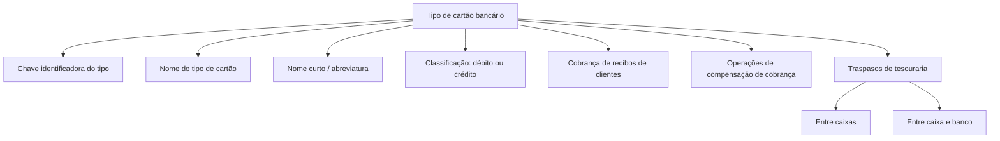

# Definição de Tipos de Cartões de Crédito para Cobro de Recibos MAPFRE

## 1. Metadados do Documento
- **Arquivo de Origem:** Não identificado no conteúdo fornecido
- **Tipo de Documento:** Especificação funcional resumida
- **Domínio / Sistema:** MAPFRE — operações de cobrança e tesouraria
- **Público-Alvo:** Não identificado no conteúdo fornecido
- **Data/Versão Identificada:** Não identificada

---

## 2. Resumo Executivo & Contexto de Negócio

O documento define o objetivo de identificar os distintos tipos de cartões bancários aceitos pela MAPFRE para cobrança de recibos de clientes. O conteúdo apresentado é conciso e concentra-se na caracterização dos tipos de cartão, sem detalhar implementação técnica, integrações, interfaces ou contratos de dados.

Os tipos de cartões bancários identificados devem ser utilizados em operações de compensação de cobrança. O documento também estabelece que esses tipos de cartões participam dos traspasos de tesouraria realizados entre caixas, bem como entre caixa e banco.

Cada tipo de cartão bancário possui uma chave identificadora, um nome associado e um nome curto ou abreviatura. A classificação do cartão deve indicar se o cartão é de débito ou crédito, utilizando os valores explícitos `(D)Débito` e `(C)Crédito`.

O conteúdo cita exemplos de nomes de cartões: VISA, MASTERCARD e AMERICAN EXPRESS. O documento não informa regras de validação de chaves, formatos de campos, origem dos dados, métodos de pagamento, fluxos de exceção ou detalhes adicionais sobre os processos de compensação e tesouraria.

---

## 3. Arquitetura, Componentes & Tecnologias Envolvidas

O documento não descreve uma arquitetura de software, microsserviços, tecnologias, servidores, APIs, URLs, ambientes ou ferramentas. O elemento funcional central é o conceito de **tipo de cartão bancário**, empregado no contexto de cobrança de recibos e operações de tesouraria da MAPFRE.

Os elementos funcionais identificados são:

| Componente / Conceito | Papel descrito no documento |
| :--- | :--- |
| MAPFRE | Organização que aceita a cobrança de recibos de clientes por tipos de cartões bancários. |
| Tipo de cartão bancário | Entidade que identifica e classifica um cartão utilizado nas operações descritas. |
| Cobro de recibos | Contexto no qual a MAPFRE aceita os cartões bancários dos clientes. |
| Operações de compensação de cobrança | Operações que utilizam os tipos de cartões bancários definidos. |
| Traspasos de tesouraria | Operações realizadas entre caixas ou entre caixa e banco que utilizam os tipos de cartões definidos. |
| Caixa / cajero | Origem ou destino de traspasos de tesouraria, conforme o documento. |
| Banco | Origem ou destino de traspasos de tesouraria, conforme o documento. |



> **Nota de Análise:** O texto inclui os fragmentos “Home Solutions APIs Documentation Zeus” e “EN”, mas não apresenta contexto suficiente para estabelecer relação desses termos com a definição de tipos de cartões, arquitetura, APIs ou ambientes.

---

## 4. Regras de Negócio, Especificações Funcionais & Processos

### 4.1 Objetivo funcional

A definição de tipos de cartões bancários tem como objetivo identificar os diferentes tipos de cartões bancários com os quais a MAPFRE aceita a cobrança de recibos de clientes.

### 4.2 Contextos de utilização

Os tipos de cartões bancários devem ser utilizados nos seguintes contextos operacionais:

1. **Operações de compensação de cobrança.**
2. **Traspasos de tesouraria entre caixas.**
3. **Traspasos de tesouraria entre caixa e banco.**

### 4.3 Propriedades do tipo de cartão bancário

O documento estabelece as seguintes propriedades gerais para um tipo de cartão bancário:

1. O tipo de cartão bancário contém uma **chave** que identifica o tipo de cartão.
2. O tipo de cartão bancário possui um **nome** associado à chave identificadora.
3. O tipo de cartão bancário possui um **nome curto** ou abreviatura do nome do cartão.
4. O tipo de cartão bancário deve determinar se o cartão é de **débito** ou **crédito**.
5. A classificação de débito ou crédito utiliza os valores:
   - `(D)Débito`
   - `(C)Crédito`

### 4.4 Exemplos explicitamente apresentados

O documento apresenta os seguintes exemplos de nomes de cartões:

- VISA
- MASTERCARD
- AMERICAN EXPRESS

> **Nota de Análise:** O documento não informa se VISA, MASTERCARD e AMERICAN EXPRESS são valores exaustivos, obrigatórios ou apenas exemplos ilustrativos.

---

## 5. Tabelas de Parâmetros, Ambientes e Estruturas de Dados

| Item / Parâmetro | Descrição / Função | Tipo / Valores / Formato | Ambiente / Observações |
| :--- | :--- | :--- | :--- |
| Tipo de cartão bancário | Identifica um tipo de cartão bancário aceito para cobrança de recibos de clientes. | Entidade funcional. | Utilizado pela MAPFRE. |
| Chave do tipo de cartão bancário | Chave que identifica o tipo de cartão bancário. | Formato não especificado. | Não há regras de unicidade ou validação descritas. |
| Nome do tipo de cartão | Nomenclatura associada à chave que identifica o tipo de cartão bancário. | Texto; exemplos: VISA, MASTERCARD, AMERICAN EXPRESS. | Não há tamanho, obrigatoriedade ou catálogo completo informado. |
| Nome curto | Abreviatura do nome do cartão. | Texto; formato não especificado. | O conteúdo também apresenta o fragmento “CF”, sem explicar sua relação com o nome curto. |
| Cartão débito ou crédito | Determina se o cartão é de débito ou crédito. | `(D)Débito` ou `(C)Crédito`. | Únicos valores explicitamente apresentados. |
| Cobro de recibos | Cobrança de recibos de clientes aceita pela MAPFRE por meio dos tipos de cartões bancários. | Processo operacional. | Sem detalhamento de fluxo, canal ou integração. |
| Compensação de cobrança | Operação que utiliza os tipos de cartões bancários definidos. | Processo operacional. | Sem detalhamento adicional. |
| Traspaso entre caixas | Transferência de tesouraria entre caixas. | Processo operacional. | Utiliza os tipos de cartões definidos. |
| Traspaso entre caixa e banco | Transferência de tesouraria entre caixa e banco. | Processo operacional. | Utiliza os tipos de cartões definidos. |

---

## 6. Bateria de Perguntas & Respostas para RAG (FAQ Sintético)

### P1: Qual é o objetivo da definição de tipos de cartões bancários no contexto MAPFRE?
**R:** O objetivo é identificar os diferentes tipos de cartões bancários com os quais a MAPFRE aceita a cobrança de recibos de clientes.

### P2: Em quais operações os tipos de cartões bancários devem ser utilizados?
**R:** Os tipos de cartões bancários devem ser utilizados nas operações de compensação de cobrança e nos traspasos de tesouraria entre caixas ou entre caixa e banco.

### P3: Qual propriedade identifica um tipo de cartão bancário?
**R:** A propriedade que identifica o tipo de cartão bancário é a chave do tipo de cartão bancário. O documento não especifica o formato nem regras de validação dessa chave.

### P4: O que representa o nome do tipo de cartão bancário?
**R:** O nome do tipo de cartão bancário é a nomenclatura associada à chave que identifica o tipo de cartão bancário. VISA, MASTERCARD e AMERICAN EXPRESS são os exemplos apresentados no documento.

### P5: Quais valores classificam um cartão como débito ou crédito?
**R:** A propriedade “Tarjeta débito o crédito” determina a classificação do cartão utilizando os valores `(D)Débito` e `(C)Crédito`.

### P6: O documento define como validar se uma chave de tipo de cartão é válida?
**R:** Não. O documento informa apenas que existe uma chave que identifica o tipo de cartão bancário, sem descrever formato, regras de validação, unicidade ou catálogo de valores permitidos.

### P7: Os tipos de cartões são usados somente para cobrança de recibos?
**R:** Não. Além da cobrança de recibos de clientes, os tipos de cartões são utilizados nas operações de compensação de cobrança e em traspasos de tesouraria entre caixas ou entre caixa e banco.

### P8: O que é o nome curto de um tipo de cartão?
**R:** O nome curto é definido como a abreviatura do nome do cartão. O documento não especifica seu formato, limite de caracteres ou exemplos completos de abreviaturas.

### P9: O documento informa APIs, métodos HTTP ou contratos JSON para gestão dos tipos de cartão?
**R:** Não. O conteúdo fornecido não detalha APIs, métodos HTTP, contratos JSON, URLs, tecnologias, bancos de dados ou integrações técnicas.

### P10: VISA, MASTERCARD e AMERICAN EXPRESS são os únicos tipos de cartões aceitos?
**R:** O documento os apresenta como exemplos, mas não declara que constituem uma lista completa ou exclusiva de tipos de cartões aceitos.

---

## 7. Glossário de Termos, Siglas & Conceitos-Chave

- **MAPFRE:** Organização mencionada como aceitadora da cobrança de recibos de clientes por tipos de cartões bancários.
- **Tipo de cartão bancário:** Classificação identificada por uma chave, nome, nome curto e indicador de débito ou crédito.
- **Cobro de recibos:** Cobrança de recibos de clientes.
- **Compensação de cobrança:** Operação de compensação que utiliza os tipos de cartões bancários definidos.
- **Traspaso de tesouraria:** Operação de tesouraria realizada entre caixas ou entre caixa e banco.
- **Débito `(D)`:** Classificação de cartão indicada explicitamente pelo valor `(D)Débito`.
- **Crédito `(C)`:** Classificação de cartão indicada explicitamente pelo valor `(C)Crédito`.
- **CF:** Fragmento apresentado no conteúdo original sem expansão ou explicação contextual.
- **VISA:** Exemplo de nome de tipo de cartão apresentado no documento.
- **MASTERCARD:** Exemplo de nome de tipo de cartão apresentado no documento.
- **AMERICAN EXPRESS:** Exemplo de nome de tipo de cartão apresentado no documento.

---

## 8. Notas Críticas, Riscos & Limitações

- O documento é resumido e não especifica detalhes de implementação técnica.
- Não há definição de sistema de origem, banco de dados, APIs, métodos HTTP, contratos JSON, autenticação, integrações ou ambientes.
- Não são fornecidos formatos, tamanhos, obrigatoriedade, validações ou restrições para a chave, nome e nome curto do tipo de cartão.
- Não há catálogo completo de tipos de cartões aceitos; VISA, MASTERCARD e AMERICAN EXPRESS são apresentados como exemplos.
- Não há detalhamento operacional das operações de compensação de cobrança nem dos traspasos de tesouraria.
- O fragmento “CF” não possui definição contextual no texto.
- Os fragmentos “Home Solutions APIs Documentation Zeus” e “EN” aparecem no conteúdo bruto, mas não possuem explicação que permita associá-los com segurança ao processo de definição de cartões.

---

## 9. Conteúdo Bruto Estruturado (Referência Fiel)

```text
--- [PÁGINA 1 DE 2] ---

EN CONSTRUCCIÓN
DEFINICIÓN de tipos de tarjetas de crédito
Objetivo
Identificar los distintos tipos de tarjetas bancarias con las que MAPFRE acepta el cobro de recibos de
los clientes.
Estas tarjetas se utilizarán en las operaciones de compensación de cobro y en los traspasos de
tesorería entre cajeros o entre caja y banco.
Propiedades generales
Propiedades generales
tarjeta bancaria
Contiene la clave que identifica el tipo de tarjeta bancaria.
Nombre del tipo de tarjeta
Nomenclatura asociada a la clave que identifica el tipo de tarjeta bancaria.
Ejemplo
VISA MASTERCARD AMERICAN EXPRESS
Nombre corto
 /
CF
Home Solutions APIs Documentation Zeus
EN


--- [PÁGINA 2 DE 2] ---

Abreviatura del nombre de la tarjeta.
Tarjeta débito o crédito
Determina si la tarjeta es de débito o crédito.
(D)Débito
(C)Crédito
```
