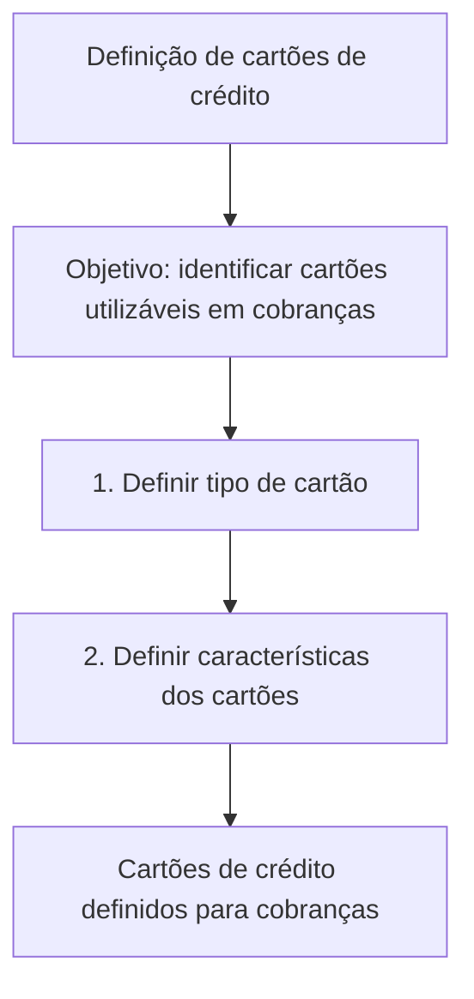

# Definição de Cartões de Crédito para Cobranças — Documentação Home Solutions APIs Zeus

## 1. Metadados do Documento
- **Arquivo de Origem:** Não informado
- **Tipo de Documento:** Procedimento
- **Domínio / Sistema:** Home Solutions APIs Documentation Zeus
- **Público-Alvo:** Não identificado
- **Data/Versão Identificada:** Não identificada

---

## 2. Resumo Executivo & Contexto de Negócio

O documento descreve a **definição de cartões de crédito** que podem ser utilizados em processos de cobrança. O objetivo declarado é identificar os tipos e as características dos cartões elegíveis para esse uso.

O processo apresentado possui duas etapas: definir o tipo de cartão e definir as características dos cartões. A sequência indica que a classificação do cartão precede o detalhamento de suas características.

O conteúdo cita o contexto de **Home Solutions APIs Documentation Zeus** e contém as referências textuais `CF` e `EN`. O documento não detalha integrações, métodos de API, contratos, regras de elegibilidade, campos de dados ou critérios específicos para cobrança.

> **Nota de Análise:** O documento apresenta somente o objetivo e as duas etapas de definição. Não há detalhamento adicional sobre atributos de cartões, regras de validação ou implementação técnica.

---

## 3. Arquitetura, Componentes & Tecnologias Envolvidas

Os elementos identificados são:

| Componente / Termo | Papel identificado no documento |
| :--- | :--- |
| Cartões de crédito | Entidades a serem identificadas e caracterizadas para utilização em cobranças. |
| Cobranças | Finalidade de utilização dos cartões de crédito definidos. |
| Home Solutions APIs Documentation Zeus | Referência documental/sistêmica citada no conteúdo. |
| CF | Sigla ou referência citada sem definição. |
| EN | Sigla ou referência citada sem definição. |



> **Nota de Análise:** O documento não apresenta uma arquitetura de software, microsserviços, endpoints, tecnologias, ambientes ou fluxo de integração entre sistemas.

---

## 4. Regras de Negócio, Especificações Funcionais & Processos

### Objetivo funcional

O objetivo explícito é realizar a **identificação e caracterização dos cartões de crédito que podem ser utilizados em cobranças**.

### Processo identificado

1. **Definir tipo de cartão**
   - O documento estabelece a definição do tipo de cartão como primeira etapa.
   - Não são apresentados tipos concretos de cartão nem critérios de classificação.

2. **Definir características dos cartões**
   - O documento estabelece a definição das características dos cartões como segunda etapa.
   - Não são informadas características específicas, atributos obrigatórios, valores permitidos ou regras de validação.

### Restrições de evidência

- O documento não informa quais cartões são aceitos em cobranças.
- O documento não especifica condições de rejeição ou aprovação.
- O documento não apresenta dados de entrada, saída, contratos JSON, métodos HTTP ou operações de API.
- O documento não detalha o significado de `CF`, `EN` ou `Zeus`.

---

## 5. Tabelas de Parâmetros, Ambientes e Estruturas de Dados

| Item / Parâmetro | Descrição / Função | Tipo / Valores / Formato | Ambiente / Observações |
| :--- | :--- | :--- | :--- |
| Tipo de cartão | Primeira definição requerida no processo de cartões de crédito. | Não especificado. | Necessário antes da definição das características. |
| Características de cartões | Segunda definição requerida para os cartões de crédito. | Não especificadas. | O documento não lista atributos ou valores. |
| Cobranças | Contexto de uso dos cartões de crédito identificados. | Não especificado. | O documento não descreve o processo de cobrança. |
| Home Solutions APIs Documentation Zeus | Referência documental/sistêmica citada. | Texto livre. | Sem detalhes técnicos adicionais. |
| CF | Referência textual citada. | Não especificado. | Sem definição no documento. |
| EN | Referência textual citada. | Não especificado. | Sem definição no documento. |

---

## 6. Bateria de Perguntas & Respostas para RAG (FAQ Sintético)

### P1: Qual é o objetivo do documento sobre cartões de crédito?
**R:** O objetivo é identificar e definir as características dos cartões de crédito que podem ser utilizados em cobranças.

### P2: Quais são as etapas do processo de definição de cartões de crédito?
**R:** O processo possui duas etapas: primeiro, definir o tipo de cartão; depois, definir as características dos cartões.

### P3: Qual etapa deve ser executada primeiro na definição de cartões de crédito?
**R:** A primeira etapa é definir o tipo de cartão.

### P4: O documento informa quais tipos de cartão de crédito são aceitos?
**R:** Não. O documento determina que o tipo de cartão deve ser definido, mas não apresenta uma lista de tipos aceitos.

### P5: Quais características dos cartões devem ser configuradas?
**R:** O documento informa que as características dos cartões devem ser definidas, mas não especifica quais características, campos, formatos ou valores são necessários.

### P6: Para qual finalidade os cartões de crédito definidos serão utilizados?
**R:** Os cartões de crédito identificados e caracterizados são destinados à utilização em cobranças.

### P7: O documento descreve APIs ou endpoints para a definição dos cartões?
**R:** Não. Embora cite “Home Solutions APIs Documentation Zeus”, o conteúdo não apresenta endpoints, métodos HTTP, contratos de API ou exemplos de requisições.

### P8: O que significa a sigla CF no documento?
**R:** O documento cita `CF`, mas não fornece uma definição ou contexto suficiente para determinar seu significado.

### P9: O que significa EN no documento?
**R:** O documento cita `EN`, mas não fornece uma definição ou contexto suficiente para determinar seu significado.

### P10: Há regras de validação para determinar se um cartão pode ser usado em cobranças?
**R:** Não foram identificadas regras de validação, critérios de aprovação, critérios de rejeição ou condições operacionais no conteúdo fornecido.

---

## 7. Glossário de Termos, Siglas & Conceitos-Chave

- **Cartões de crédito:** Cartões que, segundo o objetivo do documento, podem ser identificados e caracterizados para uso em cobranças.
- **Cobranças:** Finalidade de uso dos cartões de crédito mencionada no documento.
- **CF:** Sigla ou referência citada sem significado definido.
- **EN:** Sigla ou referência citada sem significado definido.
- **Home Solutions APIs Documentation Zeus:** Nome ou referência documental/sistêmica citada sem detalhamento técnico adicional.
- **Zeus:** Termo presente na referência “Home Solutions APIs Documentation Zeus”; sem definição explícita.

---

## 8. Notas Críticas, Riscos & Limitações

- O conteúdo é resumido e não especifica tipos de cartões de crédito.
- Não há detalhamento das características que devem ser definidas para cada cartão.
- Não são fornecidos critérios de elegibilidade para uso em cobranças.
- Não há definições para as referências `CF` e `EN`.
- Não há dados sobre APIs, integrações, ambientes, logs, segurança, contratos ou tratamento de erros.
- A referência a “Home Solutions APIs Documentation Zeus” não inclui detalhes suficientes para estabelecer responsabilidades técnicas ou fluxos de integração.

---

## 9. Conteúdo Bruto Estruturado (Referência Fiel)

```text
--- [PÁGINA 1 DE 1] ---

DEFINICIÓN de tarjetas de crédito
Objetivo
Identificación y características de las tarjetas de crédito que pueden ser utilizadas en cobros.
Pasos a seguir
DEFINIR
Tipo de tarjeta
(1)
DEFINIR
Características de
tarjetas
(2)
1. DEFINIR Tipo de tarjeta
2. DEFINIR Características de tarjetas
 /
 CF
Home Solutions APIs Documentation Zeus
EN
```
