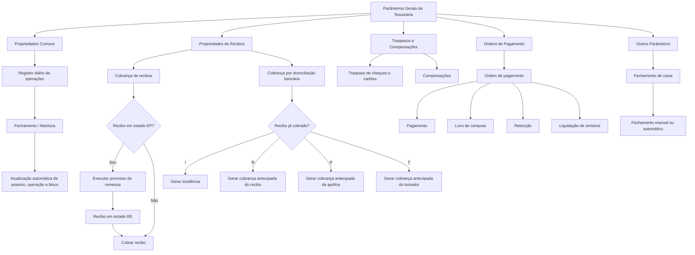

# Definição de Parâmetros Gerais do Módulo de Tesouraria

## 1. Metadados do Documento
- **Arquivo de Origem:** Não informado; conteúdo bruto com 13 páginas.
- **Tipo de Documento:** Especificação Funcional / Manual Operacional.
- **Domínio / Sistema:** Tesouraria, registro diário de operações, recibos, traspasos e compensações, ordens de pagamento, Reef.core.
- **Público-Alvo:** Analistas funcionais, desenvolvedores, arquitetos, operação de tesouraria e negócio.
- **Data/Versão Identificada:** Não identificada.

---

## 2. Resumo Executivo & Contexto de Negócio

O documento define parâmetros gerais que determinam o comportamento do módulo de tesouraria. Os parâmetros abrangem a manutenção do registro diário de operações, a numeração de assentos e transações, o estado do parte diário, a contabilização e regras operacionais de recibos, pagamentos, transferências, compensações, cheques e cartões.

A seção de propriedades comuns controla elementos estruturais do processo diário de tesouraria, incluindo exercício contábil aberto, data do assento, último bloco de tesouraria, estado do registro diário e identificação da oficina central. Parte desses valores é definida inicialmente e atualizada automaticamente pelo fechamento ou abertura do registro diário de operações.

As propriedades de recibos regulam condições de cobrança, estorno de cobranças, planos de pagamento, remessas, avisos, antecipações de comissão, gestão de incidências e integração com livro de vendas. O documento também define alternativas codificadas para tratamento de recibos cobrados durante processos de domiciliação bancária.

As propriedades de traspasos e compensações definem agrupamento de cheques e cartões, regras para voucher, repetição de cheques, diferenças cambiais e geração de números de traspaso. As propriedades de ordens de pagamento regulam autorizações, registro e livro de faturas, retenções, anulações, geração de transferência, cheques e IVA.

Por fim, os demais parâmetros governam o fechamento de caixa, incluindo limites de diferença, fechamento automático, dias máximos de parte aberto, cheques pendentes, transações automáticas, cobrança parcial e contabilização de ajustes de comissão. O documento não detalha telas, contratos HTTP, banco de dados, APIs, tecnologias de infraestrutura ou responsabilidades técnicas de implementação.

---

## 3. Arquitetura, Componentes & Tecnologias Envolvidas

| Componente / Conceito | Papel descrito |
| :--- | :--- |
| Módulo de tesouraria | Contexto principal da parametrização operacional e contábil. |
| Registro diário de operações | Registro que controla assentos, operações, fechamento, abertura e estado do parte diário. |
| Fechamento do registro diário | Atualiza automaticamente determinados parâmetros, como assento, operação do assento e último bloco de tesouraria. |
| Processo de cobrança de recibos | Executa cobranças, admite regras de comissão, planos de pagamento, remessa, referência e incidências. |
| Processo de remessa de recibo | É executado antes da cobrança de recibos em estado Emitido pendente (EP), deixando o recibo em estado Remesado (RE). |
| Processo de cobrança de domiciliação bancária | Pode encontrar recibos já cobrados e aplicar tratamento por incidência, recibo, apólice ou tomador. |
| Processo batch | Utilizado para agrupamentos maiores que 24 recibos e, conforme parametrização, para cobrança parcial e mudança de plano de pagamento. |
| Traspasos de tesouraria | Abrange operações de transferência de cheques e cartões entre caixa e banco. |
| Compensações | Abrange operações de compensação de cobrança ou pagamento, incluindo diferença de câmbio, saldo, cheques e voucher de cartão. |
| Ordens de pagamento | Abrange autorizações, livro de compras, registro de faturas, retenções, transferências, cheques e IVA. |
| Módulo de sinistros | Pode gerar ordens de pagamento por meio da liquidação de expediente; também pode registrar faturas. |
| Livro de vendas | Pode ser gerado a partir da apólice, do recibo ou não ser utilizado. |
| Livro de compras | Pode ser gerado na ordem de pagamento, no registro de faturas ou não ser utilizado. |
| Reef.core | Citado como aplicação que não explora a propriedade “Hora de fechamento automático”. |



> **Nota de Análise:** O documento descreve relações funcionais entre processos, mas não identifica microsserviços, APIs, protocolos, tecnologias de persistência, URLs, portas, ambientes técnicos ou contratos de integração.

---

## 4. Regras de Negócio, Especificações Funcionais & Processos

### 4.1 Propriedades comuns

1. **Assento:** identifica o último número de assento de tesouraria. O valor é definido uma vez e atualizado diariamente no fechamento do registro diário de operações.
2. **Operação do assento:** contém o último número de operação do assento de tesouraria. É sequencial e corresponde ao número de movimentos no parte contábil. É definido uma vez e atualizado automaticamente no fechamento do registro diário.
3. **Data de assento:** contém a data de contabilização dos movimentos do registro diário de operações. A data deve pertencer ao mesmo mês e ano da data de processo de tesouraria. O valor inicial é definido e, posteriormente, o fechamento e a abertura atualizam a propriedade.
4. **Exercício:** identifica o exercício contábil aberto no qual o registro diário é contabilizado.
5. **Último bloco de tesouraria:** identifica o último número de transação do dia e serve para calcular a sequência do dia seguinte. É atualizado automaticamente no fechamento do registro diário.
6. **Estado do registro diário:** admite os estados `N` para fechado, `S` para aberto e `X` para fechando no momento.
7. **Oficina central:** contém o terceiro nível da estrutura comercial considerado como oficina central.

### 4.2 Regras de recibos

1. A propriedade **Anula cobrança de recibos positivos e negativos** determina se um recibo cobrado pelo processo de recibos positivos e negativos pode ter sua cobrança anulada.
2. **Solicita causa de devolução de prêmios** determina se a causa de devolução deve ser solicitada na cobrança de recibos negativos.
3. **Desconto de comissão** indica se o agente pode descontar sua comissão na cobrança do recibo.
4. **Desconto de comissão líquido** determina se o desconto da comissão do agente é líquido de impostos ou calculado sobre o total.
5. **Número de dias da data de valor** determina o máximo de dias em que o caixa pode alterar a data de valor dos recebimentos. A alteração normalmente permite aplicar uma taxa de câmbio anterior à data de assento.
6. **Cobrança de recibos de cosseguro** define se recibos de cosseguro aceito podem ser cobrados pelos processos on-line do parte.
7. **Dias de aviso** define o número de dias permitido entre a data de efeito do recibo e a data de vencimento do aviso.
8. **Número total de avisos** limita a quantidade de recibos em um agrupamento on-line; o valor padrão indicado é 24. Agrupamentos maiores exigem processo batch.
9. **Antecipações pendentes** determina se um agente com antecipações pendentes de cancelamento pode receber novas antecipações de comissão.
10. **Imprime comprovante** define se é impresso comprovante de tesouraria ou recibo de caixa nas operações do ambiente de cobranças, identificado como ambiente 1.
11. **Cobrança de recibos EP** permite cobrar recibos no estado Emitido pendente (EP). Antes da cobrança, o sistema executa o processo de remessa e deixa o recibo no estado Remesado (RE).
12. **Controle de incidências de recibo** define a ação quando o processo de cobrança por domiciliação encontra um recibo já cobrado:
    - `I`: gera incidência.
    - `R`: gera cobrança antecipada para o recibo.
    - `P`: gera cobrança antecipada para a apólice.
    - `T`: gera cobrança antecipada para o tomador.
13. **Plano de pagamento** identifica o plano utilizado quando a cobrança tem valor inferior ao valor do recibo. A alteração é feita pelo suplemento `(CV) Cambio forma pago`, identificado pelas propriedades Suplemento e Suplemento extensão.
14. **Anulação de cobrança de recibo com sinistro** determina se a cobrança pode ser anulada quando existe sinistro processado no período entre o efeito e o vencimento do recibo. Quando selecionada, a anulação apresenta mensagem de aviso ao localizar recibos com sinistros.
15. **Anulação de liquidação de cobrança de sinistros:**
    - `Sim`: anula a liquidação e impede nova cobrança; uma nova liquidação deve ser gerada para nova cobrança.
    - `Não`: anula a cobrança e mantém a liquidação pendente de cobrança, permitindo nova cobrança sem nova liquidação.
16. **Cambia data de remessa** determina se é possível alterar a data de remessa. Quando não permitido, a data decorre das propriedades Remessa data do dia e Remessa data de assento.
17. **Remessa data do dia:**
    - `Sim`: utiliza por padrão a data do dia.
    - `Não`: utiliza a data determinada pela propriedade Remessa data de assento.
18. **Remessa data de assento:**
    - `Sim`: utiliza por padrão a data do assento de tesouraria.
    - `Não`: utiliza por padrão a data de processo de tesouraria.
19. **Tipo de livro de vendas:**
    - `P`: a fatura é gerada na emissão ou modificação da apólice.
    - `R`: a fatura é gerada na cobrança do recibo.
    - `N`: não existe trabalho com livro de vendas.
20. **Cambia gestor de cobrança RE** define se o gestor de cobrança pode ser alterado para recibo em estado Remesado (RE).
21. **Referência de recibo** determina se uma referência pode ser informada durante a cobrança de recibos.

### 4.3 Regras de traspasos e compensações

1. **Agrupamento de cheques:**
   - `Sim`: cheques são agrupados em um único lançamento no banco pelo total.
   - `Não`: é gerado um lançamento bancário para cada cheque transferido.
2. **Agrupamento de cartões:**
   - `Sim`: cartões são agrupados em um único lançamento bancário pelo total.
   - `Não`: é gerado um lançamento bancário para cada cartão transferido.
   - Independentemente do valor configurado, comissão e retenção de cada cartão são contabilizadas individualmente.
3. **Valor de diferença de câmbio** contém o valor máximo aceito para compensação de diferença de caixa decorrente de taxas de câmbio, em compensações de cobrança ou pagamento.
4. **Valor em compensações** determina se o saldo da transação é exibido nas operações de compensação.
5. **Voucher em compensações:**
   - `Sim`: o número de voucher do cartão deve ser informado manualmente.
   - `Não`: o número de voucher é gerado automaticamente.
6. **Permite repetir cheque** define se o número de cheque pode se repetir para uma mesma entidade nas operações de compensação.
7. **Cheques em traspaso:**
   - `Sim`: todos os cheques são exibidos selecionados automaticamente.
   - `Não`: os cheques são exibidos sem seleção automática.
8. **Cheque com conta corrente** define se deve ser solicitada a conta corrente bancária associada ao cheque de cobrança.
9. **Número de traspaso obrigatório** define se operações de traspaso de tesouraria para cheques e cartões recebem um número de traspaso automático.

### 4.4 Regras de ordens de pagamento

1. **Autorização** determina se autorizadores são solicitados no pagamento de ordens de pagamento.
2. **Registro de faturas** determina se o sistema trabalha com registro de faturas. Faturas registradas no módulo de sinistros podem ter seus dados validados contra a fatura. Quando há livro de compras, esta propriedade deve possuir valor `S`. O registro pode inserir o documento no livro de compras se estiver parametrizado para isso.
3. **Libera ordem de pagamento** determina se, ao anular uma ordem de pagamento de sinistros paga por transferência, a ordem fica disponível para pagamento futuro em próximo pagamento massivo ou se a liquidação de sinistros é anulada e exige nova geração.
4. **Livro de compras:**
   - `G`: gerado na ordem de pagamento, inclusive por registro diário ou módulo de sinistros por liquidação de expediente.
   - `M`: inserido no registro de faturas; modificações posteriores da ordem, como anulação ou alteração de liquidação de sinistros, não atualizam o livro de compras.
   - `N`: não existe livro de compras.
5. **Retenção na geração:**
   - `C`: exibida em consultas e contabilizada no pagamento.
   - `N`: contabilizada no pagamento e não exibida em consultas.
   - `A`: contabilizada na geração da ordem de pagamento.
6. **Agrupamento de cálculo de retenção no pagamento:**
   - `D`: cálculo documento a documento.
   - `B`: cálculo pelo total a pagar ao beneficiário.
7. **Meses de livro** estabelece quantos meses podem transcorrer entre a emissão e a recepção da fatura. Se o intervalo exceder o número configurado, a fatura fica caduca.
8. **Conta de anulação de retenção** contém o tipo de conta simplificada para contabilizar retenção ao anular uma ordem com reexpedição. Sem valor, a retenção é anulada e recalculada no novo pagamento. Com valor, o montante da retenção é contabilizado nessa conta tanto na anulação quanto no pagamento reexpedido, usando o valor da primeira cobrança e sem recálculo ou contabilização na conta real de retenção.
9. **Imprime cheque pagamento transferência** determina se, no pagamento, o número de transferência é gerado como definitivo.
10. **Número de página do cheque** determina se a impressão de cheques solicita o número da página de impressão.
11. **Base para cálculo de IVA** define se o IVA é calculado sobre o total (`T`) ou sobre a base imponível (`B`).
12. **Data do cheque:**
    - `Sim`: data padrão é a data do assento de tesouraria.
    - `Não`: data padrão é a data estimada de pagamento da ordem.

### 4.5 Outros parâmetros

1. **Conta simplificada de fechamento** identifica a conta simplificada usada para lançar a diferença quando o caixa é fechado com caixas desequilibrados.
2. **Valor máximo de fechamento** determina a diferença máxima de um caixa que ainda permite o fechamento.
3. **Fecha caixa com cheques pendentes** define se é permitido fechar caixa com cheques pendentes de impressão.
4. **Listagem no fechamento** define se o fechamento de caixa gera listagem do registro diário de operações.
5. **Transação automática** define se a alteração do número de transação, quando o caixa está equilibrado, é automática ou informada manualmente pelo usuário.
6. **Número de dias de parte aberto** define por quantos dias o parte pode permanecer aberto para continuar recebendo imputações no registro diário.
7. **Fechamento automático** define se o fechamento de caixa é automático. Quando selecionado, o fechamento manual não é permitido.
8. **Hora de fechamento automático** registra a hora de execução do fechamento automático. Reef.core não explora essa propriedade; ela costuma ser utilizada por processos automatizados externos à aplicação.
9. **Data contábil estendida** indica se a data de cobrança dos recibos utiliza formato estendido.
10. **Aprova comprovante** define se é solicitada a impressão do recibo de caixa quando a transação está equilibrada.
11. **Desconto de imposto** define se o agente pode ficar com o valor dos impostos do recibo durante a cobrança.
12. **Desconto de acréscimo** define se o agente pode ficar com o valor dos acréscimos do recibo durante a cobrança.
13. **Cambia plano de pagamento em processo batch** define se cobranças parciais são geradas na cobrança batch de recibos quando o valor pago é menor que o valor do recibo.
14. **Anula recibo de cobrança parcial** define se um recibo cobrado parcialmente pode ter sua cobrança anulada.
15. **Contabiliza ajustes de comissões:**
    - `Sim`: ajustes são contabilizados na operação de ajustes.
    - `Não`: ajustes são contabilizados no assento de comissões (`COM`).

---

## 5. Tabelas de Parâmetros, Ambientes e Estruturas de Dados

| Item / Parâmetro | Descrição / Função | Tipo / Valores / Formato | Ambiente / Observações |
| :--- | :--- | :--- | :--- |
| Assento | Último número de assento de tesouraria | Número | Atualizado diariamente no fechamento do registro diário |
| Operação do assento | Último número de operação do assento de tesouraria | Número sequencial | Corresponde aos movimentos no parte contábil |
| Data de assento | Data de contabilização dos movimentos | Data | Deve estar no mesmo mês e ano da data de processo |
| Exercício | Identifica exercício contábil aberto | Chave | Exercício em contabilização |
| Último bloco de tesouraria | Último número de transação do dia | Número | Base para sequência do dia seguinte |
| Estado do registro diário | Estado do parte diário | `N`, `S`, `X` | `N`: fechado; `S`: aberto; `X`: fechando |
| Oficina central | Terceiro nível da estrutura comercial | Identificador | Considerado oficina central |
| Anula cobrança de recibos positivos e negativos | Permite anulação de cobrança | Seleção não detalhada | Aplica-se a recibos cobrados por processo de positivos e negativos |
| Solicita causa devolução de prêmios | Solicita motivo da devolução | Seleção não detalhada | Cobrança de recibos negativos |
| Desconto de comissão | Permite agente descontar comissão | Seleção não detalhada | Cobrança do recibo |
| Desconto de comissão líquido | Define base líquida ou total do desconto | Seleção não detalhada | Considera impostos |
| Número de dias data de valor | Máximo de dias para alterar data de valor | Número de dias | Permite usar câmbio anterior à data de assento |
| Cobra recibos de cosseguro | Permite cobrança de cosseguro aceito | Seleção não detalhada | Processos on-line do parte |
| Dias de aviso | Intervalo entre efeito e vencimento | Número de dias | Recibos |
| Número total de avisos | Máximo de recibos em agrupamento on-line | Número; padrão 24 | Maior quantidade exige processo batch |
| Antecipações pendentes | Permite novas antecipações ao agente | Seleção não detalhada | Considera antecipações pendentes de cancelamento |
| Imprime comprovante | Imprime comprovante de tesouraria | Seleção não detalhada | Operações do ambiente de cobranças, ambiente 1 |
| Cobrança de recibos EP | Permite cobrança de recibos EP | Seleção não detalhada | Executa remessa e muda recibo para RE antes de cobrar |
| Controle de incidências de recibo | Ação para recibo já cobrado | `I`, `R`, `P`, `T` | Domiciliação bancária |
| Plano de pagamento | Plano para cobrança inferior ao valor do recibo | Chave | Altera plano via suplemento CV |
| Suplemento | Identifica suplemento de alteração de plano | Chave | Suplemento definido para alteração de plano |
| Suplemento extensão | Identifica extensão do suplemento | Chave de extensão | Usado com Suplemento |
| Anulado de cobrança com sinistro | Permite anular cobrança com sinistro processado | Seleção não detalhada | Período entre efeito e vencimento |
| Anulado de liquidação de cobrança de sinistros | Define tratamento de liquidação negativa | `Sim`, `Não` | `Sim`: exige nova liquidação para cobrar novamente |
| Cambia data de remessa | Permite alterar data da remessa | Seleção não detalhada | Caso contrário aplica propriedades de remessa |
| Remessa data do dia | Determina data padrão da remessa | `Sim`, `Não` | `Sim`: data do dia; `Não`: data definida por remessa data de assento |
| Remessa data de assento | Determina origem alternativa da data | `Sim`, `Não` | `Sim`: data do assento; `Não`: data de processo |
| Tipo de livro de vendas | Define momento/origem da fatura de venda | `P`, `R`, `N` | Apólice, recibo ou sem livro |
| Cambia gestor de cobrança RE | Permite alterar gestor em recibo RE | Seleção não detalhada | Estado Remesado |
| Referência de recibo | Permite informar referência na cobrança | Seleção não detalhada | Cobrança de recibos |
| Agrupamento de cheques | Agrupa traspasos de cheques ao banco | `Sim`, `Não` | Facilita conciliação conforme informação do banco |
| Agrupamento de cartões | Agrupa traspasos de cartões ao banco | `Sim`, `Não` | Comissão e retenção contabilizadas individualmente |
| Valor diferença de câmbio | Limite de compensação de diferença cambial | Valor monetário | Compensações de cobrança ou pagamento |
| Valor em compensações | Exibe saldo da transação | Seleção não detalhada | Operações de compensação |
| Voucher em compensações | Define captura do voucher de cartão | `Sim`, `Não` | Manual ou automático |
| Permite repetir cheque | Permite repetição para mesma entidade | Seleção não detalhada | Compensações |
| Cheques em traspaso | Seleção automática de cheques | `Sim`, `Não` | Traspaso caixa para banco |
| Cheque com conta corrente | Solicita conta corrente do banco | Seleção não detalhada | Cheque de cobrança |
| Número de traspaso obrigatório | Gera número automático de traspaso | Seleção não detalhada | Operações com cheques e cartões |
| Autorização | Solicita autorizadores no pagamento | Seleção não detalhada | Ordens de pagamento |
| Registro de faturas | Habilita registro de faturas | `S` exigido com livro de compras | Pode validar faturas de sinistros |
| Libera ordem de pagamento | Libera ordem anulada para novo pagamento | Seleção não detalhada | Ordens de sinistros pagas por transferência |
| Livro de compras | Define utilização e momento de inserção | `G`, `M`, `N` | Ordem de pagamento, registro de faturas ou inexistente |
| Retenção na geração | Define contabilização e consulta de retenção | `C`, `N`, `A` | Consulta, pagamento ou geração |
| Agrupamento cálculo retenção pagamento | Nível de cálculo da retenção | `D`, `B` | Documento ou beneficiário |
| Meses livro | Limite entre emissão e recebimento de fatura | Número de meses | Excedente torna fatura caduca |
| Conta de anulação de retenção | Conta simplificada de retenção em reexpedição | Tipo de conta simplificada | Sem valor, retenção é recalculada |
| Imprime cheque pagamento transferência | Gera número definitivo de transferência | Seleção não detalhada | No momento do pagamento |
| Número de página do cheque | Solicita número da página na impressão | Seleção não detalhada | Impressão de cheques |
| Base para cálculo de IVA | Define base de cálculo de IVA | `T`, `B` | Total ou base imponível |
| Data do cheque | Define data padrão do cheque | `Sim`, `Não` | Data de assento ou data estimada de pagamento |
| Conta simplificada fechamento | Conta para ajuste de desequilíbrio no fechamento | Conta simplificada | Fechamento de caixa |
| Valor máximo fechamento | Limite de desequilíbrio para permitir fechamento | Valor monetário | Caixa |
| Fecha caixa com cheques pendentes | Permite fechamento com cheques não impressos | Seleção não detalhada | Fechamento de caixa |
| Listagem no fechamento | Gera listagem do registro diário | Seleção não detalhada | Fechamento de caixa |
| Transação automática | Define geração de mudança de transação | Seleção não detalhada | Caixa equilibrado |
| Número de dias parte aberto | Limite de dias de parte aberto | Número de dias | Permite novas imputações |
| Fechamento automático | Executa fechamento automaticamente | Seleção não detalhada | Impede fechamento manual quando selecionado |
| Hora de fechamento automático | Hora para execução automatizada | Hora | Não explorada por Reef.core |
| Data contábil estendida | Define formato estendido de data de cobrança | Seleção não detalhada | Recibos |
| Aprova comprovante | Solicita impressão de recibo de caixa | Seleção não detalhada | Transação equilibrada |
| Desconto de imposto | Permite agente reter imposto do recibo | Seleção não detalhada | Cobrança de recibos |
| Desconto de acréscimo | Permite agente reter acréscimo do recibo | Seleção não detalhada | Cobrança de recibos |
| Cambia plano pagamento em batch | Gera cobrança parcial em processo batch | Seleção não detalhada | Valor pago inferior ao valor do recibo |
| Anula recibo cobrança parcial | Permite anular cobrança parcial | Seleção não detalhada | Recibos parcialmente cobrados |
| Contabiliza ajustes de comissões | Define momento contábil de ajustes | `Sim`, `Não` | Operação de ajustes ou assento `COM` |

---

## 6. Bateria de Perguntas & Respostas para RAG (FAQ Sintético)

### P1: Como o número de assento de tesouraria é atualizado?
**R:** O parâmetro **Assento** identifica o último número de assento de tesouraria. O valor é definido inicialmente uma única vez e é atualizado todos os dias pelo fechamento do registro diário de operações.

### P2: Quais estados são permitidos para o registro diário de operações?
**R:** O parâmetro **Estado do registro diário** admite três valores: `N` para registro fechado, `S` para registro aberto e `X` para registro que está sendo fechado naquele momento.

### P3: O que acontece quando um recibo em estado EP é cobrado?
**R:** Quando a propriedade **Cobrança de recibos EP** permite essa operação, o sistema executa primeiro o processo de remessa do recibo. O recibo passa do estado Emitido pendente (`EP`) para o estado Remesado (`RE`) e então pode ser cobrado.

### P4: Como o sistema trata um recibo já cobrado encontrado na cobrança por domiciliação bancária?
**R:** O comportamento é definido pela propriedade **Controle de incidências de recibo**. O valor `I` gera uma incidência; `R` gera uma cobrança antecipada para o recibo; `P` gera uma cobrança antecipada para a apólice; e `T` gera uma cobrança antecipada para o tomador.

### P5: Qual é o limite padrão de recibos em agrupamentos on-line?
**R:** A propriedade **Número total de avisos** indica que o valor padrão é 24 recibos por agrupamento em processo on-line. Para agrupar quantidade maior, o documento determina o uso de processo batch.

### P6: Como é alterado o plano de pagamento quando o valor cobrado é inferior ao valor do recibo?
**R:** O parâmetro **Plano de pagamento** identifica o plano usado para esse cenário. A alteração é realizada por meio do suplemento `(CV) Cambio forma pago`, identificado pelas propriedades **Suplemento** e **Suplemento extensão**.

### P7: O que ocorre ao anular uma liquidação negativa de sinistro?
**R:** Com a propriedade **Anulado de liquidação de cobrança de sinistros** configurada como `Sim`, a liquidação é anulada e não pode ser cobrada novamente sem gerar uma nova liquidação. Com valor `Não`, a cobrança é anulada, mas a liquidação permanece pendente de cobrança e pode ser cobrada novamente.

### P8: Como funciona o agrupamento de cartões no traspaso ao banco?
**R:** Quando **Agrupamento de cartões** está como `Sim`, os cartões são agrupados em um único lançamento bancário pelo total. Com `Não`, é feito um lançamento bancário por cartão. Em ambos os casos, a comissão e a retenção de cada cartão são contabilizadas individualmente.

### P9: Quando o livro de compras é inserido no modo G?
**R:** No valor `G` da propriedade **Livro de compras**, o livro é inserido na geração da ordem de pagamento. Essas ordens podem ser criadas diretamente no registro diário de operações ou no módulo de sinistros por meio da liquidação de um expediente.

### P10: Qual é a diferença entre os modos de retenção C, N e A?
**R:** Em `C`, a retenção é exibida em consultas e contabilizada no pagamento da ordem. Em `N`, ela é contabilizada no pagamento, mas não aparece em consultas. Em `A`, a retenção é contabilizada quando a ordem de pagamento é gerada.

### P11: O que ocorre se a conta de anulação de retenção não estiver informada?
**R:** Ao anular com reexpedição e pagar novamente a ordem, a retenção anterior é anulada e a retenção é calculada novamente. Quando a conta possui valor, o valor original da retenção é contabilizado nessa conta e não é recalculado.

### P12: É possível fechar o caixa manualmente se o fechamento automático estiver habilitado?
**R:** Não. Enquanto a propriedade **Fechamento automático** estiver selecionada, o fechamento manual não é permitido.

### P13: A hora de fechamento automático é utilizada pelo Reef.core?
**R:** Não. O documento afirma expressamente que a propriedade **Hora de fechamento automático** não é explorada pelo Reef.core e costuma ser usada por processos automatizados externos à aplicação.

### P14: Onde são contabilizados os ajustes de comissões?
**R:** Quando **Contabiliza ajustes de comissões** está como `Sim`, os ajustes são contabilizados na operação de ajustes. Quando está como `Não`, são contabilizados no assento de comissões identificado como `COM`.

---

## 7. Glossário de Termos, Siglas & Conceitos-Chave

- **Assento:** número de assento de tesouraria associado à contabilização dos movimentos do registro diário.
- **Base imponível:** base utilizada como uma das opções para cálculo do IVA.
- **Batch:** processo usado, entre outros casos, para agrupamentos superiores a 24 recibos e para regras de cobrança parcial.
- **COM:** assento de comissões.
- **CV:** suplemento “Cambio forma pago”, usado para alterar plano de pagamento.
- **EP:** estado “Emitido pendiente” de um recibo.
- **IVA:** imposto cujo cálculo pode usar total ou base imponível.
- **Livro de compras:** registro contábil associado a faturas e ordens de pagamento.
- **Livro de vendas:** registro associado à geração de fatura por apólice ou recibo.
- **Parte:** registro diário de operações de tesouraria.
- **RE:** estado “Remesado” de um recibo.
- **Reef.core:** aplicação citada como não explorando a propriedade Hora de fechamento automático.
- **Registro diário de operações:** registro de movimentos usado para controle de assentos, operações, fechamento e abertura.
- **Remessa:** processo que pode mover recibos de EP para RE antes da cobrança.
- **Retenção:** valor contabilizado em momentos configuráveis durante a geração ou pagamento de ordens.
- **Traspaso:** operação de transferência em tesouraria, incluindo cheques e cartões.
- **Voucher:** número de referência de operação de cartão utilizado em compensações.

---

## 8. Notas Críticas, Riscos & Limitações

- O documento não informa nome do arquivo, data, versão, autor, área responsável ou ambiente de execução.
- O documento não descreve APIs, endpoints, métodos HTTP, eventos, banco de dados, tabelas físicas, contratos JSON, autenticação, URLs, servidores, portas ou pipelines de CI/CD.
- O valor padrão explicitamente informado é **24** para a propriedade Número total de avisos; não há valores concretos para os demais parâmetros numéricos ou monetários.
- A data do assento deve permanecer no mês e ano da data de processo de tesouraria, configurando uma restrição funcional explícita.
- Configurar fechamento automático impede o fechamento manual de caixa.
- O parâmetro Hora de fechamento automático não é explorado pelo Reef.core e depende de processos externos automatizados para eventual utilização.
- Utilizar o modo `M` de Livro de compras implica que alterações posteriores em ordens de pagamento, incluindo anulação ou modificação de liquidação de sinistros, não atualizam o livro de compras.
- Quando a anulação de liquidação de sinistros estiver configurada como `Sim`, uma nova liquidação é necessária para nova cobrança.
- Quando a conta de anulação de retenção não tiver valor, retenções podem ser anuladas e recalculadas em processos de reexpedição.
- **Nota de Análise:** O documento menciona “entorno 1” para operações de cobrança, mas não detalha os demais ambientes, sua configuração ou diferenciação.

---

## 9. Conteúdo Bruto Estruturado (Referência Fiel)

```text
--- [PÁGINA 1 DE 13] ---

EN CONSTRUCCIÓN
DEFINICIÓN de parámetros generales
Objetivo
Definir los parámetros que determinarán el funcionamiento del módulo.
Propiedades comunes
Propiedades de recibos
Propiedades de traspasos y compensaciones
Propiedades de órdenes de pago
Otros parámetros
Propiedades comunes
Asiento
Identifica el último número de asiento de tesorería.
Su valor se define una vez y posteriormente, se actualiza cada día en el cierre del registro diario de
operaciones.
Operación del asiento
Esta propiedad contiene el último número de operación del asiento de tesorería. Es un número
secuencial que corresponde al número de movimientos en el parte contable.
 / 
 CF
Inicio Soluciones APIs Documentación Zeus
ES


--- [PÁGINA 2 DE 13] ---

Su valor se define una vez y posteriormente, el cierre del registro diario de operaciones lo actualiza
automáticamente.
Fecha de asiento
Esta propiedad contiene la fecha en la que se contabilizan los movimientos del registro diario de
operaciones. Debe estar comprendida en el mes y año de la fecha de proceso de tesorería.
Se determina el primer valor para esta propiedad y posteriormente, el cierre y la apertura del registro
diario de operaciones, la actualiza automáticamente.
Ejercicio
Es la clave que identifica el ejercicio contable que está abierto, en el que se está contabilizando el
registro diario de operaciones.
Último bloque de tesorería
Identifica el último número de transacción del dia. Utilizado para calcular la secuencia del día
siguiente.
Su valor se define una vez y posteriormente, el cierre del registro diario de operaciones lo actualiza
automáticamente.
Estado del registro diario
Indica el estado del parte del registro diario.
(N)Cerrado
(S)Abierto
(X)Cerrándose en este momento
Oficina central
Esta propiedad contiene el tercer nivel de la estructura comercial, que se considera la oficina central.
Propiedades de recibos
Anula cobro de recibos positivos y negativos
Esta propiedad determina si se puede anular de cobro un recibo cobrado por el proceso de recibos
positivos y negativos.
Solicita causa devolución de primas
Indica si se debe solicitar la causa de devolución de primas en el cobro de los recibos negativos.


--- [PÁGINA 3 DE 13] ---

Descuento comisión
Indica si el agente se puede descontar su comisión en el cobro del recibo.
Descuento comisión neto
En el descuento de comisión del agente en el momento del cobro, esta propiedad indica si el importe
de descuento de comisión de los recibos es neto de impuestos o es por el total.
Número de días fecha de valor
En caso de que el cajero pueda cambiar la fecha de valor, esta propiedad indicará número máximo
de días para los que se puede cambiar la fecha de los cobros.
El cambio de la fecha de valor se utiliza normalmente para poder aplicar un tipo de cambio anterior al
de la fecha de asiento.
Cobra recibos de coaseguro
Determina si es posible cobrar recibos de coaseguro aceptado a través de los procesos on-line del
parte.
Días aviso
Esta propiedad contiene el número de días que puede haber entre la fecha de efecto del recibo y la
fecha de vencimiento del aviso.
Número total de avisos
Indica el numero total de recibos que se pueden incluir en una agrupación, en el proceso on-line,
tomando 24 como valor por defecto. En caso de necesitar agrupar un número mayor de recibos, se
debe hacer mediante un proceso batch.
Anticipos pendientes
El valor de esta propiedad indica si se pueden hacer mas anticipos de comisiones a un agente
teniendo anticipos pendientes de cancelar.
Imprime comprobante
Determina si se imprime el comprobante de tesorería, o recibo de caja, en las operaciones realizadas
dentro del entorno de cobros (entorno 1) del parte.
Cobro de recibos EP
Determina si en el proceso de cobro de recibos, se permiten cobrar recibos que estén en estado
Emitido pendiente (EP). En este caso, se ejecutara el proceso de remesa de recibo antes del cobro,


--- [PÁGINA 4 DE 13] ---

dejando dicho recibo en estado Remesado (RE), para que pueda ser cobrado.
Control incidencias recibo
Determina la acción a tomar cuando, al ejecutar el proceso de cobros de domiciliación bancaria, se
encuentra un recibo cobrado.
(I)Incidencia
(R)Recibo
(P)Póliza
(T)Tomador
(I)Incidencia
Genera una incidencia.
(R)Recibo
Genera un cobro anticipado para el recibo.
(P)Póliza
Genera un cobro anticipado para la póliza.
(T)Tomador
Genera un cobro anticipado para el tomador.
Plan de pago
Identifica la clave del plan de pago que se ha definido para poder realizar cobros por importe inferior
al importe del recibo. En este caso se realiza un cambio de plan de pago utilizando el plan de pago
informado en esta propiedad.
El cambio de plan de pago se realiza ejecutando el suplemento definido como (CV)Cambio forma
pago, identificado con las propiedades suplemento y Suplemento extensión.
Suplemento
Clave que identifica el suplemento definido para realizar el cambio de plan de pago.
Suplemento extensión
Clave extensión que identifica el suplemento definido para realizar el cambio de plan de pago.


--- [PÁGINA 5 DE 13] ---

Anulado de cobro de un recibo con siniestro
Determina si es posible anular el cobro de un recibo cuando hay algún siniestro procesado en el
período delimitado por el efecto y vencimiento de dicho recibo que se trata de anular.
Cuando esta propiedad está seleccionada, el proceso de anulación de cobro de recibos, mostrará un
mensaje, cuando encuentre recibos con siniestros, avisando de esta situación.
Anulado de liquidación de cobro de siniestros
Esta propiedad indica si se anula o no la liquidación negativa de un siniestro al anular de cobro dicha
liquidación.
Si
Anula la liquidación y no permite que se vuelva a cobrar. Para volver a cobrarla habría que
generar una nueva liquidación.
No
Anula de cobro la liquidación y la deja pendiente de cobro para que se pueda volver a cobrar sin
necesidad de una nueva liquidación.
Cambia fecha de remesa
Determina si se permite cambiar la fecha de remesa de los recibos.
Cuando no se permite cambiar la fecha de remesa, esta se calcula según la definición de las
propiedades Remesa fecha del día y Remesa fecha de asiento.
Remesa fecha del día
Indica si la fecha de remesa por defecto es la del dia o la del asiento.
Si
Toma por defecto la fecha del día.
No
Toma por defecto la fecha que determine la propiedad Remesa fecha asiento.
Remesa fecha de asiento
Indica si la fecha de remesa por defecto es la del asiento o la de proceso.


--- [PÁGINA 6 DE 13] ---

Si
Toma por defecto la fecha del asiento de tesorería.
No
Toma por defecto la fecha de proceso de tesorería.
Tipo de libro de ventas
El valor de esta propiedad indica desde donde se genera la factura en el libro de ventas.
(P)Póliza
(R)Recibo
(N)No hay libro ventas
(P)Póliza
La factura se genera desde el proceso de emisión o modificación de la póliza.
(R)Recibo
La factura se genera en el cobro del recibo.
(N)No hay libro ventas
No se trabaja con libro de ventas.
Cambia gestor de cobro RE
indica si se permite cambiar el gestor de cobro a un recibo que está en estado remesado (RE).
Referencia recibo
Esta propiedad determina si se en el cobro de recibos se va poder informar un número de referencia
para el recibo.
Propiedades de traspasos y compensaciones
Agrupación de cheques
Indica si se agrupan los traspasos de cheques de caja al banco. Su valor dependerá de la forma en
la que el banco informe de estos traspasos, para facilitar la conciliación.


--- [PÁGINA 7 DE 13] ---

Si
Se agrupan los cheques en un solo apunte al banco por el total.
No
No se agrupan los cheque y se hacen tantos apuntes al banco como cheques se traspasan.
Agrupación de tarjetas
Indica si se agrupan los traspasos de tarjetas al banco. Su valor dependerá de la forma en la que el
banco informe de estos traspasos, para facilitar la conciliación.
Si
Se agrupan las tarjetas en un solo apunte al banco por el total.
No
No se agrupan las tarjetas y se hacen tantos apuntes al banco como tarjetas se traspasan.
Independientemente del valor de esta propiedad la comisión y la retención de cada una de las
tarjetas se contabilizan una a una.
Importe diferencia cambio
Contiene el importe máximo por el que se permite compensar la diferencia de caja por tipos de
cambio, en las operaciones de compensación de cobro o pago por diferencia de cambio.
Importe en compensaciones
Determina si se muestra el saldo de la transacción en las operaciones de compensación.
Voucher en compensaciones
Esta propiedad determina si se debe indicar el número de voucher de la tarjeta en las operaciones de
cobro con tarjeta.
Si
Se debe indicar el voucher manualmente.
No
El número de voucher se genera de forma automática.


--- [PÁGINA 8 DE 13] ---

Permite repetir cheque
Esta propiedad indica si el número de cheque se puede repetir para una misma entidad en las
operaciones de compensación.
Cheques en traspaso
Determina si en los traspasos de cheques de caja a banco se muestran todos los cheques
seleccionados automáticamente.
Si
Todos los cheques se mostrarán seleccionados.
No
Los cheques no se mostrarán seleccionados.
Cheque con cuenta corriente
El valor de esta propiedad indica si para un cheque de cobro se debe solicitar la cuenta corriente del
banco a la que pertenece el cheque.
Número de traspaso obligatorio
Indica si se genera un número de traspaso automático en las operaciones de traspasos de tesorería,
para operaciones de cheques y tarjetas.
Propiedades de órdenes de pago
Autorización
Indica si se va a pedir o no autorizantes para el pago de las ordenes de pago.
Registro de facturas
Esta propiedad determina si se trabaja o no con el registro de facturas.
Si se registran las facturas en el módulo de siniestros se pueden validar datos contra la factura.
Si se trabaja con libro de compras el valor de esta propiedad debe ser siempre 'S'. El registro de
facturas ingresa el documento al libro de compras si así está parametrizado.
Libera orden de pago
Cuando se anula una orden de pago de siniestros, pagada con un formato de transferencia, esta
propiedad indica si se libera o no la orden de pago para poder pagarse posteriormente en el próximo


--- [PÁGINA 9 DE 13] ---

pago masivo, o por el contrario, la liquidación de siniestros queda anulada y hay que generar una
nueva.
Libro de compras
Indica si el sistema trabaja con libro de compras y cuando se inserta.
(G)Generada en orden de pago
(M)En registro de facturas //: # (## Previa a la orden de pago)
(N)No trabaja con libro de compras
(G)Generada en orden de pago
El libro de compras se inserta cuando se genera la orden de pago. Estas órdenes de pago
pueden ser generadas directamente desde el registro diario de operaciones, o bien, desde el
módulo de siniestros a través de la liquidación de un expediente.
(M)En registro de facturas
El libro de compras se inserta desde el registro de facturas y por lo tanto, si la orden de pago
se modifica, por ejemplo en la anulación o modificación de liquidación de siniestros, el libro
de compras no se actualiza.
(N)No trabaja con libro de compras
No existe libro de compras.
Retención en generación
Indica en que momento se contabiliza la retención y su posible consulta.
(C)Contabilizada solo consultas
(N)Contabilizada en el pago
(A)Contabilizada en la generación
(C)Contabilizada solo consultas
Se muestra en las consultas y se contabiliza en el pago de la orden de pago.
(N)Contabilizada en el pago
Se contabiliza en el pago y no se muestra en las consultas.
(A)Contabilizada en la generación


--- [PÁGINA 10 DE 13] ---

Se contabiliza al generar la orden de pago.
Agrupación cálculo retención pago
Cuando la retención se calcula en el momento del pago, esta propiedad indica a que nivel va el
cálculo de esta retención.
(D)Documento
(B)Beneficiario
(D)Documento
Se calcula documento a documento, si al pagar a un tercero tiene 2 facturas se calcula la
retención para cada una de las facturas.
(B)Beneficiario
Se calcula por el total a pagar.
Meses libro
Cuando se trabaja con libro de compras, esta propiedad indica cuantos meses pueden pasar entre la
fecha de emisión y fecha de recepción de la factura. Si el tiempo entre ambas fechas supera el
número de meses definidos, la factura quedara como caduca.
Cuenta de anulación de retención
Contiene el tipo de cuenta simplificada que se utiliza al anular con reexpedición una orden de pago,
para contabilizar el importe de la retención, si no se quiere que al volver a pagar con reexpedición se
calcule de nuevo la retención.
Si esta propiedad no tiene valor, al anular con reexpedición y volver a pagar la orden, se anula y
calcula de nuevo la retención.
Si por el contrario, esta propiedad tiene un valor, al anular con reexpedición, el importe de la
retención se contabiliza a esta cuenta y al volver a pagar también se contabiliza a esta cuenta con el
valor original de la retención, el del primer pago, no volviendo a calcular dicho importe ni a
contabilizarlo a la cuenta real de retención.
Imprime cheque pago transferencia
Indica si en el momento del pago se genera el número de transferencia como definitivo.
Número de página del cheque
Determina si en la impresión de cheques se pide el número de página en la que se imprime el
cheque.


--- [PÁGINA 11 DE 13] ---

Base para cálculo de IVA
Determina sobre que importe se calcula de IVA.
(T)Total
(B)Base imponible
Fecha de cheque
Determina la fecha del cheque por defecto.
Si
Indica que la fecha del cheque por defecto es la fecha del asiento de tesorería.
No
Indica que la fecha del cheque por defecto es la fecha estimada de pago de la orden de pago.
Otros parámetros
Cuenta simplificada cierre
Cuando se realiza el cierre de caja, si se cierra con cajeros descuadrados, se realiza un apunte para
cuadrar la operación, con el importe del descuadre.
Esta propiedad contiene la cuenta simplificada sobre la que se realiza el apunte.
Importe máximo cierre
Determina el importe máximo de descuadre que puede tener un cajero para permitir el cierre.
Cierra caja con cheques pendientes
Indica si se permite el cierre de caja cuando existen cheques pendientes de imprimir.
Listado en cierre
Esta propiedad indica si en el cierre de caja se genera el listado del registro diario de operaciones.
Transacción automática
Determina si el cambio de número de transacción, cuando el cajero está cuadrado, se genera
automáticamente o lo indica el usuario de forma manual.
Número de días parte abierto


--- [PÁGINA 12 DE 13] ---

Con esta propiedad se define el número de días que se permite tener el parte abierto para continuar
haciendo imputaciones en el registro diario.
Cierre automático
Determina si el cierre de caja se realiza de forma automática.
Mientras esta propiedad esté seleccionada, no se permitirá realizar el cierre manualmente.
Hora de cierre automático
Cuando el cierre de caja se realiza de forma automática, en esta propiedad se permite indicar una
hora a la que ejecutar el proceso.
Esta propiedad no es explotada por Reef.core, se suele utilizar para procesos automatizados fuera
de la aplicación.
Fecha contable extendida
indica si la fecha de cobro de los recibos llevará formato extendido o no.
Aprueba comprobante
Indica si se solicita o no la impresión del recibo de caja cuando la transacción está cuadrada.
Descuento impuesto
Al cobrar un recibo el agente se puede quedar con el importe de los impuestos del recibo.
Descuento recargo
Al cobrar un recibo el agente se puede quedar con el importe de los recargos del recibo.
Cambia plan pago en proceso batch
Determina si se generan o no cobros parciales en el cobro batch de recibos, cuando el importe
cobrado es menor que el importe del recibo.
Anula recibo cobro parcial
Indica si se puede anular de cobro un recibo cobrado parcialmente.
Contabiliza ajustes comisiones
Determina cuando se contabilizan los ajustes de comisiones.
Si


--- [PÁGINA 13 DE 13] ---

Se contabilizan en la operación de ajustes.
No
Se contabilizan en el asiento de comisiones (COM).
```
