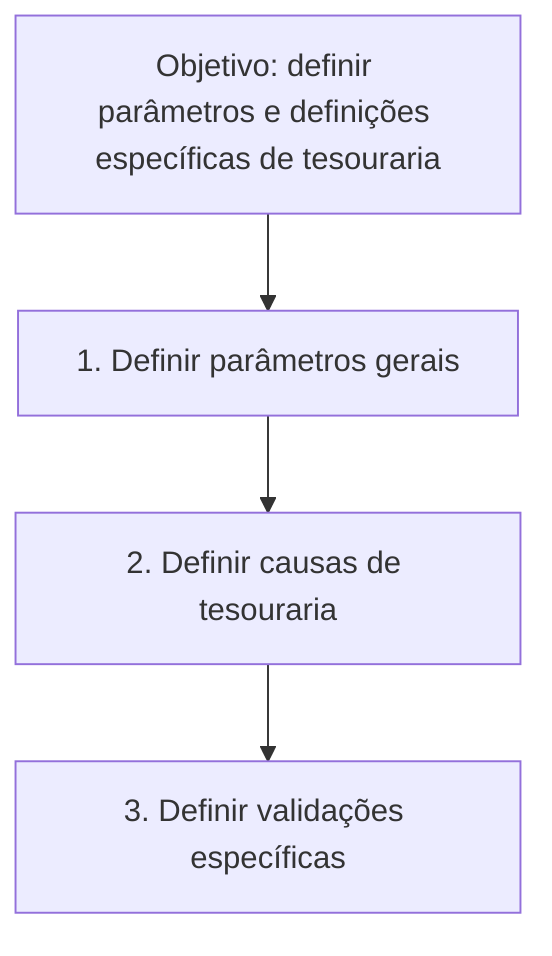

# Definição de Parâmetros e Definições Específicas de Tesouraria

## 1. Metadados do Documento
- **Arquivo de Origem:** Não identificado
- **Tipo de Documento:** Procedimento
- **Domínio / Sistema:** Tesouraria
- **Público-Alvo:** Não identificado
- **Data/Versão Identificada:** Não identificada

---

## 2. Resumo Executivo & Contexto de Negócio

O documento define um procedimento para estabelecer as definições e os parâmetros que condicionam o funcionamento do módulo de tesouraria.

O processo apresentado está organizado em três etapas sequenciais: definição de parâmetros gerais, definição de causas de tesouraria e definição de validações específicas.

O conteúdo não especifica valores de parâmetros, regras de cálculo, responsáveis, critérios de aprovação, integrações técnicas ou detalhes de implementação do módulo de tesouraria.

O documento também apresenta referências textuais a “CF”, “Home Solutions”, “APIs Documentation”, “Zeus” e “EN”, sem explicar a relação dessas referências com o procedimento de tesouraria.

---

## 3. Arquitetura, Componentes & Tecnologias Envolvidas

O documento não descreve arquitetura de software, microsserviços, bancos de dados, interfaces, protocolos, tecnologias ou ambientes técnicos. O fluxo identificado é exclusivamente procedimental.



**Nota de Análise:** O documento não detalha sistemas, contratos de API, métodos HTTP, estruturas de dados ou relações técnicas entre “Home Solutions”, “APIs Documentation”, “Zeus”, “CF” e o módulo de tesouraria.

---

## 4. Regras de Negócio, Especificações Funcionais & Processos

O objetivo declarado é indicar as definições e os parâmetros que condicionarão o funcionamento do módulo de tesouraria.

O procedimento prevê as seguintes etapas:

1. **Definir parâmetros gerais:** o documento determina que parâmetros gerais devem ser definidos, mas não informa quais parâmetros, seus valores permitidos, formatos ou impactos funcionais.
2. **Definir causas de tesouraria:** o documento determina a definição de causas de tesouraria, mas não descreve categorias, códigos, condições de uso ou efeitos dessas causas.
3. **Definir validações específicas:** o documento determina a definição de validações específicas, mas não especifica regras de validação, mensagens de erro, condições de bloqueio ou critérios de exceção.

Não foram identificadas regras adicionais de negócio, fórmulas, validações detalhadas, exceções, permissões ou responsabilidades operacionais.

---

## 5. Tabelas de Parâmetros, Ambientes e Estruturas de Dados

| Item / Parâmetro | Descrição / Função | Tipo / Valores / Formato | Ambiente / Observações |
| :--- | :--- | :--- | :--- |
| Parâmetros gerais | Elementos a serem definidos na primeira etapa do procedimento de tesouraria. | Não detalhado. | O documento não apresenta nomes, valores ou formatos. |
| Causas de tesouraria | Elementos a serem definidos na segunda etapa do procedimento de tesouraria. | Não detalhado. | O documento não apresenta classificação, códigos ou regras de utilização. |
| Validações específicas | Elementos a serem definidos na terceira etapa do procedimento de tesouraria. | Não detalhado. | O documento não apresenta condições, mensagens ou consequências de validação. |
| CF | Referência textual presente no documento. | Não detalhado. | Relação com o processo de tesouraria não explicada. |
| Home Solutions | Referência textual presente no documento. | Não detalhado. | Relação com o processo de tesouraria não explicada. |
| APIs Documentation | Referência textual presente no documento. | Não detalhado. | Não há documentação de APIs no conteúdo fornecido. |
| Zeus | Referência textual presente no documento. | Não detalhado. | Relação com o processo de tesouraria não explicada. |
| EN | Referência textual presente no documento. | Não detalhado. | Significado não informado. |

---

## 6. Bateria de Perguntas & Respostas para RAG (FAQ Sintético)

### P1: Qual é o objetivo do documento sobre tesouraria?
**R:** O objetivo é indicar as definições e os parâmetros que condicionarão o funcionamento do módulo de tesouraria.

### P2: Quais são as etapas do procedimento de definição para o módulo de tesouraria?
**R:** O procedimento possui três etapas: definir parâmetros gerais, definir causas de tesouraria e definir validações específicas.

### P3: O documento informa quais parâmetros gerais devem ser configurados?
**R:** Não. O documento apenas indica que parâmetros gerais devem ser definidos, sem listar seus nomes, valores, formatos ou regras de aplicação.

### P4: O que são as causas de tesouraria segundo o documento?
**R:** O documento menciona que causas de tesouraria devem ser definidas como segunda etapa do processo, mas não fornece definição funcional, classificação, código ou condição de uso.

### P5: Quais validações específicas devem ser implementadas?
**R:** O documento exige a definição de validações específicas, mas não detalha critérios de validação, regras de bloqueio, mensagens de erro ou cenários de exceção.

### P6: O documento descreve integrações ou APIs para o módulo de tesouraria?
**R:** Não. Embora o texto apresente a expressão “APIs Documentation”, não há descrição de APIs, endpoints, métodos HTTP, contratos ou integrações técnicas.

### P7: Existe uma arquitetura de software detalhada no documento?
**R:** Não. O conteúdo fornecido descreve somente um fluxo procedimental composto por três etapas de definição para tesouraria.

### P8: O documento identifica versões, datas ou responsáveis pelo processo?
**R:** Não. Não foram identificadas data, versão, responsáveis, áreas proprietárias ou critérios de aprovação.

### P9: Qual é a ordem das atividades do processo de tesouraria?
**R:** A ordem apresentada é: primeiro definir parâmetros gerais, depois definir causas de tesouraria e, por último, definir validações específicas.

### P10: Qual é o significado de “CF”, “Home Solutions”, “Zeus” e “EN” no documento?
**R:** O documento apresenta esses termos sem fornecer definições ou explicar sua relação com o módulo de tesouraria e com o procedimento descrito.

---

## 7. Glossário de Termos, Siglas & Conceitos-Chave

- **Tesouraria:** domínio funcional mencionado como o módulo cujo funcionamento será condicionado por definições e parâmetros.
- **Parâmetros gerais:** primeira categoria de definições prevista no procedimento; detalhes não informados.
- **Causas de tesouraria:** segunda categoria de definições prevista no procedimento; detalhes não informados.
- **Validações específicas:** terceira categoria de definições prevista no procedimento; detalhes não informados.
- **CF:** termo citado sem significado definido no conteúdo.
- **Home Solutions:** termo citado sem significado definido no conteúdo.
- **APIs Documentation:** expressão citada sem documentação técnica associada no conteúdo.
- **Zeus:** termo citado sem significado definido no conteúdo.
- **EN:** termo citado sem significado definido no conteúdo.

---

## 8. Notas Críticas, Riscos & Limitações

- O documento não especifica os parâmetros gerais que devem ser definidos.
- O documento não detalha as causas de tesouraria nem seus critérios de classificação ou utilização.
- O documento não descreve as validações específicas, seus critérios, exceções ou impactos operacionais.
- Não há identificação de responsáveis, datas, versão, ambientes, sistemas integrados ou dependências técnicas.
- As referências “CF”, “Home Solutions”, “APIs Documentation”, “Zeus” e “EN” não possuem contextualização adicional.
- **Nota de Análise:** O conteúdo é um roteiro de alto nível; não contém detalhamento suficiente para implementar ou operar configurações de tesouraria sem fontes complementares.

---

## 9. Conteúdo Bruto Estruturado (Referência Fiel)

```text
--- [PÁGINA 1 DE 1] ---

DEFINICIÓN de parámetros y definiciones
específicas de tesorería
Objetivo
Indicar las definiciones y parámetros que condicionarán el funcionamiento del módulo de tesorería.
Pasos a seguir
DEFINIR
Parámetros
generales
(1)
DEFINIR
Causas de
tesorería
(2)
DEFINIR
Validaciones
específicas
(3)
1. DEFINIR Parámetros generales
2. DEFINIR Causas de tesorería
3. DEFINIR Validaciones específicas
 / 
 CF
Home Solutions APIs Documentation Zeus
EN
```
