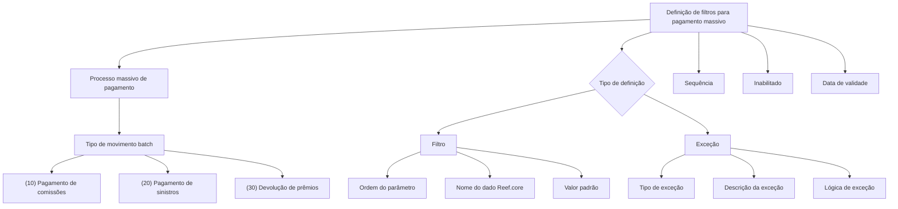

# Definição de Filtros para Pagamento Massivo

## 1. Metadados do Documento
- **Arquivo de Origem:** Não identificado no conteúdo fornecido
- **Tipo de Documento:** Especificação Técnica / Funcional
- **Domínio / Sistema:** Processo massivo de pagamento; Reef.core; Zeus
- **Público-Alvo:** Analistas funcionais, desenvolvedores, arquitetos e operação
- **Data/Versão Identificada:** Não identificada

---

## 2. Resumo Executivo & Contexto de Negócio

O documento define propriedades utilizadas para configurar filtros e exceções aplicáveis ao processo massivo de pagamento. O objetivo declarado é definir as condições de seleção dos pagamentos que serão executados por esse processo.

A definição identifica o tipo de movimento batch de pagamento e contempla três categorias de execução: pagamento de comissões, pagamento de sinistros e devolução de prêmios. Cada definição pode corresponder a um filtro de execução ou a uma exceção.

Quando configurada como exceção, a definição contém um tipo de exceção, uma descrição e uma lógica de negócio que avalia se o pagamento deve ser excepcionado. O conteúdo lista seis tipos de exceção: solicitação do usuário, terceiro em lista negra, moeda de pagamento, valor inferior ao mínimo transferível, conta embargada e bloqueio de contas do terceiro.

Quando configurada como filtro, a definição utiliza propriedades de parâmetros associadas a dados do Reef.core, incluindo nome, valor padrão e ordem de tratamento. A sequência determina a ordem de aplicação das condições definidas.

A vigência e o estado de inabilitação permitem controlar a disponibilidade das definições e manter um histórico das alterações realizadas. O documento não apresenta contratos de integração, métodos HTTP, estruturas JSON, URLs de serviço, tecnologias de implementação ou detalhes de persistência.

---

## 3. Arquitetura, Componentes & Tecnologias Envolvidas

Os elementos identificados no conteúdo são:

| Componente / Conceito | Papel identificado no documento |
| :--- | :--- |
| Processo massivo de pagamento | Processo que executa pagamentos selecionados conforme condições configuradas. |
| Movimento batch de pagamento | Classificação do processo massivo de pagamento. |
| Filtro | Definição usada para condições de seleção e execução. |
| Exceção | Definição usada para identificar situações em que o pagamento deve ser excepcionado. |
| Lógica de exceção | Lógica de negócio que avalia se uma exceção deve ser aplicada. |
| Reef.core | Origem ou referência do dado cujo nome participa de uma definição de filtro. |
| Zeus | Termo presente na navegação do conteúdo, sem função técnica detalhada. |
| Soluciones APIs / Documentación | Termos presentes na navegação do conteúdo, sem detalhamento arquitetural. |



**Nota de Análise:** O documento cita Reef.core como fonte ou referência de dados para filtros, mas não detalha entidades, atributos disponíveis, contratos, APIs ou mecanismos de integração.  
**Nota de Análise:** O termo Zeus aparece na navegação, mas o documento não descreve sua responsabilidade funcional ou técnica no processo massivo de pagamento.

---

## 4. Regras de Negócio, Especificações Funcionais & Processos

### 4.1 Objetivo da definição

A definição de filtros para pagamento massivo estabelece as condições de seleção dos pagamentos que serão executados pelo processo massivo.

### 4.2 Tipos de movimento batch de pagamento

A propriedade de processo massivo de pagamento identifica o tipo de movimento batch de pagamento. Os valores apresentados são:

1. **(10) Pagamento de comissões**
2. **(20) Pagamento de sinistros**
3. **(30) Devolução de prêmios**

### 4.3 Distinção entre filtro e exceção

A propriedade **Filtro** determina se uma definição faz parte:

- Da definição de uma **exceção**; ou
- Da definição de um **filtro para execução**.

### 4.4 Regras para definição de exceção

Quando a definição corresponde a uma exceção:

1. A definição contém um tipo de exceção.
2. A descrição da exceção deve conter a descrição aplicável à exceção configurada.
3. A lógica de exceção corresponde à lógica de negócio que avalia se o pagamento deve ser excepcionado.
4. A sequência determina a ordem em que as condições definidas são aplicadas.

Os tipos de exceção listados são:

1. **(1) A solicitação do usuário**
2. **(2) Terceiros em lista negra**
3. **(3) Moeda de pagamento**
4. **(4) Valor de pagamento menor que o mínimo transferível**
5. **(5) Terceiros com conta embargada**
6. **(6) Terceiro com bloqueio de contas**

### 4.5 Regras para definição de filtro

Quando a definição corresponde a um filtro:

1. A ordem do parâmetro determina a ordem de tratamento das propriedades dos parâmetros.
2. O nome identifica o nome do dado do Reef.core que participa do filtro.
3. O valor padrão contém o valor padrão do dado utilizado no filtro.
4. A sequência determina a ordem de aplicação das condições definidas.

### 4.6 Controle de disponibilidade e histórico

1. A propriedade **Inabilitado** determina se a definição está ativa ou se não pode mais ser considerada.
2. A **Data de validade** determina quando a definição estará disponível para utilização.
3. O uso correto da data de validade permite manter um registro histórico das alterações realizadas na definição.

---

## 5. Tabelas de Parâmetros, Ambientes e Estruturas de Dados

| Item / Parâmetro | Descrição / Função | Tipo / Valores / Formato | Ambiente / Observações |
| :--- | :--- | :--- | :--- |
| Objetivo | Define as condições de seleção dos pagamentos executados pelo processo massivo. | Texto funcional | Processo massivo de pagamento. |
| Processo massivo de pagamento | Identifica o tipo de movimento batch de pagamento. | `(10)`, `(20)` ou `(30)` | Não há ambiente identificado. |
| Tipo `(10)` | Pagamento de comissões. | Código numérico | Tipo de movimento batch. |
| Tipo `(20)` | Pagamento de sinistros. | Código numérico | Tipo de movimento batch. |
| Tipo `(30)` | Devolução de prêmios. | Código numérico | Tipo de movimento batch. |
| Filtro | Determina se a definição é parte de uma exceção ou de um filtro para execução. | Exceção ou filtro | Não há valores técnicos adicionais informados. |
| Exceção | Contém o tipo de exceção. | Códigos `(1)` a `(6)` | Aplicável quando a definição é uma exceção. |
| Exceção `(1)` | Exceção por solicitação do usuário. | Código numérico | Não há regra adicional detalhada. |
| Exceção `(2)` | Exceção para terceiros em lista negra. | Código numérico | Não há regra adicional detalhada. |
| Exceção `(3)` | Exceção por moeda de pagamento. | Código numérico | Não há regra adicional detalhada. |
| Exceção `(4)` | Exceção por valor de pagamento menor que o mínimo transferível. | Código numérico | O valor mínimo transferível não é especificado. |
| Exceção `(5)` | Exceção para terceiros com conta embargada. | Código numérico | Não há regra adicional detalhada. |
| Exceção `(6)` | Exceção para terceiro com bloqueio de contas. | Código numérico | Não há regra adicional detalhada. |
| Descrição da exceção | Contém a descrição da exceção quando a definição é uma exceção. | Texto | Aplicável somente a definições de exceção. |
| Sequência | Determina a sequência de aplicação das condições definidas. | Ordem não especificada | Aplicável às condições definidas. |
| Lógica de exceção | Avalia, por regra de negócio, se o pagamento deve ser excepcionado. | Lógica de negócio não detalhada | O documento não informa expressões, regras ou implementação. |
| Ordem do parâmetro | Determina a ordem de tratamento das propriedades de parâmetros de um filtro. | Ordem não especificada | Aplicável quando a definição é um filtro. |
| Nome | Identifica o nome do dado Reef.core participante de um filtro. | Nome de dado não especificado | Aplicável a filtros. |
| Valor padrão | Contém o valor padrão do dado para o filtro. | Valor não especificado | Aplicável a filtros. |
| Inabilitado | Determina se a definição está ativa ou não pode mais ser considerada. | Estado lógico não especificado | Controle de disponibilidade. |
| Data de validade | Determina quando a definição estará disponível para uso. | Data, formato não especificado | Permite histórico de alterações. |
| Reef.core | Sistema ou domínio de dados cujos dados participam de filtros. | Não especificado | Sem detalhamento de integração. |
| Zeus | Termo presente na navegação. | Não especificado | Sem função descrita. |

---

## 6. Bateria de Perguntas & Respostas para RAG (FAQ Sintético)

### P1: Qual é o objetivo da definição de filtros para pagamento massivo?
**R:** O objetivo é definir as condições de seleção dos pagamentos que serão executados pelo processo massivo de pagamento.

### P2: Quais tipos de movimento batch estão previstos no processo massivo de pagamento?
**R:** O documento lista três tipos de movimento batch: `(10)` pagamento de comissões, `(20)` pagamento de sinistros e `(30)` devolução de prêmios.

### P3: O que a propriedade Filtro determina na definição de pagamento massivo?
**R:** A propriedade Filtro determina se a definição faz parte de uma definição de exceção ou de uma definição de filtro para execução.

### P4: Quais tipos de exceção podem impedir ou excepcionar um pagamento no processo massivo?
**R:** Os tipos listados são: solicitação do usuário, terceiros em lista negra, moeda de pagamento, valor de pagamento menor que o mínimo transferível, terceiros com conta embargada e terceiro com bloqueio de contas.

### P5: Como funciona a exceção por valor inferior ao mínimo transferível?
**R:** O documento identifica a exceção `(4)` como “valor de pagamento menor que o mínimo transferível”. Entretanto, o conteúdo não define o valor do mínimo transferível, sua moeda, fonte de cálculo ou regra detalhada de comparação.

### P6: Qual é a finalidade da lógica de exceção?
**R:** A lógica de exceção é a lógica de negócio que avalia se um pagamento deve ser excepcionado. O documento não detalha a implementação, condições específicas ou linguagem utilizada para essa lógica.

### P7: Para que serve o campo Sequência?
**R:** A Sequência determina a ordem em que as condições definidas são aplicadas no contexto da definição de filtros ou exceções.

### P8: Como são tratados os parâmetros quando a definição é um filtro?
**R:** Quando a definição é um filtro, a ordem do parâmetro determina a ordem de tratamento das propriedades dos parâmetros. O nome identifica o dado do Reef.core participante do filtro e o valor padrão contém o valor padrão desse dado.

### P9: O que representa o campo Nome em uma definição de filtro?
**R:** O campo Nome identifica o nome do dado do Reef.core que faz parte de um filtro. O documento não apresenta exemplos de nomes de dados nem um catálogo de atributos do Reef.core.

### P10: Como uma definição deixa de ser considerada pelo processo massivo?
**R:** A propriedade Inabilitado determina se uma definição está ativa ou se já não pode ser levada em consideração.

### P11: Qual é a finalidade da data de validade?
**R:** A data de validade determina quando uma definição estará disponível para utilização. O uso correto dessa propriedade permite manter um registro histórico das alterações feitas na definição.

### P12: O documento descreve APIs, endpoints ou contratos de integração para o processo massivo?
**R:** Não. O conteúdo menciona Reef.core, Zeus, Soluciones APIs e Documentación na navegação, mas não apresenta métodos HTTP, endpoints, URLs, formatos JSON, contratos de mensagens ou detalhes técnicos de integração.

---

## 7. Glossário de Termos, Siglas & Conceitos-Chave

- **Pagamento massivo:** Processo que executa pagamentos selecionados conforme condições definidas.
- **Movimento batch de pagamento:** Tipo de movimento associado ao processo massivo de pagamento.
- **Filtro:** Definição utilizada para compor condições de seleção ou execução no processo massivo.
- **Exceção:** Definição que representa uma situação em que o pagamento deve ser excepcionado.
- **Lógica de exceção:** Lógica de negócio que avalia se um pagamento deve ser excepcionado.
- **Sequência:** Ordem de aplicação das condições definidas.
- **Ordem do parâmetro:** Ordem de tratamento das propriedades de parâmetros quando a definição é um filtro.
- **Reef.core:** Referência a dados que podem fazer parte de um filtro; o documento não detalha o sistema ou modelo de dados.
- **Zeus:** Termo presente na navegação do conteúdo, sem significado ou função explicada.
- **CF:** Sigla exibida no conteúdo sem expansão ou definição.
- **Terceiro:** Entidade citada nos tipos de exceção, incluindo lista negra, conta embargada e bloqueio de contas.

---

## 8. Notas Críticas, Riscos & Limitações

- O documento não informa o nome do arquivo de origem, data, versão, autor ou responsável pela especificação.
- Não há detalhamento de APIs, endpoints, protocolos, eventos, filas, banco de dados, estruturas JSON ou contratos de integração.
- O documento não define como a lógica de exceção é configurada, executada, validada ou auditada.
- O documento não especifica os valores, moeda, origem ou regra de cálculo do mínimo transferível associado à exceção `(4)`.
- Não são definidos formatos para data de validade, valor padrão, sequência ou ordem do parâmetro.
- Não há definição de prioridade ou comportamento quando múltiplas exceções ou filtros forem aplicáveis ao mesmo pagamento.
- Não há detalhes sobre o significado da sigla **CF**, do termo **Zeus** ou da navegação “Soluciones APIs Documentación”.
- Não há catálogo dos dados disponíveis no Reef.core que possam ser utilizados em filtros.
- O conteúdo parece extraído de duas páginas e possui repetição do texto “Propiedades generales”; essa repetição foi preservada na referência bruta por fidelidade.

---

## 9. Conteúdo Bruto Estruturado (Referência Fiel)

```text
--- [PÁGINA 1 DE 2] ---

EN CONSTRUCCIÓN
DEFINICIÓN de filtros para pago masivo
Objetivo
Definir las condiciones de selección de los pagos que se ejecutarán por el proceso masivo.
Propiedades generales
Propiedades generales
Proceso masivo de pago
Identifica el tipo de movimiento batch de pago.
(10)Pago de comisiones
(20)Pago de siniestros
(30)Devolución de primas
Filtro
Determina si la definición es parte de la definición de excepción o de la definición de un filtro para la
ejecución.
Excepción
Contiene el tipo de excepción.
 / 
 CF
Inicio Soluciones APIs Documentación Zeus
ES


--- [PÁGINA 2 DE 2] ---

(1)A solicitud del usuario
(2)Terceros en lista negra
(3)Moneda de pago
(4)Importe de pago menor que el mínimo transferible
(5)Terceros con cuenta embargada
(6)Tercero con bloqueo de cuentas
Descripción de la excepción
En caso de tratarse de la definición de una excepción, esta propiedad contiene la descripción de la
excepción.
Secuencia
Determina la secuencia en la que se aplican las condiciones definidas.
Lógica de excepción
Lógica de negocio que evalúa si se debe excepcionar.
Orden parámetro
Determina el orden en que se tratan las propiedades de los parámetros cuando se trata de un filtro.
Nombre
Identifica el nombre del dato de Reef.core que forma parte de un filtro.
Valor por defecto
Contiene el valor por defecto del dato para el filtro.
Inhabilitado
En este punto se determina si la definición está activa, o por el contrario ya no puede tenerse en
cuenta.
Fecha de validez
Determina cuando la definición estará disponible para ser utilizada.
Su correcto uso permite tener un registro histórico de los cambios efectuados en la definición.
```
